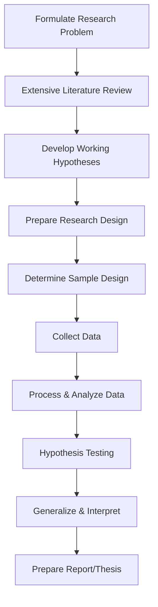

# MMPC-015: Research Methodology for Management Decisions
## Block 1: Introduction to Research Methodology — Hinglish Revision Notes

---

### UNIT 1: RESEARCH METHODOLOGY: AN OVERVIEW

#### 1. Concept and Definition of 'Research'
*   **What is Research?**
    Research ek **purposeful, systematic, aur objective investigation** hai kisi specific subject, issue, ya problem ka, jisme scientific methodologies ka use kiya jata hai. Yeh koi blind search (fishing expedition) nahi hai, na hi yeh normal facts ka random collection hai, aur na hi yeh normal common sense ke barabar hai.
*   **Three Essential Parts of an Investigation (Kisi bhi investigation ke 3 main parts):**
    1.  **Implicit Question:** Woh core question ya problem jise solve karna hai (e.g., *“Product X ka selling price kya hona chahiye?”*).
    2.  **Explicit Answer:** Woh final recommendation ya solution jo study ke baad diya jata hai (e.g., *“Price Rs. 100 hona chahiye.”*).
    3.  **The Defence (Research):** Woh systematic process jisme data collect, analyze, aur interpret kiya jata hai jo question ko uske final answer se connect karta hai.

#### 2. Five Distinguishing Features of Good Research (Ache Research ke 5 Features)
1.  **Systematic:** Yeh ek fixed sequence me hota hai jahan har step ko pehle se plan kiya jata hai. Agar baad me koi galti pata chale, toh use theek karna bohot costly ya impossible ho jata hai.
2.  **Objectivity:** Yeh researcher ke personal biases, opinions, aur pehle ke opinions se bilkul door hota hai. Sacha research hamesha ek unbiased answer dhoondne ki koshish karta hai.
3.  **Reproducibility:** Research ka procedure itna clear aur simple hona chahiye ki agar koi doosra researcher bhi use repeat kare, toh use lagbhag same results milein.
4.  **Relevance:** Yeh sirf usi data par focus karta hai jo decision-making ke liye zaroori ho. Faltu data collect nahi kiya jata aur action criteria ke saath compare kiya jata hai (*"Agar answer X aaya, toh hum kya decision lenge?"*).
5.  **Control:** Dusre factors ko isolate karne ki ability. Yeh ensure karta hai ki dependent variable me jo change aaya hai, woh humare study variables ki wajah se hi hai, na ki kisi aur external factor ki wajah se (e.g., shopping behavior par income ka effect dekhte waqt age aur education ko control karna).

#### 3. Research Methodology vs. Research Methods
| Feature | Research Methods | Research Methodology |
| :--- | :--- | :--- |
| **Definition** | Woh specific techniques, tools, aur procedures jo data collect aur analyze karne ke liye use hote hain. | Woh broad philosophy, logic, aur systematic design jo poore research ko guide karti hai. |
| **Scope** | Narrow (Chota): Sirf data collection/analysis ke *how* par focus karta hai. | Wide (Bada): Poore study ke *why*, *how*, aur *what* ko explain karta hai. |
| **Examples** | Questionnaires, personal interviews, Chi-square test, observations. | Research design select karna, sampling strategy choose karna, parametric vs non-parametric test decide karna. |
| **Relationship** | Methods tools hote hain jo toolbox ke andar hote hain. | Methodology ek architectural plan hai jo decide karta hai ki kaun sa tool kab aur kyun use hoga. |

#### 4. The Metaphor of the Researcher: "Judge vs. Pleader"
*   **The Statement:** *"A research scholar has to work as a judge and derive the truth and not as a pleader who is only eager to prove his case in favour of his plaintiff."*
*   **Core Meaning in Hinglish:**
    *   Ek **Pleader (Vakeel/Advocate)** biased hota hai. Woh sirf apne client ke fayde ke points dhoondta hai, negative points ko chupa deta hai aur facts ko bend karta hai taaki case jeet sake.
    *   Ek **Judge** bilkul neutral aur objective hota hai. Woh kisi ka side liye bina saare saboot (evidence) ko check karta hai taaki sach saamne aa sake.
*   **Connection to Research:** Researcher ko hamesha **Judge** ki tarah sachai dhoondni chahiye. Agar woh pleader ban gaya (e.g., jabardasti kisi product launch ko sahi prove karne ki koshish karna), toh objectivity khatam ho jayegi aur research fail ho jayega.

#### 5. Role of Research in Management Decision-Making (Business me iska kya kaam hai?)
*   **The Core Value:** Business ka poora environment uncertainty se bhara hai. Research management ke decisions me risk ko kam karta hai aur galat decision lene ke chances ko minimize karta hai.
*   **Role in Different Areas:**
    *   **Marketing:** Demand forecasting, advertising effectiveness check karna, consumer behavior samajhna, product position karna, aur test marketing ke liye.
    *   **Production:** *Kya* banana hai, *kitna* banana hai, *kab* banana hai, aur *kiske liye* banana hai, yeh decide karne ke liye. Quality control aur inventory manage karne me kaam aata hai.
    *   **HRD (Human Resource):** Manpower planning, wage structure, incentive schemes, cost of living, performance appraisal, aur staff turnover study karne ke liye.
    *   **Materials Management:** Purchasing policies banane ke liye—kab, kahan se, kitna, aur kis price par raw material kharidna hai.
    *   **Banking:** Credit risk analyze karna, interest rate effects, aur investment portfolios plan karne ke liye.
    *   **Government:** Union budgets, economic planning, aur natural resource allocation plan karne ke liye.
*   **The 4 P's Framework:**
    *   *Product:* Package design test karna, product-line extend karna.
    *   *Price:* Price sensitivity aur perceived value ko samajhna.
    *   *Place:* Distributer satisfaction check karna, supply chain design karna.
    *   *Promotion:* Best media channel aur advertisement effectiveness evaluate karna.

#### 6. Mathematical/Statistical Tools for Analysis in Research
Data ko analyze karne ke liye quantitative tools ko teen main groups me baanta jata hai:
1.  **Univariate Analysis:** Ek waqt me sirf ek single variable ko analyze karna (e.g., Mean, Median, Mode, Standard Deviation) taaki data ka primary distribution samajh sakein.
2.  **Bivariate Analysis:** Do variables ke beech ke relationship ko check karna (e.g., Simple Correlation, Simple Regression, Chi-square test of association).
3.  **Multivariate Analysis:** Ek saath teen ya usse zyada variables ko analyze karna taaki complex real-world relationships ko samajha ja sake (e.g., Multiple Regression, Discriminant Analysis, Factor Analysis).

---

### UNIT 2: STEPS FOR RESEARCH PROCESS

#### 1. What is the Research Process?
Research process ek sequential (ek ke baad ek hone wala) roadmap hai jo aapas me connected activities se banta hai. Agar data collection karte waqt data analysis ke steps ko dhyan me na rakha jaye, toh poora research collapse ho sakta hai.



#### 2. Defining and Formulating a Research Problem
*   **What is a Research Problem?**
    Yeh ek clear statement hota hai jo batata hai ki decision-maker ko kaun si information chahiye taaki woh kisi specific management problem ko solve kar sake.
*   **Steps in Formulation (Problem banane ke steps):**
    1.  **Identify a Broad Subject Area:** Researcher ke interest ka bada topic select karna (e.g., *Customer Dissatisfaction*).
    2.  **Divide into Sub-areas:** Bade topic ko chhote components me todna (e.g., *delivery delay, product quality, ya billing issues*).
    3.  **Select the Most Interesting Sub-topic:** Kisi ek manageable sub-topic ko target karna.
    4.  **Raise Research Questions:** Jo answers chahiye unki list banana.
    5.  **Formulate Objectives:** Questions ko clear, actionable goals me convert karna (e.g., *"To study the impact of delivery delays on customer loyalty"*).
    6.  **Assess Viability:** Time, budget, aur data availability ke hisab se feasibility check karna.
*   **Key Considerations in Selecting a Problem:**
    *   *Interest:* Hamesha apna interest dekhein taaki boring na lage.
    *   *Magnitude:* Scope bohot bada na ho, taaki manage ho sake.
    *   *Measurement of Concepts:* Jo variables le rahe hain, unhe measure karna possible ho.
    *   *Level of Expertise:* Apni research skills aur knowledge ke hisab se topic choose karein.
    *   *Relevance:* Yeh business ko fayda de ya knowledge gap ko fill kare.

#### 3. "Knowing What Data Are Available..."
*   **The Idea:** *"Knowing what data are available often serves to narrow down the problem itself as well as the technique that might be used."*
*   **Key Insights in Hinglish:**
    *   Research khayalo me nahi hota. Agar aapka research question bohot bada hai lekin uske liye real-world data available nahi hai (due to confidentiality or cost), toh woh research fail hai.
    *   Pehle hi available data ko evaluate karne se research ka scope practical limits me set ho jata hai.
    *   Data ka type hi statistical techniques decide karta hai (e.g., agar aapke paas ranked/ordinal data hai toh aap parametric tests nahi laga sakte, aapko non-parametric tests hi lagane honge).

#### 4. Sources of a Research Topic (The 4 P's Framework)
Har research project in 4 variables ke aas-pass ghoomta hai:
*   **People:** Jo study population hain (e.g., consumers, employees, general public) — provides the *who*.
*   **Problems:** Jo issues ya negative situations hain jise theek karna hai (e.g., high labor turnover, drop in sales) — provides the *what*.
*   **Phenomena:** Koi ajeeb behavior ya event jise study karna hai (e.g., sudden shift towards online shopping) — provides the *why*.
*   **Programs:** Koi intervention ya scheme jo implement hui hai aur uska impact evaluate karna hai (e.g., new training policy, cash discount scheme) — provides the *how*.

#### 5. Units of Analysis & Decision-Making Units (DMU)
*   **Unit of Analysis:** Woh chiz ya insaan jiske baare me data collect aur measure kiya ja raha hai (e.g., an individual consumer, a family, a transaction, or a company).
*   **Decision-Making Unit (DMU):** Business me, yeh woh group ya individual hota hai jo final khareedne (buying) ka decision leta hai.
    *   *Example:* Ghar ke appliance ke liye DMU husband-wife dono ho sakte hain. Industrial product ke liye DMU complex hota hai jisme engineers, purchase managers, aur finance managers sab hote hain.
    *   Sahi DMU ko identify karna bohot zaroori hai, warna galat insaan se data collect ho jayega.

#### 6. Extensive Review of Literature (Literature Review)
*   **Definition:** Purane published research documents, journals, aur books ko check karna jo aapke topic se related hain.
*   **Types of Literature Reviews:**
    1.  **Conceptual Literature:** Jo topic ke rules, theories, aur theoretical frameworks se deal karta hai.
    2.  **Empirical Literature:** Jo purani actual studies, unki methodology, aur unke results ko review karta hai.
*   **The Dual Role of Literature Review:**
    *   *Paradoxical Role:* Pehle review karne ke liye thoda basic knowledge chahiye hota hai, aur review karne ke baad problem statement aur refine ho jata hai.
    *   *Gap Identification:* Pata chalta hai ki kya kaam ho chuka hai aur kya baaki hai (research gap).
    *   *Methodology Improvement:* Purani studies se pata chalta hai ki kaun sa design aur sample size best work kiya tha aur kya pitfalls (galtiyan) avoid karni hain.
    *   *Contextualizing Findings:* Apne findings ko purani studies ke data se link karke justify karna ki aapka research kaise unique aur valid hai.

---

### UNIT 3: RESEARCH DESIGNS

#### 1. Concept of Research Design
*   **What is a Research Design?**
    Yeh ek **conceptual blueprint/framework** hai jiske under research kiya jata hai. Yeh batata hai ki minimum cost me objectives ko achieve karne ke liye data kaise collect aur analyze hoga.
*   **Key Decisions in Design:**
    *   Data lane ka source ya tareeqa kya hoga?
    *   Humare paas kitna time, finance, aur skill available hai?
    *   Ek particular design ko select karne ki kya logic hai?

#### 2. Types of Research Designs
Objectives aur structure ke basis par, teen main designs hote hain:

| Feature | Exploratory Research Design | Descriptive Research Design | Experimental Research Design |
| :--- | :--- | :--- | :--- |
| **Primary Objective** | Insights gain karna, problems formulate karna, aur hypothesis banana. | Kisi group, situation, ya phenomenon ke characteristics ko accurate describe karna. | Cause-and-effect (karan aur asar) relationships check karna. |
| **Structure** | Highly **Flexible** aur unstructured hota hai. | **Rigid**, pre-planned, aur highly structured hota hai. | Rigorous (sakht) aur highly controlled hota hai. |
| **Hypothesis** | Zaroori nahi hota, ya bohot loose hota hai. | Pehle se hi clear hypothesis banayi jati hai. | Clear causal (cause-effect) hypothesis mandatory hai. |
| **Techniques Used** | Literature surveys, experience surveys (experts se baat karna), focus groups, case studies. | Structured questionnaires, systematic observation, census data. | Lab experiments, field experiments, simulations. |
| **Focus** | Koi naya idea na chhoot jaye (Exploration). | **Bias ko minimize karna** aur **reliability ko badhana**. | External factors ko control karke causality verify karna. |

#### 3. Lab Experiments vs. Field Experiments
*   **Lab Experiments:** Artificial environment me experiment karna jahan researcher saare external factors ko control kar sakta hai.
    *   *Example:* Simulated shop room me consumer ka reaction naye package design par check karna.
*   **Field Experiments:** Real-world (natural) setting me study karna jahan researcher ka direct environment par bohot kam control hota hai.
    *   *Example:* Selected real retail stores me kisi product ka naya price check karna.

#### 4. Internal Validity vs. External Validity
*   **Internal Validity:** Yeh confidence ki dependent variable me jo change aaya hai, woh *sirf aur sirf* independent variable ki wajah se hi aaya hai (aur kisi external factor se nahi).
    *   *High in:* Lab Experiments (control zyada hota hai).
*   **External Validity:** Experimental results ko doosre settings, populations, ya time periods par generalise karne ki ability.
    *   *High in:* Field Experiments (real environment hota hai).
*   **The Trade-off:**
    ```
    ┌─────────────────────────────┐
    │     CONTROL vs. REALISM     │
    ├──────────────┬──────────────┤
    │  Lab Study   │  Field Study │
    │  ▲ Internal  │  ▼ Internal  │
    │  ▼ External  │  ▲ External  │
    └──────────────┴──────────────┘
    ```
    Control badhane se internal validity badh jati hai, par environment artificial ho jata hai, jisse external validity kam ho jati hai.

#### 5. True vs. Quasi-Experimental Designs
*   **True Experimental Design:**
    *   Isme subjects ko experimental aur control groups me **randomly assign** kiya jata hai.
    *   Researcher ka treatment schedule aur group composition par poora control hota hai.
    *   *Result:* High internal validity; saare threat factors effectively control hote hain.
*   **Quasi-Experimental Design:**
    *   Isme subjects ka **random assignment nahi hota** (kyunki real life me yeh ethical ya practical nahi hota).
    *   Natural groups ko use kiya jata hai (e.g., Office A ke employees ko training dena, aur Office B ke employees ko as a control group treat karna).
    *   *Result:* Internal validity thodi kam hoti hai because of selection bias, par real-world business environment me yeh highly useful hai.
