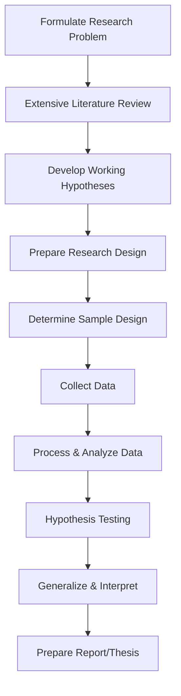

# MMPC-015: Research Methodology for Management Decisions
## Block 1: Introduction to Research Methodology — Revision Notes

---

### UNIT 1: RESEARCH METHODOLOGY: AN OVERVIEW

#### 1. Concept and Definition of 'Research'
*   **What is Research?**
    Research is a **purposeful, systematic, and objective investigation** of a specific subject, issue, or problem using scientific methodologies. It is *not* a fishing expedition, a mere collection of assorted facts, or synonymous with common sense.
*   **Three Essential Parts of an Investigation:**
    1.  **Implicit Question:** The core query or problem to be solved (e.g., *“What should the selling price of Product X be?”*).
    2.  **Explicit Answer:** The final recommendation or solution proposed (e.g., *“The price should be $100.”*).
    3.  **The Defence (Research):** The systematic process of collecting, analyzing, and interpreting information that bridges the question to the proposed answer.

#### 2. Five Distinguishing Features of Good Research
1.  **Systematic:** Formulated in a sequence where each step is carefully planned and leads logically to the next. Mistake correction is costly or impossible once subsequent steps begin.
2.  **Objectivity:** Independent of the researcher's personal biases, opinions, and prior positions. True research attempts to find an unbiased answer.
3.  **Reproducibility:** The procedure must be stated so clearly and unambiguously that an equally competent researcher can duplicate it and obtain roughly the same results.
4.  **Relevance:** Focuses strictly on data necessary for decision-making. Avoids wasteful collections and forces comparison of data with action criteria (*"What action will we take if the answer is X?"*).
5.  **Control:** The ability to isolate the factors under study. It ensures that observed changes are actually caused by the variables being investigated, rather than uncontrolled external variables (e.g., controlling for age and education when studying the effect of income on shopping behavior).

#### 3. Research Methodology vs. Research Methods
| Feature | Research Methods | Research Methodology |
| :--- | :--- | :--- |
| **Definition** | The specific tactics, tools, and procedures used to collect data and conduct experiments. | The broader philosophy, logic, and systematic design governing the entire research. |
| **Scope** | Narrow: Focuses on the *how* of data collection/analysis. | Wide: Explains the *why*, *how*, and *what* of the entire study. |
| **Examples** | Questionnaires, personal interviews, Chi-square test, observations. | Selecting a research design, justifying a sampling strategy, choosing parametric vs. non-parametric tests. |
| **Relationship** | Methods are the *tools* inside the research toolbox. | Methodology is the *architectural plan* that determines which tools to use and why. |

#### 4. The Metaphor of the Researcher: "Judge vs. Pleader"
*   **The Statement:** *"A research scholar has to work as a judge and derive the truth and not as a pleader who is only eager to prove his case in favour of his plaintiff."*
*   **Core Meaning:**
    *   A **Pleader (Advocate)** is highly biased, selecting only favorable evidence, ignoring contradictory data, and bending facts to "win" a predetermined case.
    *   A **Judge** must be completely neutral, objective, and evidence-driven. A judge evaluates all evidence dispassionately to uncover the absolute truth.
*   **Connection to Research Objectives:** The primary objective of research is **truth-seeking and discovery of the unknown**. The moment a researcher acts as a pleader (e.g., to justify a product launch they personally like), objectivity is lost, and the research fails to guide sound management decisions.

#### 5. Role of Research in Management Decision-Making
*   **The Core Value:** All business operations exist in a world of uncertainty. Research applies the *methods of science to the art of management*, minimizing risk and reducing the probability of making wrong choices.
*   **Role in Functional Areas:**
    *   **Marketing:** Used for demand forecasting, measuring advertising effectiveness, consumer buying behavior, product positioning, and test marketing.
    *   **Production:** Helps determine *what* to produce, *how much*, *when*, and *for whom*. Crucial for quality control and inventory optimization.
    *   **Human Resource Development (HRD):** Used for manpower planning, studying wage structures, incentive schemes, cost of living, performance appraisals, and employee turnover.
    *   **Materials Management:** Formulating purchasing policies—deciding *where, when, how much*, and *at what price* to buy.
    *   **Banking:** Assessing economic conditions, evaluating loan risks, and planning investment portfolios.
    *   **Government Policies:** Formulating union budgets, economic planning, and resource utilization.
*   **The 4 P's Framework:**
    *   *Product:* Testing packaging, extending product-line shelves.
    *   *Price:* Understanding price sensitivity and perceived value.
    *   *Place:* Identifying distribution channels and ensuring supply chain satisfaction.
    *   *Promotion:* Identifying efficient media platforms and investment frequencies.

#### 6. Mathematical/Statistical Tools for Analysis in Research
To make sense of raw data, research methodology relies on quantitative analysis tools grouped into:
1.  **Univariate Analysis:** Analyzing one variable at a time (e.g., Mean, Median, Mode, Standard Deviation) to describe data distributions.
2.  **Bivariate Analysis:** Examining relationships between two variables (e.g., Simple Correlation, Simple Regression, Chi-square tests of association).
3.  **Multivariate Analysis:** Analyzing three or more variables simultaneously to understand complex real-world dynamics (e.g., Multiple Regression, Discriminant Analysis, Factor Analysis).

---

### UNIT 2: STEPS FOR RESEARCH PROCESS

#### 1. What is the Research Process?
The research process is a sequential roadmap consisting of closely related activities. If subsequent procedures (like data analysis) are not considered at the early stages (like data collection planning), the research can collapse.



#### 2. Defining and Formulating a Research Problem
*   **What is a Research Problem?**
    It is a statement of the information needed by a decision-maker to help solve a practical or theoretical management problem.
*   **Steps in Formulation:**
    1.  **Identify a Broad Subject Area:** Based on researcher interest (e.g., *Customer Dissatisfaction*).
    2.  **Divide into Sub-areas:** Breakdown into smaller components (e.g., *Dissatisfaction with delivery times, product quality, or customer service*).
    3.  **Select the Most Interesting Sub-topic:** Focus on one manageable area.
    4.  **Raise Research Questions:** List all questions you want answers to.
    5.  **Formulate Objectives:** Translate questions into clear, actionable goals (e.g., *"To determine the impact of delivery delays on customer retention"*).
    6.  **Assess Viability:** Check against time, budget, expertise, and access to data.
*   **Key Considerations in Selecting a Problem:**
    *   *Interest:* Crucial for sustaining motivation through a long journey.
    *   *Magnitude:* Ensure it is manageable in scope; do not attempt the impossible.
    *   *Measurement of Concepts:* Ensure key terms are clearly defined and measurable.
    *   *Level of Expertise:* Match the problem to your research skills.
    *   *Relevance:* The topic must add value to the profession or bridge existing knowledge gaps.

#### 3. "Knowing What Data Are Available..."
*   **The Idea:** *"Knowing what data are available often serves to narrow down the problem itself as well as the technique that might be used."*
*   **Key Insights:**
    *   Research does not occur in a vacuum. A brilliant research question is useless if the required data is impossible to obtain due to confidentiality, cost, or physical constraints.
    *   Evaluating available data at the start forces the researcher to modify the scope of the problem to fit reality.
    *   It determines the statistical techniques that can be used (e.g., if you only have ranked/ordinal data, you must use non-parametric tests; if you have interval/ratio data, you can use parametric regression models).

#### 4. Sources of a Research Topic (The 4 P's Framework)
Every research project revolves around a combination of these four elements:
*   **People:** The study population (e.g., consumers, employees, patients) — provides the *who*.
*   **Problems:** Issues, difficulties, or situations needing correction (e.g., low productivity, high turnover) — provides the *what*.
*   **Phenomena:** Unexplained occurrences or relationships (e.g., sudden drop in sales after a specific event) — provides the *why*.
*   **Programs:** Interventions or initiatives being evaluated (e.g., new training program, marketing campaign) — provides the *how*.

#### 5. Units of Analysis & Decision-Making Units (DMU)
*   **Unit of Analysis:** The individual, object, or entity whose characteristics are measured (e.g., a person, a household, a transaction, a business unit).
*   **Decision-Making Unit (DMU):** In business research, the DMU is the group or individual responsible for the buying decision.
    *   *Example:* For household appliances, the DMU might be a joint husband-wife unit. For industrial products, it is highly complex, involving engineers, purchasing agents, and finance managers.
    *   Identifying the correct DMU is crucial because interviewing the wrong entity leads to invalid data.

#### 6. Extensive Review of Literature
*   **Definition:** The systematic identification, location, and analysis of documents containing information related to the research problem.
*   **Types of Literature Reviews:**
    1.  **Conceptual Literature:** Focuses on theories, concepts, definitions, and frameworks related to the topic.
    2.  **Empirical Literature:** Reviews actual past studies, methodologies used, and findings from similar research.
*   **The Dual Role of Literature Review:**
    *   *Paradoxical Role:* You need some basic idea to start reviewing, yet the review itself shapes and refines the final problem statement.
    *   *Gap Identification:* Shows what has already been done and highlights where knowledge gaps exist.
    *   *Methodology Improvement:* Helps identify the best methods, sampling sizes, and research instruments by revealing what worked or failed in prior studies.
    *   *Contextualizing Findings:* Allows you to link your results back to the existing body of knowledge to prove their validity and uniqueness.

---

### UNIT 3: RESEARCH DESIGNS

#### 1. Concept of Research Design
*   **What is a Research Design?**
    It is the **conceptual framework** within which research is conducted. It acts as the blueprint for the collection, measurement, and analysis of data in a manner that balances relevance to the research purpose with economic efficiency.
*   **Key Decisions in Research Design:**
    *   The means of obtaining information.
    *   The availability of skills, time, and finance.
    *   The reasoning behind selecting a specific methodology.

#### 2. Types of Research Designs
Based on their objective and structure, designs are classified into three categories:

| Feature | Exploratory Research Design | Descriptive Research Design | Experimental Research Design |
| :--- | :--- | :--- | :--- |
| **Primary Objective** | To gain insights, formulate problems, and develop hypotheses. | To accurately describe characteristics of a group, situation, or phenomenon. | To establish cause-and-effect relationships. |
| **Structure** | highly **Flexible** and unstructured. | **Rigid**, highly structured, and pre-planned. | Rigorous and strictly controlled. |
| **Hypothesis** | Not required (or very loose). | Formulated prior to data collection. | Clear testable causal hypothesis is mandatory. |
| **Techniques Used** | Literature surveys, experience surveys (expert interviews), focus groups, case analyses. | Structured questionnaires, systematic observation, census data. | Lab experiments, field experiments, simulations. |
| **Focus** | Minimizing missed insights. | **Minimizing bias** and **maximizing reliability**. | Controlling external variables to verify causality. |

#### 3. Lab Experiments vs. Field Experiments
*   **Lab Experiments:** Conducting a study in an artificial environment where the researcher can strictly control all confounding variables.
    *   *Example:* Testing consumer reaction to package designs in a simulated store room.
*   **Field Experiments:** Conducting a study in a natural, live setting with minimal direct control over the environment.
    *   *Example:* Introducing a new pricing strategy in selected real-world retail outlets.

#### 4. Internal Validity vs. External Validity
*   **Internal Validity:** The degree of confidence that the observed change in the dependent variable is *solely* caused by the independent variable, and not by external factors.
    *   *High in:* Lab Experiments (due to high control).
*   **External Validity:** The degree to which the experimental results can be generalized to other settings, populations, or time periods.
    *   *High in:* Field Experiments (due to the natural environment).
*   **The Trade-off:**
    ```
    ┌─────────────────────────────┐
    │     CONTROL vs. REALISM     │
    ├──────────────┬──────────────┤
    │  Lab Study   │  Field Study │
    │  ▲ Internal  │  ▼ Internal  │
    │  ▼ External  │  ▲ External  │
    └──────────────┴──────────────┘
    ```
    Increasing control increases internal validity but makes the environment artificial, reducing external validity.

#### 5. True vs. Quasi-Experimental Designs
*   **True Experimental Design:**
    *   Requires **random assignment** of subjects to experimental and control groups.
    *   The researcher has full control over the treatment schedule and group composition.
    *   *Result:* High internal validity; effectively controls for threat factors.
*   **Quasi-Experimental Design:**
    *   Does **not** use random assignment of subjects (often because it is ethically or practically impossible in real settings).
    *   Uses naturally occurring groups (e.g., testing a training program on an existing batch of employees in Office A, while Office B serves as control).
    *   *Result:* Lower internal validity due to potential selection biases, but highly useful in field studies.
