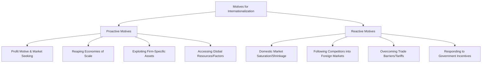

# MMPC-016: International Business Management
## Block 1: Dynamics of International Business & Environment — Hinglish Revision Notes

---

### UNIT 1: DYNAMICS OF INTERNATIONAL BUSINESS

#### 1. Domestic vs. International Business (Domestic aur International Business me kya difference hai?)
*   **Definition of International Business (IB):** Koi bhi business transaction (sales, investment, logistics, transportation) jo national boundaries (desh ki seema) ke paar hota hai. Multinational Corporations (MNCs/MNEs) IB ke central actors hote hain.
*   **Key Differences:**
    | Feature | Domestic Business | International Business |
    | :--- | :--- | :--- |
    | **Scope & Boundaries** | Operations ek single country ke political boundaries ke andar tak limited hote hain. | Operations multiple nations me spread hote hain, political aur geographical borders ko cross karte hain. |
    | **Environment** | Homogeneous environment hota hai (same culture, uniform laws, single currency). | Heterogeneous environment hota hai (diverse cultures, different legal frameworks, multi-currency). |
    | **Risk and Uncertainty** | Relativly kam risk hota hai; factors ko predict aur control karna aasan hai. | Exchange rate volatility, political instability, aur cultural barriers ki wajah se high risk hota hai. |
    | **Mobility of Factors** | Country ke andar labor aur capital ki mobility high hoti hai. | Cross-border capital flows aur immigration rules ki wajah se labor aur capital ki movement restricted hoti hai. |
    | **Customer Base** | Customer behavior, language, aur purchasing habits lagbhag same hote hain. | Customer base highly diverse hota hai, unke tastes, religion, aur income levels alag hote hain. |
    | **Government Control** | Sirf ek single government ke regulations follow karne hote hain. | Multiple host governments aur international bodies (e.g., WTO) ke rules, tariffs, aur taxes follow karne hote hain. |

#### 2. Importance and Benefits of International Business (IB ke benefits aur importance)
*   **Why is IB Important?** 
    Yeh new technologies ke transfer ko badhata hai, global competition badhata hai, product standardization ko promote karta hai, global cooperation ko encourage karta hai, aur national economies ko ek single global system me integrate karta hai.
*   **Key Benefits:**
    1.  **For Nations (Desh ke liye):**
        *   **Higher Standard of Living:** Consumers ko competitive prices par wide variety of goods aur services milti hain.
        *   **Price Stability:** Global demand-supply mismatches ko balance karta hai, jisse local price shocks nahi lagte.
        *   **Specialization & Productivity:** Countries un goods ke production par focus karti hain jisme unka comparative advantage ho, jisse resources ka maximum utilization hota hai.
        *   **Economic Growth:** Exports badhte hain, job opportunities milti hain, aur GDP boost hota hai.
        *   **International Peace:** Aapas ki economic interdependence ki wajah se military conflicts ke chances kam ho jate hain.
    2.  **For Firms (Companies ke liye):**
        *   **Wider Markets & Growth:** Saturated ya shrinking domestic market se bahar nikalne ka rasta milta hai.
        *   **Economies of Scale:** Badi production scale par unit cost reduce hoti hai.
        *   **Risk Diversification:** Alag-alag countries me operations hone se agar kisi ek economy me downturn aaye, toh doosri markets use offset kar deti hain.

#### 3. Challenges in International Business (IB me aane wale challenges)
1.  **Distance and Transport Costs:** Physical distance badhne se logistics costs badh jati hain, jisse product ki competitiveness affect hoti hai.
2.  **Time Lag:** Lambe transit time ki wajah se order delivery delay hoti hai, cargo (specially perishables) damage hone ka risk hota hai, aur capital payment cycle slow ho jata hai.
3.  **Language, Customs, and Laws:** Cultural diversity ki wajah se communication gap ho sakta hai. Host-country ke unfamiliar social norms aur rules enter karne me bade barriers bante hain.
4.  **Currency and Measurement Fluctuations:** Multiple currencies me transactions hone se exchange rates fluctuate hote hain. Alag measurement systems (e.g., India me Metric system aur USA me Imperial system) ki wajah se product specifications me changes karne padte hain.
5.  **Government Controls and Regulations:** Tariffs, quotas, licenses, aur discriminatory tax regimes (e.g., EU non-members se heavy duty leta hai jabki members duty-free trade karte hain) entry ko complex bana dete hain.
6.  **Risk and Uncertainty:** Political shocks, sudden policy changes, aur macro-economic instability ka direct impact padta hai.

#### 4. Why Do Firms Go International? (Proactive vs. Reactive Motives)
Firms internationalization ke liye do tarike se motivate hoti hain:
*   **Proactive Firms:** Aggressive, forward-looking, aur risk-taking hoti hain. Yeh khud se opportunities dhoondti hain aur domestic pressures aane se pehle hi expand karti hain.
*   **Reactive Firms:** Passive, defensive, aur risk-averse hoti hain. Yeh domestic market ke threats ya pressures se bachne ke liye react karti hain.



*   **Key Drivers Summary:**
    *   *Market-Seeking:* Badi aur integrated markets (e.g., European Union, Indian subcontinent) me enter karna.
    *   *Scale Economies:* Production and R&D volume badha kar unit cost kam karna.
    *   *Resource/Factor Seeking:* Sasta labor, raw materials ya specialized skills access karna (e.g., Japan ka India se iron ore import karna).
    *   *Defensive Offensive:* Competitor ke home market me enter karke unpar pressure banana taaki apna domestic market safe rahe.

---

### UNIT 2: GLOBALIZATION AND EVOLVING PARADIGM

#### 1. Concept and Stages of Globalization (Globalization kya hai aur iske stages)
*   **What is Globalization?** 
    Yeh ek dynamic process hai jisme national economies, industries, cultures, aur policies cross-border integrate aur interdependent hoti hain. Isme goods ke sath capital, technology, logo, aur information ka free flow hota hai.
*   **The Four Stages of Globalization:**
    1.  **First Stage (Late 19th Century to 1914):** Steamships, railways, aur telegraphs ke through trade bada. Mass migration hua, jo WWI ke sath ruka.
    2.  **Second Stage (Post-WWII to 1980s):** GATT, IMF, aur World Bank ke aane se global trade rebuild hua. US companies dominate karti thin.
    3.  **Third Stage (Late 1980s to 2000s):** LPG (Liberalization, Privatization, Globalization) reforms aur WTO ka banna. Manufacturing low-cost Asian hubs me shift hui.
    4.  **Fourth/Present Stage (2010s onward):** Digital technology, e-commerce, aur global value chains ka integration. Halanki ab geo-political tensions badh rahi hain.

#### 2. The Evolving Paradigm: Globalization vs. Re-Globalization vs. Gated-Globalization
Recent geo-political conflicts (e.g., US-China trade war, Ukraine war), Brexit, aur Covid-19 pandemic ke supply-chain disruptions ne globalization ke tareeqe ko badal diya hai:

```
┌─────────────────────────────────────────────────────────────────┐
│                    THE GLOBALIZATION TRIAD                      │
├───────────────────────┬───────────────────────┬─────────────────┤
│     Globalization     │   Re-Globalization    │Gated-Glob. (Anti)│
│  • Open global trade  │  • Supply chain       │ • Home industry │
│  • Single low-cost    │    diversification    │   ko protect    │
│    supply chain hub   │    (China + 1 model)  │   karna.        │
│    (e.g., China).     │  • Friendly alliances │ • High tariffs  │
│                       │    pe focus (Quad)    │ • Bordering     │
│                       │  • Sourcing from new  │   nations pe    │
│                       │    hubs (India, VN)   │   FDI limits.   │
└───────────────────────┴───────────────────────┴─────────────────┘
```

*   **Gated-Globalization:** Ek restrictive, state-driven approach jisme deshon ne apne markets ko protect karna shuru kar diya hai. Bordering nations ke FDI par limits lagana (e.g., India ka China se aane wale FDI ko restrict karna), high tariffs lagana, aur sirf trusted trading partners ke sath deal karna. (e.g., US ka "America-First" ya Japan ka firms ko China se nikalne ke liye incentives dena).
*   **Re-Globalization:** Yeh positive realignment hai. Globalization ko band karne ki jagah supply-chain risk ko divide kiya ja raha hai (e.g., **"China + 1" strategy** ke under India, Vietnam ya Thailand jaise countries me naye centers setup karna).
*   **India's Strategy:** India dono paradigms ko balance kar raha hai. Ek taraf **Atmanirbhar Bharat (Self-Reliant India)** aur **Production Linked Incentive (PLI)** schemes se domestic manufacturing badhai ja rahi hai, aur doosri taraf international trade ke sath open integration rakha ja raha hai.

#### 3. Drivers of Industry Globalization (George Yip's Model)
George Yip ne bataya ki industry ke globalize hone ke peechhe char main drivers hote hain:
1.  **Market Drivers:** Tastes and needs ka globally common hona, global customers ka badhna, aur lead countries ka focus.
2.  **Cost Drivers:** Global scale of production se cost savings, steep experience curves, low-cost sourcing, aur bade R&D costs ko global level par distribute karna.
3.  **Government Drivers:** Supportive trade policies, uniform technical standards, common marketing regulations, aur kam trade barriers.
4.  **Competitive Drivers:** Alag-alag countries ke markets ka aapas me connect hona, global competitors ka aana, aur rivals ke moves ko counter karna.

#### 4. Effects of Globalization on International Business
*   **Economic Integration:** National markets ka merge hona aur cross-country dependencies badhna.
*   **Industry Integration:** Global value chains ka setup hona (components alag countries me bante hain aur assemble alag jagah hote hain).
*   **Homogeneity of Tastes:** Cultural convergence hona (smartphones, fashion, aur food items ka globally standard banna).
*   **E-Commerce & Digitalization:** E-commerce ne market space ko badal diya hai. Small aur large firms bina bade budget ke directly global consumers tak pahunch sakti hain. Transaction costs kam hote hain par price sensitivity aur data protection regulations ke challenges bhi badhe hain.

---

### UNIT 3: INTERNATIONAL BUSINESS ENVIRONMENT: AN OVERVIEW

#### 1. Elements of the International Business Environment (PESTEL Elements)
Firms ka external environment par koi control nahi hota. PESTEL factors ko scan karna risk management ke liye zaroori hai:
*   **Political:** Ideologies, political risks (unrest), sovereignty, aur government stability.
*   **Economic:** GDP growth rates, inflation, exchange rates, interest rates, aur debt levels.
*   **Socio-Cultural:** Language, religion, ethics, demographics, aur customer preferences.
*   **Technological:** Innovation rates, R&D setup, infrastructure, aur Industry 4.0 techniques.
*   **Ecological/Natural:** Climate change guidelines, natural resources, geography, aur green standards.
*   **Legal:** Legal systems (Common/Civil laws), patents protection, aur standards compliance.

#### 2. The Political Environment & Political Risk
*   **Political Ideologies:** Alag-alag governance systems:
    *   *Pluralism:* Desh me bahut saare political/interest groups hote hain jo aapas me power balance karte hain.
    *   *Totalitarianism:* Monopolistic state control (e.g., military rule ya single-party dominance).
    *   *Democracy:* Log apne representatives ko elect karte hain, jahan individual freedom aur rule of law hota hai.
*   **Influence on Operations:** Government ka nature decide karta hai ki foreign investments, entry modes, aur trade barriers par kya policies hongi.
    *   **Political Risk:** Yeh risk ki country ki political situation/decisions ki wajah se firm ka profit affect ho. Isme **expropriation** (government dwara assets seize karna), equity dilution policies, trade wars, aur riots shamil hain.
    *   *Domestically:* Local business rules, taxes, aur labor laws ko impact karta hai.
    *   *Internationally:* Trade bans, assets freeze, ya forced exits (e.g., Ukraine conflict ke baad companies ka Russia se exit) karwa sakta hai.

#### 3. Technological, Ecological, and Legal Environment Impacts
*   **Technological Environment:** **Industry 4.0** (AI, Block-chain, IoT, Big Data, Machine Learning) ne manufacturing aur operations ko drastically change kiya hai. Automation ki wajah se low-wage nations ka labor advantage kam ho raha hai aur virtual workplaces badh rahe hain.
*   **Ecological Environment:** Sustainability, climate variability, aur carbon footprint reduction ab business rules decide kar rahe hain. Governments pollution aur recycling par strict laws bana rahi hain. Companies ko customer attraction aur rules compliance ke liye **green marketing** aur eco-friendly packaging use karni padti hai.
*   **Legal Environment (Legal Systems & Compliance Differences):**
    *   **Common Law:** Purani cases, codes, aur traditions par based hota hai (e.g., UK, USA, India). Yahan contracts bohot bade aur detailed hote hain.
    *   **Civil/Code Law:** Written statutes aur codes par based hota hai (e.g., France, Germany, Japan). Contracts chote hote hain kyunki major terms code me covered hote hain.
    *   **Islamic (Shariah) Law:** Quran aur Sunnah par based. Isme interest (*Riba*) charge karna aur unethical trading strictly prohibited hai.
    *   **Compliance Requirements:** Har market me IPR (Intellectual Property Rights) enforcement, health norms, aur consumer safety laws alag hote hain. Non-compliance se heavy fines lag sakte hain, products ban ho sakte hain, aur reputation kharab ho sakti hai.

#### 4. Environmental Scanning & Environmental Trends
*   **What is Environmental Scanning?** 
    External environment me chal rahe opportunities aur threats ko continuously check, analyze, aur interpret karna taaki corporate planning aur risk management ho sake.
*   **Keegan's Four Information Categories for Scanning:**
    1.  *Market Information:* Competitors details, pricing strategies, market demand, aur marketing channels.
    2.  *Prescriptive Information:* Trade rules, legal codes, tax norms, aur foreign exchange laws.
    3.  *Resource Information:* Labor availability, raw materials, capital, aur local JV partners details.
    4.  *General Information:* Inflation, currency value, political stability reports, aur cultural changes.
*   **Impact of Key Environmental Trends:**
    *   **Hollowing-Out Effect:** Jab MNEs apni production ya support functions saste countries me outsource karti hain (e.g., Bangalore me call centers setup karna), toh home country ki creative aur productive capacity "hollow out" ho jati hai, jisse wahan political protest hote hain.
    *   **Productivity Over Low Wages:** Automation ki wajah se ab pure saste labor ki value kam ho rahi hai, aur companies wahan operations lagana chahti hain jahan productivity, infrastructure, aur skills ache hon.
