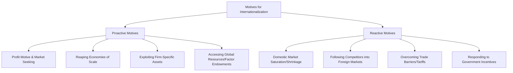

# MMPC-016: International Business Management
## Block 1: Dynamics of International Business & Environment — Revision Notes

---

### UNIT 1: DYNAMICS OF INTERNATIONAL BUSINESS

#### 1. Domestic vs. International Business
*   **Definition of International Business (IB):** Any business transaction (sales, investments, logistics, transportation) that takes place across national boundaries. Multinational Corporations (MNCs/MNEs) are the central actors in IB.
*   **Key Differences:**
    | Feature | Domestic Business | International Business |
    | :--- | :--- | :--- |
    | **Scope & Boundaries** | Operations are confined within the political boundaries of a single country. | Operations span multiple nations, crossing political and geographical boundaries. |
    | **Environment** | Homogeneous environment (familiar culture, uniform laws, single currency). | Heterogeneous environment (diverse cultures, different legal frameworks, multi-currency). |
    | **Risk and Uncertainty** | Relatively lower risk; factors are easier to predict and control. | High risk due to exchange rate volatility, political instability, and cultural barriers. |
    | **Mobility of Factors** | High mobility of labor and capital within the country. | Restrictive mobility of labor and capital across borders due to immigration and capital controls. |
    | **Customer Base** | Relatively homogeneous customer behavior, language, and purchasing habits. | Highly diverse customer base with variations in tastes, language, religion, and income. |
    | **Government Control** | Subject to regulations of a single government. | Subject to rules, tariffs, non-tariff barriers, and taxes of multiple host governments and international bodies (e.g., WTO). |

#### 2. Importance and Benefits of International Business
*   **Why is IB Important?** 
    It facilitates the diffusion of new technologies, stimulates global competition, drives product standardization, encourages global cooperation, and integrates national economies into a unified global system.
*   **Key Benefits:**
    1.  **For Nations:**
        *   **Higher Standard of Living:** Consumers get access to a wider variety of goods and services at competitive prices.
        *   **Price Stability:** Evens out demand-supply mismatches globally, preventing localized price shocks.
        *   **Specialization & Productivity:** Countries focus on producing goods where they have a comparative advantage, maximizing resource utilization.
        *   **Economic Growth:** Drives exports, creates employment, and increases GDP.
        *   **International Peace:** Mutual economic interdependence reduces the likelihood of military conflicts.
    2.  **For Firms:**
        *   **Wider Markets & Growth:** Helps firms escape saturated or shrinking domestic markets.
        *   **Economies of Scale:** Large-scale production reduces per-unit costs.
        *   **Risk Diversification:** Spread of operations across countries cushions the firm against a downturn in any single economy.

#### 3. Challenges in International Business
1.  **Distance and Transport Costs:** Physical distance increases logistics costs, affecting pricing and competitiveness.
2.  **Time Lag:** Longer transit times delay order execution, risking cargo damage (especially perishables) and delaying capital realization.
3.  **Language, Customs, and Laws:** Cultural diversity can lead to communication breakdowns. Unfamiliar social norms and complex host-country regulations act as significant barriers.
4.  **Currency and Measurement Fluctuations:** Transactions involve multiple currencies with fluctuating exchange rates. Different measurement systems (e.g., Metric system in India vs. Imperial system in the USA) require product adaptation.
5.  **Government Controls and Regulations:** Tariffs, import quotas, licenses, and discriminatory tax regimes (e.g., EU charging heavy duties on non-members while trading duty-free internally) complicate entry.
6.  **Risk and Uncertainty:** Higher vulnerability to political shocks, sudden policy changes, and macro-economic instability.

#### 4. Why Do Firms Go International? (Proactive vs. Reactive Motives)
Firms are driven to internationalize through two main orientations:
*   **Proactive Firms:** Aggressive, forward-looking, and risk-taking. They actively seek global opportunities and initiate international expansion before domestic pressures arise.
*   **Reactive Firms:** Passive, defensive, and risk-averse. They respond to external pressures or threats in their domestic environment to defend their position.



*   **Summary of Key Drivers:**
    *   *Market-Seeking:* Tapping into large, integrated markets (e.g., European Union, Indian subcontinent).
    *   *Scale Economies:* Increasing volume to lower production, marketing, and R&D costs.
    *   *Resource/Factor Seeking:* Accessing cheaper labor, raw materials, or specialized skills (e.g., Japanese steel firms sourcing iron ore from India).
    *   *Defensive Offensive:* Entering a competitor's home market to put pressure on them and protect the firm's own domestic base.

---

### UNIT 2: GLOBALIZATION AND EVOLVING PARADIGM

#### 1. Concept and Stages of Globalization
*   **What is Globalization?** 
    It is a dynamic process characterized by the increasing integration and interdependence of national economies, industries, cultures, and policies across political boundaries. It goes beyond trade to include the free flow of capital, technology, people, and information.
*   **The Four Stages of Globalization:**
    1.  **First Stage (Late 19th Century to 1914):** Driven by steamships, railways, and telegraphs. Characterized by mass migration and trade expansion, ending with WWI.
    2.  **Second Stage (Post-WWII to 1980s):** Rebuilding of international trade through GATT/IMF/World Bank. Dominated by US multinational companies.
    3.  **Third Stage (Late 1980s to 2000s):** Fall of Communism, economic liberalization (LPG reforms), and the creation of the WTO. Shift of manufacturing to low-cost Asian destinations.
    4.  **Fourth/Present Stage (2010s onward):** Driven by digital technology, e-commerce, and global value chains. Currently experiencing significant geo-political friction.

#### 2. The Evolving Paradigm: Globalization vs. Re-Globalization vs. Gated-Globalization
Recent geo-political conflicts (e.g., US-China trade wars, Russia-Ukraine war), Brexit, and the Covid-19 pandemic supply-chain disruptions have shifted the globalization paradigm:

```
┌─────────────────────────────────────────────────────────────────┐
│                    THE GLOBALIZATION TRIAD                      │
├───────────────────────┬───────────────────────┬─────────────────┤
│     Globalization     │   Re-Globalization    │Gated-Glob. (Anti)│
│  • Open global trade  │  • Diversify supply   │ • Protect home  │
│  • Single global supply  │    chains (China + 1) │   industries    │
│    chain focused on   │  • Focus on positive  │ • High tariffs  │
│    lowest-cost hubs.  │    alliances (Quad)   │ • FDI limits on │
│                       │  • Relocate to new    │   bordering     │
│                       │    hubs (India, VN)   │   nations.      │
└───────────────────────┴───────────────────────┴─────────────────┘
```

*   **Gated-Globalization:** A restrictive, state-driven approach where countries protect their home markets, restrict FDI from specific neighbors (e.g., India restricting FDI from bordering nations like China), raise tariffs, and limit trade to a selected "gate" of friendly partners. (e.g., US "America-First" policy, Japan incentivizing firms to move out of China).
*   **Re-Globalization:** A positive strategic realignment. Instead of reversing globalization, firms diversify their risk away from a single manufacturing hub (e.g., the **"China + 1" strategy**) to new competitive countries like India, Vietnam, and Thailand.
*   **India's Policy Choice:** India balance these paradigms by launching schemes like **Atmanirbhar Bharat (Self-Reliant India)** and **Production Linked Incentive (PLI)** schemes, strengthening domestic manufacturing while remaining integrated with global trade.

#### 3. Drivers of Industry Globalization
George Yip's framework identifies four broad groups of drivers that determine whether an industry will globalize:
1.  **Market Drivers:** Common customer needs, global customers, transferrable marketing, and lead countries.
2.  **Cost Drivers:** Global economies of scale, steep experience curves, sourcing efficiencies, and high product development costs that must be amortized globally.
3.  **Government Drivers:** Favorable trade policies, compatible technical standards, common marketing regulations, and government-owned competitors.
4.  **Competitive Drivers:** Interdependence of countries, global competitors, and the need to preempt rivals' moves.

#### 4. Effects of Globalization on International Business
*   **Integration of Economies:** Merging of national markets, increasing economic interdependence.
*   **Integration of Industries:** Global value chains where components are made in different countries based on cost efficiencies.
*   **Homogeneity of Tastes:** Cultural convergence where standard products (e.g., smartphones, fast food) are consumed globally.
*   **E-Commerce & Digitalization:** E-commerce has transformed the marketplace. It allows small and large firms to access global consumers directly, reduces transaction costs, and enables real-time communication. However, it also challenges firms with intense price sensitivity, brand switching, and data security regulations.

---

### UNIT 3: INTERNATIONAL BUSINESS ENVIRONMENT: AN OVERVIEW

#### 1. Elements of the International Business Environment (PESTEL)
Firms have no control over the external environment. Appraising the PESTEL forces is vital for risk mitigation:
*   **Political:** Ideologies, political risk, sovereignty, and government stability.
*   **Economic:** GDP growth, inflation, currency exchange rates, fiscal policies, and debt levels.
*   **Socio-Cultural:** Language, religion, ethics, demographics, and consumer tastes.
*   **Technological:** Innovation rates, R&D infrastructure, digital networks, and Industry 4.0.
*   **Ecological:** Environmental protection laws, climate change, geography, and carbon footprint limits.
*   **Legal:** Systems of law, contract enforcement, and compliance requirements.

#### 2. The Political Environment & Political Risk
*   **Political Ideologies:** Alternate governance philosophies:
    *   *Pluralism:* Multiple political/interest groups coexist and balance each other.
    *   *Totalitarianism:* Monopolistic state control (e.g., military junta, single-party rule).
    *   *Democracy:* Power is held by the people through elected representatives, combining freedom with rule of law.
*   **Influence on Business Operations:** 
    A country's political system determines its attitude towards foreign investment, trade barriers, and state ownership. 
    *   **Political Risk:** The risk that political decisions or events will adversely affect a firm's profitability. Includes **expropriation** (seizure of assets by the state), equity dilution laws, tariff wars, and civil unrest.
    *   *Domestically:* Affects licensing, tax codes, and labor laws.
    *   *Internationally:* Can lead to trade blockades, asset freezing, or forced exit (e.g., MNCs exiting Russia during the Ukraine conflict).

#### 3. Technological, Ecological, and Legal Environment Impacts
*   **Technological Environment:** Driven by **Industry 4.0** (AI, Block-chain, IoT, Big Data, ML). It forces firms to upgrade manufacturing, reduces direct labor cost advantages in low-wage nations (due to robotics/automation), and enables virtual office structures.
*   **Ecological Environment:** Focuses on sustainability, climate variability, terrain, and carbon footprint reduction. Countries are tightening regulations on pollution, waste disposal, and packaging. Firms must adopt **green marketing** and eco-friendly packaging to win awakened consumers and comply with international norms.
*   **Legal Environment (Legal Systems & Compliance):**
    *   **Common Law:** Based on tradition, past practices, and legal precedents (e.g., UK, USA, India). Contracts are highly detailed and lengthy.
    *   **Civil/Code Law:** Based on a comprehensive set of written statutes and codes (e.g., France, Germany, Japan). Contracts are shorter as the code fills the gaps.
    *   **Islamic (Shariah) Law:** Derived from the Quran and Sunnah. Governs banking (prohibiting interest/*Riba*) and ethical trade.
    *   **Compliance Differences:** International markets differ in intellectual property rights (IPR) enforcement, labor safety standards, and consumer protection laws. Non-compliance leads to heavy fines, ban on products, and loss of brand reputation.

#### 4. Environmental Scanning & Environmental Trends
*   **What is Environmental Scanning?** 
    The ongoing process of gathering, analyzing, and interpreting information about external opportunities and threats to assist in strategic decision-making.
*   **Keegan's Four Information Categories:**
    1.  *Market Information:* Competitors, pricing, distribution channels, and marketing mix.
    2.  *Prescriptive Information:* Regulations, foreign exchange laws, tax codes, and incentives.
    3.  *Resource Information:* Manpower, raw materials, capital availability, and joint-venture partners.
    4.  *General Information:* Macro-economic indicators, political updates, and socio-cultural shifts.
*   **Impact of Key Environmental Trends:**
    *   **Hollowing-Out Effect:** Relocating manufacturing/services to low-cost countries (e.g., outsourcing to Bangalore - "Bangalored") can hollow out the home country's creative and productive capacity, causing political backlash back home.
    *   **Productivity Over Low Wages:** Restructuring of manufacturing through automation means the relative cost advantage of low-wage nations is shrinking; firms now look for high-productivity and infrastructure quality over pure low wage rates.
