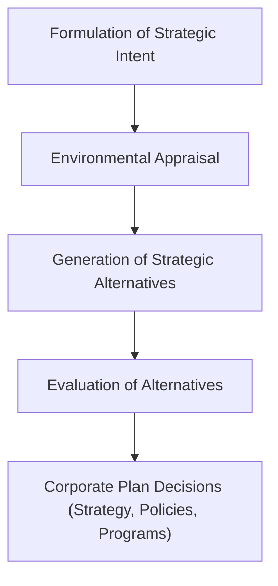

# Block 1 Revision Notes: Introduction to Corporate Management (Hinglish Version)

## Unit 1: Corporate Management: An Overview

### 1. Corporate Management: Nature, Scope, and Paradigm Shifts
Corporate management ek unified aur integrated process hai jisme corporate plans ka formulation, implementation aur evaluation shaamil hota hai.
* **Nature**: Yeh poore management process ko cover karta hai, short-term aur long-term dono hota hai, management ke saare levels par apply hota hai, aur poori tarah se integrative (sabhi ko jodkar rakhne wala) hota hai.
* **Scope**: Isme corporate governance, codes of conduct, domestic aur global markets ke competitive dynamics, network externalities, strategic enablers (IT, R&D, KM, innovation), aur corporate social responsibility (CSR) / ethics cover hote hain.
* **Five Paradigm Shifts in Corporate Management**:
  1. **Adhocism (Till 1930s)**: Exigency-driven yaani jab koi immediate crisis ya dukhda aata tha, tabhi decision liya jata tha (reactive decision-making).
  2. **Planned Policy (Post-1930s)**: Great Depression ke baad shuru hua, jisme contingencies ko anticipate karne aur stable guidelines banane par focus kiya gaya.
  3. **Environment-Strategy Interface**: External uncertainty ke under competitive advantage paane ke liye internal resources ko external environment ke sath adapt karna.
  4. **Corporate Planning**: Environmental appraisal se lekar strategic choice aur SBU coordination tak ka ek systematic progression.
  5. **Corporate Management**: Unified results paane ke liye planning ke sath execution, behavior, aur control ko integrate karna.

### 2. The Corporate Planning Process
Corporate planning ek systematic aur continuous process hai jisme future knowledge ke basis par entrepreneurial decisions liye jate hain, execution efforts ko organize kiya jata hai, aur goals ke against performance ko measure kiya jata hai.



* **Process Steps**:
  1. **Formulation of Strategic Intent**: Company ke purpose, vision, mission, aur objectives ko define karna.
  2. **Environmental Appraisal**: External environment (opportunities/threats) ko scan karna aur internal environment (strengths/weaknesses) ko analyze karna.
  3. **Generation of Strategic Alternatives**: Strengths aur opportunities ko match karte hue strategic options develop karna.
  4. **Evaluation of Alternatives**: Resources, feasibility, aur goal consistency ke basis par options ko rate karna.
  5. **Decisions on Corporate Plan**: Functional strategies, budgets, policies, aur operational programs ko finalize karna.
* **Benefits of Corporate Planning**:
  * Scarce resources ke rational allocation ko facilitate karta hai.
  * SBU/divisional efforts ko coordinate karta hai.
  * Forward-thinking aur visionary leadership ko promote karta hai.
  * Dynamic environments me respond karne ke liye ek systematic framework provide karta hai.
* **Reasons for Corporate Planning Failure**: Systems ko bahut zyada complex rakhna, organization-wide awareness ki kami, chief executives dwara planning staff ko low status dena, aur top management ka day-to-day crises me bahut zyada engrossed ho jana.
* **Prerequisites for Success**: Total chief executive commitment, implementing executives ka active participation, aur planning ko continuous basis par conduct karna.

### 3. Key Concepts in Navigation & Strategy
* **Recognizing & Ranking Opportunities in Dynamic Markets**:
  * *Scanning*: Continuous environmental scanning (PESTLE, competitive mapping).
  * *SWOT Matching*: Internal strengths ko emerging opportunities ke sath match karna.
  * *Ranking Criteria*: Opportunities ko financial feasibility, resource availability, strategic fit (core mission ke sath consistency), aur risk profiles ke basis par rate karna.
* **Scenario Planning**:
  * *Definition*: Yeh ek strategic planning tool hai jisme single forecast par rely karne ke bajaye multiple plausible futures (scenarios) construct kiye jate hain taaki organization uncertainty ke liye prepare ho sake.
  * *Role*: Yeh early warning signals ko identify karta hai, alag-alag conditions me existing strategies ki resilience ko test karta hai, cognitive biases ko prevent karta hai, aur contingency plans (jaise Special Alert Controls) map out karta hai.
* **Strategic Change and Transformation**:
  * Ise teen core dimensions ke alignment se handle kiya jata hai: **Productivity** (input/output efficiency), **Pace** (execution ki speed, jise operational efficiency bhi kehte hain), aur **People** (change ke khilaf structural aur behavioral resistance ko manage karna).
* **Aligning Structure, Culture, and Goals**:
  * *Structure follows Strategy (Chandler’s Thesis)*: Core structural mechanisms (task grouping, delegation, aur coordination) strategic goals ke sath aligned hone chahiye.
  * *Behavioral Implementation*: Strategy ke sath organizational culture, values, politics, power centers, aur leadership styles ko match karna. Mismatch hone par political resistance ke chalte execution fail ho jata hai.
* **Dynamic Capabilities**:
  * Badalte environment ke sath tezi se adapt karne ke liye internal aur external competences ko integrate, build, aur reconfigure karne ki firm ki ability (Teece et al.). Iske liye continuous learning, environmental monitoring, aur organizational flexibility zaroori hai.

### 4. Strategic Control vs. Operational Control
* **Strategic Control**: Yeh check karne ke liye external environment ko assess karne par directed hota hai ki strategy opportunities ke sath aligned hai ya nahi.
  * *Time Horizon*: Long-term.
  * *Key Types*: Premise control, implementation control, strategic surveillance, aur special alert control.
  * *Level*: Exclusively top management.
* **Operational Control**: Yeh internal organization aur operational tasks ke real-time execution par focus karta hai.
  * *Time Horizon*: Short-term (daily/weekly/monthly).
  * *Techniques*: Budgets, schedules, MBO, aur variance analysis.

### 5. Corporate Management Approaches & Roles
* **Management Approaches**:
  * *Top-Down*: Top management decide karta hai; middle/lower levels blindly execute karte hain.
  * *Bottom-Up*: Ground level se feedback aur operational realities ko promote karta hai.
  * *Hybrid (Decentralized)*: Top management aur SBUs ke beech continuous vertical communication.
  * *Team*: CEOs senior managers ke sath lateral communication use karke closely collaborate karte hain.
* **Key Strategists**:
  * *Board of Directors*: Corporate governance ko review karna, executives appoint karna, aur direction set karna.
  * *CEO*: Chief strategist jo strategic decision-making aur SBU coordination ke liye responsible hota hai.
  * *Entrepreneurs*: Proactive risk-takers jo change ko search karte hain aur use exploit karte hain.
  * *SBU Level Executives*: SBU-level functional strategies ko formulate aur execute karna.
  * *Consultants*: Feasibility studies, strategic audits, aur corporate governance me madad karna (jaise McKinsey, BCG, KPMG).

---

## Unit 2: Corporate Policy

### 1. Corporate Policy: Concept and Distinct Views
Corporate policy company ke objectives ko achieve karne ke liye actions ko govern karne ke liye management ke expressed ya implied intent ko represent karti hai. Yeh discretionary action ke liye guidelines aur limits establish karti hai.
* **Three Distinct Views**:
  1. *Synonymous with Strategy*: Broad long-range planning. (Yeh controversial hai kyunki strategy long-term goals aur resource allocations set karti hai, jabki policies thought-oriented decision guidelines hoti hain).
  2. *Tactical Tool for Strategy Implementation*: Rules, procedures, aur structures jo prescribe karte hain ki processes kaise kaam karenge.
  3. *Strategic Guidelines for Action*: Decision-making aur discretionary judgment ko guide karne ke liye common purpose ki definitions (jaise General Electric policy manual).

### 2. Features of Corporate Policy
* **General Statement of Principles**: Executives ke liye guide to action ki tarah kaam karta hai.
* **Long-Term Perspective**: Corporate systems ko stability provide karta hai.
* **Objective-Centric**: Strategic goals ko fulfill karne ke liye design kiya jata hai.
* **Qualitative, Conditional & General**: Phraseology me qualitative words use hote hain (jaise "to maintain," "to provide").
* **Guide for Repetitive Operations**: Routine decision-making ko standardize karta hai taaki baar-baar analysis na karna pade.
* **Hierarchy**: Structured levels hote hain (Basic, General, Departmental/Specific).
* **Positive Declaration**: Compliance command karta hai aur ek motivator ki tarah kaam karta hai.

### 3. Determinants of Corporate Policy

```mermaid
graph LR
    subgraph Internal Determinants
        A["Corporate Mission"]
        B["Corporate Objectives"]
        C["Available Resources"]
        D["Management Values"]
    end
    subgraph External Determinants
        E["Industry Structure"]
        F["Economic Environment"]
        G["Political Environment"]
        H["Social Environment"]
        I["Technology"]
    end
    Internal Determinants --> J["Corporate Policy Formulation"]
    External Determinants --> J
```

#### Internal Determinants
* **Corporate Mission**: Core purpose jiske liye company exist karti hai; policies iske sath aligned honi chahiye.
* **Corporate Objectives**: Economic aur financial targets policy limits ko determine karte hain.
* **Resources**: Capital structure, plant size, liquidity, aur staff expertise policy feasibility ko dictate karte hain.
* **Management Values**: Top executives ke personal values, ethics, aur traditions.

#### External Determinants
* **Industry Structure**: Competitor numbers, entry barriers, aur unki strategies.
* **Economic Environment**: Inflation, price trends, demand/supply curves, aur inputs ki availability.
* **Political Environment**: Monetary, fiscal, aur regulatory trade policies.
* **Social Environment**: Society aur interest groups ke ethnic, cultural, aur religious values.
* **Technology**: Naye systems ka emergence jo policy adaptations ko zaroori banata hai.

### 4. Classification of Corporate Policies
* **By Scope**:
  * *Basic Policies*: Top management dwara banayi jati hain; company ke overall environment ke sath relationship ko guide karti hain.
  * *General Policies*: Middle management dwara banayi jati hain; firm ke bade segments par apply hoti hain.
  * *Specific/Departmental Policies*: Supervisors dwara banayi/frame ki jati hain; routine local activities par apply hoti hain.
* **By Expression**:
  * *Expressed*: Clearly writing me ya orally stated hoti hain (small firms ke liye ideal).
  * *Implied*: Behaviors, traditions, aur organizational philosophy se derived hoti hain.
* **By Origin**:
  * *Original*: Corporate goals se directly formulate hoti hain.
  * *Appealed*: Subordinates ke suggestions/grievances ke basis par generate hoti hain.
  * *Imposed*: External entities dwara force ki jati hain (government guidelines, trade unions).
  * *Derivative*: Major corporate policies se derived operational guidelines.
* **By Function**: Production, Marketing/Sales, Financial (funds raise aur utilize karna), aur Personnel (HR recruitment, wages, training) policies.
* **By Management Function**: Planning, Organizing (delegation, structure), Actuating (leadership, climate), aur Controlling (standards, deviation correction) policies.
