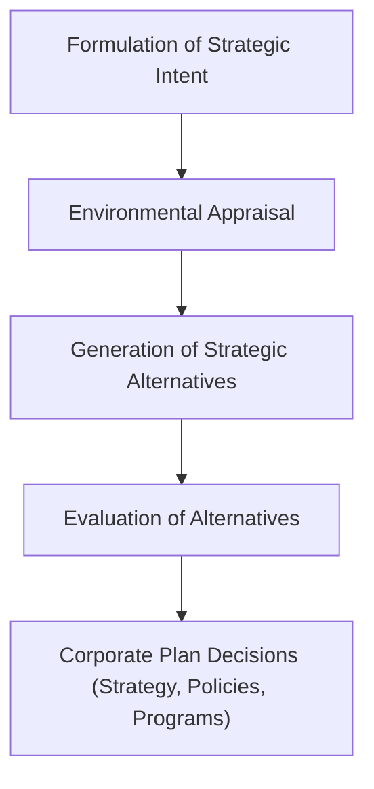

# Block 1 Revision Notes: Introduction to Corporate Management

## Unit 1: Corporate Management: An Overview

### 1. Corporate Management: Nature, Scope, and Paradigm Shifts
Corporate management is a unified and integrated process encompassing the formulation, implementation, and evaluation of corporate plans.
* **Nature**: Encompasses the entire management process, is both short-term and long-term, applies to all levels of management, and is pervasively integrative.
* **Scope**: Covers corporate governance, codes of conduct, competitive dynamics in domestic and global markets, network externalities, strategic enablers (IT, R&D, KM, innovation), and corporate social responsibility (CSR) / ethics.
* **Five Paradigm Shifts in Corporate Management**:
  1. **Adhocism (Till 1930s)**: Exigency-driven, reactive decision-making in response to immediate crises.
  2. **Planned Policy (Post-1930s)**: Emerging from the Great Depression, focusing on anticipating contingencies and setting stable guidelines.
  3. **Environment-Strategy Interface**: Adapting internal resources to external environments to secure competitive advantage under uncertainty.
  4. **Corporate Planning**: Systematic progression from environmental appraisal to strategic choice and SBU coordination.
  5. **Corporate Management**: Integration of execution, behavior, and control with planning to achieve unified results.

### 2. The Corporate Planning Process
Corporate planning is a systematic, continuous process of making entrepreneurial decisions based on future knowledge, organizing execution efforts, and measuring performance against goals.



* **Process Steps**:
  1. **Formulation of Strategic Intent**: Defining the company's purpose, vision, mission, and objectives.
  2. **Environmental Appraisal**: Scanning the external environment (opportunities/threats) and analyzing the internal environment (strengths/weaknesses).
  3. **Generation of Strategic Alternatives**: Developing strategic options to match strengths with opportunities.
  4. **Evaluation of Alternatives**: Rating options based on resources, feasibility, and goal consistency.
  5. **Decisions on Corporate Plan**: Finalizing functional strategies, budgets, policies, and operational programs.
* **Benefits of Corporate Planning**:
  * Facilitates rational allocation of scarce resources.
  * Coordinates SBU/divisional efforts.
  * Promotes forward-thinking, visionary leadership.
  * Provides a systematic framework for responding to dynamic environments.
* **Reasons for Corporate Planning Failure**: Keeping systems too complex, lack of organization-wide awareness, chief executives giving planning staff low status, and top management becoming too engrossed in day-to-day crises.
* **Prerequisites for Success**: Total chief executive commitment, active participation of implementing executives, and conducting planning on a continuous basis.

### 3. Key Concepts in Navigation & Strategy
* **Recognizing & Ranking Opportunities in Dynamic Markets**:
  * *Scanning*: Continuous environmental scanning (PESTLE, competitive mapping).
  * *SWOT Matching*: Matching internal strengths with emerging opportunities.
  * *Ranking Criteria*: Rating opportunities based on financial feasibility, resource availability, strategic fit (consistency with core mission), and risk profiles.
* **Scenario Planning**:
  * *Definition*: A strategic planning tool where multiple plausible futures (scenarios) are constructed to help organizations prepare for uncertainty, rather than relying on a single forecast.
  * *Role*: Identifies early warning signals, tests the resilience of existing strategies under varying conditions, prevents cognitive biases, and maps out contingency plans (e.g., Special Alert Controls).
* **Strategic Change and Transformation**:
  * Handled by aligning three core dimensions: **Productivity** (input/output efficiency), **Pace** (speed of execution, often expressed as operational efficiency), and **People** (managing structural and behavioral resistance to change).
* **Aligning Structure, Culture, and Goals**:
  * *Structure follows Strategy (Chandler’s Thesis)*: Core structural mechanisms (task grouping, delegation, and coordination) must align with strategic goals.
  * *Behavioral Implementation*: Matching organizational culture, values, politics, power centers, and leadership styles to the strategy. Mismatches lead to execution failures due to political resistance.
* **Dynamic Capabilities**:
  * A firm’s ability to integrate, build, and reconfigure internal and external competences to rapidly adapt to changing environments (Teece et al.). It requires continuous learning, environmental monitoring, and organizational flexibility.

### 4. Strategic Control vs. Operational Control
* **Strategic Control**: Directed toward assessing the external environment to check if the strategy remains aligned with opportunities.
  * *Time Horizon*: Long-term.
  * *Key Types*: Premise control, implementation control, strategic surveillance, and special alert control.
  * *Level*: Exclusively top management.
* **Operational Control**: Focused on internal organization and real-time execution of operational tasks.
  * *Time Horizon*: Short-term (daily/weekly/monthly).
  * *Techniques*: Budgets, schedules, MBO, and variance analysis.

### 5. Corporate Management Approaches & Roles
* **Management Approaches**:
  * *Top-Down*: Top management decides; middle/lower levels execute blindly.
  * *Bottom-Up*: Encourages feedback and operational realities from the ground up.
  * *Hybrid (Decentralized)*: Continuous vertical communication between top management and SBUs.
  * *Team*: CEOs collaborate closely with senior managers using lateral communication.
* **Key Strategists**:
  * *Board of Directors*: Reviewing corporate governance, appointing executives, and setting direction.
  * *CEO*: Chief strategist responsible for strategic decision-making and SBU coordination.
  * *Entrepreneurs*: Proactive risk-takers searching for change and exploiting it.
  * *SBU Level Executives*: Formulating and executing SBU-level functional strategies.
  * *Consultants*: Assist with feasibility studies, strategic audits, and corporate governance (e.g., McKinsey, BCG, KPMG).

---

## Unit 2: Corporate Policy

### 1. Corporate Policy: Concept and Distinct Views
Corporate policy represents management’s expressed or implied intent to govern action in the pursuit of the company’s objectives. It establishes guidelines and limits for discretionary action.
* **Three Distinct Views**:
  1. *Synonymous with Strategy*: Broad long-range planning. (Controversial as strategy sets long-term goals and resource allocations, while policies are thought-oriented decision guidelines).
  2. *Tactical Tool for Strategy Implementation*: Rules, procedures, and structures prescribing how processes will function.
  3. *Strategic Guidelines for Action*: Definitions of common purpose to guide decision-making and discretionary judgment (e.g., General Electric policy manual).

### 2. Features of Corporate Policy
* **General Statement of Principles**: Acts as a guide to action for executives.
* **Long-Term Perspective**: Provides stability to corporate systems.
* **Objective-Centric**: Designed for the fulfillment of strategic goals.
* **Qualitative, Conditional & General**: Phraseology uses qualitative words ("to maintain," "to provide").
* **Guide for Repetitive Operations**: Standardizes routine decision-making to avoid constant analysis.
* **Hierarchy**: Structured levels (Basic, General, Departmental/Specific).
* **Positive Declaration**: Commands compliance and acts as a motivator.

### 3. Determinants of Corporate Policy
```mermaid
graph LR
    subgraph Internal Determinants
        A["Corporate Mission"]
        B["Corporate Objectives"]
        C["Available Resources"]
        D["Management Values"]
    end
    subgraph External Determinants
        E["Industry Structure"]
        F["Economic Environment"]
        G["Political Environment"]
        H["Social Environment"]
        I["Technology"]
    end
    Internal Determinants --> J["Corporate Policy Formulation"]
    External Determinants --> J
```

#### Internal Determinants
* **Corporate Mission**: The core purpose for which the company exists; policies must align with it.
* **Corporate Objectives**: Economic and financial targets determine the policy limits.
* **Resources**: Capital structure, plant size, liquidity, and staff expertise dictate policy feasibility.
* **Management Values**: Personal values, ethics, and traditions of top executives.

#### External Determinants
* **Industry Structure**: Competitor numbers, entry barriers, and strategies.
* **Economic Environment**: Inflation, price trends, demand/supply curves, and input availability.
* **Political Environment**: Monetary, fiscal, and regulatory trade policies.
* **Social Environment**: Ethnic, cultural, and religious values of society and interest groups.
* **Technology**: Emergence of new systems necessitating policy adaptations.

### 4. Classification of Corporate Policies
* **By Scope**:
  * *Basic Policies*: Framed by top management; guide the company's overall relationship with its environment.
  * *General Policies*: Framed by middle management; apply to large segments of the firm.
  * *Specific/Departmental Policies*: Framed by supervisors; apply to routine local activities.
* **By Expression**:
  * *Expressed*: Clearly stated in writing or orally (ideal for small firms).
  * *Implied*: Derived from behaviors, traditions, and organizational philosophy.
* **By Origin**:
  * *Original*: Formulated directly from corporate goals.
  * *Appealed*: Generated based on suggestions/grievances from subordinates.
  * *Imposed*: Forced by external entities (government guidelines, trade unions).
  * *Derivative*: Operational guidelines derived from major corporate policies.
* **By Function**: Production, Marketing/Sales, Financial (raising and utilizing funds), and Personnel (HR recruitment, wages, training).
* **By Management Function**: Planning, Organizing (delegation, structure), Actuating (leadership, climate), and Controlling (standards, deviation correction).
