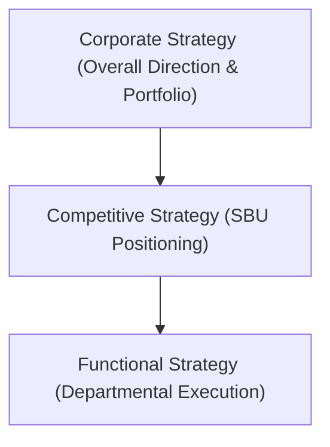

# Block 2 Revision Notes: Corporate Level Growth Strategy (Hinglish Version)

## Unit 3: Intensive Growth Strategies

### 1. Levels and Scope of Strategy
Strategy organizational ends (objectives) aur means (resources) ke beech ke gap ko bridge karti hai. Yeh teen hierarchical levels par operate karti hai:
* **Corporate-Level Strategy**: Growth ke liye overall blueprint hai. Yeh is question ka answer deti hai: *"Hum kaunse businesses me hain, aur hum in businesses ke sath kya karna chahte hain?"* Yeh overall direction, portfolio mix, aur corporate center kaise value add karta hai (parenting advantage) ko establish karti hai.
* **Competitive (Business-Level) Strategy**: Yeh determine karti hai ki ek firm kisi specific industry ya Strategic Business Unit (SBU) ke andar kaise compete karegi. Standard options me low-cost leadership, differentiation, aur focus shaamil hain.
* **Functional (Operational) Strategy**: Departmental levels par local aur short-term (<1 year) action plans, jo functional departments (marketing, finance, production) dwara resource productivity ko maximize karne ke liye develop kiye jate hain.

### 2. Generic Corporate (Grand) Strategies
* **Stability Strategies**: Apne current level of activity ko incremental growth ke sath maintain rakhna, jisme current products aur markets par hi focus kiya jata hai.
* **Growth/Expansion Strategies**: Scale, integration, diversification, ya internationalization ke zariye sales, market share, aur assets ko accelerate karna.
* **Retrenchment Strategies**: Competitive position ko improve karne ke liye redirection karna (turnaround), ya divestment/liquidation ke zariye cuts lagana.
* **Combination Strategies**: Alag-alag business units me stability, growth, aur retrenchment ko sequence me ya simultaneously apply karna (jaise TISCO ne non-core activities ko divest kiya aur core steel operations ko consolidate kiya).

### 3. Stability Strategy: Nature, Rationale, and Approaches
* **Nature**: Ek defensive strategy hai jo stable environments, mature industries (jahan limited growth ho), ya rapid expansion ke baad consolidate karne wali organizations ke liye ideal hai.
* **Rationale**: Isme high risk nahi hota, naye capital assets ki zaroorat nahi hota, status quo bana rehta hai, aur overstretching ke chalte hone wali management inefficiency se bache rehte hain.
* **Four Strategic Approaches**:
  1. **Holding Strategy**: Growth ko digest karne ke liye ya volatile/uncertain environments ke guzarne ka wait karne ke liye current rate of development ko maintain rakhna.
  2. **Stable Growth Strategy**: Apne current kaam ko hi thoda behtar dhang se karte hue dheere-dheere expand karna.
  3. **Harvesting Strategy**: Apne dominant market share se short-term cash flow ko maximize karne ke liye investments ko minimize karna aur costs ko cut karna, jabki prices ko badha dena (jaise HUL ka Lifebuoy soap).
  4. **Profit or Endgame Strategy**: Transition phase ke dauran kisi obsolete technology par capitalize karna, spare parts ke high-margin aftermarket ko capture karke (jaise vacuum tubes me Sylvania, RCA, aur GE).

### 4. Expansion through Intensification: Ansoff’s Matrix
Intensification ka matlab hai current line of business ke andar hi growth par focus karna. **Ansoff Product-Market Expansion Grid** iske char main routes ko define karta hai:

| Markets \ Products | Current Products | New Products |
| :--- | :--- | :--- |
| **Current Markets** | **Market Penetration** *(Low Risk)* | **Product Development** *(Moderate Risk)* |
| **New Markets** | **Market Development** *(Moderate Risk)* | **Diversification** *(High Risk)* |

* **Market Penetration**: Current markets me current products ki sales ko badhana—non-users ko frequent users me convert karke, competitors ke customers ko attract karke, ya loyalty programs launch karke.
* **Market Development**: Existing products ko naye geographical areas me introduce karna ya naye demographic segments ko target karna.
* **Product Development**: Current customer base ke liye naye ya improved products/variants introduce karna.

### 5. Expansion through Integration
Integration ka matlab hai value chain stages ya competitor operations ko combine karke externally expand karna.
* **Vertical Integration**: Supply chain ke alag-alag stages ko aapas me link karna.
  * **Backward (Upstream)**: Inputs/suppliers par control paana (jaise Nirma ne soda ash aur linear alkyl benzene manufacture karne ke liye plants lagaye).
  * **Forward (Downstream)**: Distribution/retailers par control paana (jaise kisi computer manufacturer ka retail outlets own karna).
  * *Pros*: Upstream/downstream margins ko capture karta hai, supply chains ko coordinate karta hai, entry barriers khada karta hai, aur scarce resources ko secure karta hai.
  * *Cons*: High capital requirements, capacity balancing ki problems, strategic flexibility ka kam hona, aur technological obsolescence ka risk.
  * *Alternatives*: Long-term contracts, franchise agreements, joint ventures, ya facilities ki co-location.
* **Horizontal Integration**: Value chain ke same level par competitors ko acquire ya merge karna (jaise Aditya Birla Group dwara L&T Cements ko acquire karna).
  * *Pros*: Economies of scale/scope, suppliers par behtar bargaining power, brand synergy, aur competitive intensity ka kam hona.
  * *Cons*: Anti-trust/legal hurdles, cultural friction, aur imaginary synergies ka fail ho jana.

### 6. International Expansion: Modes and Strategies
Firms globally expand karti hain taaki product life cycles ko extend kiya ja sake, low-cost inputs ko access kiya ja sake, aur economies of scale achieve ki ja sake.
* **Entry Modes (Control vs. Risk Trade-off)**:
  1. **Exporting**: Domestic level par produce karke abroad me bechna. Low risk/investment lekin transport costs aur tariffs high hote hain.
  2. **Licensing**: Royalties ke badle intellectual property use karne ke rights dena. Risk/investment ko minimize karta hai par operational control nahi rehta aur future competitor khada hone ka risk rehta hai.
  3. **Joint Venture**: Local partner ke sath resources combine karna. Entry barriers aur cultural gaps ko overcome karta hai par control dilute hota hai aur partner conflicts ho sakte hain.
  4. **Direct Investment**: Wholly owned local operations ko acquire ya build karna. High control aur insider status milta hai lekin high resource commitment aur political/economic risk exposure hota hai.
* **Strategic Archetypes**:
  * **Multi-domestic Strategy**: Decentralized operations; products ko local national preferences ke hisab se customize kiya jata hai.
  * **Global Strategy**: Scale economies paane ke liye standardized products aur globally integrated operations chalana.
  * **Transnational Strategy**: Glocalization (*"Think globally, act locally"*); global supply chains ko integrate karte hue local flexibility aur responsiveness ko maintain rakhna.

---

## Unit 4: Integration and Diversification Growth Strategies

### 1. Diversification Strategy: Concentric vs. Conglomerate
Diversification ka matlab hai current industry boundaries se bahar naye business lines me kadam rakhna.
* **Concentric (Related) Diversification**: Aise naye product/service areas me enter karna jo existing lines se alag toh hain par unme technological, production, ya marketing commonalities hain.
* **Conglomerate (Unrelated) Diversification**: Bilkul unrelated industries me enter karna jahan koi product, market, ya technological synergy na ho (jaise Reliance Group).
* **Rationale (Pros & Cons)**:
  * *Advantages*: Risk ka dispersal (bhatwara), financial economies of scope, surplus cash ka utilization, nayi technologies ka access, aur tax savings.
  * *Disadvantages*: Focus ka dilute hona, administrative overhead, core capabilities ka overstretch hona, aur high coordination costs.

### 2. Mergers and Acquisitions (M&A)
* **Distinction**: **Acquisition** me ek badi firm dusri choti firm ka controlling interest le leti hai. **Merger** do barabar ki companies ke beech ek mutual transaction ki tarah hota hai.
* **Motivations for M&A**: Tezi se inorganic growth paana, critical mass/market share acquire karna, skill aur technology enhancement, cost rationalization, aur offshore capabilities ko access karna.
* **M&A Pitfalls & Failure Reasons**: Integration ki dikkatein, cultural clashes, bahut zyada debt leverage (jis se bankruptcy risk badhta hai), over-diversification jis se efficiency loss hoti hai, aur customer service/revenue generation ko ignore karke sirf cost-cutting par focus karna.
* **M&A Transaction Steps**:
  1. **Initial Offer**: Acquirer cash, stock, ya unke combination ke zariye tender offer (pricing, deadlines, terms) deta hai.
  2. **Target Response**: Target company ke paas options hote hain—*Accept* karna, *better terms ke liye negotiate* karna, *Hostile Takeover Defense* deploy karna (poison pills, antitrust lawsuits), ya kisi *White Knight* (friendly acquirer) ko dhoodhna.
  3. **Closing the Deal**: Ownership ka transfer. Cash deals par immediately tax lagta hai; stock-swap deals me tax liabilities tab tak defer rehti hain jab tak shares beche nahi jate.

### 3. M&A Valuation and Synergy Formulas
* **Comparative Ratios**: Offer prices target performance ke multiples par based hoti hain:
  $$\text{Valuation (P/E Basis)} = \text{Target Earnings} \times \text{Industry P/E Multiple}$$
  $$\text{Valuation (P/S Basis)} = \text{Target Revenues} \times \text{Industry P/S Multiple}$$
* **Replacement Cost**: Equipment, asset, aur staffing replacement costs ka sum, jisme intangibles (goodwill, management brand) shaamil nahi hote.
* **Discounted Cash Flow (DCF)**: Expected future cash flows ki present value calculate karta hai:
  $$DCF = \sum_{t=1}^{n} \frac{CF_t}{(1 + WACC)^t} + \frac{TV}{(1 + WACC)^n}$$
  *(Yahan $CF_t$ year $t$ ka cash flow hai, $WACC$ Weighted Average Cost of Capital hai, aur $TV$ Terminal Value hai).*
* **Synergy Test of Success**: Merger tabhi value create karta hai jab acquirer ka post-merger stock price badhta hai:
  $$\text{Acquirer's Post-Merger Stock Price} = \frac{\text{Pre-Merger Combined Firm Value} + \text{Synergies}}{\text{Post-Merger Number of Shares}}$$

### 4. Strategic Pricing and Revenue Management
* **Revenue Management (Yield Management)**: Fixed capacity constraint ke under profit ko maximize karna, supply aur demand ke basis par dynamic pricing karke:
  $$\text{Revenue Yield} = \frac{\text{Actual Revenue}}{\text{Potential Maximum Revenue}}$$
* **Strategic Pricing Challenges**:
  * **Price Elasticity of Demand** ($E_d$): Price changes ke prati consumer sensitivity ko check karna:
    $$E_d = \frac{\% \Delta \text{ Quantity Demanded}}{\% \Delta \text{ Price}}$$
  * **Dynamic Pricing**: Capacity availability, competitor actions, aur time-sensitive demand ke basis par real-time prices set karna.
  * **Price Segmentation**: Consumer segments ki willingness to pay ke basis par prices customize karna (jaise peak vs. off-peak pricing).

---

## Unit 5: Strategic Alliances

### 1. Concept and Types of Strategic Alliances
Strategic alliance do ya zyada firms ke beech milkar business karne ka ek cooperative agreement hai, jo normal transactions se bada hota hai par merger ya full partnership se chota.
* **Contractual (Non-equity) Alliances**: Short-term, asset-light arrangements jaise licensing, joint marketing/distribution agreements, R&D contracts, aur outsourcing.
* **Joint Ventures (JVs)**: Ek alag legal third entity banana jahan dono partners capital, distinctive skills, aur managers contribute karte hain (jaise Hero Honda, Wipro GE).
* **Cross-Holdings & Consortia**: Multi-partner alliances jisme mutual equity stakes hote hain taaki long-term technological aur market ventures par organizations ko closely bind kiya ja sake.

### 2. Factors Promoting the Rise of Strategic Alliances
* National aur technological boundaries ka blur (dhundhla) hona.
* Bhari R&D aur capital investments ke cost burden ko share karna.
* Naye geographic/ethnic markets aur distribution channels ko access karna.
* Volatile economic aur technological environments me risk manage karna.
* Speed to market; time-consuming aur expensive internal competency development se bachna.

### 3. Costs and Risks of Strategic Alliances
* **Loss of Autonomy & Operational Control**: Kisi bhi single partner ke paas outcomes par unilateral (ektarfa) control nahi hota.
* **Cultural Clashes**: Differing corporate values aur managerial styles ke chalte friction (jaise Western firms ka focus shareholder returns par aur Asian firms ka employees ke interests par).
* **Lack of Trust**: Is se blame-shifting, hidden agendas, aur opportunistic behavior (shirking, resource appropriation) badhta hai.
* **Creating a Competitor**: Partner dwara proprietary skills seekhkar ek competing business launch karne ka risk.
* **Coordination & Loss of Agility**: Negotiation bottlenecks ke chalte decision-making me delays hona.

### 4. Factors Contributing to Successful Alliances
* **Senior Management Commitment**: Key managerial, capital, aur technical resources allocate karna.
* **Compatibility of Philosophies**: Similar strategies aur corporate cultures wale partners select karna.
* **Frequent Performance Feedback**: Clearly defined aur measurable goals ke against continuous evaluation.
* **Trust & Communication**: Responsibility, equality, aur reliability par based personal relationships banana. Kenichi Ohmae ise marriage se compare karte hain: isme loose evolution, faith, aur mutual adaptation zaroori hai.
* **Safeguards**: Contractually critical technology ko block karna, skills swap karna, aur credible commitments seek karna.

### 5. Planning for a Successful Alliance
* **SWOT Analysis**: Resource compatibility ensure karne ke liye details me internal aur partner SWOT reviews karna.
* **Alliance Plan**: Revenue aur non-revenue dono targets ko map karne wala ek living aur flexible document formulate karna.
* **Exit Strategy**: Shuruat me hi alliance ko wind down, buy out, ya dissolve karne ke clear terms formulate karna.

### 6. Corporate Social Responsibility (CSR) and Sustainability
* **Integration**: Alliance strategies ko environmental aur social guidelines ke sath align karna.
* **Supply Chain Risks**: Kisi partner ki poor ethical practices (child labor, hazardous waste disposal, ecological damage) ki wajah se company ki reputation kharab ho sakti hai.
* **Policy Alignment**: Waste management, human rights, aur local economic impact ko handle karne ke liye shuruat me hi common agreed-upon policies aur audits formulate karna.
