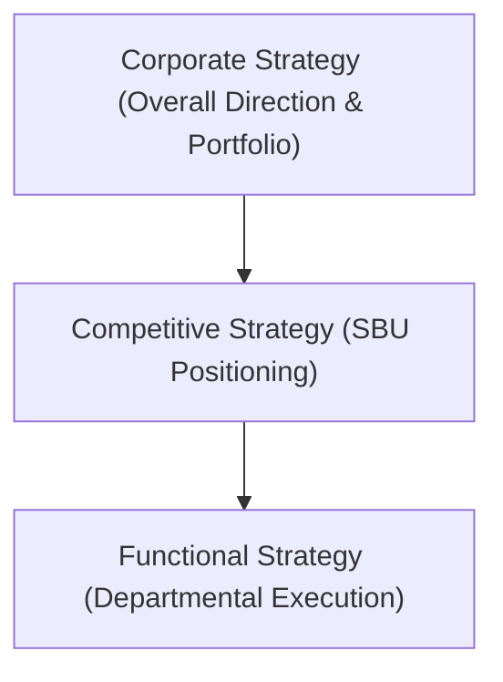

# Block 2 Revision Notes: Corporate Level Growth Strategy

## Unit 3: Intensive Growth Strategies

### 1. Levels and Scope of Strategy
Strategy bridges the gap between organizational ends (objectives) and means (resources). It operates at three hierarchical levels:
* **Corporate-Level Strategy**: The overall blueprint for growth. It answers: *"What businesses are we in, and what do we want to do with these businesses?"* It establishes the direction, portfolio mix, and how the corporate center adds value (parenting advantage).
* **Competitive (Business-Level) Strategy**: Determines how a firm competes within a specific industry or Strategic Business Unit (SBU). Standard options include low-cost leadership, differentiation, and focus.
* **Functional (Operational) Strategy**: Localized, short-term (<1 year) action plans developed by functional departments (marketing, finance, production) to maximize resource productivity.

### 2. Generic Corporate (Grand) Strategies
* **Stability Strategies**: Maintaining the current level of activity with incremental growth, focusing on current products and markets.
* **Growth/Expansion Strategies**: Accelerating sales, market share, and assets through scale, integration, diversification, or internationalization.
* **Retrenchment Strategies**: Redirection to improve competitive position (turnaround), or cutting back via divestment or liquidation.
* **Combination Strategies**: Sequencing or simultaneously applying stability, growth, and retrenchment across different business units (e.g., TISCO divesting non-core activities while consolidating core steel operations).

### 3. Stability Strategy: Nature, Rationale, and Approaches
* **Nature**: A defensive strategy ideal for stable environments, mature industries with limited growth, or organizations consolidating after rapid expansion.
* **Rationale**: Avoids high risk, requires no new capital assets, maintains status quo, and helps prevent management inefficiency due to overstretching.
* **Four Strategic Approaches**:
  1. **Holding Strategy**: Maintaining current rates of development to digest growth or wait out volatile/uncertain environments.
  2. **Stable Growth Strategy**: Moderate, steady expansion by focusing on doing what the firm already does, but slightly better.
  3. **Harvesting Strategy**: Minimizing investments and cutting costs while raising prices to maximize short-term cash flow from a dominant market share (e.g., HUL's Lifebuoy soap).
  4. **Profit or Endgame Strategy**: Capitalizing on an obsolete technology during a transition phase by capturing the high-margin aftermarket for spare parts (e.g., Sylvania, RCA, and GE in vacuum tubes).

### 4. Expansion through Intensification: Ansoff’s Matrix
Intensification focuses on growth within the current line of business. The **Ansoff Product-Market Expansion Grid** defines the four main routes:

| Markets \ Products | Current Products | New Products |
| :--- | :--- | :--- |
| **Current Markets** | **Market Penetration** *(Low Risk)* | **Product Development** *(Moderate Risk)* |
| **New Markets** | **Market Development** *(Moderate Risk)* | **Diversification** *(High Risk)* |

* **Market Penetration**: Scaling sales of current products in current markets by converting non-users to frequent users, attracting competitors' customers, or launching loyalty programs.
* **Market Development**: Introducing existing products into new geographical areas or targeting new demographic segments.
* **Product Development**: Introducing new or improved products/variants targeted to the current customer base.

### 5. Expansion through Integration
Integration involves expanding externally by combining value chain stages or competitor operations.
* **Vertical Integration**: Linking different stages of the supply chain.
  * **Backward (Upstream)**: Gaining control over inputs/suppliers (e.g., Nirma setting up plants to manufacture soda ash and linear alkyl benzene).
  * **Forward (Downstream)**: Gaining control over distribution/retailers (e.g., a computer manufacturer owning retail outlets).
  * *Pros*: Captures upstream/downstream margins, coordinates supply chains, builds entry barriers, secures scarce resources.
  * *Cons*: High capital requirements, capacity balancing issues, reduced strategic flexibility, potential technological obsolescence.
  * *Alternatives*: Long-term contracts, franchise agreements, joint ventures, co-location of facilities.
* **Horizontal Integration**: Acquiring or merging with competitors at the same level of the value chain (e.g., Aditya Birla Group acquiring L&T Cements).
  * *Pros*: Economies of scale/scope, enhanced bargaining power over suppliers, brand synergy, and reduced competitive intensity.
  * *Cons*: Anti-trust/legal hurdles, cultural friction, and failure to realize imaginary synergies.

### 6. International Expansion: Modes and Strategies
Firms expand globally to extend product life cycles, access low-cost inputs, and achieve economies of scale.
* **Entry Modes (Control vs. Risk Trade-off)**:
  1. **Exporting**: Domestically producing and selling abroad. Low risk/investment but high transport costs and tariffs.
  2. **Licensing**: Granting rights to use intellectual property in exchange for royalties. Minimizes risk/investment but lacks operational control and risks creating a future competitor.
  3. **Joint Venture**: Combining resources with a local partner. Overcomes barriers and cultural gaps but involves dilution of control and potential partner conflicts.
  4. **Direct Investment**: Acquiring or building wholly owned local operations. High control and insider status but demands high resource commitment and political/economic risk exposure.
* **Strategic Archetypes**:
  * **Multi-domestic Strategy**: Decentralized operations; products are customized to local national preferences.
  * **Global Strategy**: Standardized products and integrated worldwide operations to achieve scale economies.
  * **Transnational Strategy**: Glocalization (*"Think globally, act locally"*); integrating global supply chains while maintaining local flexibility and responsiveness.

---

## Unit 4: Integration and Diversification Growth Strategies

### 1. Diversification Strategy: Concentric vs. Conglomerate
Diversification involves moving into new business lines outside current industry boundaries.
* **Concentric (Related) Diversification**: Entering new product/service areas that are different from existing lines but share technological, production, or marketing commonalities.
* **Conglomerate (Unrelated) Diversification**: Entering entirely unrelated industries with no product, market, or technological synergies (e.g., Reliance Group).
* **Rationale (Pros & Cons)**:
  * *Advantages*: Risk dispersal, financial economies of scope, utilizing surplus cash, access to new technologies, and tax savings.
  * *Disadvantages*: Dilution of focus, administrative overhead, overstretching core capabilities, and high coordination costs.

### 2. Mergers and Acquisitions (M&A)
* **Distinction**: **Acquisition** involves a larger firm taking over controlling interest of a smaller firm. **Merger** is a combination portrayed as a transaction between equals.
* **Motivations for M&A**: Fast inorganic growth, acquiring critical mass/market share, skill and technology enhancement, cost rationalization, and accessing offshore capabilities.
* **M&A Pitfalls & Failure Reasons**: Integration difficulties, cultural clashes, excessive debt leverage (increasing bankruptcy risk), over-diversification leading to efficiency losses, and focusing too narrowly on cost-cutting while ignoring customer service and revenue generation.
* **M&A Transaction Steps**:
  1. **Initial Offer**: Acquirer makes a tender offer (pricing, deadlines, terms) using cash, stock, or a combination.
  2. **Target Response**: Target company's options are to *Accept*, *Negotiate for better terms*, deploy a *Hostile Takeover Defense* (e.g., poison pills, antitrust lawsuits), or seek a *White Knight* (friendly acquirer).
  3. **Closing the Deal**: Transfer of ownership. Cash deals are taxable immediately; stock-swap deals defer tax liabilities until shares are sold.

### 3. M&A Valuation and Synergy Formulas
* **Comparative Ratios**: Offer prices are frequently based on multiples of target performance:
  $$\text{Valuation (P/E Basis)} = \text{Target Earnings} \times \text{Industry P/E Multiple}$$
  $$\text{Valuation (P/S Basis)} = \text{Target Revenues} \times \text{Industry P/S Multiple}$$
* **Replacement Cost**: Sum of equipment, asset, and staffing replacement costs, excluding intangibles (goodwill, management brand).
* **Discounted Cash Flow (DCF)**: Calculates the present value of expected future cash flows:
  $$DCF = \sum_{t=1}^{n} \frac{CF_t}{(1 + WACC)^t} + \frac{TV}{(1 + WACC)^n}$$
  *(Where $CF_t$ is cash flow in year $t$, $WACC$ is the Weighted Average Cost of Capital, and $TV$ is the Terminal Value).*
* **Synergy Test of Success**: A merger creates value only if the acquirer's post-merger stock price is enhanced:
  $$\text{Acquirer's Post-Merger Stock Price} = \frac{\text{Pre-Merger Combined Firm Value} + \text{Synergies}}{\text{Post-Merger Number of Shares}}$$

### 4. Strategic Pricing and Revenue Management
* **Revenue Management (Yield Management)**: Maximizing profit under fixed capacity constraint by dynamically pricing based on supply and demand:
  $$\text{Revenue Yield} = \frac{\text{Actual Revenue}}{\text{Potential Maximum Revenue}}$$
* **Strategic Pricing Challenges**:
  * **Price Elasticity of Demand** ($E_d$): Gauging consumer sensitivity to price changes:
    $$E_d = \frac{\% \Delta \text{ Quantity Demanded}}{\% \Delta \text{ Price}}$$
  * **Dynamic Pricing**: Setting real-time prices based on capacity availability, competitor actions, and time-sensitive demand.
  * **Price Segmentation**: Customizing prices based on consumer segments' willingness to pay (e.g., peak vs. off-peak pricing).

---

## Unit 5: Strategic Alliances

### 1. Concept and Types of Strategic Alliances
A strategic alliance is a cooperative agreement between firms to do business together that goes beyond normal transactions but falls short of a merger or full partnership.
* **Contractual (Non-equity) Alliances**: Short-term, asset-light arrangements including licensing, joint marketing/distribution agreements, R&D contracts, and outsourcing.
* **Joint Ventures (JVs)**: Creating a separate legal third entity where both partners contribute capital, distinctive skills, and managers (e.g., Hero Honda, Wipro GE).
* **Cross-Holdings & Consortia**: Multi-partner alliances involving mutual equity stakes to bind organizations closely together on long-term technological and market ventures.

### 2. Factors Promoting the Rise of Strategic Alliances
* Blurring of national and technological boundaries.
* Shared cost burden of massive R&D and capital investments.
* Access to new geographic/ethnic markets and distribution channels.
* Risk management in highly volatile economic and technological environments.
* Speed to market; avoiding time-consuming and expensive internal competency development.

### 3. Costs and Risks of Strategic Alliances
* **Loss of Autonomy & Operational Control**: No single partner has unilateral control over outcomes.
* **Cultural Clashes**: Friction due to differing corporate values and managerial styles (e.g., Western focus on shareholder returns vs. Asian focus on employee interests).
* **Lack of Trust**: Leads to blame-shifting, hidden agendas, and opportunistic behavior (shirking, resource appropriation).
* **Creating a Competitor**: Risk of the partner learning proprietary skills and launching a competing business.
* **Coordination & Loss of Agility**: Delays in decision-making due to negotiation bottlenecks.

### 4. Factors Contributing to Successful Alliances
* **Senior Management Commitment**: Allocating key managerial, capital, and technical resources.
* **Compatibility of Philosophies**: Selecting partners with similar strategies and corporate cultures.
* **Frequent Performance Feedback**: Continuous evaluation against clearly defined, measurable goals.
* **Trust & Communication**: Building personal relationships based on responsibility, equality, and reliability. Ohmae compares it to a marriage: it requires loose evolution, faith, and mutual adaptation.
* **Safeguards**: Contractually blocking critical technology, swapping skills, and seeking credible commitments.

### 5. Planning for a Successful Alliance
* **SWOT Analysis**: Performing detailed internal and partner SWOT reviews to ensure resource compatibility.
* **Alliance Plan**: Formulating a living, flexible document mapping both revenue and non-revenue targets.
* **Exit Strategy**: Formulating clear terms for winding down, buying out, or dissolving the alliance up front.

### 6. Corporate Social Responsibility (CSR) and Sustainability
* **Integration**: Aligning alliance strategies with environmental and social guidelines.
* **Supply Chain Risks**: A company can have its reputation tarnished by a partner's poor ethical practices (e.g., child labor, hazardous waste disposal, ecological damage in mineral/oil extraction).
* **Policy Alignment**: Formulating common agreed-upon policies and audits at the outset to handle waste management, human rights, and local economic impact.
