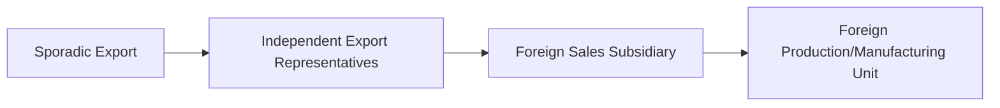
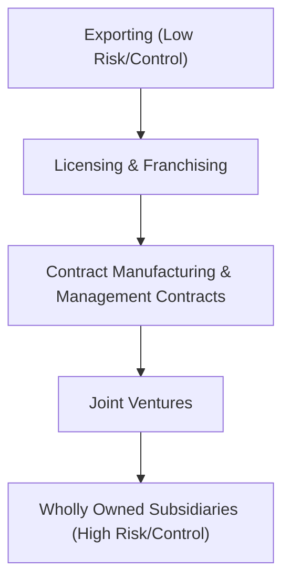

# Block 3 Revision Notes: International Strategy (Hinglish Version)

## Unit 6: Internationalization Process

### 1. Reasons for Internationalization
Companies kai driving factors ki wajah se internationalize karti hain:
* **Market Expansion & Growth**: Saturated domestic markets se nikal kar bade customer bases ko access karna.
* **Economies of Scale**: Unit costs ko kam karne ke liye production volume badhana.
* **Cost Minimization**: Low-cost inputs ko access karna (jaise cheap labor, raw materials, land).
* **Diversification**: Localized economic downturns ke asar ko kam karne ke liye business risk ko multiple national markets me spread karna.
* **Government Incentives**: Host country ke investment subsidies aur tax benefits ka fayda uthana.
* **Joint Venture Opportunities**: Local distribution channels aur market knowledge ko jaldi access karne ke liye partner karna.

### 2. Stages of Internationalization
Firms aamtaur par paanch distinct evolutionary stages se guzarti hain:
1. **Domestic Operations**: Poori tarah se home-market par focus; ethnocentric orientation hota hai (foreign markets ko consider nahi kiya jata).
2. **Foreign Operations (Export)**: Minimal resource commitment ke sath domestically produced goods ko foreign markets me sell karna.
3. **Joint Ventures or Subsidiaries**: Cost/profit-sharing partnerships ke zariye host country me physical operations establish karna.
4. **Multinational Operations (MNC)**: Polycentric orientation; multiple foreign subsidiaries ko independent entities ki tarah manage karna (multi-domestic strategy).
5. **Transnational Operations**: Geocentric orientation; global integration (efficiency) aur local responsiveness dono ko ek sath achieve karna (integrated network structure).

### 3. MNCs vs. Domestic Firms: Pros and Cons
* **Domestic Firm**:
  * *Advantages*: Local culture ki deep understanding, simple logistics, koi foreign exchange risk nahi, aur clear legal alignment.
  * *Disadvantages*: Single-market downturns ke prati vulnerable, limited growth potential, aur scale economies ki kami.
* **Multinational Corporation (MNC)**:
  * *Advantages*: Global technical know-how ka access, suppliers par bargaining power, brand goodwill ka leverage, low-cost capital access, aur risk diversification.
  * *Disadvantages*: Foreign exchange fluctuations, diverse legal systems ke sath compliance, political instability ke risks, aur cultural misalignment.

### 4. Models of International Trade & Internationalization

#### A. Vernon's Product Life Cycle Model (1966)
Yeh propose karta hai ki product ke mature hone ke sath-sath international trade patterns badal jate hain:
1. **New Product**: Developed innovator country me launch hota hai. Unit costs high hoti hain, aur high-income consumers ko becha jata hai (low price elasticity).
2. **Mature Product**: Standardized design mass production ko allow karti hai. Export volumes badhte hain; tariffs ko bypass karne aur shipping costs ko kam karne ke liye dusre advanced countries me FDI shuru kiya jata hai.
3. **Standardized Product**: Process poori tarah standardize ho jata hai. Cheap labor ka fayda uthane ke liye production developing nations me relocate ho jata hai. Innovating country ab apne hi product ka net importer ban jata hai.

#### B. Uppsala Internationalization Model (1977)
Yeh suggest karta hai ki internationalization ek gradual, learning-driven process hai jahan firms **Psychic Distance** (cultural, linguistic, aur political proximity) ke basis par incremental steps lekar risk ko minimize karti hain:

* Yeh **Market Commitment** par focus karta hai, jo do cheezon par depend karta hai:
  1. *Resource commitment ka amount* (capital/personnel).
  2. *Degree of commitment* (in assets ko reallocate karne ki difficulty).

#### C. REM Model (Decision Framework)
Ek three-factor contingency model hai:
* **R (Reasons)**: Proactive drivers (scale, cost reduction, unique product) aur Reactive drivers (saturated markets, competitive pressure, overproduction).
* **E (Environment)**: Conducive host country characteristics (kam psychic/geographical distance).
* **M (Modes of Entry)**: Entry cost, risk, control, aur expected profits ko evaluate karke sahi entry method select karna.

#### D. Transaction Cost Analysis (TCA) Model (Coase, 1937)
Firms cost minimization ke basis par yeh chunti hain ki unhe activities ko internalize (vertical integration) karna hai ya externalize (market contracting) karna hai. Perfect competition me zero transaction costs hote hain, par real-world market friction (opportunistic partner behaviors ke chalte) costs create karta hai:
$$\text{Transaction Cost} = \text{Ex-ante Costs (Search + Contracting)} + \text{Ex-post Costs (Monitoring + Enforcement)}$$
* *Decision Rule*: Agar foreign market me transaction cost internal coordination costs se zyada hai, toh firm activity ko internalize karegi (jaise establishing a wholly owned subsidiary). Agar kam hai, toh external market modes use karegi (jaise licensing).

#### E. Dunning's Eclectic (OLI) Model (1980)
Firms Foreign Direct Investment (FDI) tabhi karengi jab unke paas teen simultaneous advantages honge:
$$\text{FDI Selection} = O \land L \land I$$
1. **Ownership Advantages (O)**: Asset-based (patents, brands, systems) ya transaction-based (scale, capital access) unique assets.
2. **Location Advantages (L)**: Immobile country-specific benefits (resource availability, low labor costs, infrastructure, supportive policies).
3. **Internalization Advantages (I)**: Assets ko third parties ko license karne ke bajaye internally exploit karne me behtar efficiency.

* *Decision Matrix*:
  * $O + L + I \rightarrow$ Foreign Direct Investment (FDI)
  * $O + I$ (Lacking Location Advantage) $\rightarrow$ Domestic Production & Exporting
  * $O$ only (Lacking Location & Internalization) $\rightarrow$ Licensing / Franchising

#### F. Interactive (Business Network) Model
International market ko long-term business relationships ke ek network ki tarah dekhta hai. Internationalization inke zariye achieve hoti hai:
* *Extension*: Naye foreign markets me firms ke sath link up karna.
* *Penetration*: Existing international networks ke andar relationships ko gahra (deepen) karna.
* *Coordination*: Kai alag-alag national networks me relationships ko integrate karna.

---

## Unit 7: Evaluation of Market Risk Assessment

### 1. Risk Assessment Framework
Firms ko potential rewards ko teen main risk categories ke against evaluate karna hota hai:
* **Political Risk**: Host country ke political decisions (policy changes, unrest, expropriation) se investment returns ke erode hone ka khatra.
* **Financial Risk**: Foreign exchange rate fluctuations aur international trade payments par default ka exposure.
* **Economic Risk**: Macroeconomic instability (inflation, infrastructure deficits, balance of payment crises) jo supply chains aur market demand ko threat karti hai.

### 2. The Two-Stage Risk Assessment Process
1. **Country Risk Assessment**: Country ki overall political aur social stability ko evaluate karna. Professional agencies weighted factors assign karke composite score nikalti hain:
   $$\text{Country Risk Score} = \sum (\text{Risk Factor}_i \times \text{Weight}_i)$$
2. **Investment Risk Assessment**: Country ke andar specific project ko evaluate karna. Isme local lobby influence, tax structures, local content mandates, aur profit repatriation rules ko analyze karna shaamil hai.

### 3. Causes of International Business Risk
* **Economic Objectives**: Balance-of-payments issues face karne wale host governments foreign currency repatriation ko block kar sakte hain ya imports ko restrict kar sakte hain.
* **Monetary & Fiscal Policies**: Unexpected inflation jis se interest rates badhte hain ya MNC profits par sudden tax rate hikes hote hain.
* **Industrial Policies**: Sirf local firms ko discriminatory subsidies dena, ya core sectors ko foreign capital ke liye close kar dena.
* **Colonial Heritage**: Foreign economic exploitation ke prati suspicious hona, jis se nationalistic aur anti-MNC policies banti hain.
* **Socio-Cultural Differences**: Local religious ya social sensibilities ko offend karna (jaise gender roles, hospitality norms).
* **Circumstantial Political Changes**: Sudden regime changes jahan nayi governments purani policy palat deti hain, assets nationalize karti hain, ya MNCs ko scapegoat banati hain.
* **Local Vested Interests**: Local business lobbies dwara government par pressure dalna taaki foreign entry ko block kiya ja sake aur unka market share protect ho sake.

### 4. Risk Management Techniques
* **Rejecting Investment**: Aise high-risk projects ko decline karna jahan expected returns uncertainty premium ko cover nahi karte.
* **Long-Term Agreements**: Invest karne se pehle host government se written guarantees secure karna.
* **Lobbying**: Favorable policies secure karne ke liye politicians aur bureaucrats ke sath relationships banane ke liye local liaison agents hire karna.
* **Legal Action**: Host governments ko court me le jana (sirf mature aur independent judiciaries me hi feasible hai aur aamtaur par exit se pehle hota hai).
* **Home Country Pressure**: MNC ke home government se diplomatic intervention, trade retaliation ki dhamki, ya state-level pressure dalwana.
* **Joint Ventures & Local Equity Sharing**: Interests ko align karne ke liye local firms ke sath partner karna. Host governments local partners ko nuksan pahunchane se bachti hain.
* **Promoting Host Goals**: MNC operations ko host country ke targets ke sath align karna (jaise host nation ke liye foreign exchange earn karne ke liye exports ko maximize karna).
* **Risk Insurance**: Specialized agencies se political risk coverage purchase karna (jaise US me OPIC, ya World Bank ke under MIGA).
* **Contingency Planning**: Product manufacturing ke bajaye proprietary intermediate components supply karke physical asset exposure ko minimize karna (takki technology leaks na hon).

---

## Unit 8: Entry into the International Markets

### 1. International Entry Strategies
International markets me enter karne me resource commitment/risk aur operational control ke beech trade-off hota hai:

#### A. Export-Based Entry
* **Direct Exporting**: Firm foreign market me channels (distributors, sales reps, retailers) ko directly manage karti hai.
* **Indirect Exporting**: Kisi domestic intermediary ko sell karna jo international logistics aur sales ko handle karta hai.
  * *Pros*: Lowest capital risk, existing capacity ko utilize karta hai, easy exit option hai.
  * *Cons*: Tariffs/transport costs, local market knowledge ki kami, brand replication ka risk.

#### B. Non-Equity / Contractual Entry
* **Licensing**: Royalties ke badle patents, trademarks, ya technologies ke rights dena.
  * *Pros*: Rapid entry, high ROI, trade barriers ko bypass karta hai.
  * *Cons*: Low quality control, limited profits, competitor khada hone ka risk.
* **Franchising**: Operational support dete hue brand name aur business model ke rights dena.
  * *Pros*: Fast brand expansion, low capital requirement.
  * *Cons*: Quality control deviations se global brand image ko nuksan pahunch sakta hai.
* **Contract Manufacturing**: MNC ke name ke under goods produce karne ke liye local plants ko subcontract karna.
  * *Pros*: Local startup costs se bacha jata hai, flexible hai.
  * *Cons*: Production control ka loss, supply timeline delays ka exposure.
* **Management Contracts**: Turnkey projects ya post-expropriation recovery facilities me host entities ko managerial expertise aur systems rent par dena.

#### C. Equity / Direct Investment Entry
* **Joint Venture (JV)**: Local firms ya governments ke sath equity partnership share karna (jaise Hero Honda, Wipro GE).
  * *Pros*: Shared risks/costs, local political alignment, capital raise karne me aasani.
  * *Cons*: Profit repatriation limits, objectives par conflict, complete operational control ki kami.
* **Wholly Owned Subsidiaries (WOS)**: Retaining 100% ownership and control.
  * **Greenfield Strategy**: Scratch se local facilities build karna (customized, state-of-the-art facilities ke liye use hota hai).
  * **Brownfield Strategy**: Existing local firm ko acquire karna (rapid entry, startup lags se bachata hai, goodwill/customers virasat me milte hain).
  * *Pros*: IP aur pricing par poora control, aur 100% profit retention.
  * *Cons*: Extremely high capital commitment and maximum political/business risk exposure.

#### D. Keiretsu, Chaebol, and Consortia
* **Consortia**: Technology aur market access share karne ke liye firms ke beech interlocking relationship.
* **Keiretsu**: Japanese firms ka ek coalition jo costs share karne ke liye ek dominant bank/trading firm ke aaspas structured hota hai.
* **Chaebol**: Family-controlled South Korean conglomerates jo family-controlled hote hain aur jinhe strategic dominance paane ke liye government finance ka support milta hai.

### 2. Government Trade Policies: Restrictions and Support
Governments local jobs secure karne, infant industries ko protect karne, aur national security ko support karne ke liye **Protectionism** ke zariye international trade me intervene karti hain.
* **Tariffs**: Imported goods ko artificially mehanga banane ke liye custom duties lagana.
  * *Ad Valorem Duties*: Product value par based percentage tax.
  * *Specific Duties*: Per physical unit (jaise per ton) flat fee assess karna.
  * *Compound Tariff*: Ad valorem aur specific duties ka combination.
* **Non-Tariff Barriers (NTBs)**: Administrative friction ke zariye imports ko discourage karna:
  * Government tenders me bid discrimination karna.
  * Strict customs valuation aur clearance procedures.
  * Complex safety/health standard testing.
  * Domestic content rules (raw materials me localized content ka mandatory percentage set karna).
* **Quotas & Embargoes**:
  * *Quotas*: Imported goods par quantitative volume caps lagana.
  * *Embargo*: Political hostilities ke chalte kisi specific country ke sath trade par poora ban lagana.
