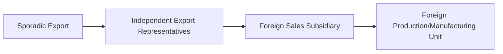
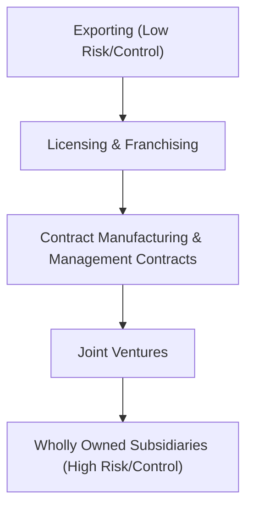

# Block 3 Revision Notes: International Strategy

## Unit 6: Internationalization Process

### 1. Reasons for Internationalization
Companies internationalize due to several driving factors:
* **Market Expansion & Growth**: Escaping saturated domestic markets to access larger customer bases.
* **Economies of Scale**: Increasing production volumes to lower unit costs.
* **Cost Minimization**: Accessing low-cost inputs (e.g., cheaper labor, raw materials, land).
* **Diversification**: Spreading business risk across multiple national markets to offset localized economic downturns.
* **Government Incentives**: Capitalizing on host country investment subsidies and tax benefits.
* **Joint Venture Opportunities**: Partnering to quickly access local distribution channels and knowledge.

### 2. Stages of Internationalization
Firms typically progress through five distinct evolutionary stages:
1. **Domestic Operations**: Purely home-market focused; ethnocentric orientation (foreign markets are not considered).
2. **Foreign Operations (Export)**: Selling domestically produced goods to foreign markets with minimal resource commitment.
3. **Joint Ventures or Subsidiaries**: Establishing physical operations in a host country via cost/profit-sharing partnerships.
4. **Multinational Operations (MNC)**: Polycentric orientation; managing multiple foreign subsidiaries as independent entities (multi-domestic strategy).
5. **Transnational Operations**: Geocentric orientation; achieving global integration (efficiency) and local responsiveness simultaneously (integrated network structure).

### 3. MNCs vs. Domestic Firms: Pros and Cons
* **Domestic Firm**:
  * *Advantages*: Deep understanding of local culture, simple logistics, no foreign exchange risk, and clear legal alignment.
  * *Disadvantages*: Vulnerable to single-market downturns, limited growth potential, and lack of scale economies.
* **Multinational Corporation (MNC)**:
  * *Advantages*: Access to global technical know-how, bargaining power over suppliers, brand goodwill leverage, low-cost capital access, and risk diversification.
  * *Disadvantages*: Foreign exchange fluctuations, compliance with diverse legal systems, political instability risks, and cultural misalignment.

### 4. Models of International Trade & Internationalization

#### A. Vernon's Product Life Cycle Model (1966)
Proposes that international trade patterns change as a product matures:
1. **New Product**: Launched in the developed innovator country. High unit costs, sold to high-income consumers (low price elasticity).
2. **Mature Product**: Standardized design allows mass production. Export volumes increase; FDI is initiated in other advanced countries to bypass tariffs and lower shipping costs.
3. **Standardized Product**: The process is fully standardized. Production is relocated to developing nations to exploit cheap labor. The innovating country becomes a net importer of its own product.

#### B. Uppsala Internationalization Model (1977)
Suggests internationalization is a gradual, learning-driven process where firms minimize risk by entering markets in incremental steps based on **Psychic Distance** (cultural, linguistic, and political proximity):

* Focusses on **Market Commitment**, which depends on:
  1. *Amount of resources committed* (capital/personnel).
  2. *Degree of commitment* (difficulty of reallocating these assets).

#### C. REM Model (Decision Framework)
A three-factor contingency model:
* **R (Reasons)**: Proactive drivers (scale, cost reduction, unique product) and Reactive drivers (saturated markets, competitive pressure, overproduction).
* **E (Environment)**: Conducive host country characteristics (narrow psychic/geographical distance).
* **M (Modes of Entry)**: Evaluating cost of entry, risk, control, and expected profits to select the appropriate entry method.

#### D. Transaction Cost Analysis (TCA) Model (Coase, 1937)
Firms choose whether to internalize (vertical integration) or externalize (market contracting) activities based on cost minimization. Perfect competition yields zero transaction costs, but real-world market friction (caused by opportunistic partner behaviors) creates costs:
$$\text{Transaction Cost} = \text{Ex-ante Costs (Search + Contracting)} + \text{Ex-post Costs (Monitoring + Enforcement)}$$
* *Decision Rule*: If the transaction cost in the foreign market is higher than internal coordination costs, the firm internalizes the activity (e.g., establishing a wholly owned subsidiary). If lower, it uses external market modes (e.g., licensing).

#### E. Dunning's Eclectic (OLI) Model (1980)
Firms will engage in Foreign Direct Investment (FDI) if and only if they possess three simultaneous advantages:
$$\text{FDI Selection} = O \land L \land I$$
1. **Ownership Advantages (O)**: Asset-based (patents, brands, systems) or transaction-based (scale, capital access) unique assets.
2. **Location Advantages (L)**: Immobile country-specific benefits (resource availability, low labor costs, infrastructure, supportive policies).
3. **Internalization Advantages (I)**: Greater efficiency in exploiting assets internally rather than licensing them to third parties.

* *Decision Matrix*:
  * $O + L + I \rightarrow$ Foreign Direct Investment (FDI)
  * $O + I$ (Lacking Location Advantage) $\rightarrow$ Domestic Production & Exporting
  * $O$ only (Lacking Location & Internalization) $\rightarrow$ Licensing / Franchising

#### F. Interactive (Business Network) Model
Views the international market as a network of long-term business relationships. Internationalization is achieved via:
* *Extension*: Linking up with firms in new foreign markets.
* *Penetration*: Deepening relationships within existing international networks.
* *Coordination*: Integrating relationships across multiple distinct national networks.

---

## Unit 7: Evaluation of Market Risk Assessment

### 1. Risk Assessment Framework
Firms must evaluate potential rewards against three main categories of risk:
* **Political Risk**: The threat that host country political decisions (e.g., policy changes, unrest, expropriation) will erode investment returns.
* **Financial Risk**: Exposure to foreign exchange rate fluctuations and default on international trade payments.
* **Economic Risk**: Macroeconomic instability (inflation, infrastructure deficits, balance of payment crises) that threatens supply chains and market demand.

### 2. The Two-Stage Risk Assessment Process
1. **Country Risk Assessment**: Evaluating the country's overall political and social stability. Professional agencies score country risk by assigning weighted factors to arrive at a composite score:
   $$\text{Country Risk Score} = \sum (\text{Risk Factor}_i \times \text{Weight}_i)$$
2. **Investment Risk Assessment**: Evaluating the specific project within the country. Includes analyzing local lobby influence, tax structures, local content mandates, and profit repatriation rules.

### 3. Causes of International Business Risk
* **Economic Objectives**: Host governments facing balance-of-payments issues may block foreign currency repatriation or restrict imports.
* **Monetary & Fiscal Policies**: Unexpected inflation leading to interest rate hikes or sudden tax rate increases on MNC profits.
* **Industrial Policies**: Discriminatory subsidies given only to local firms, or designation of core sectors as closed to foreign capital.
* **Colonial Heritage**: Suspicion of foreign economic exploitation leading to nationalistic, anti-MNC policies.
* **Socio-Cultural Differences**: Offending local religious or social sensibilities (e.g., gender roles, hospitality norms).
* **Circumstantial Political Changes**: Sudden regime changes where new governments reverse predecessors' policies, nationalize assets, or scapegoat MNCs for economic ills.
* **Local Vested Interests**: Local business lobbies pressurizing the government to block foreign entry to protect their market share.

### 4. Risk Management Techniques
* **Rejecting Investment**: Declining high-risk projects where expected returns do not cover uncertainty premiums.
* **Long-Term Agreements**: Securing written guarantees from the host government prior to investing.
* **Lobbying**: Hiring local liaison agents to build relationships with politicians and bureaucrats to secure favorable policies.
* **Legal Action**: Taking host governments to court (only feasible in mature, independent judiciaries and usually acts as a prelude to exit).
* **Home Country Pressure**: Requesting diplomatic intervention, trade retaliation threats, or state-level pressure from the MNC’s home government.
* **Joint Ventures & Local Equity Sharing**: Partnering with local firms to align interests. Host governments are less likely to damage local joint-venture partners.
* **Promoting Host Goals**: Aligning MNC operations with host country targets (e.g., maximizing exports to earn foreign exchange for the host nation).
* **Risk Insurance**: Purchasing political risk coverage from specialized agencies (e.g., OPIC in the US, or MIGA under the World Bank).
* **Contingency Planning**: Minimizing physical asset exposure by supplying proprietary intermediate components rather than manufacturing from scratch locally (preventing technology leaks).

---

## Unit 8: Entry into the International Markets

### 1. International Entry Strategies
Entering international markets involves trading off resource commitment/risk against operational control:

#### A. Export-Based Entry
* **Direct Exporting**: Firm directly manages channels (distributors, sales reps, retailers) in the foreign market.
* **Indirect Exporting**: Selling to a domestic intermediary who handles international logistics and sales.
  * *Pros*: Lowest capital risk, utilizes existing capacity, easy exit option.
  * *Cons*: Tariffs/transport costs, lack of local market knowledge, risk of brand replication.

#### B. Non-Equity / Contractual Entry
* **Licensing**: Granting rights to patents, trademarks, or technologies in exchange for royalties.
  * *Pros*: Rapid entry, high ROI, bypasses trade barriers.
  * *Cons*: Low quality control, limited profits, risk of creating a competitor.
* **Franchising**: Granting rights to brand name and business model while providing operational support.
  * *Pros*: Fast brand expansion, low capital requirement.
  * *Cons*: Quality control deviations can damage global brand image.
* **Contract Manufacturing**: Subcontracting local plants to produce goods under the MNC’s name.
  * *Pros*: Bypasses local startup costs, flexible.
  * *Cons*: Loss of production control, exposure to supply timeline delays.
* **Management Contracts**: Renting managerial expertise and systems to host entities (often used in turnkey projects or post-expropriation facility recoveries).

#### C. Equity / Direct Investment Entry
* **Joint Venture (JV)**: Shared equity partnership with local firms or governments (e.g., Hero Honda, Wipro GE).
  * *Pros*: Shared risks/costs, local political alignment, capital raising ease.
  * *Cons*: Profit repatriation limits, conflict over objectives, lack of complete operational control.
* **Wholly Owned Subsidiaries (WOS)**: Retaining 100% ownership and control.
  * **Greenfield Strategy**: Building local facilities from scratch (used for customized, state-of-the-art facilities).
  * **Brownfield Strategy**: Acquiring an existing local firm (rapid entry, avoids startup lags, inherits goodwill/customers).
  * *Pros*: Full control over IP, pricing, and 100% profit retention.
  * *Cons*: Extremely high capital commitment and maximum political/business risk exposure.

#### D. Keiretsu, Chaebol, and Consortia
* **Consortia**: Interlocking relationship between firms to share technology and market access.
* **Keiretsu**: A coalition of Japanese firms structured around a dominant bank/trading firm to share costs.
* **Chaebol**: Family-controlled South Korean conglomerates supported by government finance to achieve strategic dominance.

### 2. Government Trade Policies: Restrictions and Support
Governments intervene in international trade via **Protectionism** to secure local jobs, protect infant industries, and support national security.
* **Tariffs**: Custom duties levied to make imported goods artificially expensive compared to local goods.
  * *Ad Valorem Duties*: Percentage tax based on product value.
  * *Specific Duties*: Flat fee assessed per physical unit (e.g., per ton).
  * *Compound Tariff*: A combination of ad valorem and specific duties.
* **Non-Tariff Barriers (NTBs)**: Discouraging imports via administrative friction:
  * Bid discrimination in government tenders.
  * Rigorous customs valuation and country entry clearance procedures.
  * Severe and complex safety/health standard testing.
  * Domestic content rules (mandating a percentage of local raw materials).
* **Quotas & Embargoes**:
  * *Quotas*: Quantitative volume caps on imported goods.
  * *Embargo*: Complete ban on all trade with a specific country due to political hostilities.
