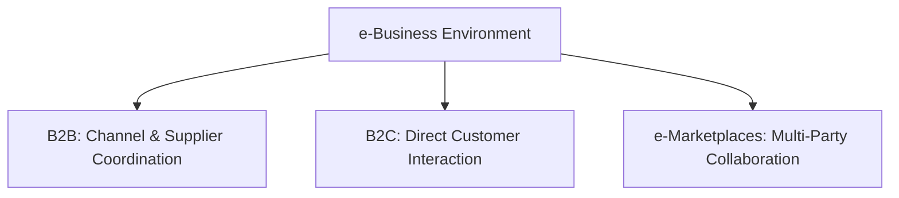
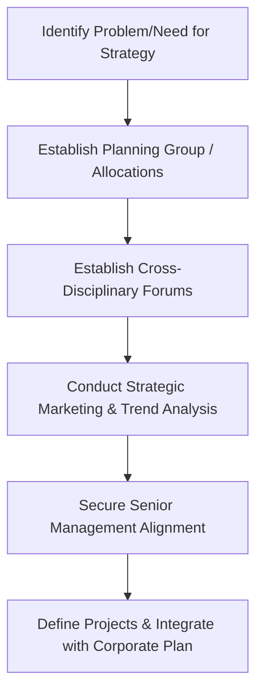

# Block 4 Revision Notes: Strategic Enablers (Hinglish Version)

## Unit 9: IT and Strategy

### 1. Evolution and Strategic Role of IT
Information Technology (IT) ka role purely operational support tool se lekar business competitiveness ka core strategic driver banne tak evolve hua hai:
* **Stage 1 (Operational Support/Efficiency)**: Aamtaur par manual processes ko automate karne par focus. Primary goal cost reduction aur transaction speed badhana hota hai. Ise yadatar bahar ke IT consultants manage karte hain.
* **Stage 2 (Integration/Effectiveness)**: Alag-alag systems ko integrate karne ke liye IT deploy karna. Yahan focus organizational design, structure, user participation, aur steering committees par shift hota hai.
* **Stage 3 (Strategic Differentiation)**: IT ko ek catalyst ki tarah use karna jo strategic position ko redefine kare aur competitive advantage dilaye (jaise Maruti 800 standard/low-cost IT use karti hai aur Mercedes-Benz premium customization ke liye IT use karti hai).

### 2. Core Drivers of IT-Enabled Competitiveness
IT ke paas char distinctive features hain jo rapid social aur organizational change ko drive karte hain:
1. **Ubiquitous Application**: IT ko alag-alag areas me apply kiya ja sakta hai (jaise internet aur email ek hospital ke liye bhi utne hi relevant hain jitne ek component manufacturer ke liye).
2. **Dramatic Rate of Cost Decline**: Processing power, data storage, aur transmission ki prices bohot tezi se kam hui hain.
3. **Universal Ownership**: Low costs ki wajah se lagbhag sabhi isey adopt kar pa rahe hain, halanki bandwidth ki availability abhi bhi India jaise desh me ek bada developmental bottleneck bani hui hai.
4. **Exponential Growth**: Technology me capacity badhne ka growth rate continuous aur massive hai (jaise early telegraph ki capacity 0.2 bps thi jo aaj fiber optics me 10 Gbps se bhi zyada ho chuki hai).

### 3. IT Architecture vs. IT Infrastructure
Organizations business vision aur objectives ko structured hierarchy ke zariye technical implementation me translate karti hain:

$$\text{Business Strategy} \rightarrow \text{Business Architecture} \rightarrow \text{IT Architecture} \rightarrow \text{IT Infrastructure}$$

* **Business Architecture (The "What")**: Business objectives ko operational processes me translate karta hai aur iske teen blueprints hote hain:
  * *Business Function Blueprint*: Centralized aur decentralized responsibility fields ko describe karta hai.
  * *Data Access Blueprint*: Company ki information needs ko define karta hai.
  * *Application Access Blueprint*: Data access karne ke liye zaroori applications ko describe karta.
* **IT Architecture (The "How")**: Business demands aur technical solutions ke beech ka bridge hai, jo functional design ko technical solutions me badalta hai.
* **IT Infrastructure (The "With What")**: Hardware, software, aur data communication supplies ko concretely specify karta hai taaki architecture successfully chal sake.

#### Components of IT Infrastructure
* **IT Components**: Physical hardware (computers, personal computers, displays, printers, disk units, data links) aur system software. Choice compatibility, speed, price/output, aur operation ki ease par depend karti hai.
* **IT Services**: Shared software services (jaise Database Management Systems - DBMS, network management systems) jo applications ke liye specific assignments run karti hain.
* **IT Control Instruments**: Procedures, methods, aur tools (jaise CASE tools, object-oriented languages) jo system development ke liye use hote hain, aur IT personnel ki skill aur quality.

#### Contingency Factors for IT Infrastructure Choice
* **User-Friendliness**: Pull-down menus, graphical interfaces, aur uniform function keys.
* **Cost Control**: Terminals ki type, communication costs, aur localized vs. centralized data storage ke beech balance.
* **Hardware Policy**: Supplier selection aur multi-vendor compatibility.
* **Safeguarding**: Security, access controls, aur logical application safety.
* **Feasibility Parameters**: Technical feasibility, complexity limitations, controllability (staff capability), aur economic feasibility.

### 4. Value Chains, Value Systems, and IT Integration
* **Value Chain Integration**: IT functional boundaries ko cut karke value chain elements ko integrate karta hai, jis se data quality improve hoti hai aur system cost kam hoti hai.
* **Value System Interoperability**: Suppliers (upstream) aur distributors (downstream) ke sath coordinate karne ke liye networking firm se bahar tak extend hoti hai. Shared EDI (Electronic Data Interchange) systems aur common data structures use karne se coordination costs bohot kam ho jati hain.
* **Strategic IT Cooperation**:
  * *Vertical Integration*: Supply chain databases ko link karna.
  * *Outsourcing*: Non-core IT components ko specialized vendors ko dena.
  * *Quasi-Diversification*: Knowledge resources ko exploit karne ke liye cross-industry cooperation karna.

### 5. e-Business Models and Implementation
E-business communication aur processing time ko compress karke zero kar deta hai, jis se firm **Real Time** me operate kar pati hai.
* **Web-Based Business Models**:
  * *Business-to-Business (B2B)*: Upstream/downstream channel coordination (jaise JC Penney shipping/inventory data share karta hai; Tesco TIES - Tesco Information Exchange System use karta hai). B2B me cost-saving ka sabse zyada potential hota hai.
  * *Business-to-Consumer (B2C)*: Product ordering, information sharing, aur tracking ke liye seedhe consumers ke sath connect hona (jaise FedEx package tracking).
  * *e-Marketplaces*: Companies, partners, aur customers ko Web ke zariye link karna surveys, warranties, aur information exchanges ke liye.

#### Steps in Implementing an e-Business Plan
1. **Application Portfolio Selection**: Strategic perspective se decide karna ki kaunse specific e-business applications develop karne hain.
2. **Information Architecture Impact Assessment**: Analyze karna ki nayi application:
   * Existing systems area me fit hoti hai (architecture valid rehta hai).
   * Do ya do se zyada areas ko cover karti hai (areas ko merge ya rearrange karna padega).
   * Bilkul fit nahi hoti (ek naya systems area aur data items define karne padenge).
3. **Systems Architecture Alignment**: Data stewardship (kaun data design aur redundancy control karega) assign karna aur consistent user interface banana.
4. **IT & Organizational Architecture Scaling**: Infrastructure ko high security aur scalability demands ke liye scale karna, aur skills gaps ko outsourcing se dur karna.
5. **Project Portfolio Management**: Portfolio me applications aur integration dono projects ko standard portfolio techniques se prioritze aur run karna.

### 6. e-Business Impact on Organizational Design
* **Web-like Structures**: Rigid hierarchical pyramids ki jagah flat, woven networks le lete hain jo partners, contractors, suppliers, aur customers ko link karte hain.
* **Restructuring & Downsizing**: Time demands compress hone ki wajah se re-engineering, restructuring, downsizing, aur spin-offs badhte hain.
* **Outsourcing Reliance**: Firm apni core competencies par focus karti hai aur manufacturing ya R&D jaise kaam ko specialized partners ko outsource kar deti hai.
* **Collaborative Decision-Making**: Organic structures me information share karke team-based decision-making systems ka use karna.
* **Information Overload and Stress**: Zero-time demands se employees ka stress badhta hai aur information filters lagane padte hain.

### 7. IT in Service Quality and Delivery
High-contact services me quality poori tarah information collection, processing, aur distribution par depend karti hai:
* **Demand Forecasting & Capacity Management**: Services ko inventory me store nahi kiya ja sakta, isliye staff schedules aur capacity ko predictable demand peaks ke hisab se match karne ke liye forecasting systems use hote hain.
* **Customer Databases & Profiles**: Customer preference aur history ko databases me store karna (jaise Nordstrom sales associates ki memory ko corporate memory me convert karta hai) taaki personalized service aur consistency bani rahe, bhale hi staff badal jaye.
* **Decision-Support & Knowledge Systems**: Service expertise ko central database me store karna taaki entry-level ya part-time staff bhi sophisticated queries ko on the spot resolve kar sake.
* **Job Status Systems**: Production aur shipping files ka direct access customer uncertainty ko kam karta hai (jaise airlines delay reasons clarify karti hain).
* **Quality Control & Preventive Action**: Waiting times aur system speeds ko track karke customer complaint se pehle hi corrective actions lena.
* **Complaints Management & Service Recovery**: Complaints ko category aur frequency ke hisab se track karna. Frontline employees ko data aur authority dena taaki immediate service recovery ho sake. Defection scanning systems last active transaction dates scan karke lost customers aur unke jaane ka reason pata lagate hain.

---

## Unit 10: Technology and R&D

### 1. The Technology Package and Transition Phases
Technology ko in teen categories me divide kiya ja sakta hai:
* *Product Technology*: Product ke features aur specifications.
* *Process Technology*: Manufacturing ya processing ki technical knowledge.
* *Management of Technology*: Business chalane ke liye zaroori skills.

#### The Technology Package
Technology package ke teen core components hote hain:
1. **Product Design**: Simple items se lekar highly complex designs tak ki specifications.
2. **Production Technique**: Blueprints, recipes, flowcharts, material specifications, aur tools design.
3. **Management Systems**: Plant layout, quality testing, maintenance scheduling, procurement control, aur financial checks.

#### Phases of Technology Transition
* **Adoption**: Transfer ke dauran buyer ki requirements ke hisab se technology ko modify karna.
* **Adaptation**: Production start hone ke baad technology me jaruri changes karna.
* **Absorption**: "Know-why" exercises conduct karna taaki product ya process ko ache se samajh kar optimize kiya ja sake.
* **Optimization**: Value engineering ke zariye rough edges ko remove karna taaki energy aur raw material consumption kam ho sake.
* **Upgradation**: Apne products ki range badhana ya existing manufacturing equipment ko scale up karna.
* **Protection**: Patents (temporary monopoly rights) aur Trademarks ke zariye competitive edge ko protect karna.

### 2. Technology Audit and Search Strategies
* **Technology Search Strategy**: Resource limitations ko evaluate karke yeh decide karna ki technology internally develop karni hai ya kisi licensor se import/transfer karni hai.
* **Technology Audit**: Technology projects ke risks ko teen broad areas me evaluate karna:
  1. *Technical/Relevance Risk*: Technology kitne samay tak relevant rahegi aur customer acceptance kaisa hoga.
  2. *Commercial/Competence Risk*: Firm ki ability ki woh technology ko acquire, develop aur commercialize kar sake.
  3. *Investment/Cost Risk*: R&D me kitna capital investment zaroori hoga.

### 3. R&D Linkage to Generic Competitive Strategies
Porter ke Value Chain me R&D ek **Support Activity** hai jo generic strategies ko in tarike se support karti hai:
* **Cost Leadership (Process-Oriented R&D)**: Process improvement, cost reduction, recycling, aur energy efficiency par focus karna taaki unit cost kam ho sake.
* **Differentiation (Product-Oriented R&D)**: Design features, performance, aesthetics, unique quality, aur market me fast launching par focus karna.
* **Sustainable Competitiveness**: Technology decisions ke zariye aise barrier to imitation khade karna jise competitors copy na kar sakein.

#### Creating Value Chain Advantage
Firms R&D se teen tareeqon se competitive advantage paati hain:
1. Competitors se zyada resources R&D me allocate karke.
2. R&D activities ko alag tarike se (new technology platforms adopt karke) perform karke.
3. Linkages ko behtar manage karke (jaise R&D ko marketing aur manufacturing ke sath link karna).

### 4. Process of Developing R&D Strategy
R&D strategy bit-by-bit projects select karne ke bajaye overall strategic goals, technical strengths, aur market demands ke base par projects select karne me help karti hai.

#### Seven Prerequisites for Developing an R&D Strategy
1. **Problem-Solving Belief**: Yeh vishwas hona ki R&D strategy resource allocation conflicts ko dur kar sakti hai.
2. **Planning Staff/Commitment**: Badi companies me planning staff banana (jo facilitator/champion ki tarah kaam karein) ya choti firms me line managers ka planning ke liye time nikalna.
3. **Linkage to Operations**: Planning ko operations ke sath connect karna (jaise cross-disciplinary forums bana kar).
4. **Strategic Marketing**: Macro trends analyze karke future customers aur unki needs ko predict karna.
5. **Senior Management Support**: R&D ki value ko business terms (cost, sales, customer satisfaction) me explain karke support lena.
6. **Prior Planning Efforts**: Purane planning experiences ka fayda uthana.
7. **Stepping Stones**: Benchmarking, technology forecasting, aur portfolio management jaise concrete tasks se planning capability ko behtar banana.

#### Steps in R&D Strategy Formulation

### 5. Obstacles to R&D Strategy in India
Indian companies me R&D strategies in reasons se aamtaur par root nahi le pati hain:
* **Lack of Planning Infrastructure**: Bahut si badi R&D organizations me dedicated planning group nahi hota.
* **Siloed Operations**: R&D marketing aur manufacturing strategies ke sath integrated nahi hota.
* **Defensive Strategy Focus**: Proactive innovation ke bajaye mostly projects government regulation compliance ya survival ke liye hote hain.
* **Lack of Benchmarking & Forecasting**: Competitors ki technology ko track karne aur 5-10 saal ke changes ko forecast karne me kami.
* **Managerial Disalignment**: Senior management R&D ko business terms me na samajhne ki wajah se support nahi karti.
* **Arbitrary Changes**: Plans ko achanak kisi bhi manager ke kehne par badal diya jata hai bina sabhi ko inform kiye.

---

## Unit 11: Knowledge Management (KM)

### 1. Knowledge vs. Information vs. Skills
* **Information**: Messages ka ek structured flow.
* **Skills**: Information processing competencies jo kaam ko karke (doing) seekhi jati hain.
* **Knowledge**: Holder ke beliefs aur commitment me anchored information jo action ke liye ground banti hai. Yeh study ya investigation se seekhi jati hai.
* **Explicit Knowledge**: Jise easily codify kiya ja sake, formal language (words, numbers) me express kiya ja sake, aur manuals, specifications ke zariye systematically share kiya ja sake.
* **Tacit Knowledge**: Highly personal, hard to formalize, aur share karne me kathin. Isme subjective insights, intuitions, emotions, aur hunches shaamil hain jo individual actions aur experiences par based hote hain.

### 2. The SECI Model of Knowledge Conversion
Organizational knowledge tacit aur explicit dimensions ke beech continuous aur dynamic conversion se banti hai:

$$\text{SECI Spiral} = \text{Socialization} \rightarrow \text{Externalization} \rightarrow \text{Combination} \rightarrow \text{Internalization}$$

| Mode | Conversion Type | Description & Key Activities |
| :--- | :--- | :--- |
| **Socialization** | Tacit to Tacit | Shared experience, observation, imitation, aur practice ke zariye tacit knowledge share karna.  • Management by wandering inside/outside. • Master-apprentice training. • Customers aur competitors ke sath dialogue. |
| **Externalization** | Tacit to Explicit | Tacit knowledge ko explicit concepts, metaphors, ya models me articulate karna.  • Creative dialogues. • Abductive thinking. • Concept design ke liye metaphors use karna. |
| **Combination** | Explicit to Explicit | Alag-alag explicit knowledge systems ko integrate aur synthesize karna.  • Data, documents, aur databases ko assemble karna. • Computer simulations, data mining, aur forecasting. • Presentations aur strategic planning. |
| **Internalization** | Explicit to Tacit | Explicit knowledge ko operational routines, values, aur mental models me embody karna.  • Learning-by-doing. • Cross-functional development teams ka use. • Prototyping, benchmarking, aur experiments. |

### 3. The 5-Level KMS Working Model
Firms in five structured levels ke zariye ek effective Knowledge Management System (KMS) develop karti hain:
* **Level 1 (Strategy)**: Best practices ko list karna, corporate goals ke sath align karna, aur KM policies set karna.
* **Level 2 (Infrastructure & Resources)**: Repositories ka design, search tools, semantic functionalities (categorization, maps, expert identification filters).
* **Level 3 (Grouping of Knowledge)**: Knowledge ko classify aur sync karna:
  * *Individual*: Search, filter, capture, aur personalize karna.
  * *Group/Project*: Project deliverables, plans, design documents ko peer groups me coordinate karna.
  * *Corporate*: Company policies, market trends, aur external data resources.
* **Level 4 (Delivery)**: Target audience identify karna, accessibility personalize karna, aur seamless channels banana.
* **Level 5 (Performance)**: KMS ke implementation ke baad individual aur corporate performance gains ko measure karna.

### 4. Components of a KM Project
1. **Create a Knowledge Repository (KR)**: Documented knowledge (memos, presentations) aur discussion databases (jaise Lotus Notes, Exchange) ko collect karna.
2. **Improve Knowledge Access**: Expert directories aur video-conferencing systems banana taaki face-to-face knowledge transfer ho sake.
3. **Enhance Knowledge Environment**: Training aur coaching ke zariye workplace trust aur sharing culture ko build karna.
4. **Manage Knowledge as an Asset**: Reuse ki wajah se hone wali cost savings ko track karke KM ka financial return check karna.

### 5. KM Initiatives in Indian Organizations
* **Infosys ("Learn once, Use anywhere")**:
  * *Knowledge Shop (K-Shop)*: Intranet-based portal jahan employees papers (technology, domain, project experiences) submit karte hain.
  * *Process Assets Database (PAD)*: Past projects ke plans, design documents, aur test cases ko capture karta hai.
  * *People Knowledge Map (PKM)*: Net-based expert directory jo provider aur seeker ko connect karti hai.
  * *SPARSH*: Intranet portal jo central window ki tarah kaam karta hai.
  * *Project Integration*: KM activities ko overall project plan ka 2%-3% budget diya jata hai.
  * *Knowledge Currency Units (KCUs)*: Authors aur reviewers ko document accept hone aur reads/reuse ke base par KCUs diye jate hain. Employees in KCUs ko cash ya gifts ke liye redeem kar sakte hain, jis se quality content badhta hai.
  * *Outcomes*: Defect levels 40% tak kam huye (associated rework bacha) aur productivity 3% badhi.
* **BaaN**:
  * *SCOPUS*: Centralized database system jo intranet ke zariye employees use karte hain.
  * *Knowledge Transfer & Development*: Naye recruits aur existing staff ki training ke liye dedicated departments.
  * *ASK HR*: Public folders jahan employees doubts post kar sakte hain aur solutions share karte hain.
  * *SPANDANA (Reaction)*: Monthly open meetings jahan employees freely management ke sath apna experience aur views share karte hain.

### 6. Trends and Challenges in KM
* **Technology Trends**: Groupware (Lotus Notes/Exchange), Data Warehousing se KRs banana, ETL tools, aur Business Intelligence (BI) ko decision support systems ke liye integrate karna.
* **Challenges**:
  * *Dispersion*: Telecommuting aur remote workforce ke aapas me information share karne ki difficulty.
  * *Reinventing the Wheel*: Systematic tracking na hone ki wajah se kaam ko repeat karna (jaise Tata Steel 1999 case jahan foreign consultant ne wahi problem solve kiya jo usne ek saal pehle solve kiya tha).
  * *Attrition*: Experienced employees ke retire hone ya job switch karne se tacit knowledge chali jana.
  * *Knowledge Depreciation*: Data aur patents ki value ka tezi se depreciating/erode hona.
  * *Information Overload*: Quantity se zyada content ki quality aur relevance par check rakhna.
  * *Cultural Resistance*: "Knowledge is power" samajh kar share na karne ki human tendency.

---

## Unit 12: Innovation

### 1. Creativity vs. Innovation vs. Change
* **Creativity**: Kisi specific context me products, processes, ya procedures ke liye naye aur useful/valuable ideas generate karna.
* **Innovation**: Kisi adoption unit ke andar in naye ideas ka intentional introduction aur successful exploitation/implementation karna.
* **Change vs. Innovation**: Har change innovation nahi hota. Innovation me naya idea aur improvement hona zaroori hai (jaise garmiyo me office hours change karna ek change hai, innovation nahi).

### 2. The Creative Process
Creativity achanak nahi hoti, yeh in four systematic stages se guzarti hai:
1. **Preparation**: Knowledge base build karne ke liye information aur raw materials ko collect, sort, aur integrate karna.
2. **Incubation**: Jab conscious mind problem par focused nahi hota; relaxation ya sleep ke dauran background me unconscious processing chalti hai.
3. **Insight**: Woh familiar, achanak aane wala "Eureka!" moment jab solution dimag me flash karta hai.
4. **Verification**: Experiments, testing, aur facts check karke insight ki feasibility aur correctness ko check karna.

### 3. Structural Influences: Organic vs. Mechanistic
Structure innovation ko enhance ya inhibit karne me main role play karta hai:
* **Organic Structures (Promote Innovation)**:
  * Flat design, decentralized control, aur informal procedures.
  * Low red tape, face-to-face communication, aur fast decisions.
  * Inter-disciplinary aur cross-functional teams.
  * Strategic goals ke andar high operational autonomy.
  * External ideas ko accept karna aur tolerance of ambiguity.
* **Mechanistic Structures (Hinder Innovation)**:
  * Rigid departmental separation aur narrow functional specialization.
  * Tall hierarchy, slow decision chains, aur highly centralized systems.
  * Rules, procedures, aur formal written reporting.
  * Directives ka top-down flow aur information ka up-down flow.

### 4. Creativity Enhancement Techniques
* **Gordon Technique**: Incremental improvements se bachne ke liye logo ko pehle se object nahi bataya jata, balki functionality par focus kiya jata hai (jaise knife bolne ke bajaye function "severing" rakhna, ya mousetrap ke liye "capturing").
* **Synectics ("Joining apparently unrelated elements")**: Alag-alag fields ke logo ko combine karna aur analogies use karna:
  * *Direct Analogy*: Kisi dusre domain (jaise nature/biology) me parallel facts ya solutions dhoodhna.
  * *Personal Analogy*: Problem ke component ke sath physically identify karna (jaise machine box ke andar enter hone ki metaphor use karna).
  * *Fantasy Analogy*: Wildest dreams/wish-fulfillment ke bare me sochna (jaise space suit closure ke liye rows of trained insects clasping claws ka metaphor).
  * *Process*: Uses "Springboards" ("I wish..." or "How to...") followed by "itemized responses" (advantages then concerns).
* **Idea Checklists (SCAMPER & Osborn)**:
  * *SCAMPER*:
    * *Substitute*: Materials ya process badalna.
    * *Combine*: Ideas ko blend karna.
    * *Adapt*: (jaise Clarence Birdseye ne Inuit se quick-freezing seekh kar General Foods shuru kiya).
    * *Modify/Magnify*: Shape, size, ya attributes badalna.
    * *Put to other uses*: (jaise Goodyear ka discarded tires ko fuel ki tarah use karna).
    * *Eliminate*: Waste remove karna (jaise Kiichiro Toyoda ne supermarket se seekh kar inventories aur warehouses eliminate kiye aur Just-in-Time banaya).
    * *Reverse/Rearrange*: Causality aur sequences badalna.
  * *Osborn's 73 Questions*: Prompt questions jo substitution, combination, aur subtraction ke aaspas sochte hain.
* **Attribute Listing**:
  * *Attribute Modifying*: Object ke attributes (durability, weight) ko list karke har ek ko behtar banana.
  * *Attribute Transferring*: Attributes ko ek chiz se dusri chiz me transfer karna.
* **Checkerboard Method (Morphological Analysis)**: Multiple dimensions ko matrix ke axes par plot karke cells ke zariye unique combinations dhoodhna (jaise paper clips ke designs aur material combinations).
* **Retroduction (Assumption Challenging)**: Common assumptions ko challenge karke unhe reverse karna:
  * *Henry Ford*: "Material ko worker tak le jane ke bajaye agar work ko worker tak laya jaye?" $\rightarrow$ Assembly Line.
  * *Citibank ATM Case*: Pehle assume kiya gaya ki customer human tellers prefer karenge aur machines ko sirf low-deposit log use karenge (treating them as second-class citizens). Is failure ke baad dusre banker ne is class distinction assumption ko challenge kiya, ATMs open kiye aur success payi.

### 5. Building Creative Organizations
* **Venture Teams & Skunk Works**: Temporary, autonomous groups jinhe separate locations par rakha jata hai bureaucracy se free karke (jaise Ford's "Team Mustang" ne budget me 30% saving aur 25% time reduction kiya).
* **Idea Champions**: Company ka woh dedicated manager jo change implementation ke liye resistance se ladta hai. Texas Instruments ne champion ki presence ko project approval ka number one criterion banaya hai.
* **Intrapreneurship & Intra-Capital**: Large corporate me entrepreneurial ventures chalana. Iske liye (a) top-level sponsors aur (b) suitable rewards jaise **Intra-capital** (promotion ke bajaye ventures ke liye discretionary budget dena) zaroori hain.
* **Demographic & Cognitive Diversity**: Ethnic aur stylistic diversity groupthink ko bypass karti hai aur critical analysis ko behtar banati hai.
* **Continuity of Slack**: stable, uninterrupted slack resources (time, funding) maintain karna taaki log bina achanak budget cut ke dar ke risk le sakein.
* **Corporate retreats and Outings**: out-of-box thinking enhance karne ke retreats (jaise Quaker Oats horse riding, Omron midlevel managers' juku cram schools where they think like warlords).
