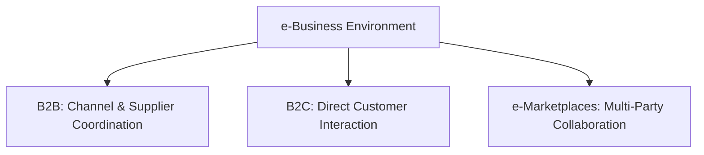
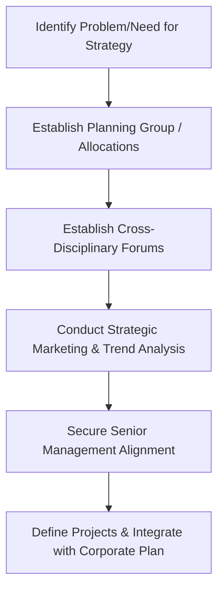

# Block 4 Revision Notes: Strategic Enablers

## Unit 9: IT and Strategy

### 1. Evolution and Strategic Role of IT
Information Technology (IT) has transitioned from a purely operational support tool to a core strategic driver of business competitiveness:
* **Stage 1 (Operational Support/Efficiency)**: Focus on automation of simple, single manual processes. The primary goal is cost reduction and transaction processing speed. IT is managed primarily by external technical consultants.
* **Stage 2 (Integration/Effectiveness)**: Deploying IT to integrate separate systems. Focus shifts to organizational design, structure, user participation, and steering committees.
* **Stage 3 (Strategic Differentiation)**: IT is used as a catalyst to influence the strategic position, redefine business models, and establish competitive advantage (e.g., Maruti 800 using standard/low-cost IT vs. Mercedes-Benz using IT for high-end customization).

### 2. Core Drivers of IT-Enabled Competitiveness
IT possesses four distinctive features that drive rapid social and organizational change:
1. **Ubiquitous Application**: IT can be applied across diverse domains (e.g., email and internet are equally relevant to a hospital and a component manufacturer).
2. **Dramatic Rate of Cost Decline**: The price of processing power, data storage, and transmission has fallen exponentially.
3. **Universal Ownership**: Low costs lead to near-universal adoption, though bandwidth availability remains a developmental bottleneck in some economies (like India).
4. **Exponential Growth**: Capacity increases continue at a massive pace (e.g., telegraph capacity of 0.2 bps evolving to modern fiber optics exceeding 10 Gbps).

### 3. IT Architecture vs. IT Infrastructure
Organizations translate business vision and objectives into technical implementation through a structured hierarchy:

$$\text{Business Strategy} \rightarrow \text{Business Architecture} \rightarrow \text{IT Architecture} \rightarrow \text{IT Infrastructure}$$

* **Business Architecture (The "What")**: Translates business objectives into organizational processes and is divided into three blueprints:
  * *Business Function Blueprint*: Centralized vs. decentralized responsibility fields.
  * *Data Access Blueprint*: Defining the company's information needs.
  * *Application Access Blueprint*: Defining the applications required to access data.
* **IT Architecture (The "How")**: The bridge between functional business demands and technical solutions, translating organizational processes into automation directions.
* **IT Infrastructure (The "With What")**: The concrete hardware, software, and communication products specified to execute the architecture.

#### Components of IT Infrastructure
* **IT Components**: Physical hardware (computers, personal computers, displays, printers, disk units, communication links) and operating software. Choice is driven by compatibility, processing speed, price/output, and ease of operation.
* **IT Services**: Shared software services (e.g., Database Management Systems (DBMS), network management systems) that execute assignments for applications.
* **IT Control Instruments**: Procedures, tools, and methodologies (e.g., CASE tools, object-oriented languages) used for system development, alongside the skills and quality of IT personnel.

#### Contingency Factors for IT Infrastructure Design
* **User-Friendliness**: Pull-down menus, graphical user interfaces, and consistent function keys.
* **Cost Control**: Selecting between terminal types, communication lines, and localized vs. centralized data storage.
* **Hardware Policy**: Supplier selection and multi-vendor compatibility.
* **Safeguarding**: Security, access controls, and logical application safety.
* **Feasibility Parameters**: Technical feasibility, complexity limitations, controllability (personnel capability), and economic feasibility.

### 4. Value Chains, Value Systems, and IT Integration
* **Value Chain Integration**: IT cuts across functional silos to integrate value chain elements, improving data quality and reducing system costs.
* **Value System Interoperability**: Networking extends outside the firm to coordinate with suppliers (upstream) and distributors (downstream). Implementing shared EDI (Electronic Data Interchange) systems and common data structures minimizes coordination costs.
* **Strategic IT Cooperation**:
  * *Vertical Integration*: Linking supply chain databases.
  * *Outsourcing*: Entrusting non-core IT components to specialized vendors.
  * *Quasi-Diversification*: Cooperating across industries to exploit shared knowledge resources.

### 5. e-Business Models and Implementation
E-business compresses processing and communication times to zero, enabling a firm to operate in **Real Time**.
* **Web-Based Business Models**:
  * *Business-to-Business (B2B)*: Upstream/downstream channel coordination (e.g., JC Penney sharing shipping/inventory data; Tesco using TIES - Tesco Information Exchange System). B2B offers the highest potential for cost-saving.
  * *Business-to-Consumer (B2C)*: Connecting directly with end consumers for product ordering, tracking (e.g., FedEx package tracking), and service.
  * *e-Marketplaces*: Linking companies, partners, and customers for surveys, warranties, and information exchanges.

#### Steps in Implementing an e-Business Plan
1. **Application Portfolio Selection**: Identify specific e-business applications from a strategic perspective.
2. **Information Architecture Impact Assessment**: Determine if the new application:
   * Fits within an existing area (architecture remains valid).
   * Covers multiple areas (necessitating merging or rearranging systems areas).
   * Requires a completely new systems area to be defined.
3. **Systems Architecture Alignment**: Assign data stewardship (defining who controls data creation and how redundancy is managed) and ensure user interface consistency.
4. **IT & Organizational Architecture Scaling**: Scale the IT infrastructure to handle higher security and capacity requirements; address potential skills gaps via outsourcing.
5. **Project Portfolio Management**: Populate the portfolio with application and integration projects, applying standard portfolio management techniques to prioritize and execute the plan.

### 6. e-Business Impact on Organizational Design
* **Web-like Structures**: Rigid hierarchical pyramids are replaced by flat, woven networks linking partners, contractors, suppliers, and customers.
* **Restructuring & Downsizing**: Compressing time demands leads to downsizing, re-engineering, and strategic spin-offs.
* **Outsourcing Reliance**: Specializing in core competencies and outsourcing activities like manufacturing or R&D to efficient partners.
* **Collaborative Decision-Making**: Dynamically sharing information across organic structures, using team-based decision systems.
* **Information Overload and Stress**: Zero-time demands lead to employee stress and information filters necessity.

### 7. IT in Service Quality and Delivery
In high-contact services, quality is heavily dependent on information collection, processing, and distribution:
* **Demand Forecasting & Capacity Management**: Because services cannot be inventoried, forecasting systems are used to build detailed staff schedules that match capacity to demand peaks, preventing slow service or customer disappointment.
* **Customer Databases & Profiles**: Computerized databases store personal service histories (e.g., Nordstrom converting sales associate memory to corporate memory) to personalize service, recognize loyal repeat customers, and ensure service consistency when personnel change.
* **Decision-Support & Knowledge Systems**: Capture service expertise in central databases to allow inexperienced or entry-level staff to resolve sophisticated queries on the spot.
* **Job Status Systems**: Direct customer access to production and shipping files minimizes uncertainty (e.g., airline coordinate flight delay explanations).
* **Quality Control & Preventive Action**: Collecting objective performance data (waiting times, response speeds) to make corrections before customer complaints occur.
* **Complaints Management & Service Recovery**: Tracking complaints by type, frequency, and department. Frontline staff are empowered with data and decision-making authority for immediate service recovery. Defection scanning systems scan the dates of last active membership to identify lost customers and discover why they left.

---

## Unit 10: Technology and R&D

### 1. The Technology Package and Transition Phases
Technology can be categorized into:
* *Product Technology*: Features and design of the product.
* *Process Technology*: Knowledge required for processing or manufacturing.
* *Management of Technology*: Skills required to run the business.

#### The Technology Package
A technology package comprises three core components:
1. **Product Design**: Specifications ranging from simple components to complex systems.
2. **Production Technique**: Blueprints, recipes, flowcharts, material specifications, operational procedures, and tool designs.
3. **Management Systems**: Plant layout, quality control, maintenance, inventory systems, procurement, and financial controls.

#### Phases of Technology Transition
* **Adoption**: Modifying technology features to fit the needs of the buyer during transfer.
* **Adaptation**: Modifying technology after it has been put to use in production facilities.
* **Absorption**: Conducting "know-why" exercises to fully understand the product or process, allowing for optimization.
* **Optimization**: Eliminating rough edges via value engineering to reduce material and energy consumption.
* **Upgradation**: Extending capabilities to a higher range of products or scaling up existing production equipment.
* **Protection**: Securing competitive advantage through Patents (temporary monopoly rights) and Trademarks (unique brand identities).

### 2. Technology Audit and Search Strategies
* **Technology Search Strategy**: Evaluating resource limitations to decide whether to develop technology internally or import/transfer it from a licensor.
* **Technology Audit**: Assessing the risks of technology projects across three domains:
  1. *Technical/Relevance Risk*: Duration of relevance and user acceptance.
  2. *Commercial/Competence Risk*: The firm's capability to develop, acquire, and commercialize the technology.
  3. *Investment/Cost Risk*: The amount of capital investment needed for development.

### 3. R&D Linkage to Generic Competitive Strategies
R&D is categorized as a **Support Activity** in Porter's Value Chain. It supports the generic competitive strategies as follows:
* **Cost Leadership (Process-Oriented R&D)**: R&D focuses on process improvements, cost reduction, recycling, energy efficiency, and learning curve acceleration to lower unit costs.
* **Differentiation (Product-Oriented R&D)**: R&D focuses on design features, performance, aesthetics, unique quality attributes, and short-time-to-market.
* **Sustainable Competitiveness**: Ensuring that technology decisions build high barriers to imitation, preventing competitors from easily copying the strategy.

#### Creating Value Chain Advantage
Firms achieve competitive advantage through R&D in three ways:
1. Placing higher resource allocation on R&D than competitors.
2. Performing R&D activities differently (adopting new technology platforms).
3. Managing linkages better (e.g., integrating R&D with manufacturing and marketing).

### 4. Process of Developing R&D Strategy
A R&D strategy helps an organization select projects based on strategic goals, technical strengths, and market demand rather than bit-by-bit.

#### Seven Prerequisites for Developing an R&D Strategy
1. **Problem-Solving Belief**: A shared belief that R&D strategy can resolve resource allocation conflicts.
2. **Planning Staff/Commitment**: Establishing a planning group in large firms (to act as facilitators/champions) or getting line managers to commit planning time in small firms.
3. **Linkage to Operations**: Connecting planning to project execution (e.g., using cross-disciplinary forums).
4. **Strategic Marketing**: Determining future customers and future customer needs by analyzing macro trends.
5. **Senior Management Support**: Translating R&D value into business terms (costs, sales, customer satisfaction).
6. **Prior Planning Efforts**: Leveraging baseline experiences.
7. **Stepping Stones**: Carrying out concrete studies (benchmarking, technology forecasting, portfolio management) to build planning capability.

#### Steps in R&D Strategy Formulation

### 5. Obstacles to R&D Strategy in India
R&D strategies often fail to take root in Indian organizations due to:
* **Lack of Planning Infrastructure**: Most large R&D organizations lack a dedicated planning group.
* **Siloed Operations**: R&D is not integrated with marketing and manufacturing strategies.
* **Defensive Strategy Focus**: Projects are mostly driven by regulatory compliance and short-term survival rather than proactive innovation.
* **Lack of Benchmarking & Forecasting**: Weak tracking of competitor technologies and 5-to-10-year technological changes.
* **Managerial Disalignment**: Senior business managers often fail to support R&D plans due to a lack of communication in business terms.
* **Arbitrary Changes**: Plans are frequently altered at the whim of individuals without formal coordination.

---

## Unit 11: Knowledge Management (KM)

### 1. Knowledge vs. Information vs. Skills
* **Information**: A structured flow of messages.
* **Skills**: Competencies in information processing that are learned by doing.
* **Knowledge**: Information anchored in the beliefs and commitment of its holder that becomes grounds for action. It is learned by studying or investigating.
* **Explicit Knowledge**: Easily codified, expressed in formal language (words, numbers), and shared systematically (e.g., manuals, specifications, data).
* **Tacit Knowledge**: Highly personal, hard to formalize, and difficult to communicate. It consists of subjective insights, intuitions, emotions, and hunches rooted in individual action and experience.

### 2. The SECI Model of Knowledge Conversion
Organizational knowledge is created through the continuous, dynamic conversion between tacit and explicit knowledge:

$$\text{SECI Spiral} = \text{Socialization} \rightarrow \text{Externalization} \rightarrow \text{Combination} \rightarrow \text{Internalization}$$

| Mode | Conversion Type | Description & Key Activities |
| :--- | :--- | :--- |
| **Socialization** | Tacit to Tacit | Sharing tacit knowledge through shared experiences, observation, imitation, and practice.  • Management by wandering inside/outside. • Master-apprentice training. • Dialogue with customers and competitors. |
| **Externalization** | Tacit to Explicit | Articulating tacit knowledge into explicit concepts, metaphors, analogies, or models.  • Creative dialogues. • Abductive thinking. • Creating metaphors for concept design. |
| **Combination** | Explicit to Explicit | Assembling, integrating, and synthesizing different bodies of explicit knowledge into a system.  • Assembling data, documents, and databases. • Computer simulations, data mining, and forecasting. • Presentations and strategy planning. |
| **Internalization** | Explicit to Tacit | Embodying explicit knowledge into tacit operational routines, values, and mental models.  • Learning-by-doing. • Cross-functional development teams. • Prototyping, benchmarking, and experimentation. |

### 3. The 5-Level KMS Working Model
Firms develop an effective Knowledge Management System (KMS) by progressing through five structured levels:
* **Level 1 (Strategy)**: Listing best practices, identifying organizational needs, establishing KM policies, and alignment with corporate objectives.
* **Level 2 (Infrastructure & Resources)**: Designing repositories, message structures, search/retrieval tools, and semantic functions (clustering, linguistic analysis, expert identification filters).
* **Level 3 (Grouping of Knowledge)**: Classifying and synchronizing knowledge:
  * *Individual*: Search, filter, capture, and personalize assets.
  * *Group/Project*: Integrating individual deliverables, design documents, and peer coordination.
  * *Corporate*: Storing organizational policies, market trends, and external sources.
* **Level 4 (Delivery)**: Identifying target audiences, personalizing access, and providing seamless delivery channels.
* **Level 5 (Performance)**: Measuring individual and corporate performance improvements through the KMS.

### 4. Components of a KM Project
1. **Create a Knowledge Repository (KR)**: Storing documented knowledge (memos, reports, presentations) and discussion databases (e.g., Lotus Notes, Microsoft Exchange).
2. **Improve Knowledge Access**: Establishing search directories, expert maps, and video-conferencing to facilitate face-to-face transfer.
3. **Enhance Knowledge Environment**: Cultivating a sharing culture via coaching, training, and building organizational trust.
4. **Manage Knowledge as an Asset**: Measuring the ROI of knowledge reuse (e.g., cost savings from avoiding redundant research).

### 5. KM Initiatives in Indian Organizations
* **Infosys ("Learn once, Use anywhere")**:
  * *Knowledge Shop (K-Shop)*: Intranet portal where employees submit papers (technology, domain, culture, project reviews).
  * *Process Assets Database (PAD)*: Captures project deliverables (plans, design documents, test cases) from past projects.
  * *People Knowledge Map (PKM)*: Expert directory for face-to-face knowledge access.
  * *SPARSH*: Intranet portal serving as the single-window interface.
  * *Project-Level Integration*: KM activities are budgeted as 2%-3% of the overall project plan.
  * *Knowledge Currency Units (KCUs)*: Authors and reviewers are rewarded with KCUs when their documents are published, read, or reused. KCUs can be redeemed for cash or gifts, encouraging high-quality contributions.
  * *Outcomes*: Reduced defect levels by 40% (minimizing rework) and improved overall productivity by 3%.
* **BaaN**:
  * *SCOPUS*: Centralized database accessed via intranet.
  * *Knowledge Transfer & Development*: Departments dedicated to upgrading employee skills.
  * *ASK HR*: Public folders allowing employees to post queries and share solutions.
  * *SPANDANA (Reaction)*: Open, monthly town-hall meetings for direct sharing of employee experiences and feedback.

### 6. Trends and Challenges in KM
* **Technology Trends**: Groupware (Lotus Notes/Exchange), Data Warehouses evolving into KRs, ETL (Extraction, Transformation, Loading) tools, and Business Intelligence (BI) integration with KM to support Decision Support Systems (DSS).
* **Challenges**:
  * *Dispersion & Communication*: Coordinating and sharing knowledge across telecommuting, geographically dispersed workforces.
  * *Reinventing the Wheel*: Repeating work due to poor tracking (e.g., Tata Steel 1999 case where a consultant was hired to solve a problem that he had already solved the previous year).
  * *Attrition & Mobility*: Earlier retirements and high employee mobility leading to the loss of tacit knowledge.
  * *Knowledge Depreciation*: Fast decay of knowledge value (e.g., patents, sales leads).
  * *Information Overload*: Ensuring quality of information over quantity.
  * *Cultural Resistance*: Reluctance to share information due to "knowledge is power" mindsets.

---

## Unit 12: Innovation

### 1. Creativity vs. Innovation vs. Change
* **Creativity**: The generation of new, valuable, and context-specific ideas for products, services, processes, and procedures.
* **Innovation**: The intentional introduction and successful exploitation/implementation of these new ideas within a group or organization to yield significant benefits.
* **Change vs. Innovation**: Change is not always an innovation. Innovation must involve a new idea and lead to significant improvement (e.g., modifying office hours during a hot summer is a change, not an innovation).

### 2. The Creative Process
Creativity is a systematic, painstaking process involving four distinct stages:
1. **Preparation**: Gathering, sorting, and integrating information to build a solid base of knowledge.
2. **Incubation**: The conscious mind is disengaged; unconscious processing occurs while the individual is relaxed or performing unrelated tasks.
3. **Insight**: The sudden, sudden "Eureka!" moment of inspiration where the solution becomes clear.
4. **Verification**: Checking facts, conducting experiments, and testing feasibility to support and prove the insight.

### 3. Structural Influences: Organic vs. Mechanistic
Organizational structure heavily determines a firm's capacity to innovate:
* **Organic Structures (Promote Innovation)**:
  * Flat hierarchy, decentralization, and informal systems.
  * Low red tape, face-to-face communication, and rapid decision-making.
  * Inter-disciplinary, cross-functional teams.
  * High operational autonomy within strategic guidelines.
  * Outward-looking; high tolerance of ambiguity.
* **Mechanistic Structures (Hinder Innovation)**:
  * Rigid departmental silos and narrow functional specialization.
  * Tall hierarchy, high centralization, and slow decision chains.
  * Excessive rules, formal reporting, and bureaucratic procedures.
  * Upward information flow with top-down directives.

### 4. Creativity Enhancement Techniques
* **Gordon Technique**: Initial focus on function rather than the object to prevent incrementalism and inspire breakthroughs (e.g., presenting the focus as "severing" rather than "designing a better knife", or "capturing" instead of "mousetrap").
* **Synectics ("Joining apparently unrelated elements")**: Group sessions characterized by diverse personnel using three main types of analogies:
  * *Direct Analogy*: Looking for parallel technology or facts in other domains (e.g., nature).
  * *Personal Analogy*: Psychologically identifying with a problem component (e.g., entering the machine box).
  * *Fantasy Analogy*: Expressing wild wishes (e.g., spring mechanism space closures based on rows of trained insects).
  * *Process*: Uses "Springboards" ("I wish..." or "How to...") followed by "itemized responses" (listing three advantages before raising concerns).
* **Idea Checklists (SCAMPER & Osborn)**:
  * *SCAMPER*:
    * *Substitute*: Swapping materials or processes.
    * *Combine*: Blending ideas or purposes.
    * *Adapt*: Copying ideas (e.g., Clarence Birdseye adapting quick-freezing from the Inuit, founding General Foods).
    * *Modify/Magnify*: Changing size, shape, or attributes.
    * *Put to other uses*: (e.g., Goodyear using scrap tires as fuel; silly putty from petrochemical waste).
    * *Eliminate*: Removing waste (e.g., Kiichiro Toyoda adapting supermarket concepts to eliminate warehouses and inventories, creating Just-in-Time).
    * *Reverse/Rearrange*: Swapping sequences or transposition.
  * *Osborn's 73 Idea-Spurring Questions*: A list of prompts targeting modification, substitution, rearrangement, and combination.
* **Attribute Listing**:
  * *Attribute Modifying*: Listing the core attributes of a problem object (e.g., running shoe: weight, durability, cushioning) and identifying ways to improve each.
  * *Attribute Transferring*: Transferring attributes from one object to another (similar to direct analogy).
* **Checkerboard Method (Morphological Analysis)**: A multi-dimensional matrix where attributes of one dimension are mapped on one axis, and a second dimension along the other axis. Cells provide novel idea combinations (e.g., vehicle energy sources vs. vehicle types).
* **Retroduction (Assumption Challenging)**: Identifying, questioning, and reversing standard assumptions:
  * *Henry Ford*: Questioned moving workers to materials, asking "What if the work moved to the people?" $\rightarrow$ the assembly line.
  * *Citibank Teller Case*: Reversing the assumption that customers preferred human tellers. Early ATMs failed because Citibank reserved human tellers for large accounts, making small depositors feel like second-class citizens when relegated to machines. Another banker challenged this, deployed ATMs with no class distinction, and succeeded.

### 5. Building Creative Organizations
* **Venture Teams & Skunk Works**: Autonomous, temporary groups freed from corporate bureaucracy, often located in separate facilities (e.g., Ford's "Team Mustang" utilizing converted furniture warehouses and chunk teams to reduce development time by 25% and cost by 30%).
* **Idea Champions**: Dedicated individuals who drive change, fight resistance, and secure resources. Texas Instruments found that every failed project lacked a champion, making the presence of an idea champion their number one criterion for project approval.
* **Intrapreneurship & Intra-Capital**: Fostering entrepreneurial activities within large corporations. Fostered by (a) executive sponsors who secure resources and (b) suitable rewards like **Intra-capital** (a discretionary budget earned by the intrapreneur to fund new ventures, rather than standard promotions).
* **Demographic & Cognitive Diversity**: Diverse brainstorming groups produce higher-quality ideas, challenge underlying assumptions, and prevent conformity/groupthink.
* **Continuity of Slack**: Maintaining stable, uninterrupted slack resources (time, seed funding) to encourage risk-taking without fear of sudden budget cuts.
* **Corporate Outing & Retreat Programs**: Special retreats to break routine thinking (e.g., Quaker Oats horseback riding; Omron "cram schools" / juku where managers think like 19th-century warlords; Fuji Film managers studying ape sociology).
