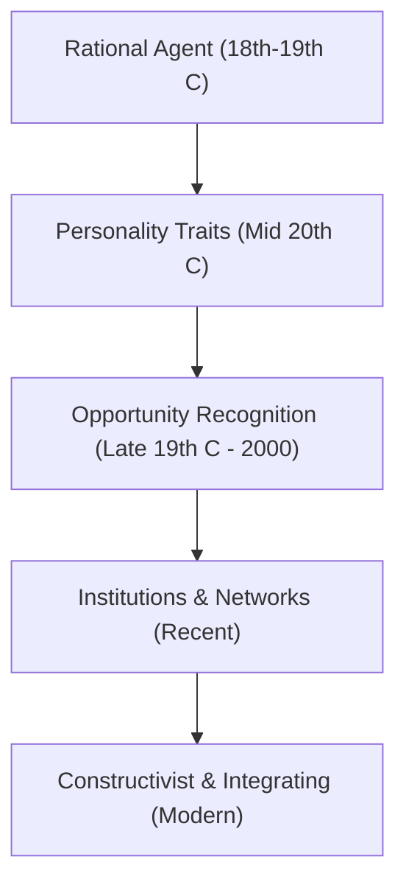

# MMPC 018: Entrepreneurship
## Block 1: Entrepreneurship – An Overview (Hinglish Version)

---

## Unit 1: Introduction to Entrepreneurship

### 1. Evolution of Entrepreneurship (Schools of Thought)
Entrepreneurship ki study over time different phases aur schools of thought se guzar kar evolve hui hai:

*   **Phase 1: Entrepreneur as a Rational Agent (Economic School)**
    *   **Richard Cantillon (1755):** Inhone sabse pehle entrepreneur ko ek *risk-taker* ke roop mein define kiya, jo products ko certain price par khareedta hai aur uncertain price par bechta hai.
    *   **Adam Smith (1776):** Inhone entrepreneur ko ek profit-seeking enterpriser bataya jo business establish karta hai.
    *   **Jean-Baptiste Say (1807):** Inhone coordination ka concept joda. Entrepreneur factors of production (land, labor, capital) ko coordinate aur manage karta hai.
    *   **Joseph Schumpeter (1934):** Inhone entrepreneur ko ek *innovator* kaha jo "creative destruction" ke zariye market equilibrium ko disrupt karta hai.
*   **Phase 2: Personality Traits / Behavioral School**
    *   Isme focus economic functions se hatkar entrepreneur ki personality aur behavior par shift hua.
    *   Key concepts: Need for Achievement (**David McClelland**), Internal Locus of Control (**Julian Rotter**), risk-taking ability, aur ambiguity (uncertainty) tolerance.
*   **Phase 3: Opportunity Recognition & Discovery**
    *   **Shane & Venkataraman (2000):** Inke according, entrepreneurship woh process hai jisse market opportunities ko discover, evaluate aur exploit kiya jata hai.
    *   **Kirzner (1997):** Market mein jo imperfections (asymmetric information) hoti hain, unhi se opportunities milti hain.
*   **Phase 4: Institutions and Networks**
    *   Yeh school manta hai ki sociocultural networks aur formal rules/regulations venture creation ko control karte hain.
    *   **Gnyawali & Fogel (1994):** Inhone 5 institutional factors bataye: government policies, socio-economic conditions, entrepreneurial capabilities, financial support, aur non-financial support.
*   **Phase 5: Constructivist & Integrating Approach**
    *   Modern view jo manta hai ki individual, project aur environmental factors ke inter-connection se business successfully chalta hai.

---

### 2. Major Theories of Entrepreneurship

| Theory Name | Proponent | Core Philosophy / Concept (Hinglish) | Exam Example |
| :--- | :--- | :--- | :--- |
| **Innovation Theory** | Joseph Schumpeter | Entrepreneur circular flow ko disrupt karta hai "novel combinations" (new product, new process, new market) launch karke. Inventor (jo naya khojta hai) aur Innovator (jo commercialize karta hai) alag hote hain. | *Example:* Apple ka iPhone launch karna, jisne mobile industry ko badal diya. |
| **Need for Achievement (N-Ach)** | David McClelland | Motivation hi entrepreneurship ka main driver hai. High N-Ach wale log sirf paise ke liye nahi, balki excel karne aur feedback paane ke liye kaam karte hain. iske 5 components hote hain. | *Example:* Ek founder ka day-night kaam karna taaki startup successfully run ho sake. |
| **Risk and Uncertainty Theory** | Frank Knight | Profit us risk ko bear karne ka reward hai jo non-insurable hai (jise statistics se predict nahi kiya ja sakta). | *Example:* Space tourism ya AI healthcare jaise completely new industry mein enter karna. |
| **Locus of Control** | Julian Rotter | Do tarah ke locus hote hain: Internal (jo maante hain ki success unke apne haath mein hai) aur External (jo kismat ya luck ko blame karte hain). Successful entrepreneurs ka **Internal Locus** hota hai. | *Example:* Market down hone par economy ko blame karne ke bajaye business pivot karna. |
| **Entrepreneurial Alertness** | Israel Kirzner | Entrepreneur market gaps (arbitrage opportunities) ko identify karta hai jo doosre miss kar dete hain. Woh low price par buy karke high price par sell karta hai. | *Example:* Apne area mein organic vegetables ki short supply dekh kar organic store shuru karna. |
| **Social Change Theory** | Everett Hagen | Jab kisi marginalized minority group se unka status ya respect chhin li jati hai, toh woh as a catalyst/rebel business start karte hain taaki status wapas paa sakein. | *Example:* India mein historical communities (jaise Marwaris/Parsis) ka business hubs banana. |
| **Effectuation Theory** | Saras Sarasvathy | "Causation" (pehle goal set karna fir resources dhoondhna) ke bajaye entrepreneurs "Effectuation" use karte hain (jo resources haath mein hain unse kya banaya ja sakta hai). | *Example:* Fridge mein jo ingredients available hain unhe dekh kar dinner taiyar karna. |
| **Entrepreneurial Bricolage** | Claude Lévi-Strauss | Resource constraints (kami) ke samay jo bhi materials aur resources available hain, unka creative use karke problem solve karna. | *Example:* Kabaad (scrap metal) se packing machine bana dena. |

---

### 3. Types of Entrepreneurship & Indian Suitability

#### Major Types:
1.  **Small Business:** Local aur family-run business (jaise grocery store).
2.  **Scalable Startups:** Venture Capital se funded fast-growing tech companies.
3.  **Large Company:** Badi companies ke andar continuous innovation (jaise Samsung).
4.  **Social:** Profit ke bajaye social issues (jaise education, poverty) solve karne par focused.
5.  **Environmental (Green):** Eco-friendly practices aur green products par focused.
6.  **Technopreneurship:** Technology-driven business models.
7.  **Imitative:** Doosre successful model ko copy karke local market mein chalana (jaise fast food franchises).
8.  **Cyberpreneurship:** Virtual aur completely online business.

#### India ke liye kaunsa suitable hai aur kyun?
*   **Small Business, Imitative, aur Social/Rural Entrepreneurship** India ke liye sabse suitable hain.
*   **Justification:**
    *   **Employment Generation:** India mein population bohot zyada hai. Small businesses labor-intensive hote hain jo disguised unemployment ko absorb karte hain.
    *   **Necessity-Driven:** Jobs ki kami ke karan log necessity ke roop mein business shuru karte hain.
    *   **Resource Constraints:** Rural aur imitative models mein capital investment kam lagta hai, isliye easily start kiye ja sakte hain.

---

## Unit 2: Entrepreneurial Competencies

### 1. Key Definitions (Hinglish)
*   **Competence:** Knowledge, skills, aur traits/motives ka combination jo kisi task mein superior (excellent) performance deta hai.
*   **Knowledge:** Brain mein stored information (jaise tairne/swimming ka process pata hona - par yeh kafi nahi hai).
*   **Skill:** Practice se aane wali ability (jaise paani mein float kar paana).
*   **Motive/Trait:** Internal driver (jaise N-Ach) ya personality characteristic (jaise internal locus of control).

---

### 2. Typology of Competencies (EDII Studies)
EDII Ahmedabad ne David McClelland ki research par base 13+ cross-cultural competencies batayi hain:

1.  **Initiative:** Situation ke demand karne se pehle hi action lena.
2.  **Sees & Acts on Opportunities:** Market gaps dekh kar land, finance aur machinery arrange karna.
3.  **Persistence:** Har na manna aur hurdles ke bawajood bar-bar koshish karna.
4.  **Information Seeking:** Apne aap research karna aur experts se consultation lena.
5.  **Concern for High Quality:** Existing standards se better quality achieve karne ki koshish karna.
6.  **Commitment to Work Contract:** Customer satisfaction ke liye personal sacrifice ya extra effort dena.
7.  **Efficiency Orientation:** Kam cost aur kam time mein kaam khatam karne ke raste dhoondhna.
8.  **Systematic Planning:** Bade tasks ko sub-tasks mein todna aur plan banana.
9.  **Problem Solving:** Goal tak pahunchne ke liye innovative solutions sochna.
10. **Self-Confidence:** Apni abilities par poora bharosa rakhna.
11. **Assertiveness:** Problems ko directly confront karna aur clear instructions dena.
12. **Persuasion:** Financers aur customers ko aasani se convince kar lena.
13. **Use of Influence Strategies:** Business networks aur contacts banana.

---

### 3. Entrepreneur aur Regular Business Owner mein kya difference hai?

| Parameter | Entrepreneur | Regular Business Owner |
| :--- | :--- | :--- |
| **Primary Goal** | Growth, innovation, aur market disruption. | Stability, steady income, aur family livelihood. |
| **Risk Appetite** | Moderate to high (uncertainty ko handle kar sakta hai). | Low (capital risk ko avoid karta hai). |
| **Core Competencies** | Initiative, opportunity seeking, aur effectuation. | Daily operations, cost monitoring, aur basic maintenance. |
| **Startup Success** | Growth loop aur capital scale ke liye bohot critical hai. | Daily cash flow aur customer retention ke liye zaroori hai. |

---

## Unit 3: Dimensions of Entrepreneurship

### 1. Group Entrepreneurship
*   **Definition:** Jab business ka control aur leadership ek single owner ke bajaye like-minded logo ke group (jinki complementary skills hon) ke paas chala jata hai.
*   **Why it matters:** Business jab scale karta hai tab akela banda technology, finance, marketing sab handle nahi kar sakta. Tab team work zaroori ho jata hai.

#### Types of Group Entrepreneurship:
1.  **Sophisticated Tech Ventures:** Jisme co-founders alag-alag technical field (software, hardware, finance) ke expert hote hain.
2.  **SHG/Community-based:** Jaise Self-Help Groups (SHGs) jo rural areas mein livelihood generation ke liye group work karte hain.

---

### 2. Women Entrepreneurship & Empowerment
*   **Context:** Patriarchal norms aur childcare ke chalte rural/urban women formal job nahi kar paati. Entrepreneurship unhe flexible timings aur financial independence deta hai.
*   **Significance:** Yeh women's decision-making power aur family healthcare/education standard ko badhata hai kyunki women apni income ka bada hissa family welfare par spend karti hain.

#### Key Government Schemes for Women in India:
*   **Mudra Loan for Women:** Micro-enterprise ke liye up to `10 Lakh` ka collateral-free loan.
*   **Annapurna Scheme:** Food catering business ke liye up to `50,000` ka loan (36 EMIs mein returnable).
*   **Stree Shakti & Dena Shakti:** Women-owned businesses ko interest rate par 0.05% se 0.25% tak ka discount milta hai.
*   **Bhartiya Mahila Bank (BMB) Loans:** Up to `20 Crore` ka loan (jaise beauty parlors ke liye *Shringaar* loan, crèches ke liye *Parvarish* loan).
*   **Mahila Udyam Nidhi (PNB/SIDBI):** Up to `10 Lakh` ka finance support.
*   **Cent Kalyani Scheme:** Micro & small sector mein up to `100 Lakh` ka collateral-free loan.

---

### 3. Techno-Entrepreneurship (Technopreneurship)
*   **Concept:** Aisa business model jisme high-level technology hi value creation aur cost reduction ka primary driver ho.
*   **Significance:** Sustainability aur climate targets (SDGs) ko achieve karne ke liye resources conservation aur waste reduction mein technopreneurs ka bada role hai.

#### Key Support Systems & Programs:
1.  **Saha Fund:** Tech startups (preferably women-founded) ko capital aur mentoring dene wala venture fund.
2.  **NEN (National Entrepreneurship Network):** Wadhwani Foundation ke sath mil kar tier-1/tier-2 campuses mein entrepreneurship hubs establish karta hai.
3.  **NASSCOM Initiatives:** Start-up Warehouse (incubation) aur *Girl in Technology* programs chalana.
4.  **Government of India (Startup India Hub):** Mentorship aur virtual learning programs.
