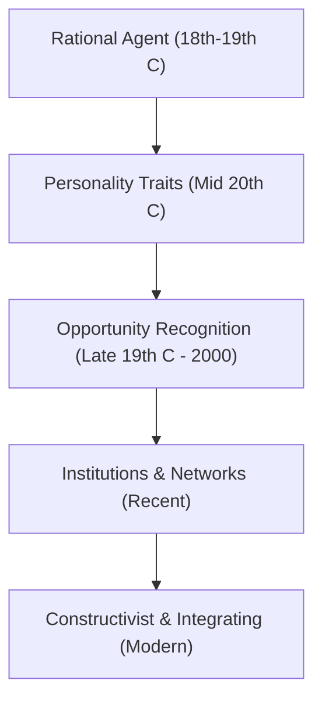

# MMPC 018: Entrepreneurship
## Block 1: Entrepreneurship – An Overview

---

## Unit 1: Introduction to Entrepreneurship

### 1. Evolution of Entrepreneurship (Schools of Thought)
The academic discipline of entrepreneurship has evolved through multiple theoretical phases:

*   **Phase 1: Entrepreneur as a Rational Agent (Economic School)**
    *   **Richard Cantillon (1755):** First defined the entrepreneur as a risk-taker who buys at a certain price and resells at an uncertain price.
    *   **Adam Smith (1776):** Visualized the entrepreneur as a commercial, profit-seeking enterpriser.
    *   **Jean-Baptiste Say (1807):** Added coordination. The entrepreneur coordinates resources (land, labor, capital) and administers production.
    *   **Joseph Schumpeter (1934):** Described the entrepreneur as a dynamic innovator who disrupts the market equilibrium via "creative destruction."
*   **Phase 2: Personality Traits / Behavioral School**
    *   Shifts focus from economic functions to the individual's persona.
    *   Key aspects include the need for achievement (**David McClelland**), internal locus of control (**Julian Rotter**), risk-taking propensity, and tolerance for ambiguity.
*   **Phase 3: Opportunity Recognition & Discovery**
    *   **Shane & Venkataraman (2000):** Defined entrepreneurship as the process of discovering, evaluating, and exploiting opportunities to create goods/services.
    *   **Kirzner (1997):** Conceptualized opportunities as market imperfections resulting from information asymmetry.
*   **Phase 4: Institutions and Networks**
    *   Argues that sociocultural networks and formal institutions (laws, regulations, capital markets) govern venture creation.
    *   **Gnyawali & Fogel (1994):** Highlighted five institutional factors: government policies, socio-economic conditions, capabilities, financial support, and non-financial support.
*   **Phase 5: Constructivist & Integrating Approach**
    *   Focuses on the interaction between the individual, the project, and the socio-institutional context.

---

### 2. Major Theories of Entrepreneurship

| Theory | Key Proponent | Core Philosophy / Concept | Exam Application Example |
| :--- | :--- | :--- | :--- |
| **Innovation Theory** | Joseph Schumpeter | Entrepreneurs disrupt circular flows through "novel combinations" (new products, processes, markets, or sources). Distinct from an inventor (who discovers new things; the innovator commercializes them). | *Example:* Apple introducing the iPhone, disrupting the mobile phone market. |
| **Need for Achievement (N-Ach)** | David McClelland | Entrepreneurs are driven by an internal motivation to excel, solve problems, and receive concrete feedback, rather than purely monetary gain. Five components: responsibility, goal setting, personal effort, feedback, and moderate risk. | *Example:* A founder working day and night to build a social network due to personal drive. |
| **Risk and Uncertainty** | Frank Knight | Profit is the reward for bearing non-insurable risks and uncertainties (situations where probability cannot be statistically determined). | *Example:* Launching a startup in a brand-new space like space tourism. |
| **Locus of Control** | Julian Rotter | Successful entrepreneurs have an **internal locus of control**—they believe their actions determine their success, rather than luck or external factors. | *Example:* A founder pivoting their startup when sales drop rather than blaming the economy. |
| **Entrepreneurial Alertness** | Israel Kirzner | The entrepreneur notices market gaps (arbitrage opportunities) caused by information asymmetry. They act to buy low and sell high, moving the market toward equilibrium. | *Example:* Spotting a local shortage of organic food and setting up a dedicated supply chain. |
| **Social Change Theory** | Everett Hagen | Entrepreneurship is driven by status withdrawal of marginalized minority groups, causing them to channel creative energies into economic power. | *Example:* Historical communities (like Marwaris or Parsis in India) building strong business hubs. |
| **Effectuation Theory** | Saras Sarasvathy | Emphasizes "effectuation" (starting with given means: who I am, what I know, who I know) rather than "causation" (starting with a predefined goal). | *Example:* Cooking a meal from ingredients available in the fridge instead of buying specific ingredients for a recipe. |
| **Entrepreneurial Bricolage** | Claude Lévi-Strauss | The process of making do by combining whatever resources are at hand to solve problems in resource-constrained environments. | *Example:* A small rural shop using scrap metal to create a packaging machine. |

---

### 3. Types of Entrepreneurship & Indian Suitability

#### Major Types:
1.  **Small Business:** Local, family-run, self-funded (e.g., local grocery store).
2.  **Scalable Startups:** Seek rapid growth, funded by Venture Capital (e.g., tech startups).
3.  **Large Company:** Continuous innovation within established organizations (e.g., Samsung).
4.  **Social:** Motivated by addressing social issues rather than maximizing profit (e.g., Grameen Bank).
5.  **Ecopreneurship (Green):** Focuses on eco-friendly practices and products.
6.  **Technopreneurship:** Driven by technology-intensive activities.
7.  **Imitative:** Mimics existing models in new markets (e.g., local franchise models).
8.  **Cyberpreneurship:** Virtual, online-only businesses.

#### Which is most suitable for India?
*   **Small Business, Imitative, and Social/Rural Entrepreneurship** are highly critical.
*   **Justification:**
    *   **Employment Generation:** India has a vast, growing labor force. Small businesses are highly labor-intensive, absorbing disguisedly unemployed agricultural workers.
    *   **Necessity-Driven:** Necessity-driven entrepreneurship prevails due to limited corporate jobs.
    *   **Resource Constraints:** Rural and imitative models leverage local resources and require lower capital investment, making them highly viable.

---

## Unit 2: Entrepreneurial Competencies

### 1. Key Definitions
*   **Competence:** A combination of a body of knowledge, set of skills, and cluster of appropriate motives/traits that results in superior job performance.
*   **Knowledge:** Information and facts stored in the brain (necessary but not sufficient—e.g., knowing *how* to swim).
*   **Skill:** The ability to demonstrate a system and sequence of behaviors (acquired through practice—e.g., *actually* keeping afloat).
*   **Motive/Trait:** Recurrent internal concerns (like N-Ach) or character traits (like internal locus of control) that drive action.

---

### 2. Typology of Competencies (EDII Studies)
The Entrepreneurship Development Institute of India (EDII) identified 13+ cross-culturally valid competencies:

1.  **Initiative:** Taking action beyond job requirements or before being forced by events.
2.  **Sees and Acts on Opportunities:** Spotting market gaps and seizing unusual resources (finance, land, equipment).
3.  **Persistence:** Taking repeated, different actions to overcome obstacles.
4.  **Information Seeking:** Personally researching, consulting experts, and using networks.
5.  **Concern for High Quality:** Meeting or beating standards of excellence.
6.  **Commitment to Work Contract:** Making personal sacrifices to complete a task; prioritizing client satisfaction.
7.  **Efficiency Orientation:** Finding ways to do things faster, cheaper, or with fewer resources.
8.  **Systematic Planning:** Developing logical, step-by-step plans, breaking tasks into sub-tasks, and evaluating alternatives.
9.  **Problem Solving:** Generating unique/innovative solutions and switching strategies to reach goals.
10. **Self-Confidence:** Believing in oneself and standing by one's judgment in the face of opposition.
11. **Assertiveness:** Confronting problems with others directly; outlining expectations clearly.
12. **Persuasion:** Convinces others to purchase, finance, or collaborate.
13. **Use of Influence Strategies:** Developing business networks and utilizing strategic partnerships.

---

### 3. Differentiating Entrepreneurs from Regular Business Owners

| Characteristic | Entrepreneur | Regular Business Owner |
| :--- | :--- | :--- |
| **Primary Goal** | Growth, innovation, market disruption. | Stability, steady cash flow, family livelihood. |
| **Risk Appetite** | Moderate to high; handles uncertainty. | Low; avoids capital risks. |
| **Core Competencies** | Initiative, opportunity seeking, innovation, effectuation. | Routine operations management, administrative monitoring, customer service. |
| **Startup Success Contribution** | Vital for pivoting, raising capital, navigating market entry, and identifying growth loops. | Vital for maintaining daily cost-efficiency, customer retention, and steady operations. |

---

## Unit 3: Dimensions of Entrepreneurship

### 1. Group Entrepreneurship
*   **Definition:** Entrepreneurship where leadership is shared or transferred from a single ideator to an organized group of individuals with complementary skills.
*   **Why it matters:** As a firm scales, division of labor and specialized decision-making (technology, marketing, finance) become mandatory.

#### Types of Group Entrepreneurship:
1.  **Advanced/Sophisticated Tech Ventures:** Complex products requiring distinct technical expertise across co-founders.
2.  **Community-based/SHG Operations:** Managed by Self-Help Groups (SHGs) or cooperatives. Promotes mutual support and income generation for marginalized sections.

---

### 2. Women Entrepreneurship & Empowerment
*   **Context:** Patriarchal norms and child-rearing often limit women's entry into the formal labor market. Entrepreneurship provides financial independence and flexible hours.
*   **Significance:** Enhances decision-making power, improves household nutrition and education spend (as women reinvest income back into family welfare), and drives social change.

#### Key Government Schemes for Women in India:
*   **Mudra Loan for Women (PMMY):** Collateral-free loans up to `10 Lakh` for micro-enterprises.
*   **Annapurna Scheme:** Up to `50,000` for catering/food-related startups (repayable in 36 EMIs).
*   **Stree Shakti & Dena Shakti Schemes:** Concession on interest rates (0.05% to 0.25%) for female-owned enterprises.
*   **Bhartiya Mahila Bank Loans:** Loans up to `20 Crore` (schemes like *Shringaar* for beauty parlors, *Parvarish* for day-care crèches).
*   **Mahila Udyam Nidhi (PNB/SIDBI):** Equity/loan support up to `10 Lakh` for setting up new projects.
*   **Cent Kalyani Scheme:** Collateral-free loans up to `100 Lakh` for micro and small units.

---

### 3. Techno-Entrepreneurship (Technopreneurship)
*   **Concept:** Building a business where technology is the core driver of value creation, cost reduction, or product delivery.
*   **Significance:** Key to achieving UN Sustainable Development Goals (SDGs) by optimizing energy, reducing waste, and scaling digital platforms.

#### Key Support Systems & Programs:
1.  **Saha Fund:** Venture fund focused on supporting high-end technology startups, especially those founded by women.
2.  **National Entrepreneurship Network (NEN):** Initiated in 2008 in collaboration with the Wadhwani Foundation; sets up entrepreneurship networks and hubs in tier-1/tier-2 campuses.
3.  **NASSCOM Initiatives:** Start-up Warehouse and Hack-accelerator (e.g., in Bengaluru) providing 6-month incubation for tech startups; *Girl in Technology* program.
4.  **Government of India (Startup India Hub):** Online courses, mentorship, and virtual platforms to facilitate technical collaborations.
