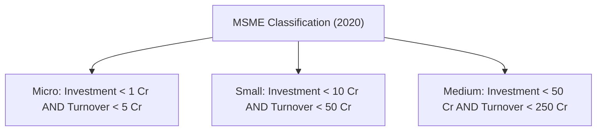
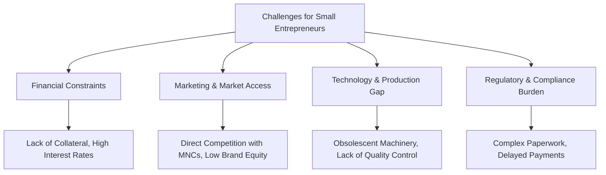

# MMPC 018: Entrepreneurship
## Block 2: Entrepreneurship in India (Hinglish Version)

---

## Unit 4: Entrepreneurship and Government Policies

### 1. Administrative aur Institutional Setup ki Zaroorat Kyun Hai?
Government ki policies aur resolutions (jaise IPR 1948, 1956, 1977, 1991, aur MSMED Act 2006) bina ek proper institutional system ke implement nahi ho sakti. Is setup ke kayi reasons hain:
*   **Policy Implementation:** Yeh system industrial policy ko ground level par assets (land, capital, raw materials) ke roop mein convert karta hai.
*   **Information Dissemination:** Bankable schemes, training aur technology ki detail rural aur backward areas tak pahunchana iski responsibility hai.
*   **Credit Delivery & Risk Mitigation:** Business start karne ke liye capital lagta hai. SIDBI aur commercial banks ke coordination se collateral-free loans aur guarantee packages milte hain.
*   **Grassroots Support:** District level par District Industries Centres (DICs) aur MSME-DIs entrepreneurs ko *inception* (startup) aur *expansion* (growth) phase mein hand-holding support dete hain.

---

### 2. MSME Sector ke liye Important Government Schemes

Ministry of MSME ke under aane wali key schemes:

| Scheme Name | Target Group | Primary Objective (Hinglish) | Features / Limits |
| :--- | :--- | :--- | :--- |
| **PMEGP** | Rural & urban unemployed youth | New micro-enterprises shuru karke self-employment generate karna. | Max project cost: `25 Lakh` (manufacturing) aur `10 Lakh` (services). Isme subsidy milti hai. |
| **CGTMSE** | New & existing Micro/Small units | Bina collateral (security) ke bank loan facilitate karwana. | Up to `200 Lakh` tak ke loan par guarantee (50% se 85% cover). |
| **ASPIRE** | Agro-rural startups | Livelihood Business Incubators (LBIs) aur Technology Business Incubators (TBIs) establish karna. | Agro-rural sector startups ko promote karne ke liye SIDBI ka Fund of Funds support. |
| **ESDP** | Students aur youth | Technical skills aur business knowledge ko upgrade karna. | Short-term skill development courses aur motivational campaigns. |
| **SFURTI** | Traditional artisans | Traditional industries (jaise khadi, coir, handicraft) ke artisans ko clusters mein organize karna. | Raw materials, training aur advanced tools provide karna. |
| **MSME Champions** | Competitive MSMEs | Technology upgradation, Lean manufacturing, IPR aur ZED (Zero Defect Zero Effect) ko promote karna. | Iske 3 sub-parts hain: MSME-Sustainable (ZED), MSME-Competitive (Lean), aur MSME-Innovative. |
| **ECLGS** | Pandemic-affected units | COVID-19 ke losses se nikalne ke liye working capital support dena. | Emergency loan par 100% guarantee cover. |
| **RAMP** | National MSME systems | Central-state coordination aur market entry ko improve karna. | `6000 Crore` ka World Bank funded 5-year program. |

---

### 3. SEBI Institutional Trading Platform (ITP) ke Zariye Fund Raising
SMEs jo public IPO nahi la sakte, unhe capital raise karne ke liye SEBI ne **ITP (Institutional Trading Platform)** shuru kiya hai:
*   **Listing Requirements:**
    *   Last 5 years mein BIFR (Board for Industrial and Financial Reconstruction) ko refer na kiya gaya ho.
    *   Last 5 years mein SEBI, RBI, MCA ya IRDA ne koi regulatory action na liya ho.
    *   Preceding financial year ki audited balance sheet honi zaroori hai.
    *   Revenues kisi bhi pichle saal mein `100 Crore` se zyada na ho aur incorporation ko 10 saal se kam hue hon.
    *   Paid-up capital `25 Crore` se kam hona chahiye.
    *   Angel Investor, VC, bank, ya QIB (Qualified Institutional Buyer) se minimum `50 Lakh` ka investment mila ho.
*   **Fund Raising Method:** ITP par listed companies sirf Private Placement ya Rights Issue se fund raise kar sakti hain (no public IPO allowed).

---

## Unit 5: Entrepreneurship and Economic Development

### 1. MSME Formation ka Concept
*   **Definition Criteria:** Pehle Manufacturing aur Service sector ki limits alag thi (machinery vs. equipment investment ke base par). Par May 2020 ke revision ke baad dono sectors ka difference khatam kar diya gaya aur **Investment** aur **Turnover** ka composite criteria banaya gaya:

*   **Ancillary Industrial Undertakings:** MSMEs ki woh sub-class jo parts, components ya intermediates banati hai aur apni production ka kam-se-kam **50%** hissa kisi badi parent industry ko supply karti hai (investment limit: `10 Crore`).

---

### 2. Economic Development mein Entrepreneurship ka Role
Entrepreneurship desh ki economy ko grow karne ka main catalyst hai:
1.  **Employment Generation:** MSME sector 11 crore se zyada logo ko job deta hai. Yeh rural labor ko non-farm jobs deta hai, jisse agriculture ka disguised unemployment pressure kam hota hai.
2.  **Regional Balance & Rural Development:** Badi industry aamtaur par metro cities mein hoti hain, par MSMEs rural/backward areas mein setup kiye ja sakte hain. Isse city-ward migration kam hota hai aur regional growth balance hoti hai.
3.  **Capital Mobilization:** Local level par logon ki small savings ko utilize karta hai jo warna idle (unused) reh jaati.
4.  **GDP aur Export Contribution:** India ke nominal GDP mein ~30%, total manufacturing output mein ~45%, aur exports mein ~48% contribution MSMEs ka hai.
5.  **Ancillarisation (Subcontracting):** Small units badi auto/engineering companies ke parts banakar complement karti hain (jaise component suppliers).

---

### 3. Small Entrepreneurs ke Problems aur Unhe Overcome karne ke Tarike

#### Detailed Problems:
*   **Financial Constraints:** Startup capital aur working capital ki kami. Bank history aur collateral na hone par banks loan dene se katrate hain, jisse high interest par informal loan lena padta hai.
*   **Marketing & Competition:** Brand equity kam hoti hai. Large MNCs ke aggressive pricing aur advertisements ke samne tikna mushkil hota hai.
*   **Lack of Information:** Government policies, export opportunities aur quality standard procedures ki awareness na hona.
*   **Technological Obsolescence:** Purani machinery use karne se production cost badhti hai aur quality standards meet nahi hote.
*   **Infrastructure Deficit:** Power cuts, testing laboratories aur cold storage ki kami.

#### Overcoming Strategies (Solution kaise nikalein):
1.  **Credit Schemes use karein:** Collateral loans ke liye **CGTMSE** aur capital subsidies ke liye **PMEGP** apply karein.
2.  **Cluster approach apnayein:** SFURTI schemes ke under clusters banayein taaki common facility centers (CFCs) aur logistics cost share ki ja sake.
3.  **Digital platforms list karein:** Government e-Marketplace (GeM) aur social media marketing use karke niche customer groups takdirectly pahunchein.
4.  **ZED Certificate lein:** Apni products ki quality improve karke Zero Defect Zero Effect (ZED) compliance ensure karein, jisse government projects mein priority mile.
5.  **MSME Samadhaan use karein:** Agar buyers 45 days ke andar payment na dein, toh is portal ke zariye heavy interest demand karein.
