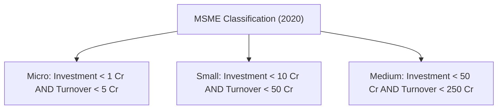
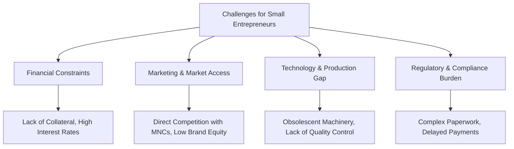

# MMPC 018: Entrepreneurship
## Block 2: Entrepreneurship in India

---

## Unit 4: Entrepreneurship and Government Policies

### 1. The Need for an Administrative and Institutional Setup
Government policy resolutions (such as IPR 1948, 1956, 1977, 1991, and the MSMED Act 2006) cannot operate in a vacuum. A robust administrative and institutional interface is crucial for several reasons:
*   **Policy Implementation:** Translates high-level industrial resolutions into actionable resources (land, capital, raw materials) for small entrepreneurs.
*   **Information Dissemination:** Distributes details about bankable schemes, technology, and market opportunities to remote and rural areas.
*   **Credit Delivery & Risk Mitigation:** Coordinates between commercial banks, NBFCs, and development institutions (like SIDBI) to facilitate collateral-free lending and guarantee schemes (like CGTMSE).
*   **Grassroots Support:** Reaches regional levels through District Industries Centres (DICs) and MSME Development Institutes (MSME-DIs) to assist at all stages: *inception*, *operation*, and *expansion*.

---

### 2. Major Government Schemes for MSMEs in India

The Ministry of MSME and allied bodies run several key programs:

| Scheme Name | Target Audience | Primary Objectives | Key Features / Limits |
| :--- | :--- | :--- | :--- |
| **PMEGP** (Prime Minister’s Employment Generation Programme) | Rural & urban unemployed youth, artisans | Generate sustainable self-employment by setting up new micro-enterprises. | Max project cost: `25 Lakh` (manufacturing) and `10 Lakh` (services). Includes capital subsidy from government. |
| **CGTMSE** (Credit Guarantee Fund Trust for MSEs) | New & existing Micro/Small Enterprises | Enable collateral-free term loans and working capital from banks. | Guarantees loans up to `200 Lakh` (guarantee cover ranges from 50% to 85%). |
| **ASPIRE** (Promotion of Innovation, Rural Industry & Entrepreneurship) | Agro-rural startups and incubators | Set up Livelihood Business Incubators (LBIs) and Technology Business Incubators (TBIs) to promote rural entrepreneurship. | Fund of Funds managed by SIDBI to support early-stage agro-rural ventures. |
| **ESDP** (Entrepreneurship and Skill Development Programmes) | Aspiring youth (men & women) | Inculcate entrepreneurial culture and upgrade technical skills. | Organizes short-term motivational campaigns and skill training programs. |
| **SFURTI** (Scheme of Fund for Regeneration of Traditional Industries) | Traditional artisans and clusters | Organize traditional industries (khadi, coir, handicrafts) into clusters to enhance competitiveness. | Upgrades artisan skills, provides common facility centers, and improves tools. |
| **MSME Champions Scheme** (CLCS-TUS) | Competitive MSMEs seeking modernization | Promote technology upgradation, Lean manufacturing, IPR awareness, and ZED (Zero Defect Zero Effect) compliance. | Three components: MSME-Sustainable (ZED), MSME-Competitive (Lean), and MSME-Innovative (Incubation & IPR). |
| **ECLGS** (Emergency Credit Line Guarantee Scheme) | Pandemic-hit MSMEs (esp. hospitality) | Provide liquidity support to counter pandemic-induced disruptions. | 100% guarantee cover for additional working capital term loans. |
| **RAMP** (Raising and Accelerating MSME Performance) | National MSME ecosystem | Enhance central-state coordination, firm capabilities, and market access. | A `6000 Crore` World Bank-assisted program spread over 5 years. |

---

### 3. Capital Raising via SEBI Institutional Trading Platform (ITP)
To solve monetary constraints, SEBI allows SMEs to list on the **Institutional Trading Platform (ITP)** without an Initial Public Offer (IPO):
*   **Listing Requirements:**
    *   No referral to BIFR (Board for Industrial & Financial Reconstruction) in the last 5 years.
    *   No regulatory action taken by SEBI, RBI, or MCA in the last 5 years.
    *   At least 1 year of audited financial statements.
    *   Annual revenues must not exceed `100 Crore` in any previous year; company age must be < 10 years.
    *   Paid-up capital must not exceed `25 Crore`.
    *   Must receive minimum investment (`50 Lakh`) from an Angel Investor, Venture Capital Fund, scheduled bank, or Qualified Institutional Buyer (QIB).
*   **Capital Raising Method:** Private placement or rights issues (no IPO allowed on ITP).

---

## Unit 5: Entrepreneurship and Economic Development

### 1. Formation & Concept of MSMEs
*   **Definition Criteria:** Previously classified separately for manufacturing and services (based strictly on investment in plant/machinery vs. equipment). Post-May 2020, the distinction is removed, and a composite criteria of **Investment** and **Turnover** is used:

*   **Ancillary Industrial Undertakings:** A special subclass of MSMEs that engaged in manufacturing components, intermediates, or services, supplying at least **50%** of their production to other mother industries.

---

### 2. Role of Entrepreneurship in Economic Development
Entrepreneurship acts as a catalyst for economic growth:
1.  **Employment Generation:** MSMEs employ 11+ crore people, utilizing labor-intensive methods that act as a buffer for disguised unemployment in agriculture.
2.  **Regional Balance & Decentralization:** Unlike large corporate complexes concentrated in metropolitan cities, MSMEs can be established in rural and semi-urban areas, reducing regional disparities and urban migration.
3.  **Capital Mobilization:** Taps into small, idle savings of families and local communities that otherwise would remain unutilized.
4.  **GDP and Export Contribution:** MSMEs account for ~30% of India's GDP, 45% of manufacturing output, and ~48% of total exports.
5.  **Subcontracting & Complementarity:** Small units act as ancillary suppliers to large corporations (common in the automotive and engineering sectors), facilitating economic integration.

---

### 3. Problems Faced by Small Entrepreneurs & Overcoming Strategies

#### Detailed Problems:
*   **Financial Constraints:** Small enterprises lack formal credit histories and collateral, leading to high-interest informal loans.
*   **Marketing & Competition:** Inability to compete with large firms on advertising, pricing, and distribution networks.
*   **Lack of Information:** Unawareness of government programs, exports channels, or technical upgrades.
*   **Technological Obsolescence:** Low-quality machinery leading to high manufacturing rejection rates.
*   **Infrastructure Deficit:** Lack of uninterrupted power, testing laboratories, and logistics.

#### Overcoming Strategies:
1.  **Leverage Credit Schemes:** Actively utilize **CGTMSE** for collateral-free loans and **PMEGP** for initial capital subsidies.
2.  **Join Industrial Clusters:** Use the cluster approach (like **SFURTI**) to share common facility centers, testing tools, and logistics, reducing overhead costs.
3.  **Adopt Digital Tools & Platforms:** List products on Government e-Marketplace (GeM) and use social media to reach niche markets directly.
4.  **Modernize Processes:** Adopt ZED (Zero Defect Zero Effect) certifications to boost quality standards, qualifying for government procurement benefits.
5.  **Address Delayed Payments:** Utilize MSME Samadhaan (under the MSMED Act 2006) which mandates interest penalties on large buyers who delay payments beyond 45 days.
