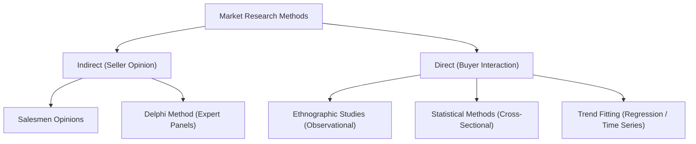
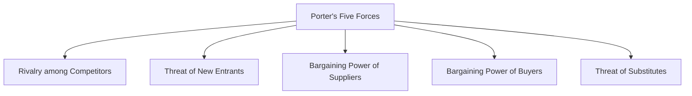

# MMPC 018: Entrepreneurship
## Block 3: Establishing a New Enterprise (Hinglish Version)

---

## Unit 6: Identification of a Business Idea/Opportunity

### 1. Idea Generation ke Sources & Methods
*   **Direct Observation (Sabse best source):** Travel karna, window shopping, reading, web searches, aur social listening (social media par customer suggestions check karna).
*   **Communication:** Distributers, users aur market experts se structured aur unstructured oral discussion.
*   **Idea Concretization ke Methods:**
    *   **Brainstorming & Reverse Brainstorming:** Phele positive gaps ko list karna aur fir product mein college students (ya target group) ko kya pasand nahi aayega, uske base par product ko improve karna.
    *   **SCAMPER:** **S**ubstitute, **C**ombine, **A**dapt, **M**odify, **P**ut to another use, **E**liminate, **R**earrange.
    *   **Mind Mapping:** Graph ke zariye supply-demand gap aur solutions ko link karna.

---

### 2. Business Model Selection & Validation
*   **Business Model:** Yeh show karta hai ki startup value kaise create, deliver, aur capture karega.
*   **Selection Factors:** Sector (B2B ya B2C), scale, resource availability, buyer profile (age, gender, income), aur demand pattern (regular vs. seasonal).
*   **Validation Factors:**
    *   *Financial:* Cost-effective production, profitability aur liquidity check karna.
    *   *Technological:* Non-polluting aur flexible technology use karna.
    *   *Customer Value:* Price, convenience aur designs par focus karna.
    *   *Societal:* Corporate Social Responsibility (CSR) ke plans.

---

### 3. Market Research Methods & App Validation Example

*   **Statistical Sample Size Calculations:**
    *   *Yamane Formula (Known Population $N$):* $n = \frac{N}{1 + N(e)^2}$ (e.g., $N = 5708, e = 0.05 \implies n \approx 374$).
    *   *Unknown Population Formula:* $n = \frac{z^2 \cdot p \cdot q}{e^2}$ (e.g., $z=1.96, p=0.5 \implies n \approx 385$).
*   **Example: Smartphone App validation kaise karein:**
    1.  *Problem Identification:* Check karein ki users app ko use karenge ya nahi.
    2.  *Planning:* Target audience, features, timeline aur budget plan karein.
    3.  *Data Collection:* Google Form surveys aur social listening.
    4.  *Analysis:* Unknown population ke formula se minimum 385 users se response le kar data analyze karein.
    5.  *MVP Launch:* Phele ek basic prototype (Minimum Viable Product) launch karein aur feedback le kar improve karein.

---

### 4. Break-Even Point (BEP)
$$BEP \text{ (in units)} = \frac{\text{Fixed Cost (FC)}}{\text{Market Price per unit (MP)} - \text{Variable Cost per unit (VC)}}$$
*   **Example:** Agar $FC = 36,20,000$, $MP = 440$, $VC = 40$. $BEP = \frac{36,20,000}{400} = 9050$ units. Agar annual demand 10,000 units hai toh yeh startup sustainable hai.

---

## Unit 7: Financing an Enterprise

### 1. Optimal Capital Structure
Mix of **Debt** (borrowed capital) aur **Equity** (owner's capital).
*   *Trading on Equity:* Debt capital use karke equity shareholders ka EPS (Earning Per Share) badhana.
*   *Pecking Order Theory:* Finance sources ka hierarchy order: Internal funding (retained earnings) $\rightarrow$ Debt funding $\rightarrow$ External Equity (dilution).

### 2. Startup Financing Stages
1.  **Pre-seed (Ideation):** Bootstrapping aur own savings.
2.  **Seed/Start-up (Prototype):** Friends & Family, Angel investors, crowdfunding.
3.  **Early Expansion (Scale-up):** Venture Capital (VC), working capital bank loans.
4.  **Maturity/Exit:** Private Equity, strategic buyout, IPO.

---

### 3. Bootstrapping, Angel Investors aur Venture Capitalists (VCs)

*   **Bootstrapping:** External funding liye bina self-sustaining model banana (second-hand equipment lena, space rent karna, work from home, customer advances lena).
    *   *Pros:* Complete freedom, koi equity dilution nahi.
    *   *Cons:* Liquidity crunch (paise ki kami) aur limited scale.
*   **Angel Investors:** High-Net-Worth Individuals (HNWIs) jo seed stage startups mein apna paisa lagate hain (informal risk capital). Yeh capital ke sath mentorship aur contacts bhi dete hain. (e.g., Mumbai Angels).
*   **Venture Capitalists (VCs):** Professional firms jo general partners (GPs) banakar limited partners (LPs) ka paisa high-risk high-growth startups mein lagate hain. Strict formal due diligence hoti hai.

#### Difference: Angel Investors vs. VCs
| Parameter | Angel Investors | Venture Capitalists |
| :--- | :--- | :--- |
| **Capital Source** | Apna khud ka paisa (Personal wealth). | Pooled public/institutional capital. |
| **Stage of Entry** | Seed & Start-up stage. | Early expansion & Expansion stage. |
| **Due Diligence** | Informal, quick aur referral-based. | Rigorous, multi-disciplinary aur formal. |
| **Exit** | Secondary purchase ya startup acquisition. | IPO (most preferred) ya strategic buyout. |

*   **VC Investment Process:** Deal Origination $\rightarrow$ Screening $\rightarrow$ Due Diligence (Evaluation) $\rightarrow$ Deal Structuring $\rightarrow$ Post-Investment Activity $\rightarrow$ Exits.
*   **Debt Instruments:**
    *   *Term Loans:* Fixed duration ke liye secured bank loans. Isme grace period (**Moratorium**) aur restrictive covenants (kuch decisions bank ki permission ke bina nahi le sakte) hote hain.
    *   *Debentures:* Long-term debt instruments. Companies Act 2013 ke under isme Debenture Redemption Reserve (DRR) banana mandatory hota hai.

---

## Unit 8: Evaluating and Preparing Business Plan

### 1. Business Plan vs. Feasibility Study
*   **Feasibility Study:** Yeh validate karta hai ki idea workable hai ya nahi (research-based).
*   **Business Plan:** Green signal milne ke baad operations, marketing aur projections ka roadmap batata hai.
*   **Detailed Project Report (DPR):** Investors aur banks ko submit karne ke liye prepared formal document.

### 2. Environmental & Market Analysis Frameworks
*   **PESTEL Model:** External factors scans (**P**olitical, **E**conomic, **S**ocial, **T**echnological, **E**nvironmental, **L**egal) aur unka business par impact high, medium ya low evaluate karna.
*   **Porter's Five Forces Model (Industry Attractiveness):**

*   **Cost of Capital:** WACC (Weighted Average Cost of Capital) - investors ko diye jaane wala minimum rate of return. Yeh shuruati phase mein liquidity maintain karne ke liye zaroori hai.

---

### 3. Technical Feasibility & Plant Layouts
*   **Location Selection Factors:** Raw material suppliers ke paas hona (sugarcane belt mein sugar mills), customer proximity (services, hotels), infrastructure (transport, power), labor availability (Bangalore for IT), aur SEZs ke benefits.
*   **Plant Layout Types:**
    *   *Line (Product) Layout:* Machinery product sequence ke according placed hoti hai. High-volume standardized production ke liye (e.g., auto assembly).
    *   *Functional (Process) Layout:* Machines ko functions ke according group kiya jata hai. Customized production ke liye (e.g., hospitals, banks).
    *   *Fixed Position Layout:* Heavy items ke liye jab product fix rahe aur labor/machinery wahan jaye (e.g., ship building).
*   **Retail Store Layouts:** Grid layout (grocery shops), Loop/Racetrack (path-based), Free-Flow layout (no route restrictions).

---

## Unit 9: Implementing Business Plan
*   **Location Decisions:** Factory/office setup tax benefits aur logistical costs par dependent hota hai.
*   **Common Errors in Business Plans:** Working capital kam assume karna, sales projection over-optimistic rakhna, competitor reactions ignore karna, aur lack of team capabilities check.

---

## Unit 10: Managing the Enterprise

### 1. Financial Functions & Negotiating with VCs
*   **VC Negotiations Steps:** Explore right VC alignment $\rightarrow$ Fair valuation calculation $\rightarrow$ Negotiate size of funding/covenants $\rightarrow$ Legal closing.
*   **Capital Budgeting Decisions:** Investment evaluation methods: Discounted (NPV, IRR, Profitability Index) vs. Non-Discounted (Payback Period, Accounting Rate of Return).
*   **Working Capital Management:** Liquidity ke liye regular cash flow manage karna. Net Working Capital ($Current\ Assets - Current\ Liabilities$) positive hona zaroori hai.

### 2. Marketing Functions & Strategies
*   **Product vs. Service Marketing:**
    *   *Product Mix (4Ps):* Product, Price, Place, Promotion.
    *   *Service Mix (7Ps):* 4Ps + People (talents/employees), Process (quick delivery), Physical Evidence (decor/ambience).
*   **Tuition Service Pricing Strategy:** Tutoring class pricing ke liye **Value-based** (quality notes, study material) aur **Competition-based** (checking local rates) mix follow karein. Cost-plus pricing lagakar basic expenses cover karein.
*   **Local Bookstore Online Strategy:**
    1.  *Google Business Profile:* Map search optimize karein.
    2.  *Social Media targeted ads:* Facebook/Instagram par 5km range ke geofenced ads run karein.
    3.  *Community events:* Weekly book discussion videos post karein aur online booking/offline pickup offer karein.
