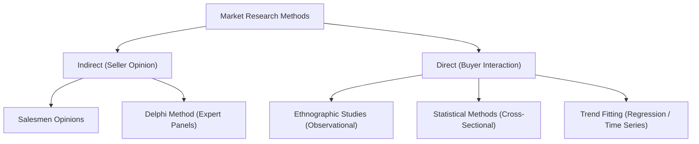
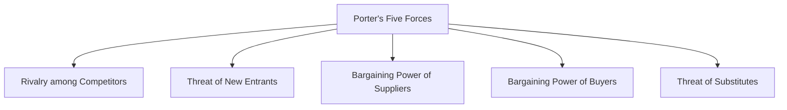

# MMPC 018: Entrepreneurship
## Block 3: Establishing a New Enterprise

---

## Unit 6: Identification of a Business Idea/Opportunity

### 1. Sources & Methods of Idea Generation
*   **Direct Observation (Best Source):** Travel, window shopping, reading, web search, and social listening.
*   **Communication:** Unstructured and structured oral communication with prospective buyers, distribution channels (salesmen), and industry experts.
*   **Methods to Concretize Ideas:**
    *   **Brainstorming & Reverse Brainstorming:** Generating solutions vs. identifying causes of potential failure.
    *   **SCAMPER:** **S**ubstitute, **C**ombine, **A**dapt, **M**odify, **P**ut to another use, **E**liminate, **R**earrange.
    *   **Mind Mapping:** Diagrammatic layout representing supply-demand gaps.

---

### 2. Business Model Selection & Validation
*   **Business Model:** A simplified architecture of the value creation, delivery, and capture mechanisms of a firm.
*   **Selection Factors:** Sector (B2B/B2C), scale, resource availability, buyer profile (age, gender, income), and nature of demand (regular vs. seasonal).
*   **Validation Dimensions:**
    *   *Financial:* Cost-effectiveness, margin generation, and long-term sustainability.
    *   *Technological:* Ease of operations, scalability, and non-polluting technology.
    *   *Customer Value:* Product convenience, pricing, and payment flexibility.
    *   *Societal:* Alignment with Corporate Social Responsibility (CSR).

---

### 3. Market Research Methods & App Demand Validation

*   **Statistical Sample Size Calculations:**
    *   *Yamane Formula (Known Population $N$):* $n = \frac{N}{1 + N(e)^2}$ (e.g., $N = 5708, e = 0.05 \implies n \approx 374$).
    *   *Unknown Population Formula:* $n = \frac{z^2 \cdot p \cdot q}{e^2}$ (e.g., $z=1.96, p=0.5 \implies n \approx 385$).
*   **Example: Smartphone App Validation:**
    1.  *Problem Identification:* Validate target customer interest.
    2.  *Planning:* Define target age groups, set research budget.
    3.  *Data Collection:* Float digital surveys (Google Forms/SurveyMonkey), monitor app store reviews of competitors.
    4.  *Analysis:* Conduct cross-sectional study on a sample of 385 users.
    5.  *MVP Launch:* Develop a basic prototype (MVP), gather feedback, and upgrade.

---

### 4. Break-Even Point (BEP)
$$BEP \text{ (in units)} = \frac{\text{Fixed Cost (FC)}}{\text{Market Price per unit (MP)} - \text{Variable Cost per unit (VC)}}$$
*   **Example:** If $FC = 36,20,000$, $MP = 440$, $VC = 40$. $BEP = \frac{36,20,000}{400} = 9050$ units. If demand is 10,000 units, the project is sustainable.

---

## Unit 7: Financing an Enterprise

### 1. Optimal Capital Structure
Balance between **Debt** (loans, debentures) and **Equity** (promoter savings, venture capital).
*   *Trading on Equity:* Using debt to increase the Earnings Per Share (EPS) for shareholders.
*   *Pecking Order Theory:* Startups prefer Internal Funds $\rightarrow$ Debt $\rightarrow$ External Equity.

### 2. Startup Financing Stages
1.  **Pre-seed (Ideation):** Bootstrapping, personal savings, grants.
2.  **Seed/Start-up (Prototype/Testing):** Friends & family, early angels, crowdfunding.
3.  **Early Expansion (Scale):** Venture Capital (Series A/B), working capital bank loans.
4.  **Maturity/Exit:** IPO, private equity, strategic buyout.

---

### 3. Bootstrapping, Angels, and Venture Capital (VC)

*   **Bootstrapping:** Cost-saving methods (buying used equipment, renting space, working from home, customer advances).
    *   *Pros:* Zero equity dilution, absolute operational freedom.
    *   *Cons:* Scaling limitations, liquidity crunch risk, high stress.
*   **Angel Investors:** High-Net-Worth Individuals (HNWIs) investing their own money in seed stages. Driven by mentorship, native support, and returns. (e.g., Indian Angel Network).
*   **Venture Capitalists (VCs):** Institutional firms investing pooled capital (General Partners manage limited partners' funds) in high-growth companies. Fully formal due diligence.

#### Comparison: Angel vs. Venture Capital
| Parameter | Angel Investors | Venture Capitalists |
| :--- | :--- | :--- |
| **Capital Source** | Personal wealth of the individual. | Pooled institutional funds (LPs). |
| **Stage of Entry** | Seed & Start-up stage. | Early-expansion & Expansion stage. |
| **Involvement** | Very high mentoring & hand-holding. | Strategic advice, board representation. |
| **Due Diligence** | Informal, quick, referral-based. | Rigorous, multi-disciplinary, formal. |
| **Exit Strategy** | Secondary sale, acquisition. | IPO (most preferred), strategic buyout. |

*   **VC Investment Process:** Deal Origination $\rightarrow$ Screening $\rightarrow$ Due Diligence (Evaluation) $\rightarrow$ Deal Structuring $\rightarrow$ Post-Investment Monitoring $\rightarrow$ Exit.
*   **Debt Options:**
    *   *Term Loans:* Secured long-term credit with a moratorium (grace) period and restrictive covenants.
    *   *Debentures:* Long-term debt instruments. Can be convertible to equity, requiring a Debenture Redemption Reserve (DRR).

---

## Unit 8: Evaluating and Preparing Business Plan

### 1. Business Plan vs. Feasibility Study
*   **Feasibility Study:** Analytical research determining *if* the idea is viable (completed first).
*   **Business Plan:** Operational roadmap detailing *how* to execute the validated idea.
*   **Detailed Project Report (DPR):** Formal document prepared to secure bank/VC funding.

### 2. Environmental & Market Analysis Frameworks
*   **PESTEL Model:** Scans external macros (Political, Economic, Social, Technological, Environmental, Legal) and rates their potential impact (High/Medium/Low) and timeframe.
*   **Porter's Five Forces Model (Industry Attractiveness):**

*   **Cost of Capital:** The minimum rate of return a startup must generate to satisfy investors and debt providers. Vital in the starting phase to avoid cash flow insolvency.

---

### 3. Technical Feasibility & Plant Layouts
*   **Location Selection Factors:** Supplier proximity (bulk raw materials, e.g., Sugar mills in sugarcane hubs), customer proximity (services, perishables), infrastructure (power/water), labor pools, government incentives (SEZs), and environmental laws.
*   **Plant Layout Types:**
    *   *Line (Product) Layout:* Sequenced machinery for high-volume, standardized goods (e.g., auto assembly).
    *   *Functional (Process) Layout:* Machines grouped by process for low-volume customized work (e.g., custom apparel, hospitals).
    *   *Fixed Position Layout:* Machinery/men move to a heavy stationary product (e.g., shipbuilding, boilers).
*   **Retail Store Layouts:** Grid (grocery stores), Loop/Racetrack (guided customer path), Free-Flow (maximum browsing flexibility), forced-path (IKEA model).

---

## Unit 9: Implementing Business Plan
*   **Location Decision Determinants:** Physical site cost, ease of transport, utility costs, regional taxation/subsidies.
*   **Formulation Errors in Business Plans:** Underestimating initial capital requirements, over-optimistic sales forecasts, superficial market analysis, ignoring competitor reactions, and failing to define a clear exit strategy.

---

## Unit 10: Managing the Enterprise

### 1. Managing Financial Functions
*   **VC Negotiations:** Explore right VC alignment $\rightarrow$ Determine fair valuation $\rightarrow$ Agree on investment size/security $\rightarrow$ Legal closing.
*   **Capital Budgeting Decisions:** Evaluation of projects using cash flow techniques (Payback Period, Accounting Rate of Return, Net Present Value, Internal Rate of Return).
*   **Working Capital Management:** Net Working Capital ($Current\ Assets - Current\ Liabilities$) vs. Gross Working Capital (total current assets). Vital to pay suppliers and manage cash runtime.

### 2. Managing Marketing Functions
*   **Product vs. Service Marketing:**
    *   *Product Mix (4Ps):* Product, Price, Place, Promotion.
    *   *Service Mix (7Ps):* 4Ps + People (staff quality), Process (delivery efficiency), Physical Evidence (ambience/office branding).
*   **Tuition Service Pricing Strategy:** Use a combination of Cost-plus pricing (accounting for notes and rent), Competition-based pricing (checking local tutoring rates), and Value-based pricing (charging premium for personalized tutoring or high success rates).
*   **Local Bookstore Online Strategy:**
    1.  *Google Business Profile:* Optimize local map search discovery.
    2.  *Social Media Targeted Ads:* Run geo-fenced Instagram/Facebook campaigns.
    3.  *Community Engagement:* Post reels summarizing books, host virtual author Q&As, and allow online reservation/pickup of physical books.
