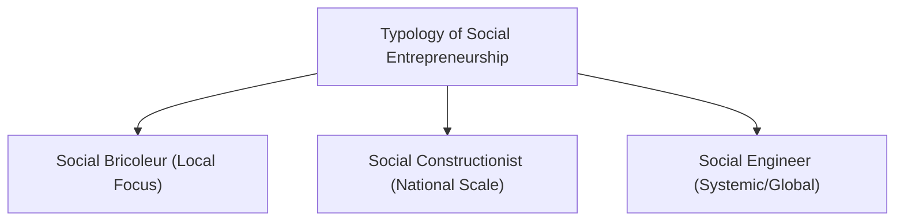

# MMPC 018: Entrepreneurship
## Block 4: Special Issues (Hinglish Version)

---

## Unit 11: Social Entrepreneurship

### 1. Social Entrepreneurship ka Concept aur iske 4 Elements
Social Entrepreneurship (SE) commercial entrepreneurship ke tools use karta hai (opportunity identification, resource mobilization) par iska ultimate objective profit-making ke bajaye social problems ko solve karna hota hai. 
Portales (2019) ke according, iske 4 major elements hote hain:
1.  **Societal Mission:** Ek mission-driven company shuru karna jahan profit ka bada hissa charitable ya societal cause par spend ho.
2.  **Motivation for Societal Change:** Community welfare improve karne aur doosron ko inspire karne ki internal drive.
3.  **Socio-Economic Value Creation:** Market price/value se zyada "Social Value" par focus karna, taaki sustainable impact ho.
4.  **Successful Implementation of Changes:** Micro level (individual/community) aur Macro level (systemic changes) dono par work karna.

---

### 2. Social vs. Corporate (Commercial) Entrepreneurship

| Parameter | Social Entrepreneurship | Corporate (Commercial) Entrepreneurship |
| :--- | :--- | :--- |
| **Primary Goal** | Social value create karna aur community issues solve karna. | Profit aur shareholder value maximize karna. |
| **Value Proposition** | Social mission-driven (jaise hunger/poverty reduction). | Market opportunity-driven (customer utility aur financial gains). |
| **Profit Treatment** | Profit ko social cause ya community activities mein reinvest kiya jata hai. | Shareholders aur promoters mein divide kiya jata hai. |
| **Success Metrics** | Social impact, depth of change aur community empowerment. | ROI, market share, profit margins, aur sales growth. |

---

### 3. Typology of Social Entrepreneurship (Smith & Stevens)

*   **Social Bricoleur:** Local level par kaam karne wale entrepreneurs jo limited resources (Bricolage) se local problems solve karte hain. Iski scalability kam hoti hai.
    *   *Example:* Kisi village mein local waste plastic ko collect karke school benches banana.
*   **Social Constructionist:** Aise startups jo pure country ke gaps ko target karte hain. Inka business model scalable hota hai.
    *   *Example:* **The Robin Hood Army** (volunteers ke through restaurants se bacha hua food collect karke poor logo ko distribute karna, jo ab pure India ke multiple cities aur abroad mein run hota hai).
*   **Social Engineer:** Jo poore system ya society ki problem ko identify karke ek bade global scale par solution structure banate hain.
    *   *Example:* **Grameen Bank** (Muhammad Yunus ka microcredit system jisne pure banking model ko transform kiya).

---

### 4. Indian Scenario & Social Issue Resolution Example
*   **Issue:** Cities mein food waste aur hunger/garibi ki concurrent problem.
*   **Innovative Strategy:** Technology aur volunteer model use karna (like Robin Hood Army).
    *   *Mechanism:* Mobile app banana jahan restaurants excess food alerts daal sakein aur local volunteers (Robins) unhe pick karke poor slums mein distribute kar dein. Zero external funding aur local network building par focused.

---

## Unit 12: Rural Entrepreneurship

### 1. Concept & Four Forms of Rural Entrepreneurship
Rural areas mein local raw materials use karke aur rural labor ko hire karke value addition karne ko Rural Entrepreneurship kehte hain. 
Iske 4 basic forms hote hain:
1.  **Individual:** Ek akele entrepreneur ke ownership wala micro-business.
2.  **Group:** Rural areas mein partnerships, private limited companies ya business houses.
3.  **Cluster Formation:** NGOs, VOs, CBOs aur Self-Help Groups (SHGs) ka network taaki economies of scale (cost efficiency) mile.
4.  **Cooperative:** Logo ka voluntary group jo mutual welfare ke liye shuru ho (e.g., AMUL cooperative dairy).

---

### 2. Women Empowerment aur Rural Challenges
*   **Role in Empowerment:** Income aane se women ke paas financial autonomy aati hai, jisse family decisions, health aur children education spend improve hota hai.
*   **Rural Women ke Key Challenges:**
    *   *Patriarchal barriers:* Family limitations aur social restrictions.
    *   *Lack of Capital:* Zameen ya property khud ke naam na hone se collateral bank loan nahi milta.
    *   *Illiteracy:* Digital tools aur modern training ki kami.
    *   *Middlemen Exploitation:* Direct market access na hone se agents kam rate par products khareedte hain.

### 3. Government Support Endeavors
*   **SVEP (Start-up Village Entrepreneurship Programme):** DAY-NRLM ka sub-scheme jo non-agricultural village enterprises ko funding deta hai.
*   **RSETIs (Rural Self-Employment Training Institutes):** Rural youth ko free of cost entrepreneurial skills training dena.

---

## Unit 13: Ethical Entrepreneurship

### Theories of Ethical Behavior
Ethical entrepreneurship moral standards aur values ko business mein implement karta hai. Iski key theories hain:
1.  **Deontological (Duty-Based) Ethics (Immanuel Kant):** Yeh maanta hai ki moral duty sabse upar hai, chahe uska result kuch bhi ho. Businessman ko dishonest nahi hona chahiye chahe profit kam ho jaye.
2.  **Teleological / Consequentialist Ethics:** Kisi decision ki rightness uske *consequences* (results) par check hoti hai. Agar result accha hai toh decision proper hai.
3.  **Utilitarianism:** Utilitarian approach ka matlab hai aisi actions lena jo maximum people ke liye maximum benefit/welfare laye.
4.  **Virtue Ethics (Aristotle):** Yeh rules ke bajaye character par focus karta hai. Insan ko courage, honesty aur justice practice karni chahiye.
5.  **Rule-based (Natural Liberty) Theory (Adam Smith):** Agar businesses fair market rules ke under economic self-interest mein behave karein, toh societal well-being automatically achieve ho jayegi.

---

## Unit 14: Cultural Governance and Family Business

### 1. Family Business ke Positive aur Negative sides
India mein family businesses ka nominal GDP aur industries mein bada share hai. Family and business ka interaction iska unique characteristic hai.

*   **Positive (Strengths):**
    *   *Stewardship mindset:* Business ko trust ke roop mein aage ki generation ke liye preserve karna.
    *   *Loyalty & Trust:* Family members ke beech trust aur strong core values.
    *   *Quick decision making:* Bureaucracy kam hoti hai.
*   **Negative (Weaknesses/Challenges):**
    *   *Nepotism:* Capability check kiye bina family relatives ko priority roles dena (misplaced altruism), jo company performance girata hai.
    *   *Succession conflicts:* Next generation ko business takeover karte samay sibling rivalry aur business splits.
    *   *Role Confusion:* Family issues ko corporate boardrooms mein mix karna.

---

### 2. Family Business Theories
*   **Systems Theory (Multi-system model):** Three overlapping system loops ko check karta hai: *Family*, *Ownership*, aur *Management*.
*   **Stewardship Theory:** Principal (owner) aur agent (manager) collaborative hote hain aur company ki heritage bachane ke liye work karte hain.
*   **Agency Theory:** Owner aur managers (hired non-family vs family) ke conflicts ko explain karta hai.

---

### 3. Coping Strategies & Viability (Family Business kaise chalayein?)
Venture ko sustain rakhne ke liye key coping strategies:
1.  **Professionalization:** Key positions par qualification ke base par external professionals hire karein, family background ke base par nahi.
2.  **Family Constitution:** Sabi rights, shares, and jobs ke liye ek rules & guidelines book likhein.
3.  **Family Council:** Disputes resolve karne ke liye ek formal family council meetings set-up karein.
4.  **Clear Succession Plan:** Generation transfer smoothly karne ke liye timeline roadmap create karein.
