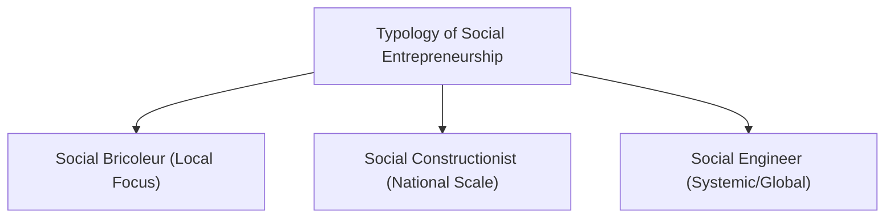

# MMPC 018: Entrepreneurship
## Block 4: Special Issues

---

## Unit 11: Social Entrepreneurship

### 1. Concept & Four Major Elements of Social Entrepreneurship
Social Entrepreneurship (SE) combines commercial entrepreneurship tools (opportunity identification, resource mobilization) to address social problems rather than maximize shareholder wealth. 
As defined by Portales (2019), the four major elements are:
1.  **Societal Mission:** Launching mission-driven organizations where income or a portion of it is dedicated to charitable/societal causes.
2.  **Motivation for Societal Change:** Driven by personal fulfillment, community welfare improvement, and the desire to inspire others.
3.  **Socio-Economic Value Creation:** Focuses on the "social value" of products/services rather than pure market value, aiming for sustainable wealth distribution.
4.  **Successful Implementation of Changes:** Involves both micro (individual/community level) and macro (systemic, societal level) changes.

---

### 2. Social vs. Corporate Entrepreneurship

| Feature | Social Entrepreneurship | Corporate (Commercial) Entrepreneurship |
| :--- | :--- | :--- |
| **Primary Goal** | Social value creation, solving societal issues. | Profit maximization, shareholder wealth, market share. |
| **Value Proposition** | Social mission-driven (e.g., poverty alleviation). | Market opportunity-driven (customer utility, financial gain). |
| **Profit Treatment** | Reinvested into the social cause or community. | Distributed to shareholders/investors. |
| **Success Metrics** | Social impact, depth of change, community welfare. | ROI, market share, profit margins, sales growth. |

---

### 3. Typology of Social Entrepreneurship (Smith & Stevens)

*   **Social Bricoleur:** Focuses on small-scale, localized social problems using whatever resources are at hand. Scalability is limited due to the local context.
    *   *Example:* A local self-help group recycling plastic waste into school benches in a single village.
*   **Social Constructionist:** Identifies opportunities to build solutions that address national/regional gaps. The business models are structured to be scaled across multiple locations.
    *   *Example:* **The Robin Hood Army** (volunteer organization collecting surplus food from local restaurants and distributing it to the poor across dozens of cities in India).
*   **Social Engineer:** Aims to disrupt and change systemic structures on a massive, global scale by replacing existing inefficient institutions with new business models.
    *   *Example:* **Grameen Bank** (Yunus' microcredit model, which completely revolutionized rural banking and financial inclusion worldwide).

---

### 4. Indian Scenario & Social Issue Resolution Example
*   **Issue:** Food waste in restaurants concurrent with severe urban hunger.
*   **Innovative Resolution Strategy:** Establish a volunteer-led, digital logistics model (similar to Robin Hood Army).
    *   *Mechanism:* A mobile app coordinates restaurant notifications (excess food alerts) and matches them to local community volunteers ("Robins").
    *   *Value Creation:* Minimizes capital outlay, uses zero external funding, relies on community trust, and ensures food is safely distributed within 2 hours.

---

## Unit 12: Rural Entrepreneurship

### 1. Concept & Forms of Rural Entrepreneurship
Rural Entrepreneurship refers to agricultural or non-agricultural commercial activities based in rural areas that add value to rural resources using local manpower. 
The four basic forms are:
1.  **Individual:** Single ownership of the enterprise; high risk-bearing by one person.
2.  **Group:** Partnership, private limited, or public limited structures in rural areas.
3.  **Cluster Formation:** Networking of NGOs, Voluntary Organizations (VOs), and Self-Help Groups (SHGs) to achieve economies of scale (e.g., traditional handloom clusters).
4.  **Cooperative:** Autonomous association of rural citizens voluntarily uniting for a common socio-economic goal (e.g., Amul dairy cooperative).

---

### 2. Women Empowerment & Challenges in Rural Setup
*   **Role in Empowerment:** Provides rural women with an independent income, improving their family decision-making power, health, and children's education.
*   **Key Challenges:**
    *   *Patriarchal Restrictions:* Social stratification, family discouragement, and mobility barriers.
    *   *Capital Deficit:* Unwillingness of banks to lend due to a lack of title deeds/collateral in women's names.
    *   *Skill & Literacy Gap:* Poor access to vocational training and technical know-how.
    *   *Market Exploitation:* High dependency on intermediaries who buy at depressed prices due to poor marketing skills.

### 3. Key Government Endeavors
*   **SVEP (Start-up Village Entrepreneurship Programme):** Sub-scheme of DAY-NRLM helping poor rural households establish non-agricultural ventures.
*   **RSETIs (Rural Self-Employment Training Institutes):** Institutions in rural districts providing free skill-development training for self-employment.

---

## Unit 13: Ethical Entrepreneurship

### Theories of Ethical Behavior
Ethical entrepreneurship applies moral principles to business conduct. The major theories governing ethical behavior are:
1.  **Deontological (Duty-Based) Ethics (Immanuel Kant):** Focuses on the morality of the action itself, regardless of the consequences. Entrepreneurs must scrupulously uphold moral duties (e.g., honesty, respect for employees) out of principle.
2.  **Teleological / Consequentialist Ethics:** The morality of an action is determined solely by its outcomes. A business decision is "right" if it yields a positive result.
3.  **Utilitarianism (Sub-type of Teleology):** Demands actions that maximize the greatest good/utility for the greatest number of people.
4.  **Virtue Ethics (Aristotle):** Concentrates on the moral character and personal traits of the individual (courage, temperance, justice) rather than a set of rules. Doing good stems from being a good person.
5.  **Rule-Based (Natural Liberty) Ethics (Adam Smith):** Argues that individuals acting in their economic self-interest in a free market naturally promotes societal welfare, provided basic fair-play laws are upheld.

---

## Unit 14: Cultural Governance and Family Business

### 1. Positive & Negative Sides of Family Businesses
Family businesses represent a major share of the Indian economy. They are unique because the business system directly overlaps with family emotions, relationships, and inheritance.

*   **Positive Side (Strengths):**
    *   *Long-term Horizon (Stewardship):* Owners view themselves as caretakers holding the business in trust for future generations.
    *   *Shared Values & Loyalty:* High trust among family members and dedicated employee bases.
    *   *Quick Decision Making:* Less bureaucratic red tape; swift alignment of goals.
*   **Negative Side (Weaknesses/Challenges):**
    *   *Nepotism:* Appointing family members to key roles regardless of competence (misplaced altruism), creating agency problems.
    *   *Succession Conflicts:* lack of transition planning between generations (leads to sibling rivalry and splits).
    *   *Role Confusion:* Inability to separate family issues from business operations.

---

### 2. Theories of Family Business
*   **Systems Theory (Multi-System model):** Examines the interaction of three overlapping subsystems: *Family*, *Ownership*, and *Management*.
*   **Stewardship Theory:** Posits that family owner-managers have collaborative relationships and goals that converge with the company's legacy.
*   **Agency Theory in Family Firms:** Addresses conflicts. Altruistic hiring can result in performance decay when unqualified family members occupy key roles.

---

### 3. Coping Strategies & Viability
To remain viable across generations, family businesses must implement the following:
1.  **Professionalization:** Hire external, qualified executives for key management roles and limit family members to board/ownership oversight.
2.  **Family Constitution:** Draft a formal written document outlining rules for family employment, dividends, and share distribution.
3.  **Family Council:** Establish a formal forum to discuss family-related disputes away from corporate boardrooms.
4.  **Structured Succession Plan:** Design a clear, transparent transition roadmap detailing when and how the next generation takes over leadership.
