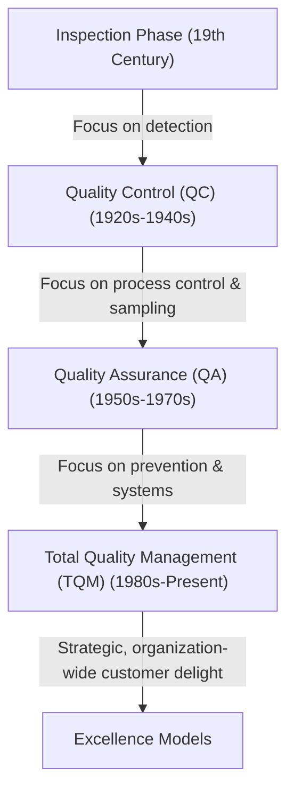
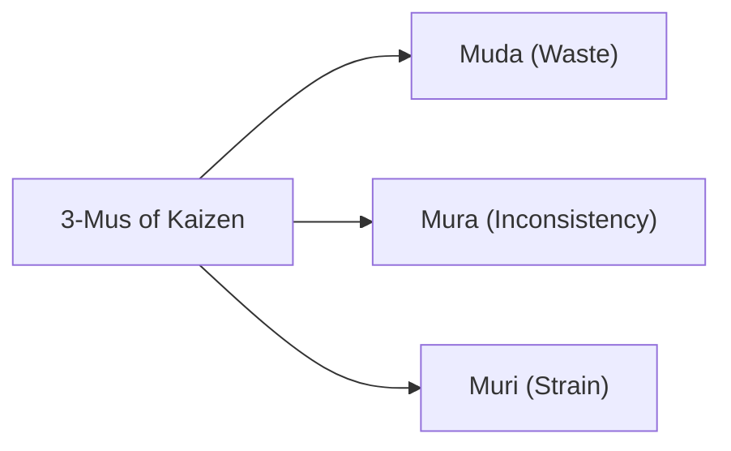

# Revision Notes: MMPC 019 — Block 1: TQM: An Overview (Hinglish Version)

Yeh block Total Quality Management (TQM) ke fundamental concepts, history, aur philosophies ko introduce karta hai. Isme bataya gaya hai ki kaise quality ek basic inspection se evolve hokar ek strategic business driver bani. Saath hi, leading quality gurus ke contributions aur TQM ke core building blocks ko bhi summarize kiya gaya hai.

---

## Unit 1: Basic Concepts and Methods

### 1. Evolution of Quality Management
Quality management ek raat me (overnight) develop nahi hua. Yeh chaar alag aur progressive phases ke through evolve hua hai:

*   **Inspection (Detection-Oriented):** Production ke baad "good" aur "bad" products ko alag-alag (sort) karna. Yeh ek reactive approach hai.
*   **Quality Control (QC - Process-Oriented):** Processes ko monitor karne aur deviations ko detect karne ke liye statistical techniques (jaise Walter Shewhart ke control charts) ka use karna.
*   **Quality Assurance (QA - Prevention-Oriented):** Systematic, pre-planned processes aur quality systems (jaise early standards) set up karna taaki yeh confidence mile ki requirements puri hongi.
*   **Total Quality Management (TQM - Strategy-Oriented):** Ek organization-wide philosophy jisme har ek employee, function, aur partner continuously improve karne aur customers ko delight karne me involved hota hai.

### 2. The Critical Importance of Quality
Aaj ke global aur competitive market me (including initiatives like *Make in India*), quality hi sabse bada differentiator hai.
*   **Survival (Astitva):** Ek seller's market (monopoly) me volume chalta hai. Lekin buyer's market (stiff competition) me sirf customer delight hi survival ensure kar sakta hai.
*   **Cost Control:** High quality se "cost of non-conformance" (scrap, rework, warranty claims) kam hoti hai, jisse profitability badhti hai.
*   **Customer Consciousness:** Customers ab sirf basic utility nahi chahte; unhe high-value aur trouble-free experiences chahiye.

### 3. Taylorism vs. Quality Evolution
**Scientific Management (Taylorism)**, jise Frederick Winslow Taylor ne introduce kiya tha, wo mass production, division of labor, aur output volume badhane par focus karta tha.
*   **Taylorism ne Quality ko side me kyu kar diya (Sidelined):**
    1.  **Separation of Planning and Execution:** Managers kaam plan karte the aur workers use mechanically perform karte the. Workers ke paas quality improve karne ke liye koi voice nahi thi.
    2.  **Focus on Speed and Volume:** Incentives piece-rate par milte the (per hour kitna production hua), jisse workers quality problems ko theek karne ke liye rukte nahi the.
    3.  **The "Inspector" Mentality:** Quality ko kisi aur ka kaam (inspector ka) samjha jata tha, operator ki responsibility nahi.
    4.  **Work Standardization vs. Process Improvement:** Taylorism ne movements ko rigid (standardized) bana diya, jabki quality evolution ke liye workers ko processes ko analyze aur continuously improve karna padta hai.

### 4. Standardisation (Mankikaran)
*   **Definition (ISO):** Standardisation rules ko formulate aur apply karne ka process hai, taaki kisi specific activity ko systematically kiya ja sake. Yeh sabhi concerned logo ke benefit aur cooperation ke liye hota hai, aur iska main goal optimum economy, safety aur functional conditions achieve karna hai.
*   **Standardisation Space (3D Concept):**
    Ek formal standard system teen dimensions (axes of reference) me operate karta hai:
    *   **X-axis (Subject):** Material, product, ya process (e.g., steel, software, agriculture).
    *   **Y-axis (Aspect):** Requirement ka type (e.g., terminology, testing method, safety specs).
    *   **Z-axis (Level):** Domain of applicability (e.g., Company, National [BIS], Regional [EN], International [ISO]).
*   **Standardisation ke Aims (Maksad):**
    *   *Overall Economy:* Materials aur human effort ko conserve karna, aur unnecessary variety ko reduce karna.
    *   *Convenience of Use:* Simplification, rationalization, aur parts ki interchangeability ensure karna.
    *   *Recurring Problems:* Science aur technology ke results ko use karke baar-baar hone wali problems ke best solutions banana.
    *   *Common Language:* Buyers aur sellers ke beech clear communication medium banana taaki disputes na ho.

### 5. TQM vs. Conventional Methods ke Underpinning Ideas

| Dimension | Conventional Quality Management | Total Quality Management (TQM) |
| :--- | :--- | :--- |
| **Primary Goal** | Specifications se conform karna (adequate quality). | Customer ko delight karne ke liye continuous improvement. |
| **Responsibility** | Quality Control (QC) department ko di jati hai. | Top management se lekar workers tak, har employee share karta hai. |
| **Approach** | Reactive (inspection, testing, fire-fighting). | Proactive (prevention, process control, system design). |
| **Supplier Relations** | Adversarial (short-term, lowest-bid contracting). | Partnering (long-term relationships, JIT integration). |
| **Orientation** | Product-focused (final output ko inspect karna). | System & Process-focused (workflow ko improve karna). |

---

## Unit 2: Quality Management: Leading Thinkers

### 1. The Crosby School
Philip Crosby ka kaam corporate pragmatism par focused hai. Unka famous slogan hai **"Quality is Free"** kyuki prevention ki cost hamesha mistake theek karne ki cost se kam hoti hai.

*   **Four Absolutes of Quality Management:**
    1.  *Definition:* Quality ka matlab hai conformance to requirements (na ki "goodness" ya "luxury").
    2.  *System:* Quality ka system prevention hai (inspection ya appraisal nahi).
    3.  *Performance Standard:* Standard hamesha "Zero Defects" hona chahiye (na ki "close enough" ya AQL).
    4.  *Measurement:* Quality ko Price of Non-Conformance (PONC) se measure kiya jata hai, indexes se nahi.
*   **"Problem Organization" ke Paanch Symptoms:**
    1.  Outgoing product ya service routinely requirements se deviate karta hai.
    2.  Company ke paas problems theek karne ke liye bada field service ya rework network hota hai.
    3.  Management ke paas quality ki koi clear definition nahi hoti.
    4.  Management ko run-time failures ki actual cost pata nahi hoti.
    5.  Management yeh manne se inkar karta hai ki problem unki wajah se hai.
*   **Crosby’s Quality Management Maturity Grid:**
    Yeh ek 5-stage evolutionary grid hai (Uncertainty $\rightarrow$ Awakening $\rightarrow$ Enlightenment $\rightarrow$ Wisdom $\rightarrow$ Certainty) jisse managers assess karte hain ki unki organization quality management, problem handling, aur cost of quality me kahan stand karti hai.

### 2. Leading Thinkers ka Comparison (Crosby, Deming, Juran)

| Guru | Core Philosophy | Performance Standard | Key Tool/Concept |
| :--- | :--- | :--- | :--- |
| **Philip Crosby** | Conformance to requirements; quality ek management attitude hai. | Zero Defects | 14-Step Improvement Program; Price of Non-Conformance (PONC). |
| **W. Edwards Deming** | System optimization; statistical methods se variation kam karna. | Continuous improvement; low variation | 14 Points for Management; PDCA Cycle; System of Profound Knowledge. |
| **Joseph M. Juran** | "Fitness for use"; quality structured aur project-driven hoti hai. | Avoid failure; meet customer needs | The Quality Trilogy (Planning, Control, Improvement). |

### 3. Other Influential Thinkers
*   **Armand Feigenbaum:** Inhone **Total Quality Control (TQC)** ka concept diya, jisme quality ko pure value chain (marketing, engineering, manufacturing) me manage kiya jata hai, na ki sirf shop floor par.
*   **Kaoru Ishikawa:** Japanese quality ke pioneer. Inhone **Cause-and-Effect Diagram (Fishbone/Ishikawa diagram)** banaya aur **Quality Circles** (workers ke volunteer groups jo problems solve karte hain) ko champion kiya.
*   **Genichi Taguchi:** Inhone **Loss Function** ka concept diya, jo kehta hai ki target value se koi bhi deviation society ko cost deti hai, bhale hi wo tolerance limits ke andar ho. Inhone robust design (Parameter Design) ko support kiya.

---

## Unit 3: Building Blocks of TQM

### 1. Core Values aur Top Management ka Role
TQM top management ke active aur hands-on leadership ke bina succeed nahi ho sakta.
*   **Top Management ka Role:** Quality Policy banana, organizational vision set karna, steering committees banana, resources allocate karna, aur active commitment show karna.
*   **Core Values (Moolya):** Customer focus, continuous learning, employee empowerment, data-based decision-making, aur suppliers ke sath long-term partnership (jaise low-bid contracts ki jagah JIT/Keiretsu-style partnerships).

### 2. Kaizen aur "3-Mus" Checkpoints
**Kaizen** ka matlab hai continuous, incremental improvement jisme sabhi log involved hote hain. Kaizen me waste reduction ko **3-Mus** analyze karke kiya jata hai:

1.  **Muda (Waste/Kachra):** Aise activities jo resources consume karti hain par koi value add nahi karti (e.g., jyada inventory, waiting time, defective parts, unnecessary movement).
2.  **Mura (Inconsistency/Unevenness):** Demand, scheduling ya work speed me utaar-chadhaw (e.g., machine ko Monday ko 150% capacity par chalana aur Tuesday ko 40% par, jisse breakdown ka khatra badhta hai).
3.  **Muri (Strain/Overburden):** Personnel ya equipment ko unki design limit se jyada push karna (e.g., employees ko bahut jyada weight uthane ko bolna ya motor ko continuously max speed par chalana, jisse accidents ho sakein).

### 3. Continuous TQM Improvement ko Guarantee Karna
Organization continuous improvement ko daily work me feedback loops integrate karke guarantee karti hai:
*   **PDCA Cycle (Plan-Do-Check-Act):** Improvements ko test aur implement karne ka ek circular methodology.
*   **Employee Participation:** Workers ko suggestions dene ke liye encourage karna aur unhe authority dena ki agar defect dikhe to production line rok sakein.
*   **Continuing Education:** workforce ko statistical tools, problem-solving, aur team-building me regular training dena taaki unki skills technology ke sath update rahein.

### 4. Brainstorming: Ek Problem-Solving Tool
*   **Concept:** Ek structured ya unstructured technique jise group use karta hai taaki kam time me bade volume me creative ideas generate kiye ja sakein.
*   **Brainstorming ke Rules:**
    1.  *No Criticism:* Session ke dauran ideas ko evaluate ya judge nahi kiya jata.
    2.  *Freewheeling Welcome:* Wild aur unconventional ideas ko encourage kiya jata hai.
    3.  *Quantity Over Quality:* Jyada se jyada ideas generate karne ka target hota hai.
    4.  *Piggybacking:* Participants dusro ke ideas par build-on ya combine kar sakte hain.
*   **TQM Relevance:** Quality Circles aur problem-solving teams iska use karti hain root causes ko identify karne ke liye, isse pehle ki Cause-and-Effect diagrams apply kiye jayein.
