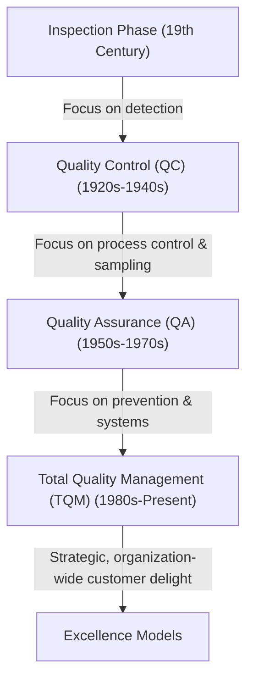
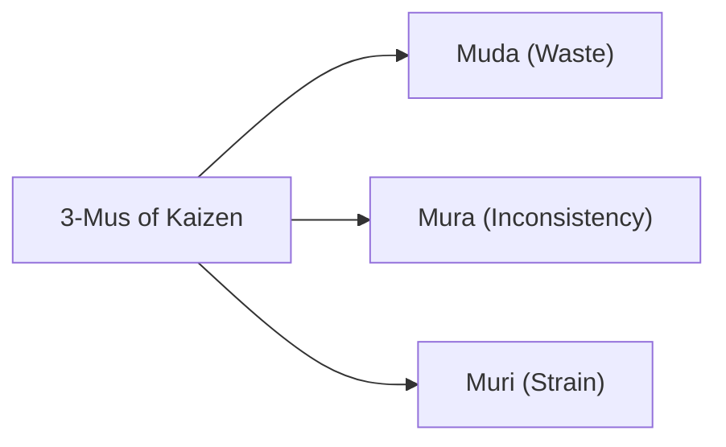

# Revision Notes: MMPC 019 — Block 1: TQM: An Overview

This block introduces the fundamental concepts, history, and philosophies of Total Quality Management (TQM). It outlines how quality evolved from basic inspection to a strategic business driver, summarizes the contributions of leading quality gurus, and defines the core building blocks of TQM.

---

## Unit 1: Basic Concepts and Methods

### 1. Evolution of Quality Management
Quality management did not emerge overnight. It has evolved through four distinct, progressive phases:

*   **Inspection (Detection-Oriented):** Sorting the "good" from the "bad" after production. A reactive approach.
*   **Quality Control (QC - Process-Oriented):** Using statistical techniques (like control charts by Walter Shewhart) to monitor processes and detect deviations.
*   **Quality Assurance (QA - Prevention-Oriented):** Setting up systematic, pre-planned processes and quality systems (e.g., early standards) to build confidence that requirements will be met.
*   **Total Quality Management (TQM - Strategy-Oriented):** An organization-wide philosophy involving every employee, function, and partner to continuously improve and delight customers.

### 2. The Critical Importance of Quality
In a globally integrated, competitive marketplace (including initiatives like *Make in India*), quality is the ultimate differentiator.
*   **Survival:** In a seller’s market (monopoly), volume rules. In a buyer's market (intense competition), only customer delight ensures survival.
*   **Cost Control:** High quality reduces the "cost of non-conformance" (scrap, rework, warranty claims), thereby increasing profitability.
*   **Customer Consciousness:** Customers now expect more than basic utility; they demand high-value, trouble-free experiences.

### 3. Taylorism vs. Quality Evolution
**Scientific Management (Taylorism)**, introduced by Frederick Winslow Taylor, focused heavily on mass production, division of labor, and maximizing output volume.
*   **Why Taylorism Sidelined Quality:**
    1.  **Separation of Planning and Execution:** Managers planned work; workers executed it mechanically. Workers had no voice in improving quality.
    2.  **Focus on Speed and Volume:** Incentives were based on pieces produced per hour, discouraging workers from pausing to fix quality issues.
    3.  **The "Inspector" Mentality:** Quality was treated as someone else's job (the inspector's), rather than the operator's responsibility.
    4.  **Work Standardization vs. Process Improvement:** Taylorism standardized movements to make them rigid, whereas quality evolution requires workers to continuously analyze and improve processes.

### 4. Standardisation
*   **Definition (ISO):** Standardisation is the process of formulating and applying rules for an orderly approach to a specific activity, for the benefit and with the cooperation of all concerned, and in particular for the promotion of optimum overall economy, functional conditions, and safety.
*   **The "Standardisation Space" (3D Concept):**
    A formal standard system operates within a three-dimensional reference space:
    *   **X-axis (Subject):** The material, product, or process (e.g., steel, software, agriculture).
    *   **Y-axis (Aspect):** The type of requirement (e.g., terminology, testing method, safety specs).
    *   **Z-axis (Level):** The domain of applicability (e.g., Company, National [BIS], Regional [EN], International [ISO]).
*   **Aims of Standardisation:**
    *   *Overall Economy:* Conserving materials, human effort, and reducing unnecessary varieties.
    *   *Convenience of Use:* Rationalization, simplification, and interchangeability of parts.
    *   *Recurring Problems:* Adopting proven solutions to recurring issues using updated science.
    *   *Common Language:* Providing a clear medium of communication between buyers and sellers to eliminate disputes.

### 5. Underpinning Ideas of TQM vs. Conventional Methods
TQM represents a paradigm shift from conventional quality approaches:

| Dimension | Conventional Quality Management | Total Quality Management (TQM) |
| :--- | :--- | :--- |
| **Primary Goal** | Conform to specifications (adequate quality). | Continuous improvement to delight the customer. |
| **Responsibility** | Assigned to the Quality Control (QC) department. | Shared by every employee, from top management to workers. |
| **Approach** | Reactive (inspection, testing, fire-fighting). | Proactive (prevention, process control, system design). |
| **Supplier Relations** | Adversarial (short-term, lowest-bid contracting). | Partnering (long-term relationships, JIT integration). |
| **Orientation** | Product-focused (inspecting the final output). | System & Process-focused (improving the workflow). |

---

## Unit 2: Quality Management: Leading Thinkers

### 1. The Crosby School
Philip Crosby’s work focuses on corporate pragmatism, famously stating that **"Quality is Free"** because the cost of prevention is always lower than the cost of mistakes.

*   **Four Absolutes of Quality Management:**
    1.  *Definition:* Quality is conformance to requirements (not "goodness" or "luxury").
    2.  *System:* The system for causing quality is prevention (not appraisal/inspection).
    3.  *Performance Standard:* The standard is Zero Defects (not "close enough" or AQL).
    4.  *Measurement:* The measurement of quality is the Price of Non-Conformance (PONC), not indices.
*   **Five Symptoms of a "Problem Organization":**
    1.  The outgoing product or service routinely deviates from requirements.
    2.  The company has an extensive field service or rework network to fix problems.
    3.  Management does not provide a clear definition of quality.
    4.  Management does not know the actual cost of run-time failures.
    5.  Management denies they are the cause of the problem.
*   **Crosby’s Quality Management Maturity Grid:**
    A 5-stage evolutionary grid (Uncertainty $\rightarrow$ Awakening $\rightarrow$ Enlightenment $\rightarrow$ Wisdom $\rightarrow$ Certainty) used by managers to assess where their organization stands across categories like management understanding, problem handling, and cost of quality.

### 2. Comparison of Leading Thinkers (Crosby, Deming, Juran)

| Guru | Core Philosophy | Performance Standard | Key Tool/Concept |
| :--- | :--- | :--- | :--- |
| **Philip Crosby** | Conformance to requirements; quality is a management attitude. | Zero Defects | 14-Step Improvement Program; Price of Non-Conformance (PONC). |
| **W. Edwards Deming** | System optimization; reducing variation via statistical methods. | Continuous improvement; low variation | 14 Points for Management; PDCA Cycle; System of Profound Knowledge. |
| **Joseph M. Juran** | "Fitness for use"; quality is structured and project-driven. | Avoid failure; meet customer needs | The Quality Trilogy (Planning, Control, Improvement). |

### 3. Other Influential Thinkers
*   **Armand Feigenbaum:** Originated **Total Quality Control (TQC)**, emphasizing that quality must be managed across the entire value chain (marketing, engineering, manufacturing) rather than just on the shop floor.
*   **Kaoru Ishikawa:** Pioneer of Japanese quality. Created the **Cause-and-Effect Diagram (Fishbone/Ishikawa diagram)** and championed **Quality Circles** (small groups of workers voluntarily solving shop-floor problems).
*   **Genichi Taguchi:** Introduced the **Loss Function**, which argues that any deviation from the target value imparts a cost to society, even if it falls within tolerance limits. Championed robust design (Parameter Design).

---

## Unit 3: Building Blocks of TQM

### 1. Core Values and the Role of Top Management
TQM cannot succeed without active, hands-on leadership from the top.
*   **Top Management Role:** Formulating the Quality Policy, setting organizational vision, establishing steering committees, allocating resources, and demonstrating active commitment.
*   **Core Values:** Focus on the customer, continuous learning, employee empowerment, data-based decision-making, and long-term partnership with suppliers (e.g., moving away from low-bid contracts to JIT/Keiretsu-style partnerships).

### 2. Kaizen and the "3-Mus" Checkpoints
**Kaizen** stands for continuous, incremental improvement involving everyone. In Kaizen, waste reduction is guided by analyzing the **3-Mus**:

1.  **Muda (Waste):** Activities that consume resources but add no value. (e.g., excessive inventory, waiting times, defective parts, unnecessary movement).
2.  **Mura (Inconsistency/Unevenness):** Fluctuations in demand, scheduling, or work speed. (e.g., running a machine at 150% capacity on Monday and 40% on Tuesday, which causes wear and tear).
3.  **Muri (Strain/Overburden):** Pushing personnel or equipment beyond their design limits. (e.g., asking employees to lift too much weight or running a motor at maximum speed continuously, leading to breakdowns and accidents).

### 3. Guaranteeing Continuous TQM Improvement
An organization guarantees continuous improvement by integrating feedback loops into daily work:
*   **PDCA Cycle (Plan-Do-Check-Act):** A circular methodology for testing and implementing improvements.
*   **Employee Participation:** Encouraging workers to submit suggestions and giving them the authority to stop production lines when defects are spotted.
*   **Continuing Education:** Offering regular training in statistical tools, problem-solving, and team-building to ensure skills keep pace with changing technologies.

### 4. Brainstorming: A Problem-Solving Tool
*   **Concept:** A structured or unstructured technique used by a group to generate a large volume of creative ideas in a short time.
*   **Rules of Brainstorming:**
    1.  *No Criticism:* Ideas are not evaluated or judged during the session.
    2.  *Freewheeling Welcome:* Wild, unconventional ideas are encouraged.
    3.  *Quantity Over Quality:* The goal is to generate as many ideas as possible.
    4.  *Piggybacking:* Participants are encouraged to build upon or combine others' ideas.
*   **TQM Relevance:** Used in Quality Circles and problem-solving teams to identify potential root causes before applying tools like Cause-and-Effect diagrams.
