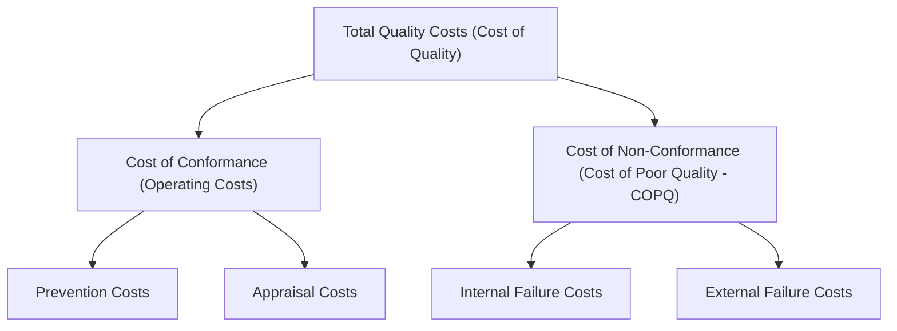
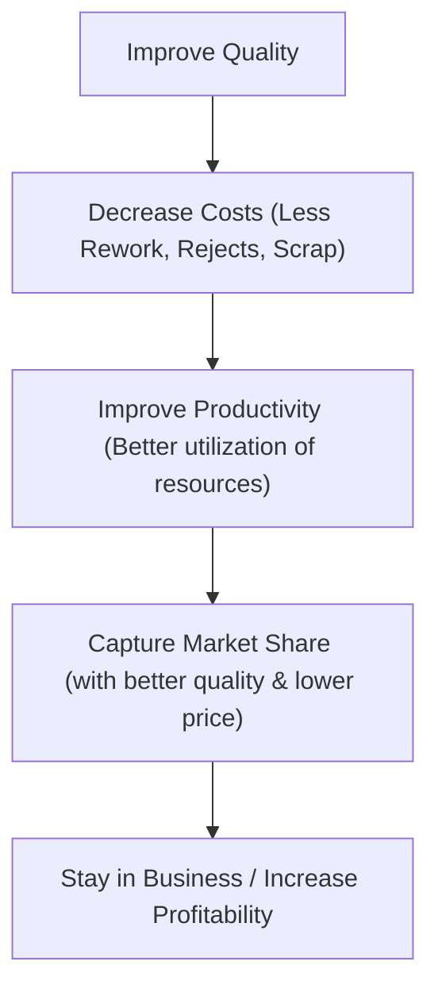
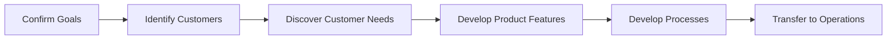
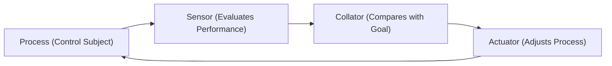

# Revision Notes: MMPC 019 — Block 2: Strategic Perspectives (Hinglish Version)

Yeh block TQM ko ek strategic standpoint se examine karta hai. Isme quality ke financial aspects (Economics of Quality), quality ko corporate strategy me integrate karne ke tarike, aur Quality-Centered Strategic Planning ke processes ko detail me bataya gaya hai.

---

## Unit 4: Economics of Quality

### 1. Quality-Related Costs ka Classification
Quality costs ka matlab hai wo total money jo customer requirements ko meet karne ke liye kharch kiya jata hai, plus wo loss jo requirements meet na karne (failure) ki wajah se hota hai. Inhe **PAF Model** (Prevention, Appraisal, Failure) ke through categorize kiya jata hai:

#### A. Cost of Conformance (Quality me Investment)
*   **Prevention Costs (Rokthaam ki Cost):** Defects ko pehli baar me hi rokne ke liye jo kharcha hota hai.
    *   *Examples:* Quality planning, design reviews, quality training, preventive maintenance, vendor quality surveys, calibration.
*   **Appraisal Costs (Mulyankan ki Cost):** Product ya service quality standards ke mutabik hai ya nahi, yeh check/measure karne ka kharcha.
    *   *Examples:* Incoming raw materials ko inspect karna, laboratory testing, final inspection, product audits, test equipment depreciation.

#### B. Cost of Non-Conformance (Cost of Poor Quality - COPQ)
*   **Internal Failure Costs (Anderuni Failure ki Cost):** Product/service ko customer tak deliver karne se pehle hone wale losses aur failure costs.
    *   *Examples:* Scrap, rework, repair, defects ki wajah se downtime hona, troubleshooting, re-inspection.
*   **External Failure Costs (Baahri Failure ki Cost):** Product/service customer tak deliver hone ke baad jo defects detect hote hain, unki cost.
    *   *Examples:* Warranty claims, customer returns, concessions, recalls, legal liabilities, lost sales (indirect), customer goodwill ka loss.

> [!TIP]
> **The 1-10-100 Rule:** Quality economics ka ek basic principle hai. 1 rupee *Prevention* par lagaya gaya, 10 rupees *Appraisal* aur 100 rupees *Failure* costs ko bacha sakta hai.

### 2. Quality Costs ke Approaches

#### A. Cost-Benefit Analysis Approach (Juran)
*   Yeh assume karta hai ki quality me har improvement ke liye financial outlay (conformance costs) ki jarurat hoti hai.
*   Inhone ek **Optimum Quality Cost Model** propose kiya: Prevention aur appraisal me investment sirf tab tak hona chahiye jab tak aur improvement karne ki cost, failure cost ke reduction se kam ho.

#### B. Deming-Kaizen Approach (Continuous Improvement)
*   Yeh Juran ke classical optimum model ko reject karta hai.
*   Yeh kehta hai ki jaise-jaise quality badhti hai, overall costs kam hoti hain kyuki waste, scrap, aur rework khatam hote hain, jisse capacity free hoti hai (jise "hidden plant" kehte hain).
*   Kaizen normal day-to-day shop-floor work me hi improvements integrate karta hai, jisme bade capital outlays ki jarurat nahi hoti.

#### C. Crosby's "Quality is Free" Approach
*   Yeh manta hai ki quality ka matlab hai conformance to requirements.
*   Agar product ko pehli baar me hi sahi banaya jaye to scrap, rework, aur warranty claims se bacha ja sakta hai, jisse quality khud apni cost pay karti hai. "Price of Non-Conformance" (PONC) hi asli waste hai.

#### D. Taguchi’s Loss Function Approach
*   Yeh kehta hai ki target performance se thoda sa bhi deviation (bhale hi wo tolerance limits ke andar ho) society ko loss deta hai.
*   Target value ke around variation ko minimize karna specification limits ke andar rehne se kahi jyada economical hai.

### 3. Life Cycle Costing (Cradle to Grave)
*   **Definition:** Life cycle cost me product ki puri lifespan ka kharcha include hota hai, jisme producer ki cost (R&D, manufacturing) aur customer ki cost (acquisition, operating, maintenance, downtime, disposal) dono aate hain.
*   **Significance:** Shuruat me high quality (producer cost) hone se customer ki maintenance aur operating costs life cycle me bahut kam ho jati hain, jisse customer retention aur brand loyalty milti hai.

---

## Unit 5: TQM and Business Strategy

### 1. Corporate Strategy Formulation me TQM ka Role
Corporate strategy ke do main phases hote hain: *Formulation* (vision/mission aur options define karna) aur *Implementation* (operations aur short-term plans execution).
*   TQM dono phases ko connect karta hai. Quality ko sirf operations (implementation) tak limit rakhne ke bajay core mission statement (formulation) me jagah di jati hai.
*   **Quality as a Strategic Choice:** Organizations quality ko strategically use karti hain (e.g., Apple ki differentiation strategy vs. low-cost imitators).

### 2. Quality-Profitability Chain Reaction (Deming)
Quality badhane se profitability aur market share kaise badhte hain, isko Deming ne is chain reaction ke through bataya hai:

### 3. TQM, Customer Value, aur Innovation
*   **Customer Value Strategy:** TQM competitors se jyada *Customer Value* ko priority deta hai. Competitors par focus karne se sirf imitation (follower mentality) hoti hai. Customer expectations par focus karne se *innovation* (market leader) hota hai.
*   **TQM and Innovation:** Cross-functional teams, fear-free environment (Deming's point), aur customer ke implied needs par focus karne se TQM ek creative environment banata hai jisme innovations badhti hain.
*   **TQM Stakeholder Shift:** Adversarial relationships (low-bid, short-term contracting) ki jagah cooperative partnerships (Keiretsu, vendor certification, Just-In-Time delivery systems) par shift hona.

---

## Unit 6: Quality Centred Strategic Planning

### 1. Quality-Centered Strategic Planning ka Concept
*   **Definition:** Quality objectives (e.g., zero defect capability, customer delight) ko organization ke long-term business goals ke sath systematically integrate karna.
*   **Top Management Responsibility:** Dr. Deming kehte hain ki **85% defects** faulty management systems ki wajah se hote hain, jabki workers sirf **15%** ke liye responsible hain. Isliye top management ko quality planning lead karni chahiye.
*   **Top Management Action Checklist:**
    1.  *Quality Council banana:* Corporate quality initiatives ko direct aur coordinate karna.
    2.  *Council me Serve karna:* Top-level commitment show karta hai.
    3.  *Quality Policies banana:* Lower-level managers ke liye guidelines set karna.
    4.  *Quality Goals deploy karna:* Quantifiable objectives ko niche deploy karna.
    5.  *Progress review karna:* Process performance aur results ko regularly audit karna.

### 2. Strategic Quality Management (SQM)
SQM business planning me quality planning ko add karne ka extension hai. Yeh **Quality Planning Road Map** ke through chalta hai:

#### Road Map ke Application Levels:
1.  **Supervisory Level:** Isme *Self-Control* (employees ko clear goals, feedback, aur control tools dena) aur *Triple Role Concept* (har employee ko ek customer, processor, aur supplier banana) use hota hai.
2.  **Functional Level:** Specific departments ke andar quality systems design karna (e.g., marketing quality specs, HR training quality).
3.  **Multifunctional Systems:** Cross-functional processes (e.g., New Product Development) ke liye project teams ke through central planning karna.
4.  **Major Programmes:** Complex aur high-risk contracts ke liye matrix organization aur intensive documentation create karna.

### 3. Strategic Quality Control ki Planning
Quality control ensure karta hai ki organization track par rahe. Yeh ek **Closed Feedback Loop** ke through hota hai:

*   **Process Adjustments:** Agar actual performance aur goal me gap hai, to actuator process ko adjust karta hai (ya, agar environment change ho jaye to goal ko modify kiya jata hai).
*   **Improvement ke Do Tarike:**
    *   *Defect-Free Focus:* Incremental process adjustments (variance ko kam karna).
    *   *Breakthrough Focus:* Product features ko redesign karna taaki customer satisfaction me bada jump mile.
