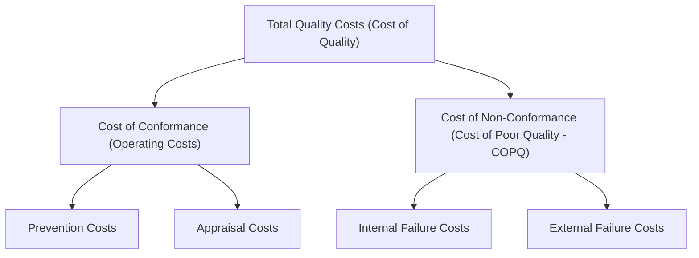
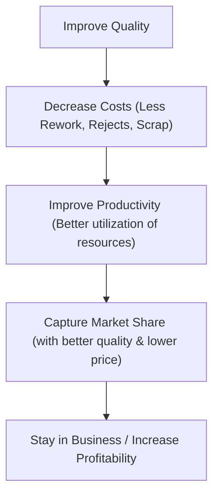
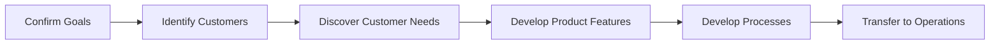
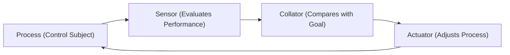

# Revision Notes: MMPC 019 — Block 2: Strategic Perspectives

This block examines TQM from a strategic standpoint. It details the financial underpinnings (Economics of Quality), explores the integration of quality into corporate strategy, and outlines the processes involved in Quality-Centered Strategic Planning.

---

## Unit 4: Economics of Quality

### 1. Classification of Quality-Related Costs
Quality costs are the sum of money spent on ensuring customer requirements are met, combined with the costs incurred through failing to achieve those requirements. They are categorized using the **PAF Model** (Prevention, Appraisal, Failure):

#### A. Cost of Conformance (Investment in Quality)
*   **Prevention Costs:** Expenses incurred to prevent defects from occurring in the first place.
    *   *Examples:* Quality planning, design reviews, quality training, preventive maintenance, vendor quality surveys, calibration.
*   **Appraisal Costs:** Expenses incurred in assessing/measuring product or service compliance with quality standards.
    *   *Examples:* Inspecting incoming raw materials, laboratory acceptance testing, final inspection, product audits, equipment depreciation.

#### B. Cost of Non-Conformance (Cost of Poor Quality - COPQ)
*   **Internal Failure Costs:** Costs arising from product/service failures prior to delivery or transfer of ownership.
    *   *Examples:* Scrap, rework, repair, downtime due to defects, troubleshooting, re-inspection.
*   **External Failure Costs:** Costs arising from failures detected after the product/service is delivered to the customer.
    *   *Examples:* Warranty claims, customer returns, concessions, recalls, legal liabilities, lost sales (indirect), loss of customer goodwill.

> [!TIP]
> **The 1-10-100 Rule:** A fundamental principle of quality economics. 1 rupee spent on *Prevention* will save 10 rupees on *Appraisal* and 100 rupees on *Failure* costs.

### 2. Approaches to Quality Costs

#### A. Cost-Benefit Analysis Approach (Juran)
*   Assumes every improvement in quality requires a financial outlay (higher conformance costs).
*   Proposes an **Optimum Quality Cost Model**: Investment in prevention and appraisal should continue only up to the point where the cost of further improvement exceeds the savings from reduced failure costs.

#### B. The Deming-Kaizen Approach (Continuous Improvement)
*   Rejects Juran's classical optimum model.
*   Argues that as quality increases, overall costs decrease because waste, scrap, and rework are eliminated, freeing up capacity (the "hidden plant").
*   Kaizen integrates improvement into daily, routine shop-floor work without requiring heavy capital outlays.

#### C. Crosby's "Quality is Free" Approach
*   Proposes that quality means conformance to requirements.
*   Since making a product right the first time avoids scrap, rework, and warranty claims, quality pays for itself. The "Price of Non-Conformance" (PONC) represents the real waste.

#### D. Taguchi’s Loss Function Approach
*   Argues that any deviation from the exact target value (even if it falls within the acceptable tolerance range) causes a loss to society.
*   Proposes that minimizing variation around the target value is far more economical than just staying within tolerances.

### 3. Life Cycle Costing (Cradle to Grave)
*   **Definition:** Life cycle cost includes all costs incurred throughout the entire lifespan of a product, covering both producer-incurred costs (R&D, manufacturing) and customer-incurred costs (acquisition, operating, maintenance, downtime, disposal).
*   **Significance:** Higher initial quality (producer cost) dramatically reduces the customer's maintenance and operating costs over the life cycle, leading to customer retention and brand equity.

---

## Unit 5: TQM and Business Strategy

### 1. Role of TQM in Corporate Strategy Formulation
Corporate strategy consists of two major phases: *Formulation* (defining vision/mission and options) and *Implementation* (operations and short-term plans).
*   TQM bridges both phases. Rather than being confined to operations (implementation), quality is elevated to a core mission statement (formulation).
*   **Quality as a Strategic Choice:** Organizations use quality to position themselves strategically (e.g., Apple's differentiation strategy vs. low-cost copycats).

### 2. The Quality-Profitability Chain Reaction (Deming)
How quality enhancement drives profitability and market share is demonstrated by Deming's famous chain reaction:

### 3. TQM, Customer Value, and Innovation
*   **Customer Value Strategy:** TQM prioritizes *Customer Value* over competitor analysis. A preoccupation with competitors leads to imitation (follower mentality). Focusing on customer expectations leads to *innovation* (market leader).
*   **TQM and Innovation:** By encouraging cross-functional teams, removing fear (Deming's point), and focusing on implied needs, TQM establishes a creative organizational environment where process and product innovations thrive.
*   **TQM Stakeholder Shift:** TQM requires moving from adversarial relationships (low-bid, short-term contracting, bargaining power) to collaborative partnerships (Keiretsu, vendor certification, Joint-In-Time delivery systems).

---

## Unit 6: Quality Centred Strategic Planning

### 1. Concept of Quality-Centered Strategic Planning
*   **Definition:** The systematic integration of quality objectives (e.g., zero defect capability, customer delight) with the long-term business goals of the organization.
*   **Top Management Responsibility:** Dr. Deming notes that **85% of defects** are caused by faulty management systems, while workers are only responsible for **15%**. Therefore, top management must lead quality planning.
*   **Top Management Action Checklist:**
    1.  *Establish a Quality Council:* Direct and coordinate corporate quality initiatives.
    2.  *Serve on the Council:* Sends a signal of top-level commitment.
    3.  *Formulate Quality Policies:* Define guidelines for lower-level action.
    4.  *Deploy Quality Goals:* Allocate quantifiable objectives down the hierarchy.
    5.  *Review Progress:* Regularly audit process performance and results.

### 2. Strategic Quality Management (SQM)
SQM is the extension of business planning to include quality planning. It operates through the **Quality Planning Road Map**:

#### Application Levels of the Road Map:
1.  **Supervisory Level:** Employs *Self-Control* (providing employees with clear goals, results feedback, and regulatory means) and *Triple Role Concept* (treating every employee as a customer, processor, and supplier).
2.  **Functional Level:** Designing quality systems within specific departments (e.g., marketing quality specs, HR training quality).
3.  **Multifunctional Systems:** Central planning for cross-functional processes (e.g., New Product Development) using project teams.
4.  **Major Programmes:** Creating matrices and intensive documentation to assure quality for large-scale, high-risk contracts.

### 3. Planning for Strategic Quality Control
Quality control ensures the organization remains on track. It is executed via a **Closed Feedback Loop**:

*   **Process Adjustments:** If a gap exists between actual performance and the goal, the actuator adjusts the process (or, in rare cases, modifies the goal if environmental variables have shifted).
*   **Two Forms of Improvement:**
    *   *Defect-Free Focus:* Incremental process adjustments (reducing variance).
    *   *Breakthrough Focus:* Redesigning product features to step change customer satisfaction.
