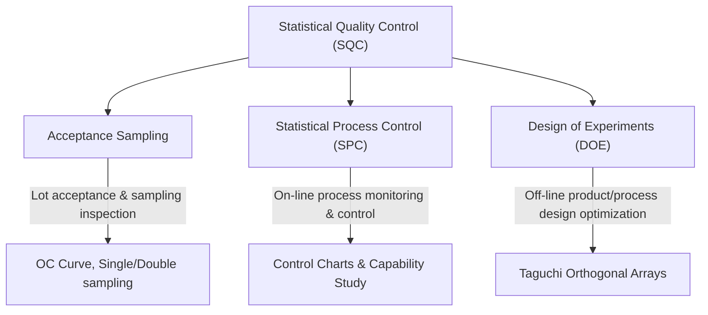
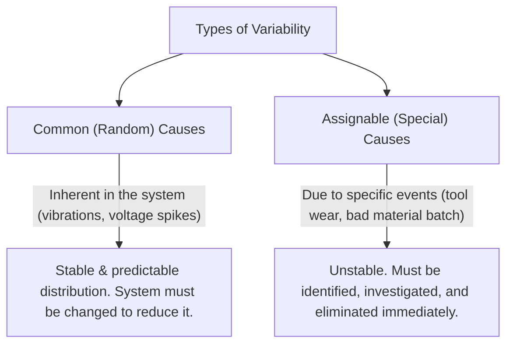
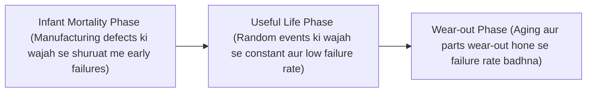

# Revision Notes: MMPC 019 — Block 3: Tools and Techniques (Hinglish Version)

Yeh block TQM implement karne ke liye mathematical, analytical, aur process-improvement frameworks ko cover karta hai. Isme Statistical Quality Control (SQC), process capability, 7 QC tools, aur specialized TQM methodologies jaise Benchmarking, QFD, BPR, 5S, Zero Defects, aur Taguchi Methods ke baare me bataya gaya hai.

---

## Unit 7: Statistical Quality Control

### 1. Statistical Quality Control (SQC) ka Rationale
*   **Strategy for Variation Reduction:** Processes me materials, operators, machines, aur environment ki wajah se fluctuations (variation) aana normal hai. SQC statistical methods ko use karke is variation ko analyze karta hai aur process ko stabilize karta hai.
*   **SQC ke Teen Core Methodologies:**



### 2. Process Capability
*   **Definition:** Statistical control me chal rahe ek stable process ki natural variation ki range ko Process Capability kehte hain.
*   **Natural Variation vs. Specifications:** 
    *   *Natural Variation (Process Spread):* Individual measurements ka $6\sigma$ (six standard deviations) range.
    *   *Specification Limits:* Designers dwara set ki gayi tolerance limits (Upper Spec Limit - USL, Lower Spec Limit - LSL).
    *   *Capable Process:* Ek process ko capable tabhi mana jata hai jab uska kam se kam **99.73%** output specification limits ke andar ho (yani process spread $6\sigma$, specification range $\text{USL} - \text{LSL}$ se narrow ho).



*   **Control Limits $\neq$ Specification Limits kyu hote hain:**
    > [!WARNING]
    > Control limits (UCL/LCL) **subgroup averages** ke distribution par calculate hote hain (stability check karne ke liye). Specification limits (USL/LSL) **individual items** par apply hote hain (capability check karne ke liye). Central Limit Theorem ke mutabik, averages me variation individual parts se bahut kam hota hai. Isliye control limits ko directly spec limits se compare karna ek badi mistake hai.
*   **Capability Studies vs. Performance Studies:**
    *   *Capability Study:* Jab process statistical control me ho tab uski inherent variation measure karta hai (normal distribution assume karta hai).
    *   *Performance Study:* One-time runs ya incoming vendor lots ko evaluate karta hai. Yeh distribution ki shape ko analyze karne ke liye hota hai taaki pata chale ki vendor ne bad parts ko sort out (truncate) to nahi kiya hai.

### 3. Seven Quality Control (7 QC) Tools
Kaoru Ishikawa dwara introduce kiye gaye yeh simple statistical tools shop floor par data-based troubleshooting ke liye use kiye jaate hain:

1.  **Flowchart:** Process ke steps ko sequence me dikhata hai. BPR me iska use control points identify karne aur ideal vs. actual process compare karne ke liye hota hai.
2.  **Histogram:** Variable quantities ka frequency distribution dikhane wala bar chart hai. Yeh process capability aur skewness ko check karne ke liye hota hai.
3.  **Pareto Chart:** Problems ko unke frequency/cost ke descending order me arrange karta hai. Yeh "vital few" (80% problems) aur "trivial many" (20% problems) ke beech ka difference dikhata hai.
4.  **Cause-and-Effect Diagram (Fishbone/Ishikawa):** Ek quality defect (effect) aur uske potential root causes (categorized under Man, Machine, Material, Method, Measurement, Environment) ke beech ka relation dikhata hai.
5.  **Scatter Diagram:** Do variables ke beech ke correlation/relationship ko check karta hai (e.g., temperature vs. defect rate).
6.  **Run Chart:** Data points ko time sequence me plot karta hai taaki trends aur patterns ko analyze kiya ja sake.
7.  **Control Chart:** Ek run chart jisme statistically calculated Upper Control Limit (UCL) aur Lower Control Limit (LCL) hote hain, jisse special causes ka pata chalta hai.

### 4. Control Charts: Accuracy vs. Precision
*   **$\bar{x}$-Chart (Mean Chart):** Process ke center ko monitor karta hai taaki **accuracy** control ho sake.
*   **R-Chart (Range Chart):** Process ke dispersion/spread ko monitor karta hai taaki **precision** control ho sake.
    *   *Note:* Shop floor par Range ($R$) isliye use hota hai standard deviation ($S$) ki jagah kyuki isse workers easily hand-calculations (max minus min) kar sakte hain.

---

## Unit 8: Tools and Techniques of TQM

### 1. Benchmarking
*   **Definition:** Apne products, services, aur practices ko competitors ya industry leaders ("best practices") se compare karke evaluate karne ka continuous systematic process.
*   **Three Components:** Analysis (process ko break down karna) $\rightarrow$ Comparison (performance gaps identify karna) $\rightarrow$ Synthesis (gaps se seekh kar naya process redesign karna).
*   **Types & Levels:**
    *   *Object ke basis par:* Product, Performance, Process, Strategic benchmarking.
    *   *Partner ke basis par:* Internal, Industry, Competitive, Best-in-Class, Relationship benchmarking.
*   **NPC India ka 8-Step Benchmarking Model:**
    Identify Process $\rightarrow$ Map/Measure Existing Process $\rightarrow$ Find Partner $\rightarrow$ Analyze Gaps $\rightarrow$ Redesign Process $\rightarrow$ Implement $\rightarrow$ Monitor $\rightarrow$ Recalibrate.

### 2. Quality Function Deployment (QFD) & House of Quality (HOQ)
*   **QFD Concept:** Ek structured system jo **"Voice of the Customer" (VOC)** ko product development ke har stage par engineering/production requirements me translate karta hai. Isme teen tarah ki quality aati hai:
    1.  *Spoken Quality:* Customer dwara boli gayi requirements (e.g., "lawnmower easily start hona chahiye").
    2.  *Unspoken/Implied Quality:* Jo customer bolta nahi par assume karta hai (e.g., "blades grass ko sahi cut karein").
    3.  *Exciting/Delight Quality:* Unexpected features jo customer ko delight karein (e.g., automatic mulching).
*   **House of Quality (HOQ) Matrix Structure:**

```
               /  Roof  \
              / (HOW-HOW \
             / Correlation\
            +-------------+
            |  Technical  |
            | Des. (HOWs) |
+-----------+-------------+-----------+
| Customer  | Relationship| Customer  |
| Req.      |   Matrix    | Comp.     |
| (WHATs)   | (WHAT vs HOW| Rating    |
+-----------+-------------+-----------+
            | Target values|
            | & Technical |
            |  Benchmarks |
            +-------------+
```

### 3. Reliability & The Bathtub Curve
*   **Reliability:** Kisi product ki bina failure ke specified conditions me specified time ke liye perform karne ki probability.
*   **Measures:** Repairable systems ke liye Mean Time Between Failures (MTBF) aur non-repairable components ke liye Failure Rate ($\lambda$).
*   **The Bathtub Curve (Reliability Curve):**



*   **Reliability Design Tools:** FMEA (Failure Mode and Effects Analysis), redundancy (parallel backup parts), part-count reduction (kam parts = kam failure rate), aur stress derating (safety margin badhana).

### 4. 5S: Workplace Organization
Workplace ko clean, safe, aur productive banane ke liye ek foundation-level technique:
1.  **Seiri (Sort/Chhantna):** Zaroori aur gair-zaroori items ko alag karna, aur gair-zaroori ko hata dena.
2.  **Seiton (Set in Order/Vyavastha):** Zaroori items ko sahi jagah rakhna taaki wo jaldi mil sakein ("har cheez ke liye ek jagah").
3.  **Seiso (Shine/Safai):** Equipment aur tools ko clean rakhna taaki leakage/crack jaisi defects jaldi spot ho sakein.
4.  **Seiketsu (Standardize/Mankikaran):** Pehle 3S ko checklists aur schedules ke through maintain karna.
5.  **Shitsuke (Sustain/Anushasan):** Workers me self-discipline develop karna taaki 5S unki habit ban jaye.

### 5. Zero Defects (ZD) & Business Process Reengineering (BPR)
*   **Zero Defects (Crosby):** Aisa standard jo mistakes ko bilkul tolerate nahi karta. Yeh "do it right the first time" par rely karta hai (na ki defect inspect karne par).
*   **BPR (Hammer & Champy):** Business processes ka *fundamental rethinking* aur *radical redesign* taaki performance measures (cost, quality, speed, service) me dramatic (10x) improvements mil sakein.

| Aspect | Kaizen (Continuous Improvement) | Reengineering (BPR) |
| :--- | :--- | :--- |
| **Scale of Change** | Incremental, small steps. | Radical, quantum leaps. |
| **Starting Point** | Existing process (improve it). | Clean sheet / Blank canvas (rebuild it). |
| **Risk & Cost** | Low risk, low capital investment. | High risk, high IT/capital investment. |
| **Key Enabler** | Employee suggestions, Quality Circles. | Information Technology (IT), Case Workers. |

### 6. Taguchi Methods
Genichi Taguchi ne off-line quality engineering ko develop kiya:
*   **Taguchi Loss Function:** $L(y) = k(y - m)^2$. Target $m$ se jitna deviation badhega, society ko loss quadratically badhta jayega, bhale hi output specifications ke andar ho.
*   **Robust Design (Two-Step Method):** Product performance ko environmental noise (vibrations, temperature shift) se insensitive (robust) banana bina costly controls ke.
    *   *Step 1:* Robustness factors ke settings se performance variation ko minimize karna.
    *   *Step 2:* Adjustment factors ke settings se average response ko target value par shift karna.
*   **Orthogonal Arrays:** Simplified multi-factor experiments jo test runs ko reduce karte hain aur best design dhoondhte hain.
