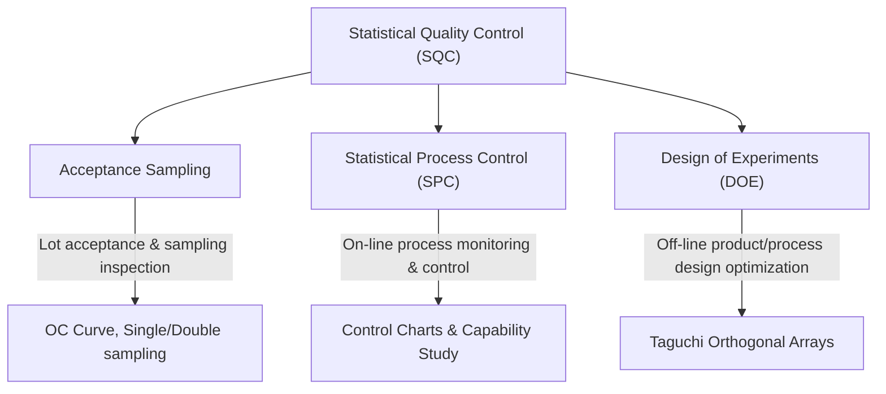
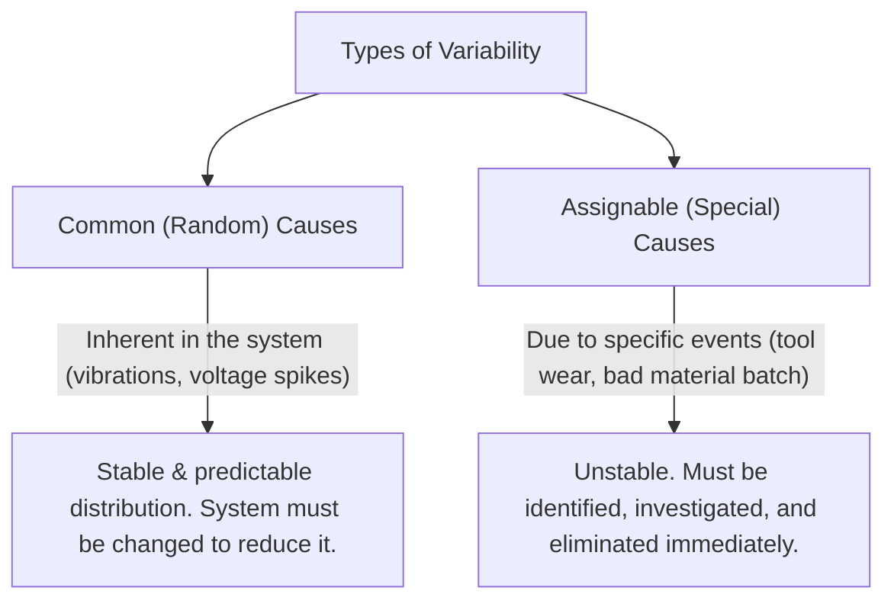
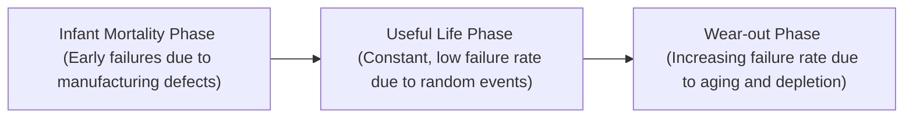

# Revision Notes: MMPC 019 — Block 3: Tools and Techniques

This block covers the mathematical, analytical, and process-improvement frameworks used to implement TQM. It explores Statistical Quality Control (SQC), process capability, the 7 QC tools, and specialized TQM methodologies like Benchmarking, QFD, BPR, 5S, Zero Defects, and Taguchi Methods.

---

## Unit 7: Statistical Quality Control

### 1. Rationale of Statistical Quality Control (SQC)
*   **Strategy for Variation Reduction:** Processes are naturally subject to fluctuations (in materials, operators, machines, and environments). SQC uses statistical methods to analyze these variations and stabilize the process.
*   **Three Core Methodologies of SQC:**



### 2. Process Capability
*   **Definition:** The natural range of variation of a stable process operating under statistical control.
*   **Natural Variation vs. Specifications:** 
    *   *Natural Variation (Process Spread):* Represented by $6\sigma$ (six standard deviations) of the individual measurements.
    *   *Specification Limits:* The engineering tolerance limits (Upper Spec Limit - USL, Lower Spec Limit - LSL) set by designers.
    *   *Capable Process:* A process is considered capable if at least **99.73%** of its output falls within the specification limits (i.e., the process spread $6\sigma$ is narrower than the specification range $\text{USL} - \text{LSL}$).



*   **Why Control Limits $\neq$ Specification Limits:**
    > [!WARNING]
    > Control limits (UCL/LCL) are calculated based on the distribution of **subgroup averages** (to monitor process stability). Specification limits (USL/LSL) apply to **individual items** (to monitor capability). Averages fluctuate much less than individuals (Central Limit Theorem). Comparing control limits directly to spec limits is a major conceptual error.
*   **Capability Studies vs. Performance Studies:**
    *   *Capability Study:* Measures inherent variation when the process is in statistical control (assumes normal distribution).
    *   *Performance Study:* Evaluates one-time runs or incoming vendor lots. Used to analyze the shape of a distribution to see if the vendor has sorted out (truncated) bad parts.

### 3. The Seven Quality Control (7 QC) Tools
Introduced by Kaoru Ishikawa, these simple statistical tools are used on shop floors worldwide for data-based troubleshooting:

1.  **Flowchart:** Maps the sequential steps of a process. Used in BPR to identify potential control points and compare ideal vs. actual workflows.
2.  **Histogram:** A bar chart showing the frequency distribution of variables. Reveals process capability and whether the output is skewed.
3.  **Pareto Chart:** Arranges problems in descending order of frequency/cost. Identifies the "vital few" (80% of issues) from the "trivial many" (20% of issues).
4.  **Cause-and-Effect Diagram (Fishbone/Ishikawa):** Graphically maps the relationship between a quality defect (effect) and its potential root causes (categorized under Man, Machine, Material, Method, Measurement, Environment).
5.  **Scatter Diagram:** Explores the relationship and correlation between two variables (e.g., temperature and defect rate).
6.  **Run Chart:** Plots data in a time sequence to detect trends, shifts, or cycles over time.
7.  **Control Chart:** A run chart with statistically calculated Central Line (CL), Upper Control Limit (UCL), and Lower Control Limit (LCL). Used to detect special causes of variation.

### 4. Control Charts: Accuracy vs. Precision
*   **$\bar{x}$-Chart (Mean Chart):** Measures the centering of the process to control its **accuracy**.
*   **R-Chart (Range Chart) / S-Chart:** Monitors the process dispersion to control its **precision**.
    *   *Note:* The Range ($R$) is historically used on shop floors instead of Standard Deviation ($S$) because it allows operators to perform simple manual calculations (subtraction of max and min values).

---

## Unit 8: Tools and Techniques of TQM

### 1. Benchmarking
*   **Definition:** An ongoing systematic process of evaluating and measuring products, services, and practices against the toughest competitors or recognized industry leaders ("best practices").
*   **Three Components:** Analysis (deconstructing the process) $\rightarrow$ Comparison (identifying performance gaps) $\rightarrow$ Synthesis (combining findings into a redesigned process).
*   **Types & Levels:**
    *   *Based on Object:* Product (satisfaction metrics), Performance (financial/operational ratios), Process (workflow details), Strategic (corporate-level portfolio decisions).
    *   *Based on Partner:* Internal, Industry, Competitive, Best-in-Class (cross-industry), Relationship (supplier-partner).
*   **NPC India 8-Step Benchmarking Model:**
    Identify Process $\rightarrow$ Map/Measure Existing Process $\rightarrow$ Find Partner $\rightarrow$ Analyze Gaps $\rightarrow$ Redesign Process $\rightarrow$ Implement $\rightarrow$ Monitor $\rightarrow$ Recalibrate.

### 2. Quality Function Deployment (QFD) & House of Quality (HOQ)
*   **QFD Concept:** A structured system to translate the **"Voice of the Customer" (VOC)** into engineering and production requirements at every stage of product development. It captures:
    1.  *Spoken Quality:* Explicitly stated requirements (e.g., "lawnmower should start easily").
    2.  *Unspoken/Implied Quality:* Assumed baseline features (e.g., "lawnmower blades should cut grass").
    3.  *Exciting/Delight Quality:* Unexpected features that surprise the customer (e.g., automatic mulching).
*   **The House of Quality (HOQ) Matrix Structure:**

```
               /  Roof  \
              / (HOW-HOW \
             / Correlation\
            +-------------+
            |  Technical  |
            | Des. (HOWs) |
+-----------+-------------+-----------+
| Customer  | Relationship| Customer  |
| Req.      |   Matrix    | Comp.     |
| (WHATs)   | (WHAT vs HOW| Rating    |
+-----------+-------------+-----------+
            | Target values|
            | & Technical |
            |  Benchmarks |
            +-------------+
```

### 3. Reliability & The Bathtub Curve
*   **Reliability:** The probability of a product performing its specified functions under prescribed conditions without failure for a specified period.
*   **Measures:** Mean Time Between Failures (MTBF) for repairable systems; Failure Rate ($\lambda$) for non-repairable components.
*   **The Bathtub Curve (Reliability Curve):**



*   **Reliability Design Tools:** FMEA (Failure Mode and Effects Analysis), redundancy (parallel backups), part-count reduction (fewer parts = fewer failures), and stress derating (running components below max limits).

### 4. 5S: Workplace Organization
A foundation-level pyramid technique for creating a clean, safe, and productive work environment:
1.  **Seiri (Sort):** Separate necessary items from unnecessary ones; discard the latter.
2.  **Seiton (Set in Order):** Arrange necessary items so they are easy to find and return ("a place for everything and everything in its place").
3.  **Seiso (Shine):** Clean the workplace, machinery, and tools thoroughly to spot hidden defects (leaks, cracks).
4.  **Seiketsu (Standardize):** Maintain the first 3S practices through visual controls, schedules, and checklists.
5.  **Shitsuke (Sustain):** Instill discipline and self-habit among workers to sustain the standards.

### 5. Zero Defects (ZD) & Business Process Reengineering (BPR)
*   **Zero Defects (Crosby):** The performance standard that tolerates no errors. It relies on doing things right the first time through supervisor training, ad hoc committees, and standard process verification rather than inspecting out defects.
*   **BPR (Hammer & Champy):** The fundamental rethinking and radical redesign of business processes to achieve dramatic improvements in critical measures of performance (cost, quality, service, speed).

| Aspect | Kaizen (Continuous Improvement) | Reengineering (BPR) |
| :--- | :--- | :--- |
| **Scale of Change** | Incremental, small steps. | Radical, quantum leaps. |
| **Starting Point** | Existing process (improve it). | Clean sheet / Blank canvas (rebuild it). |
| **Risk & Cost** | Low risk, low capital investment. | High risk, high IT/capital investment. |
| **Key Enabler** | Employee suggestions, Quality Circles. | Information Technology (IT), Case Workers. |

### 6. Taguchi Methods
Genichi Taguchi pioneered off-line quality engineering:
*   **Taguchi Loss Function:** $L(y) = k(y - m)^2$. Loss to society increases quadratically as the output deviates from target $m$, even if it lies within spec limits.
*   **Robust Design (Two-Step Method):** Makes product performance insensitive to environmental noise (vibrations, shifts) without expensive controls.
    *   *Step 1:* Optimize settings for robustness factors to reduce performance variation.
    *   *Step 2:* Optimize settings for adjustment factors to shift the average response to the target.
*   **Orthogonal Arrays:** Simplified multi-factor experiments that reduce the number of test runs needed to find optimal designs.
