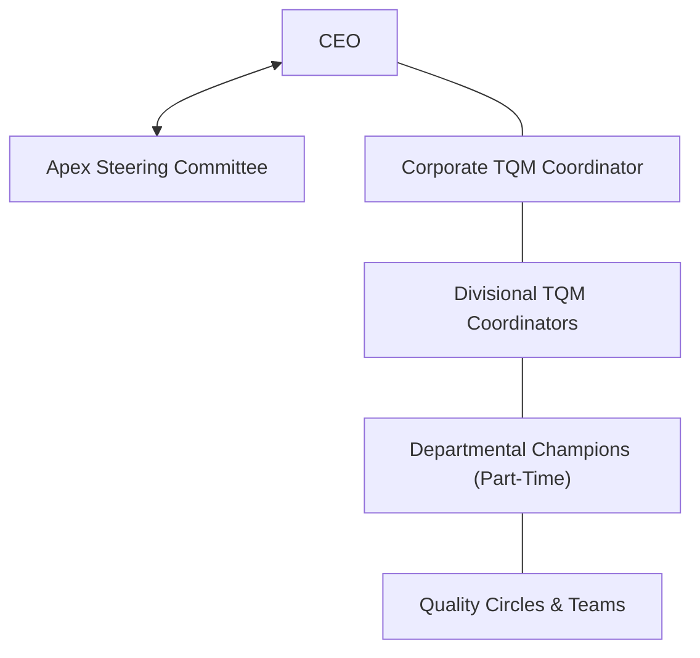

# Revision Notes: MMPC 019 — Block 4: Organization and Leadership (Hinglish Version)

Yeh block TQM implementation ke liye structural, team-oriented, aur behavioral requirements ko explore karta hai. Isme steering committees, coordinators, aur champions ke roles, TQM teams aur Quality Circles ke beech ke differences, aur leadership, employee motivation, aur organizational culture change ke baare me bataya gaya hai.

---

## Unit 9: Organization for Quality

### 1. TQM Implement Karne ka Structure
TQM ek long-term continuous transformation process hai, na ki koi short-term campaign. Isliye isme ek permanent administrative structure ki jarurat hoti hai:
*   **Apex Steering Committee:** CEO dwara led top managers ka ek group jo overall goals, policies, aur resources provide karta hai.
*   **TQM Secretariat/Office:** Isko ek **Corporate TQM Coordinator** lead karta hai jo directly CEO ko report karta hai.
*   **Divisional Structure (Multi-Divisional Firms me):**
    *   Corporate TQM Office chota (1-2 professionals) rakha jata hai taaki wo sirf standards design, training materials, aur overall status diagnosis par focus karein.
    *   Har division ki apni *Divisional Steering Committee* aur ek full-time *Divisional TQM Coordinator* hota hai.
    *   **Departmental Champions:** Part-time champions jo departments me TQM momentum aur activities ko facilitate karte hain.

### 2. Steering Committee ka Role
Steering committee TQM promotion ke liye accountable hoti hai. Inhe **leaders ki tarah act karna chahiye, na ki cheerleaders ki tarah** (yani inka active and personal participation zaroori hai, na ki sirf sideline se cheer karna).
*   **Key Responsibilities (Zimmedariyan):**
    1.  *Approve & Direct:* TQM campaign plans, goals, aur targets ko approve karna.
    2.  *Allocate Resources:* Financial aur human resources support provide karna.
    3.  *Review & Correct:* TQM progress ko regularly audit karna aur corrective measures lena.
    4.  *Recognize & Reward:* Recognition events aur awards approve karna.
*   **Committee ke Paanch Important Steps:**
    *   *Clarify the "Why":* Yeh clear hona chahiye ki TQM kis specific problem ko solve karne ke liye chalaya ja raha hai (e.g., kisi important customer ko khona ya cost competitiveness badhana).
    *   *Accept People as they are:* Logo ko blame karne ke trap se bachna ("inme hi koi kharabi hai"). Systems ko theek karna, logo ko nahi.
    *   *Create Campaigns:* TQM ideas ko concrete actions me badalna (jaise 5S campaigns chalana).
    *   *Integrate Improvement Plans:* TQM plans ko company ke daily operating plans ke sath merge karna taaki log ise "extra work" na samjhein.

### 3. TQM me Teams: Structure aur Roles
TQM cross-departmental teams ke through chronic problems solve karta hai. Yeh Taylor model (jahan sirf isolated experts plan karte the bina workers ki marzi ke) se bilkul alag hai.

*   **TQM Team Composition:** Departmental levels se diagonal slice le kar typically 3 se 5 members ki team banayi jaati hai.
*   **Key Roles:**
    *   **Sponsor:** Ek senior manager jiske paas authority ho. Resource aur budget support dena aur red tape ko door karna iska kaam hai.
    *   **Team Leader:** Workload share karna, team ko goal par focus rakhna, aur sponsor se coordinate karna.
    *   **Facilitator:** Ek neutral catalyst (jo team member nahi hota). Team ko statistical tools use karne me aur PDCA cycle process follow karne me help karta hai.
    *   **Team Member:** 7-step PDCA methodology follow karna, shop floor se data collect karna, aur solutions implement karna.

### 4. TQM Teams vs. Quality Control (QC) Circles

| Characteristic | TQM Problem-Solving Team | Quality Control (QC) Circle |
| :--- | :--- | :--- |
| **Origin / Mandate** | Management dwara form aur mandate ki jaati hai. | Workers dwara voluntarily form kiya jata hai. |
| **Composition** | Alag-alag departments ke managers, officers, aur supervisors. | **Same** workplace ke workers aur foremen. |
| **Problem Focus** | Complex, chronic, aur cross-functional problems. | Apne local workplace ki problems (safety, environment, tools). |
| **Continuity** | Temporary; project complete hone par disband ho jati hai. | Permanent; jab tak workplace hai tab tak chalti hai. |
| **Methodology** | 7-step PDCA problem-solving. | "QC Story" aur 7 QC tools ka use. |

### 5. Management Control aur Data Management
*   **Management Control:** Deployed "control points" (measurable results) ke through execute kiya jata hai taaki responsibilities clear hon aur arbitrariness na rahe.
*   **Data Management:** Opinions ki jagah facts collect karna. Data analysis se decision-making process ko support kiya jata hai.
*   **Implementation Values:** Transparency, data integrity, consensus-building, aur customer-focus jaise guidelines jo data collect karte waqt follow hone chahiye.

---

## Unit 10: Quality Culture and Leadership

### 1. Leadership in TQM
*   **Role in Implementation:** TQM me transformational leadership ki jarurat hoti hai. Leaders sirf order nahi dete; wo ek vision set karte hain, trust build karte hain, aur personal commitment show karte hain.
*   **Key Leadership Behaviors:**
    *   *Lead by Example:* Workers ke sath khud bhi TQM training sessions attend karna.
    *   *System Responsibility:* Yeh manna ki **85% defects** system failures (management ki responsibility) ki wajah se hote hain aur sirf **15%** individual galatiyon se.
    *   *Removing Barriers:* Departmental silos ko todna aur workplace se darr (fear) ko eliminate karna.
    *   *Continuing Education:* Deming ka Point 13: "Institute a vigorous program of education and self-improvement."

### 2. Employee Motivation in TQM
Motivation ek inner drive hai jo goals achieve karne ke liye behavior ko direct karta hai. TQM me motivational theories ko use kiya jata hai:
*   **Maslow's Hierarchy of Needs:**
    *   *Physiological & Safety Needs:* Safe working environment aur fair salary de kar meet ki jaati hain.
    *   *Belonging & Esteem Needs:* Quality Circles, teamwork, public recognition, aur award ceremonies ke through puri hoti hain.
    *   *Self-Actualization:* Workers ko decision-making power aur continuous improvement projects de kar self-actualize karna.
*   **Herzberg's Two-Factor Theory:**
    *   *Hygiene Factors (Dissatisfaction rokte hain):* Job security, basic salary, working conditions.
    *   *Motivators (Excellence badhate hain):* Employee empowerment, recognition, aur personal growth. TQM motivators par focus karta hai.
*   **Expectancy Theory:** Workers ko yeh belief hona chahiye ki unki quality efforts se visible rewards/recognition milenge aur process success hogi.
*   **TQM me Motivation ke Methods:**
    *   *Empowerment:* Machine operators ko authority dena ki agar defect dikhe to assembly line stop kar sakein.
    *   *Recognition:* QC circle achievements ko company events me celebrate karna.

### 3. Continuing Education for All (Nirantar Shiksha)
*   **Concept:** Sabhi employees ke liye quality principles, statistical techniques (7 QC tools), aur team behaviors me structured training.
*   **Why It Matters:** New technology aane par skills purani na ho jayein, sabhi same problem-solving language use karein, aur worker ka morale high rahe.
*   *Example:* Ek factory me jab robotic automation laya gaya, to sabhi workers ko safety check aur basic programming ki mandatory training di gayi, jisse manual workers technical quality guardians ban gaye.

### 4. Organizational Culture ko Transform Karna
*   **Culture Shift:** Purani "blame culture" (kisne galti ki?) se badal kar ek "systemic quality culture" (system ne galti kyu hone di?) banana.
*   **Workers ka Role:** Workers process ke sabse close hote hain. TQM unhe passive workers se active problem solvers banata hai suggestion schemes aur Quality Circles ke through, jisse unme ownership ki feeling aati hai.
