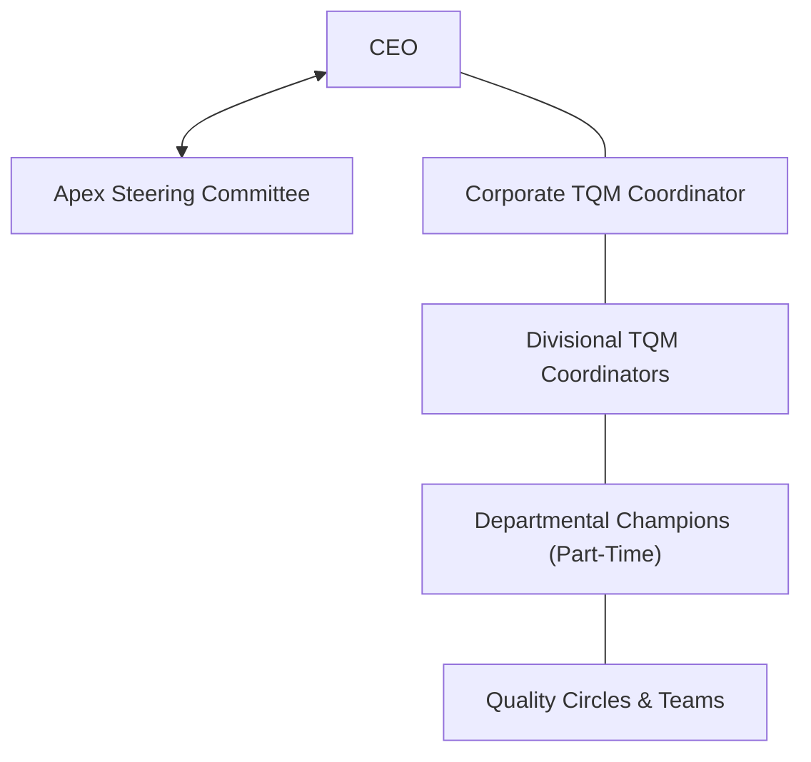

# Revision Notes: MMPC 019 — Block 4: Organization and Leadership

This block explores the structural, team-oriented, and behavioral requirements for TQM implementation. It outlines the roles of steering committees, coordinators, and champions, differentiates between TQM problem-solving teams and Quality Circles, and discusses leadership, employee motivation, and organizational culture change.

---

## Unit 9: Organization for Quality

### 1. Structure for Implementing TQM
TQM is a long-term continuous transformation process, not a temporary campaign. Thus, it requires a permanent administrative structure.
*   **Apex Steering Committee:** A group of top managers led by the CEO that provides overall goals, policies, and resources.
*   **TQM Secretariat/Office:** Led by a **Corporate TQM Coordinator** reporting to the CEO.
*   **Divisional Structure (Multi-Divisional Firms):**
    *   Corporate TQM Office remains small (1-2 professionals) to focus on design, education materials, and diagnosis.
    *   Each Division has its own *Divisional Steering Committee* and a full-time *Divisional TQM Coordinator*.
    *   **Departmental Champions:** Part-time enthusiasts who act as facilitators on the shop floor to maintain momentum.

### 2. Role of the Steering Committee
The steering committee is accountable for TQM promotion. It must act as **leaders, not cheerleaders** (meaning they participate directly rather than standing on the sidelines).
*   **Key Responsibilities:**
    1.  *Approve & Direct:* Establish TQM campaign plans, goals, and targets.
    2.  *Allocate Resources:* Provide financial and human resource support.
    3.  *Review & Correct:* Periodically audit TQM progress and implement countermeasures.
    4.  *Recognize & Reward:* Approve recognition events and awards.
*   **Four Strategic Committee Steps:**
    *   *Clarify the "Why":* Identify the actual operational problems TQM must solve (e.g., losing a customer or failing international cost competitiveness).
    *   *Accept People as they are:* Avoid the blame trap ("there is something wrong with them"). Fix processes, not people.
    *   *Create Campaigns:* Translate abstract TQM theories into concrete action-oriented drives (e.g., 5S campaigns).
    *   *Integrate Improvement Plans:* Ensure TQM plans are merged with the company's daily operating plans to avoid TQM being treated as "extra work".

### 3. Teams in TQM: Structure and Roles
TQM operates through cross-departmental teams to resolve chronic problems. This shifts away from Taylorism (where isolated experts designed work for others without their involvement).

*   **TQM Team Composition:** Typically 3 to 5 members representing a diagonal slice of the organization.
*   **Key Team Roles:**
    *   **Sponsor:** A senior manager with authority. Allocates budget, reviews progress, and clears red tape.
    *   **Team Leader:** Shares workload, keeps the team focused, allocates tasks, and interacts with the sponsor.
    *   **Facilitator:** A neutral catalyst (not a team member). Trains the team on statistical tools and guides them through the problem-solving methodology.
    *   **Team Member:** Follows the 7-step PDCA methodology, collects shop floor data, and implements solutions.

### 4. TQM Teams vs. Quality Control (QC) Circles

| Characteristic | TQM Problem-Solving Team | Quality Control (QC) Circle |
| :--- | :--- | :--- |
| **Origin / Mandate** | Formed and mandated by management. | Formed voluntarily by workers. |
| **Composition** | Managers, officers, and supervisors across departments. | Workers and foremen from the **same** workplace. |
| **Problem Focus** | Complex, chronic, cross-functional business problems. | Local workplace problems (safety, environment, tools). |
| **Continuity** | Temporary; disbanded after project completion. | Permanent; lasts as long as the workplace exists. |
| **Methodology** | 7-step PDCA problem-solving. | "QC Story" using 7 QC tools. |

### 5. Management Control and Data Management
*   **Management Control:** Done through "control points" (measurable results) deployed down the line to clarify roles and prevent arbitrariness.
*   **Data Management:** Collecting facts rather than opinions. Data is analyzed to support closed-loop control or strategic decisions. 
*   **Implementation Values:** Operational guidelines like transparency, data integrity, consensus-building, and customer-focus that must guide data collection and tool usage.

---

## Unit 10: Quality Culture and Leadership

### 1. Leadership in TQM
*   **Role in Implementation:** TQM requires transformational leadership. Leaders do not merely command; they set a vision, build trust, and demonstrate personal commitment.
*   **Key Leadership Behaviors:**
    *   *Lead by Example:* Attending TQM training sessions alongside employees.
    *   *System Responsibility:* Recognizing that **85% of defects** are system failures (management's responsibility) and only **15%** are individual mistakes.
    *   *Removing Barriers:* Actively dismantling departmental silos and eliminating fear.
    *   *Continuing Education:* Deming’s Point 13: "Institute a vigorous program of education and self-improvement."

### 2. Employee Motivation in TQM
Motivation is the inner drive inspiring behavior towards goals. TQM applies major motivational theories:
*   **Maslow's Hierarchy of Needs:**
    *   *Physiological & Safety:* Met by providing safe working conditions and fair pay.
    *   *Belonging & Esteem:* Met through Quality Circles, teamwork, public recognition, and ceremonies.
    *   *Self-Actualization:* Met by empowering workers to make decisions and drive continuous improvement.
*   **Herzberg's Two-Factor Theory:**
    *   *Hygiene Factors (Prevent Dissatisfaction):* Job security, basic salary, working conditions.
    *   *Motivators (Drive Excellence):* Employee empowerment, recognition, and skill growth. TQM focuses heavily on motivators.
*   **Expectancy Theory:** Workers must believe their quality improvement efforts will yield visible rewards/recognition and process success.
*   **TQM Methods of Motivation:**
    *   *Empowerment:* Giving operators the authority to stop the assembly line if a defect is found.
    *   *Recognition:* Celebrating QC circle achievements in corporate-wide ceremonies.

### 3. Continuing Education for All
*   **Concept:** Structured, ongoing training in quality principles, statistical techniques (7 QC tools), and team behaviors for every employee.
*   **Why It Matters:** Prevent skill obsolescence as technologies change, foster a common language of problem-solving, and boost worker morale.
*   *Example:* A manufacturing plant introducing automated robotics holds mandatory training in programming and quality control checks for shop floor operators, transforming them from manual laborers to technical quality guardians.

### 4. Transforming Organizational Culture
*   **Culture Shift:** Moving from a traditional "blame culture" (who made the mistake?) to a "systemic quality culture" (why did the process allow the mistake?).
*   **The Role of Workers:** Workers are the closest to the process. TQM shifts their role from passive executors to active solvers through suggestion schemes and Quality Circles, establishing a sense of ownership.
