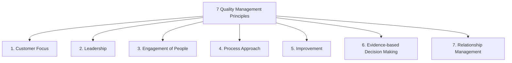
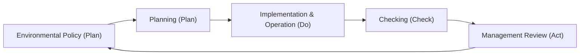

# Revision Notes: MMPC 019 — Block 5: Systems and Standards (Hinglish Version)

Yeh block international management systems aur safety standards ko cover karta hai. Isme ISO 9000 (QMS), ISO 14000 (EMS), Occupational Safety and Health Management, ISO 20000 (IT Service Management), aur Quality System Auditing, Certification, aur National/International Quality Awards ke frameworks aur processes ke baare me bataya gaya hai.

---

## Unit 11: ISO 9000 Quality Management System

### 1. Concept of Quality Management System (QMS)
*   **Genesis:** World Wars I aur II ke dauran suppliers ki capability par trust built karne ke liye military specifications se evolve hua. Shewhart ke SPC (Statistical Process Control) tools aur Juran ke QMS concepts ne international standardisation ka rasta saaf kiya, jiske baad 1987 me pehla ISO 9000 series release kiya gaya.
*   **Nature:** ISO 9000 standards **generic** होते हैं (na to yeh kisi specific industry ke liye hote hain aur na hi kisi specific product ke liye). Yeh yeh specify karte hain ki QMS ko *kya* requirements meet karni chahiye, jabki *kaise* karna hai yeh organization ke decision par chhod diya jata hai.

### 2. ISO 9000 Core Standards (Revised Models)
*   **ISO 9000:** Quality Management Systems — Fundamentals and Vocabulary.
*   **ISO 9001 (Contractual Standard):** QMS — Requirements. Pure family me yeh *ekmatra* standard hai jiske basis par organizations certification le sakti hain.
*   **ISO 9004:** QMS — Guidelines for achieving sustained success and continuous performance improvement.
*   **ISO 19011:** Guidelines for auditing management systems.

### 3. The 7 Quality Management Principles (QMPs) of ISO 9001:2015

### 4. Implementation Steps for ISO 9001 QMS
1.  *Management Commitment:* Ek Management Representative (MR) ko appoint karna aur Quality Policy establish karna.
2.  *Gap Analysis:* Existing processes ko ISO 9001 requirements ke sath compare karna (kamiyaan dhoondhna).
3.  *Documentation:* QMS hierarchy design karna (Quality Manual $\rightarrow$ Procedures $\rightarrow$ Work Instructions $\rightarrow$ Records).
4.  *Implementation & Training:* Naye procedures ko roll out karna aur employees ko train karna.
5.  *Internal Audit:* Compliance verify karne aur non-conformances ko theek karne ke liye internal audits conduct karna.
6.  *Management Review:* Top management dwara QMS ki effectiveness ko review karna.
7.  *Certification Audit:* Ek third-party certification body dwara final assessment/audit conduct karna.

---

## Unit 12: ISO 14000 Environmental Management System

### 1. Concept and Need for EMS
*   **EMS (Environmental Management System):** Ek structured framework jo kisi organization ke environmental footprint ko manage karne, legal compliance ensure karne, aur waste ko reduce karne me help karta hai.
*   **ISO 14000 Family:** Environmental management par focus karne wale standards ka set. Isme **ISO 14001** contractual standard hai jo EMS requirements specify karta hai.
*   **Core Elements of ISO 14001 EMS (PDCA Cycle Model):**

*   **EMS Activities:** Aspect-Impact analysis (yeh identify karna ki company ki activities environment ko kaise affect karti hain), legal compliance registry maintain karna, emergency preparedness (aapatkalin taiyari), aur carbon emissions ko monitor karna.

---

## Unit 13: Management Systems for Safety and Health

### 1. Safety Management Styles
Safety management yeh determine karta hai ki organizations hazard risks ko kaise manage karti hain:
*   **SWAMP (Safety Without Any Management Process):** Koi formal safety procedures nahi hote. Yeh unregulated aur extremely risky hota hai.
*   **NORM (Naturally Occurring Reactive Management):** Reactive management jahan safety issues ko *sirf* tabhi theek kiya jata hai jab koi accident ho jata hai (fire-fighting style).
*   **WCM (World Class Management):** Proactive safety culture jo is belief par kaam karta hai ki "accidents hote nahi hain, balki unhe cause kiya jata hai" unsafe acts (logo ki wajah se) ya unsafe conditions (management ki laparwahi ki wajah se) ke dwara.

### 2. Job Safety Analysis (JSA)
*   **Definition:** Ek step-by-step risk assessment tool jiska use kisi job ke har step ke sath associated potential hazards ko identify karne aur safe work practices define karne ke liye kiya jata hai.
*   **Three Pillars of Safety:**
    1.  *Engineering:* Safe equipment design karna, physical barriers lagana, aur ventilation systems improve karna.
    2.  *Education:* Safety orientation conduct karna, MSDS (Material Safety Data Sheets) ki training dena, aur toolbox talks karna.
    3.  *Enforcement:* Standard operating procedures banana, safety compliance audit karna, aur disciplinary codes apply karna.

### 3. Five Steps of Safety Implementation
Pre-Project Planning $\rightarrow$ Orientation & Need-Based Training $\rightarrow$ Documented Safety Programme $\rightarrow$ Substance Abuse Program (random alcohol/drug screening) $\rightarrow$ Accident/Near-Miss Investigation.

### 4. General Occupational Health Problems
Occupational environments ki wajah se physical, chemical, ya biological health hazards ho sakte hain:
*   *Physical Hazards:* Heat stroke (equatorial regions me common), vibration-induced injuries, noise ke karan hearing loss, radiation ke karan cancer.
*   *Chemical Hazards:* Silicosis (sandblasting ke dust se), Asbestosis (fiber inhalation se), aur chemicals (benzene, heavy metals) ke exposure se organ failure hona.
*   *Controls:* Engineering controls (exhaust hoods), legal measures (Factories Act compliance), aur medical measures (pre-employment screenings aur periodic health checks).

---

## Unit 14: Other Standards (ISO 20000 & Information Standards)

### 1. ISO 20000 (IT Service Management - ITSM)
*   **Definition:** IT Service Management ke liye international standard (specifically ISO 20000-1). Yeh ek IT Service Management System (ITSM) ko establish, implement, aur improve karne ki requirements ko outline karta hai.
*   **Need:** Modern businesses ka IT services par heavy reliance (nirbharta) hone ke karan iski zaroorat hai. Yeh ensure karta hai ki IT services business objectives ke sath aligned hon aur customer SLAs (Service Level Agreements) ko meet karein.
*   **Alignment with Other IT Frameworks:**
    *   *ITIL:* Un best practice processes (service strategy, design, transition, operations) ko define karta hai jinka use organizations ISO 20000 requirements meet karne ke liye karti hain.
    *   *COBIT:* IT governance aur control objectives par focus karta hai.
    *   *CMMI:* Software process maturity par focus karta hai.

---

## Unit 15: Quality Auditing and Certification

### 1. Quality System Audit
*   **Definition:** Audit evidence collect karne aur use objectively evaluate karne ka ek systematic, independent, aur documented process, jisse yeh determine kiya ja sake ki kis limit tak audit criteria fulfill ho rahe hain.
*   **Types of Audits:**
    *   **First-Party (Internal Audit):** Organization khud apne upar conduct karti hai taaki internal management reviews aur self-correction kiya ja sake.
    *   **Second-Party (Customer-Supplier Audit):** Ek customer (ya unka representative) supplier ke yahan conduct karta hai taaki contract award karne se pehle unki capability ko assess kiya ja sake.
    *   **Third-Party (Certification Audit):** Ek independent, accredited certification body (registrars) dwara conduct kiya jata hai taaki formal QMS certificate issue kiya ja sake.

### 2. Audit Planning and Preparation
*   *Audit Plan:* Lead Auditor dwara develop kiya jata hai jisme scope, objectives, schedule, aur team assignments detail me hote hain.
*   *Audit Preparation:* Quality documentation review karna, checklists prepare karna, aur opening & closing meetings schedule karna.

### 3. Excellence and Quality Awards (Recognition of TQM Maturity)
National aur international quality awards organizations ko TQM breakthroughs achieve karne ke liye motivate karte hain:
*   **Deming Prize (Japan/Global):** Statistical quality control aur Company-Wide Quality Control (CWQC) ke dissemination me outstanding contributions ko evaluate karta hai.
*   **Malcolm Baldrige National Quality Award (MBNQA - USA):** Seven categories ke across business excellence ko evaluate karta hai (Leadership, Strategy, Customers, Measurement, Workforce, Operations, Results).
*   **Rajiv Gandhi National Quality Award (India):** Un Indian organizations ko evaluate karta hai jo customer-focused quality improvement aur environmental awareness me excel karti hain.
