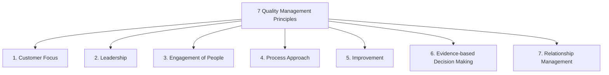
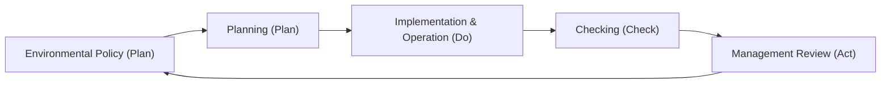

# Revision Notes: MMPC 019 — Block 5: Systems and Standards

This block covers international management systems and safety standards. It outlines the frameworks for ISO 9000 (QMS), ISO 14000 (EMS), Occupational Safety and Health Management, ISO 20000 (IT Service Management), and the processes of Quality System Auditing, Certification, and National/International Quality Awards.

---

## Unit 11: ISO 9000 Quality Management System

### 1. Concept of Quality Management System (QMS)
*   **Genesis:** Evolved from military specifications during World Wars I & II to build confidence in supplier capabilities. Shewhart's SPC tools and Juran's QMS concepts paved the way for international system standardization, culminating in the first ISO 9000 series release in 1987.
*   **Nature:** ISO 9000 standards are **generic** (neither industry-specific nor product-specific). They specify *what* requirements a QMS must meet, leaving the *how* to the organization's discretion.

### 2. ISO 9000 Core Standards (Revised Models)
*   **ISO 9000:** Quality Management Systems — Fundamentals and Vocabulary.
*   **ISO 9001 (Contractual Standard):** QMS — Requirements. The *only* standard in the family against which organizations can get certified.
*   **ISO 9004:** QMS — Guidelines for achieving sustained success and continuous performance improvement.
*   **ISO 19011:** Guidelines for auditing management systems.

### 3. The 7 Quality Management Principles (QMPs) of ISO 9001:2015

### 4. Implementation Steps for ISO 9001 QMS
1.  *Management Commitment:* Appoint a Management Representative (MR) and establish the Quality Policy.
2.  *Gap Analysis:* Compare existing processes against ISO 9001 requirements.
3.  *Documentation:* Design the QMS hierarchy (Quality Manual $\rightarrow$ Procedures $\rightarrow$ Work Instructions $\rightarrow$ Records).
4.  *Implementation & Training:* Roll out new procedures and train personnel.
5.  *Internal Audit:* Conduct audits to verify compliance and correct non-conformances.
6.  *Management Review:* Top management reviews the QMS effectiveness.
7.  *Certification Audit:* Third-party certification body conducts the final assessment.

---

## Unit 12: ISO 14000 Environmental Management System

### 1. Concept and Need for EMS
*   **EMS (Environmental Management System):** A structured framework to manage an organization's environmental footprint, ensure legal compliance, and reduce waste.
*   **ISO 14000 Family:** Set of standards focusing on environmental management. **ISO 14001** is the contractual standard specifying EMS requirements.
*   **Core Elements of ISO 14001 EMS (PDCA Cycle Model):**

*   **EMS Activities:** Aspect-Impact analysis (identifying how activities affect the environment), legal compliance registry, emergency preparedness, and monitoring carbon emissions.

---

## Unit 13: Management Systems for Safety and Health

### 1. Safety Management Styles
Safety management determines how organizations manage hazard risks:
*   **SWAMP (Safety Without Any Management Process):** No formal safety procedures. Unregulated and highly risky.
*   **NORM (Naturally Occurring Reactive Management):** Reactive management that fixes safety issues *only* after an accident occurs (fire-fighting style).
*   **WCM (World Class Management):** Proactive safety culture based on the belief that "accidents do not happen, they are caused" by unsafe acts (people) or unsafe conditions (management).

### 2. Job Safety Analysis (JSA)
*   **Definition:** A step-by-step risk assessment tool used to identify potential hazards associated with each step of a job and define safe work practices.
*   **Three Pillars of Safety:**
    1.  *Engineering:* Designing safe equipment, physical barriers, and ventilation systems.
    2.  *Education:* Conducting safety orientation, MSDS (Material Safety Data Sheets) training, and toolbox talks.
    3.  *Enforcement:* Standardizing procedures, auditing safety compliance, and using disciplinary codes.

### 3. Five Steps of Safety Implementation
Pre-Project Planning $\rightarrow$ Orientation & Need-Based Training $\rightarrow$ Documented Safety Programme $\rightarrow$ Substance Abuse Program (random alcohol/drug screening) $\rightarrow$ Accident/Near-Miss Investigation.

### 4. General Occupational Health Problems
Occupational environments can cause physical, chemical, or biological health hazards:
*   *Physical Hazards:* Heat stroke (common in equatorial regions), vibration-induced injuries, hearing loss from noise, cancer from radiation.
*   *Chemical Hazards:* Silicosis (dust in sandblasting), Asbestosis (fiber inhalation), and organ failures from chemical exposure (benzene, heavy metals).
*   *Controls:* Engineering controls (exhaust hoods), legal measures (Factories Act compliance), and medical measures (pre-employment screenings and periodic health checks).

---

## Unit 14: Other Standards (ISO 20000 & Information Standards)

### 1. ISO 20000 (IT Service Management - ITSM)
*   **Definition:** The international standard for IT Service Management (specifically ISO 20000-1). It outlines the requirements for establishing, implementing, and improving an IT Service Management System (ITSM).
*   **Need:** Driven by the heavy reliance of modern businesses on IT services. It ensures IT services are aligned with business objectives and meet customer SLAs (Service Level Agreements).
*   **Alignment with Other IT Frameworks:**
    *   *ITIL:* Defines the best practice processes (service strategy, design, transition, operations) that organizations use to meet ISO 20000 requirements.
    *   *COBIT:* Focuses on IT governance and control objectives.
    *   *CMMI:* Focuses on software process maturity.

---

## Unit 15: Quality Auditing and Certification

### 1. Quality System Audit
*   **Definition:** A systematic, independent, and documented process for obtaining audit evidence and evaluating it objectively to determine the extent to which audit criteria are fulfilled.
*   **Types of Audits:**
    *   **First-Party (Internal Audit):** Conducted by the organization on itself for internal management reviews and self-correction.
    *   **Second-Party (Customer-Supplier Audit):** Conducted by a customer (or their representative) on a supplier to assess capability prior to contract award.
    *   **Third-Party (Certification Audit):** Conducted by an independent, accredited certification body (registrars) to issue a formal QMS certificate.

### 2. Audit Planning and Preparation
*   *Audit Plan:* Developed by the Lead Auditor detailing the scope, objectives, schedule, and team assignments.
*   *Audit Preparation:* Reviewing quality documentation, preparing checklists, and scheduling opening and closing meetings.

### 3. Excellence and Quality Awards (Recognition of TQM Maturity)
National and international quality awards motivate organizations to achieve TQM breakthroughs:
*   **Deming Prize (Japan/Global):** Evaluates outstanding contributions to the dissemination of statistical quality control and Company-Wide Quality Control (CWQC).
*   **Malcolm Baldrige National Quality Award (MBNQA - USA):** Evaluates business excellence across seven categories (Leadership, Strategy, Customers, Measurement, Workforce, Operations, Results).
*   **Rajiv Gandhi National Quality Award (India):** Evaluates Indian organizations that excel in customer-focused quality improvement and environmental awareness.
