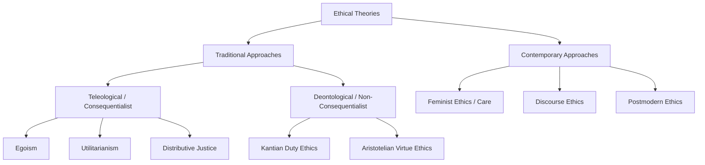

# MMPC-020: Business Ethics and CSR
## Block 1: Ethics and Business — Hinglish Revision Notes

---

### UNIT 1: BUSINESS ETHICS: AN OVERVIEW

#### 1. Concept and Relevance of Business Ethics (Business Ethics kya hai aur iski kya relevance hai)
*   **Definition:** Business ethics ek systematic study hai un business situations, activities, aur decisions ki jahan right (sahi) aur wrong (galat) ke issues ko moral criteria ke basis par evaluate kiya jata hai (Andrew Crane & Dirk Matten).
*   **Relevance in Today's World (Aaj ki duniya me importance):**
    1.  **Corporate Influence:** Aajkal badi MNCs (Google, Amazon, etc.) ke paas bahut zyada global influence aur power hai. Business ethics is power ke social implications ko samajhne me help karta hai.
    2.  **Brand & Reputation:** Social media aur globalization ke is daur me brand reputation bahut vulnerable ho gayi hai. Kisi bhi wrongdoing (unethical kaam) ke baare me kuch hi minutes me puri duniya ko pata chal jata hai aur company ki market value down ho sakti hai.
    3.  **Resource Mobilization:** Aaj ki corporates ke paas highly skilled workforce aur strong financial resources hain. Isliye, business organizations in resources ko social issues solve karne (jaise UN ke SDGs ko support karne) me use kar sakti hain.
    4.  **Complex Stakeholder Demands:** Aajkal public skepticism (shak) badh gaya hai, isliye managers ko sirf profit hi nahi balki stakeholders ki expectations ko bhi balance karna padta hai.

#### 2. Business Ethics vs. Law (Ethics aur Law me antar)
*   **Core Distinction:** *"Ethics begins where the law ends."* Law society ka ek minimum acceptable standard hota hai, jabki ethics uske aage ki moral responsibilities (moral values) ko define karta hai.
| Parameter | Law (Kanoon) | Business Ethics (Vyavasayik Naitikta) |
| :--- | :--- | :--- |
| **Nature** | Codified aur written rules hote hain jo legally binding hote hain. | Unwritten aur voluntary moral principles hote hain. |
| **Scope** | Narrow: Sirf legal compliance aur civic order par focus karta hai. | Broad: Un grey areas ko cover karta hai jo kanoon me likhe nahi hote. |
| **Examples** | Tax pay karna, labor laws ko follow karna. | Loyal rehna, fair treatment dena, law ke aage badhkar environment ki care karna. |
| **Evolution** | Laws aksar society ki badalti morality se hi bante hain (e.g., environment laws, POSH Act). | Precedes law: Yeh law se pehle aata hai aur social reforms ke zariye new legislation ko drive karta hai. |

#### 3. "Business Ethics is an Oxymoron" — A Cynical View (Ek shaq bhara nazariya)
*   **The Concept:** Cynics (cynical thinkers) ka manna hai ki "business ethics" ek contradiction in terms (oxymoron) hai, yaani profit maximization aur ethical decisions ek saath nahi chal sakte.
*   **Shareholder vs. Stakeholder Conflict:**
    *   **Shareholder Primacy (Milton Friedman):** Business ka sirf ek hi kaam hai—"business of business is to do business." Managers ko law ke andar rehkar sirf profit maximization par focus karna chahiye. Social welfare par paisa kharch karna shareholders ke paise ka misuse hai.
    *   **Stakeholder Primacy (R. Edward Freeman):** Business ek social institution hai. Stakeholders ka matlab un sabhi groups ya individuals se hai jo firm ke decisions se affect hote hain ya firm ko affect karte hain (employees, customers, suppliers, community, aur environment).
*   **Modern Resolution:** Aajkal ethical practices ko koi cost (kharcha) nahi mana jata, balki ise ek investment mana jata hai jo trust build karta hai, risks kam karta hai, aur long-term sustainability ensure karta hai.

#### 4. Global Expansion and Consumer Consciousness (Global expansion aur consumer jagrukta)
*   **Global Permeability:** Globalization ke karan companies ko alag-alag countries ki cultural norms ke prati sensitive hona padta hai (jaise marketing strategies aur gender representation me local culture ka dhyan rakhna).
*   **Institutional Voids:** Emerging markets me weak legal systems ke karan ethical blind spots create ho jaate hain jahan companies ko moral principles ka dhyan khud rakhna padta hai.
*   **Consumer Activism:** Business ke global footprint badhne se consumer movements bhi global ho gaye hain. Social media ke zariye consumers galat practices (jaise sweatshops/child labor) ke khilaf easily boycott organize kar sakte hain.

---

### UNIT 2: CONCEPTS AND THEORIES OF BUSINESS ETHICS

#### 1. Teleological (Consequentialist) Ethical Theories (Outcomes par focus karne wali theories)
*   **Core Idea:** Kisi bhi action ki moral rightness uske consequences ya outcomes (result) se decide hoti hai (ends justify the means).
*   **Key Theories:**
    1.  **Egoism (Ahamwad):** Agar koi action decision-maker ke long-term self-interest ko promote karta hai, toh woh morally right hai. Adam Smith ne ise market ke "invisible hand" se connect kiya—jab log self-interest me kaam karte hain, toh society ka automatically fayda hota hai (e.g., customers ko repeat purchase ke liye quality products dena).
    2.  **Utilitarianism (Upyogitawad - Jeremy Bentham & J.S. Mill):** Yeh theory *"greatest good of the greatest number"* (sabse zyada logon ka sabse bada bhala) par focus karti hai. Yeh decisions ko pleasure vs. pain ke cost-benefit analysis se chack karti hai. J.S. Mill ne pleasure ki *quality* ko *quantity* se zyada important bataya (*"Aristotle dissatisfied is better than a pig satisfied"*).
    3.  **Distributive Justice (John Rawls):** Yeh benefits aur burdens ke fair distribution (barabar batware) par focus karta hai. Rawls ke do concepts important hain:
        *   **Veil of Ignorance:** Ek aisi society design karna jahan aapko khud ka socioeconomic status pata na ho (taaki sabke liye fair rules banein).
        *   **Difference Principle:** Unequal treatment tabhi justified hai jab usse society ke sabse kamzor/least advantaged section ko sabse zyada benefit mile (e.g., paid maternity leave ya crèches ki facility).

#### 2. Deontological (Non-Consequentialist) Ethical Theories (Duty aur rules par focus karne wali theories)
*   **Core Idea:** Actions apne aap me right ya wrong hote hain, chahe unka result kuch bhi ho. Morality duty, rules, aur principles par base hoti hai (means take priority over ends).
*   **Key Theories:**
    1.  **Kantian Ethics (Immanuel Kant):** Kant ka manna tha ki moral action goodwill aur **Categorical Imperative** par depend karta hai:
        *   *Formula of Universal Law:* Apne rules ko aise design karo jo sabke liye universal law ban sakein ("do unto others as you would want them to do unto you").
        *   *Respect for Persons:* Har insaan ko ek end (destination) ki tarah treat karo, na ki sirf apna matlab nikalne ka zariya (means to an end).
    2.  **Virtue Ethics (Aristotle):** Yeh rules ya outcomes ke badle individual character par focus karta hai. Aristotle ke mutabik, ethical behavior ek aadat (habit) hai jise regular practice se develop kiya jata hai, taaki moral decision-making natural ho sake.

#### 3. Contemporary Approaches to Business Ethics (Aadhunik nazariye)
*   **Feminist Ethics (Ethics of Care):** Yeh abstract rights aur rules ki jagah relationships, empathy, community responsibility, aur care par focus karta hai.
*   **Discourse Ethics (Jürgen Habermas):** Iske mutabik, ethical conflicts ko bina kisi force ke, rational aur democratic dialogue (consensus-building) ke zariye solve kiya jana chahiye.
*   **Postmodern Ethics:** Yeh kisi bhi absolute rules ya grand moral narratives ko reject karta hai. Yeh real-world context, emotional impulses, aur situation-based individual responsibility par focus karta hai.



#### 4. Utility of Ethical Theory in Managerial Decision-Making (Manager ke liye theory ka use)
*   **Theoretical Grounding:** Theories managers ko opinions aur personal biases se bachati hain aur business negotiations me corporate gifts vs. bribes ke grey areas ko clear karti hain.
*   **Ethical Absolutism vs. Relativism:**
    *   *Absolutism:* Kuch moral rules (hyper-norms) universal hote hain (e.g., safety ka right).
    *   *Relativism:* Koi universal right/wrong nahi hota; morality local context par depend karti hai (e.g., China me guanxi ke liye gift-giving normal hai, par US me ise bribery mana jata hai).
    *   *Pluralism (The Middle Path):* Alag-alag beliefs ke bawajood kisi specific context me ek minimal consensus/agreement par pahunchne ki koshish karna.

---

### UNIT 3: ETHICAL DILEMMAS

#### 1. Overcoming Ethical Dilemmas in Daily and Managerial Life (Ethical dilemmas se kaise nipein)
*   Ethical dilemma ek aisi situation hai jahan hume do ya do se zyada competing moral values me se kisi ek ko choose karna padta hai (right vs. right ya wrong vs. wrong).
*   **Managerial Dilemma Binaries (Dono ke beech ka tension):**
    1.  *Personal Morality vs. Professional Ethics*
    2.  *Individual Welfare vs. Community Welfare*
    3.  *Short Term vs. Long Term*
    4.  *Corporate Need vs. Corporate Greed*
    5.  *Error in Judgment vs. Arrogance*
*   **Joseph Badaracco’s Spheres of Executive Responsibility:** Managers ko 4 main areas ko balance karna hota hai:
    1.  *Personal values aur ethical identity.*
    2.  *Fiduciary duties (shareholders ke prati responsibility) aur employees/customers ke rights.*
    3.  *Organizational values aur character (virtue ethics).*
    4.  *Pragmatic management (situation ke hisab se "lion" ya "fox" banna).*

#### 2. The Ethical Navigation Wheel (Kvalnes & Øverenget)
*   **Definition:** Yeh ek 6-step tool hai jo managers ko moral dilemmas (do wrongs me se choose karne ki situation) ko handle karne me help karta hai.
```
       [Law: Kya yeh legal hai?]
                   │
  [Ethics: Equality & Publicity] ─── (Aap kya karenge?) ─── [Identity: Values se matching?]
                   │
     [Reputation: Goodwill?] ─── [Economy: Profit par impact?] ─── [Morality: Kya yeh sahi hai?]
```
*   **The Six Elements:**
    1.  **Law (Kanoon):** Kya proposed action legal hai? (Legal minimum requirements).
    2.  **Identity (Pehchan):** Kya yeh humare profession ya industry ke core values ke sath align karta hai?
    3.  **Morality (Naitikta):** Kya yeh humare moral values ke mutabik sahi feel hota hai?
    4.  **Reputation (Goodwill):** Corporate image aur goodwill par iska kya impact hoga?
    5.  **Economy (Arthvyavastha):** Profitability aur economic goals par kya effect padega?
    6.  **Ethics (Naitik Siddhant):** Proposed action ko in principles ke basis par justify kiya ja sakta hai:
        *   *Principle of Equality:* Har identical case ko barabar treat karna jab tak koi moral difference na ho.
        *   *Principle of Publicity:* Kya aap is decision ko publicly defend karne me comfortable hain?

#### 3. Lynn Paine’s Concept of the Moral Compass (Paine ka moral compass)
*   Paine ne business aur ethical conduct ko integrate karne ke liye 4 frames bataye hain:
    1.  **Purpose:** Kya is action ka koi worthwhile purpose (sahi maqsad) hai? (Short aur long-term effects check karna).
    2.  **Principles:** Kya yeh action relevant codes of conduct, governance standards, aur legal obligations se consistent hai?
    3.  **People:** Kya yeh action un sabhi logon ke rights ko respect karta hai jo isse affected hain? (Stakeholders ke prati empathy).
    4.  **Power:** Kya humare paas is action ko execute karne ki power aur authority hai?

#### 4. Kidder’s Nine-Step Checkpoints
*   Ethical decision-making ka ek structured process:
    1.  *Moral issue ko recognize karna* (moral sensitivity).
    2.  *Protagonists/actors ko check karna* (kaun responsible hai).
    3.  *Saare facts aur information gather karna* (information gap dur karna).
    4.  *Right vs. wrong test lagana* (legal test, stench/smell test, front-page test, aur mom/aunt test).
    5.  *Right vs. right paradigms test karna* (truth vs. loyalty, individual vs. community, short vs. long term, justice vs. mercy).
    6.  *Resolution principles apply karna* (utilitarian, rule-based, ya care-based approach).
    7.  *Trilemmas investigate karna* (out-of-the-box creative, middle solutions dhoondna).
    8.  *Decision lena.*
    9.  *Revisit aur reflect karna* (decision ko review karna).

---

### UNIT 4: ETHICS IN BUSINESS

#### 1. Individual Factors and Unethical Conduct (Individual factors aur workplace par unethical behavior)
*   **The Myth of the "Bad Apple":** Ethical failure sirf ek akele bure insaan (bad apple) ke karan nahi hota. Situation aur organization ke tension ke karan acche log bhi galat decisions le lete hain.
*   **Defective Managerial Reasoning (Saul Gellerman ke 4 Rationalizations):**
    1.  Yeh manna ki unethical activity legal aur ethical limits ke andar hi aati hai.
    2.  Yeh sochna ki activity company ya individual ke best interest me hai.
    3.  Yeh maan lena ki unethical activity bilkul safe hai aur kabhi pakdi nahi jayegi.
    4.  Yeh belief rakhna ki company is activity ko condone karegi aur hume protect karegi.
*   **Cognitive Biases (Bazerman & Tenbrunsel):**
    *   *Ill-conceived goals:* Aise impractical targets set karna jo employees ko cheat karne par majboor karein.
    *   *Motivated blindness:* Apne fayde ke liye doosron ki unethical activities ko ignore karna.
    *   *Indirect blindness:* Gande ya unethical kaam third parties se karwana taaki direct blame na aaye.
    *   *Ethical fading:* Corporate pressure ke karan moral dimensions ka dhere-dhere khatam ho jana.
    *   *Slippery slope:* Pehle choti-choti ethical transgressions karna jo aage chalkar bade scandals ban jaate hain.

#### 2. Workplace Ethics and 'Moral Muteness' (Bird & Waters)
*   **Moral Muteness:** Aisa behavior jahan managers ethical kaam toh karte hain lekin kabhi moral language use nahi karte ya ethics par open discussion karne se bachte hain.
*   **Causes (Karan):**
    *   *Conflict avoidance:* Fearing that moral discussions will lead to friction or debate (issey unke aur dusre managers ke beech relation kharab na ho).
    *   *Image of efficiency:* Fearing that discussing ethics will make them look soft, impractical, or non-business-minded.
*   **Spillover Effects on Organizational Culture (Iske nuksan):**
    *   *Moral Amnesia:* Organization ke decision-making ke ethical context ko bhool jana.
    *   *Concept Narrowness:* Morality ko bas kuch standard rules tak limit kar dena, broader context ko chhod dena.
    *   *Moral Stress:* Ethical issues par bol na pane ke karan managers me badhne wali anxiety.
    *   *Neglect of Abuses:* Unethical behaviors normal ban jaate hain aur koi unhe check nahi karta.

#### 3. Relations Between Government, Business, and Civil Society (CSOs)
*   **Corporate Lobbying:** Companies politicians aur government officials ko fund karti hain ya interest groups banati hain taaki policies unke favor me ho sakein.
*   **The 'Revolving Door' Phenomenon:** Corporate executives ka government regulatory bodies me aana-jaana aur fir wapas corporate positions par jana.
    *   *Ethical Issue:* Isse conflict of interest banta hai jahan regulators apne purane ya aane wale corporate employers ko profit pohchate hain (crony capitalism).
*   **Triangular Tension (Teeno ke beech ka tension):**
```
            [Government: Regulator]
                 ╱        ╲
                ╱          ╲
  [Business: Employer] ─── [CSOs: Public Advocate]
```
*   CSOs campaigns aur social media ke through companies aur government dono ko public ke prati accountable banate hain.
