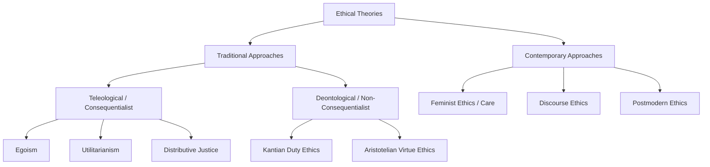

# MMPC-020: Business Ethics and CSR
## Block 1: Ethics and Business — Revision Notes

---

### UNIT 1: BUSINESS ETHICS: AN OVERVIEW

#### 1. Concept and Relevance of Business Ethics
*   **Definition:** Business ethics is the systematic study of business situations, activities, and decisions where issues of right and wrong are addressed based on moral criteria (Andrew Crane & Dirk Matten).
*   **Relevance in Today's World:**
    1.  **Corporate Influence:** Large MNCs (Google, Amazon, etc.) possess massive global influence. Business ethics helps analyze the social implications of this power.
    2.  **Brand & Reputation:** With social media and globalization, brand reputation is vulnerable. Wrongdoing can be exposed and damage a company's market value in minutes.
    3.  **Resource Mobilization:** Today's corporates have highly skilled workforces and vast financial resources to tackle complex social issues (e.g., partnering with the UN for SDGs).
    4.  **Complex Stakeholder Demands:** Growing public skepticism demands that managers balance financial results with stakeholder expectations.

#### 2. Business Ethics vs. Law
*   **Core Distinction:** *"Ethics begins where the law ends."* Law represents the minimum acceptable standard in society, whereas ethics addresses broader moral responsibilities.
| Parameter | Law | Business Ethics |
| :--- | :--- | :--- |
| **Nature** | Codified, written rules, legally binding. | Unwritten, voluntary moral principles. |
| **Scope** | Narrow: Focuses on compliance and civic order. | Broad: Covers grey areas not captured by legal codes. |
| **Examples** | Paying taxes, complying with labor laws. | Being loyal, fair treatment, environmental care beyond laws. |
| **Evolution** | Laws are often the by-product of evolving societal morals (e.g., environmental laws, POSH Act). | Precedes law, driving social reforms and new legislation. |

#### 3. "Business Ethics is an Oxymoron" — A Cynical View
*   **The Concept:** Cynics argue that "business ethics" is a contradiction in terms (an oxymoron), claiming that profit maximization and ethical decision-making are mutually exclusive.
*   **Shareholder vs. Stakeholder Conflict:**
    *   **Shareholder Primacy (Milton Friedman):** The sole "business of business is to do business." Managers should only focus on profit maximization within the law. Engaging in social welfare is seen as a misuse of shareholders' money.
    *   **Stakeholder Primacy (R. Edward Freeman):** Businesses must create value for all stakeholders (employees, customers, suppliers, community, and environment). It is fallacious to separate business from ethics.
*   **Modern Resolution:** Ethical practices are no longer seen as a cost, but as an investment that builds trust, reduces risks, and ensures long-term sustainability.

#### 4. Global Expansion and Consumer Consciousness
*   **Global Permeability:** Globalization has exposed companies to diverse cultural norms, demanding high ethical sensitivity (e.g., marketing practices, gender representation).
*   **Institutional Voids:** Operating in emerging markets with weak legal systems creates ethical blind spots.
*   **Consumer Activism:** The deterritorialization of businesses has triggered global consumer movements. Social media enables consumers to organize boycotts and demand transparency globally (e.g., protesting sweatshops).

---

### UNIT 2: CONCEPTS AND THEORIES OF BUSINESS ETHICS

#### 1. Teleological (Consequentialist) Ethical Theories
*   **Core Idea:** The moral rightness of an action is determined solely by its consequences or outcomes (ends justify the means).
*   **Key Theories:**
    1.  **Egoism:** An action is morally right if it promotes the decision-maker’s long-term self-interest. Adam Smith integrated this with the "invisible hand," arguing that the pursuit of self-interest produces desirable social outcomes (e.g., quality products to retain customers).
    2.  **Utilitarianism (Jeremy Bentham & J.S. Mill):** Advocated the principle of the *"greatest good of the greatest number."* It evaluates actions using a cost-benefit analysis of pleasure vs. pain. Mill emphasized the *quality* of pleasure over mere *quantity* (*"Aristotle dissatisfied is better than a pig satisfied"*).
    3.  **Distributive Justice (John Rawls):** Focuses on the fair distribution of benefits and burdens. Rawls proposed:
        *   **Veil of Ignorance:** Designing a fair society assuming you do not know your own socioeconomic status.
        *   **Difference Principle:** Unequal treatment is justified only if it works to the maximum benefit of the least advantaged (e.g., paid maternity leave, crèches).

#### 2. Deontological (Non-Consequentialist) Ethical Theories
*   **Core Idea:** Actions are inherently right or wrong, independent of their consequences. Morality is based on duty, rules, and principles (means take priority over ends).
*   **Key Theories:**
    1.  **Kantian Ethics (Immanuel Kant):** Based on the concept of goodwill and the **Categorical Imperative**:
        *   *Formula of Universal Law:* Act only on principles you would want to become universal laws ("do unto others as you would want them to do unto you").
        *   *Respect for Persons:* Treat humanity as an end, never merely as a means to an end.
    2.  **Virtue Ethics (Aristotle):** Focuses on individual character rather than rules or outcomes. Aristotle argued that ethical behavior is a habit built through regular practice, developing "ethical memory" to instinctively do the right thing.

#### 3. Contemporary Approaches to Business Ethics
*   **Feminist Ethics (Ethics of Care):** Rejects abstract, male-dominated rights theories. Emphasizes relationships, empathy, community responsibility, and the ethics of care.
*   **Discourse Ethics (Jürgen Habermas):** Proposes that ethical conflicts should be resolved through rational, democratic, and non-coercive dialogue (consensus-building) among all affected parties.
*   **Postmodern Ethics:** Rejects grand moral narratives and absolute rules. Emphasizes the messy reality of individual moral instincts, emotional impulses, and local responsibility in specific contexts.



#### 4. Utility of Ethical Theory in Managerial Decision-Making
*   **Theoretical Grounding:** Theory prevents opinions and individual biases from dominating choices, resolving grey areas like corporate gifts vs. bribes.
*   **Ethical Absolutism vs. Relativism:**
    *   *Absolutism:* Certain moral rules (hyper-norms) are universal (e.g., right to safety).
    *   *Relativism:* No universal rights or wrongs; morality depends on local context (e.g., gift-giving/guanxi in China is relation-building, but viewed as bribery in the US).
    *   *Pluralism (The Middle Path):* Seeking a minimal consensus on fundamental principles in a specific context while respecting diverse moral convictions.

---

### UNIT 3: ETHICAL DILEMMAS

#### 1. Overcoming Ethical Dilemmas in Daily and Managerial Life
*   An ethical dilemma is a situation requiring a choice between competing moral values (e.g., right vs. right or wrong vs. wrong).
*   **Managerial Dilemma Binaries:**
    1.  *Personal Morality vs. Professional Ethics*
    2.  *Individual Welfare vs. Community Welfare*
    3.  *Short Term vs. Long Term*
    4.  *Corporate Need vs. Corporate Greed*
    5.  *Error in Judgment vs. Arrogance*
*   **Joseph Badaracco’s Spheres of Executive Responsibility:** Managers balance four competing commitments:
    1.  *Personal values and ethical identity.*
    2.  *Fiduciary duties to shareholders and rights of employees/customers.*
    3.  *Organizational character and values (virtue ethics).*
    4.  *Pragmatic maneuvers in a value-conflict tug-of-war (acting as "lion" or "fox").*

#### 2. The Ethical Navigation Wheel (Kvalnes & Øverenget)
*   **Definition:** A six-stage tool designed to help leaders navigate moral dilemmas (defined as choices between two wrongs).
```
       [Law: Is it legal?]
               │
  [Ethics: Publicity & Equality] ─── (What do you do?) ─── [Identity: Align with values?]
               │
     [Reputation: Goodwill?] ─── [Economy: Firm profits?] ─── [Morality: Is it right?]
```
*   **The Six Elements:**
    1.  **Law:** Is the action legally acceptable? (The legal minimum).
    2.  **Identity:** Does it align with the core values of the profession/industry?
    3.  **Morality:** Does it feel right? (Based on personal/social upbringing).
    4.  **Reputation:** What is the impact on corporate image and goodwill?
    5.  **Economy:** Does it optimize profit and economic goals?
    6.  **Ethics:** Can it be rationally justified using:
        *   *Principle of Equality:* Treat similar cases equally unless morally different.
        *   *Principle of Publicity:* Would you comfortably defend the action in public?

#### 3. Lynn Paine’s Concept of the Moral Compass
*   Paine suggested a four-frame moral compass to integrate business and ethical conduct:
    1.  **Purpose:** Will this action serve a worthwhile purpose? (Weighing short/long-term consequences).
    2.  **Principles:** Is this action consistent with relevant principles? (Governance, code of conduct, legal obligations).
    3.  **People:** Does this action respect the legitimate claims of the people affected? (Sympathy/empathy for stakeholders).
    4.  **Power:** Do we have the power and authority to act?

#### 4. Kidder’s Nine-Step Checkpoints
*   A structured model to guide ethical decision-making:
    1.  *Recognize the moral issue* (moral sensitivity).
    2.  *Determine the actors* (who is responsible).
    3.  *Gather relevant facts* (minimizing information asymmetry).
    4.  *Test for right vs. wrong* (using legal, stench/smell, front-page, and mom tests).
    5.  *Test for right vs. right paradigms* (truth vs. loyalty, individual vs. community, short vs. long term, justice vs. mercy).
    6.  *Apply resolution principles* (utilitarian, rule-based, or care-based).
    7.  *Investigate "trilemmas"* (explore creative, out-of-the-box middle solutions).
    8.  *Make the decision.*
    9.  *Revisit and reflect.*

---

### UNIT 4: ETHICS IN BUSINESS

#### 1. Individual Factors and Unethical Conduct
*   **The Myth of the "Bad Apple":** Ethical failures are rarely just a result of a corrupt individual. Good people often make bad decisions due to situational and organizational pressures.
*   **Defective Managerial Reasoning (Saul Gellerman's 4 Rationalizations):**
    1.  A belief that the unethical activity is within reasonable legal or ethical limits.
    2.  A belief that it is in the best interest of the individual or the company.
    3.  A belief that the action is "safe" and will never be discovered.
    4.  A belief that the company will condone the action and protect the individual.
*   **Cognitive Biases (Bazerman & Tenbrunsel):**
    *   *Ill-conceived goals:* Setting unrealistic targets that pressure employees to cheat.
    *   *Motivated blindness:* Ignoring unethical behavior when it benefits the firm.
    *   *Indirect blindness:* Delegating dirty work to third parties to avoid responsibility.
    *   *Ethical fading:* Gradual erasure of moral dimensions from decisions due to intense pressure.
    *   *Slippery slope:* Minor moral infractions slowly building into massive scandals.

#### 2. Workplace Ethics and 'Moral Muteness' (Bird & Waters)
*   **Moral Muteness:** A phenomenon where managers act ethically but avoid using moral language or discussing ethics in verbal interactions.
*   **Causes:**
    *   *Conflict avoidance:* Fearing that moral discussions will lead to personalization of issues or corporate friction.
    *   *Image of efficiency:* Fearing that talking about ethics makes them look soft or unpragmatic.
*   **Spillover Effects on Organizational Culture:**
    *   *Moral Amnesia:* Forgetting the ethical foundations of organizational decisions.
    *   *Concept Narrowness:* Morality is restricted to a few rules, ignoring broader responsibilities.
    *   *Moral Stress:* Individual anxiety caused by inability to voice ethical concerns.
    *   *Neglect of Abuses:* Unethical behaviors are overlooked and normalized.

#### 3. Relations Between Government, Business, and Civil Society (CSOs)
*   **Corporate Lobbying:** Companies form interest groups to lobby legislators and donate to political campaigns, influencing public policy in their favor.
*   **The 'Revolving Door' Phenomenon:** The continuous movement of personnel between corporate leadership roles and government regulatory positions.
    *   *Ethical Issue:* Creates conflict of interest, where regulators favor their former/future corporate employers, leading to crony capitalism.
*   **Triangular Tension:**
```
            [Government: Regulator]
                 ╱        ╲
                ╱          ╲
  [Business: Employer] ─── [CSOs: Public Advocate]
```
*   CSOs use social media, campaigns, and protests to challenge corporate power and hold both business and government accountable to society.
