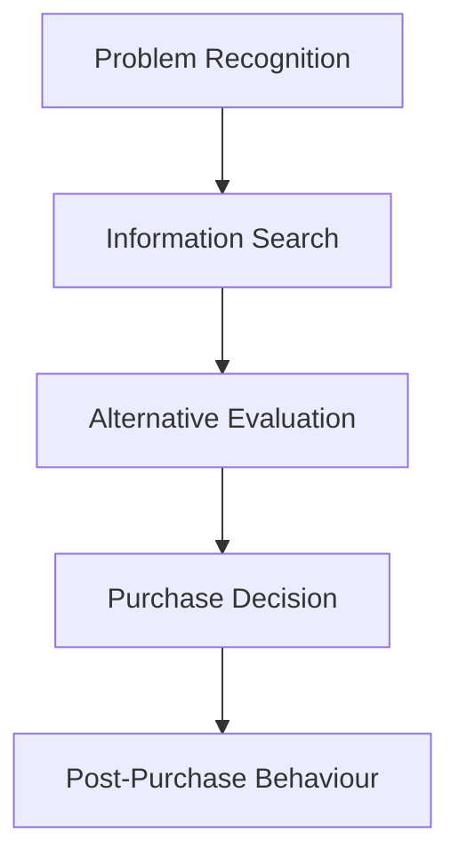

# MMPM-001: Consumer Behaviour
## Block 4: The Buying Process (Hinglish Revision Notes)

---

### UNIT 12: PROBLEM RECOGNITION AND INFORMATION SEARCH BEHAVIOUR

#### 1. Concept of Problem Recognition
*   **Definition:** Consumer ke actual state (existing condition) aur desired state (jo woh chahta hai) ke beech ka perceived gap ya discrepancy.
*   **Problem Recognition Styles:**
    1.  *Assumed Problem Style:* Jab product perform karna band kar deta hai aur tab need realize hoti hai (jaise wrist watch ka band hona).
    2.  *Desire-Driven Style:* Jab purana product sahi chal raha ho par consumer naya product buy karna chahta hai for style/novelty (jaise naya model phone/watch lena).

#### 2. Variation by Involvement Level
*   **High Involvement Purchase:**
    *   *Characteristics:* Expensive, high risk, aur complex decision (jaise passenger car ya flat lena).
    *   *Problem Recognition:* Dheere-dheere develop hota hai aur isme deep evaluation involve hota hai. Consumer ko trigger points yaad rehte hain.
    *   *Marketer Action:* Lifestyle benefits, advanced features ya purane models ki maintenance costs ko highlight karke desired state trigger karein.
*   **Low Involvement Purchase:**
    *   *Characteristics:* Sasta, low risk, routine decision (jaise soap, tea, soft drinks).
    *   *Problem Recognition:* Simple aur quick hota hai, stock-out dekh kar ya counter par impulse se trigger hota hai.
    *   *Marketer Action:* POS displays, attractive packing aur discounts dekar instantly in-store need generate karein.

#### 3. Factors Determining Level of External Information Search
*   **Product Factors:**
    *   *Increases Search:* High price, long interpurchase time (jo durables hain), style changes, market mein bohot sare brands hona.
*   **Situational Factors:**
    *   *Experience:* First-time purchase, category mein past bad experience hona.
    *   *Social Visibility:* Product publically consume hota ho ya gift dena ho.
    *   *Value-Related:* Discretionary purchase, family members ke beech evaluation differences.
*   **Consumer Factors:**
    *   *Demographics:* Highly educated, high income, aur under 35 years of age.
    *   *Personality:* Low risk perceiver, open-minded, aur high category involvement.
*   **Information Overload:** Jacob Jacoby ka concept jo warn karta hai ki agar marketer limits se zyada information dega toh consumer confuse ho kar poor decisions le sakta hai. Marketers ko information overload se bachna chahiye.

---

### UNIT 13: INFORMATION PROCESSING

#### 1. Concept of Information Processing
*   **Definition:** Woh steps jiske through consumer stimuli ko notice karta hai, attend karta hai, interpret karta hai, accept karta hai, aur memory mein save karta hai.
*   **Difference from Learning:** Information processing immediate cognitive reaction hai stimulus ke prati, jabki *learning* experience se aane wala long-term change hai.

#### 2. Five Stages of Information Processing Model
1.  **Exposure:** Kisi stimulus ko sensory receptors ke range mein notice karna.
    *   *Selective Exposure:* Zipping, zapping, muting aur skip ads ke through unwelcomed ads avoid karna.
    *   *Adaptation:* Roz-roz dekhne par stimuli normal lagne lagna aur dhyan na jana (intensity, duration, frequency, relevance isko affect karte hain).
2.  **Attention:** Cognitive capacity ko stimulus par assign karna. markerts isse kaise gain karte hain:
    *   *Contrast:* Background se alag dikhana (jaise colour magazine mein black and white ad).
    *   *Closure:* Incomplete message/jingle banana taaki consumer dimag mein use complete kare (audience engagement increase hota hai).
    *   *Similarity:* Look-alike packaging ya common theme use karna (jaise HUL ka lime Liril soap repackaging).
    *   *Figure-Ground Relationship:* Product (figure) ko dominant banana aur background ko recede karna.
3.  **Comprehension:** Stimulus ko meaning dena aur dimag ki categories mein fit karna (jaise Neem ko Margo soap se connect karna).
4.  **Acceptance / Yielding:** Message se agree ya disagree karna. Consumer resist karne ke liye counter-arguments de sakta hai, source (celebrity) ko target kar sakta hai, ya support evidence dhoodh sakta hai.
5.  **Retention:** Processed information ko future choices ke liye long-term memory (LTM) mein store karna.

---

### UNIT 14: ALTERNATIVE EVALUATION

#### 1. Successive Brand Sets in Evaluation
*   *Total Set:* Market mein available saare brands.
*   *Awareness Set:* Jinke baare mein consumer ko pata hai.
*   *Consideration Set:* Jo criteria check ke baad short-list hote hain aur evaluation ke liye active hote hain.
*   *Inept Set:* Jo negative experience ke karan pehle hi reject ho chuke hain.
*   *Inert Set:* Jinke baare mein consumer neutral hai (na accha, na bura).
*   *Choice Set:* Final short-list jo tough competition mein hain.
*   *Chosen Brand:* Jo product purchase kiya jata hai.

#### 2. Alternative Evaluation / Choice Rules (Heuristics)
*   **Non-Compensatory Rules:** Ek feature ki weakness ko dusra feature compensate nahi kar sakta.
    1.  *Conjunctive Heuristic:* Har attribute par minimum cut-off set kiya jata hai. Agar kisi ek attribute par bhi brand score se peeche raha toh use drop kar diya jata hai.
    2.  *Disjunctive Heuristic:* Sirf key salient attributes ke cut-offs check hote hain. Agar unme exceed kare toh accept ho jata hai.
    3.  *Lexicographic Heuristic:* Sabse important attribute par highest score karne wala brand choose hota hai. Tie hone par second important attribute dekhte hain.
*   **Compensatory Rules:**
    1.  *Linear Compensatory Heuristic:* Strength aur weakness aapas mein balance/compensate hoti hain. Highest total weighted score wala brand select kiya jata hai.
*   **Affect Referral Heuristic:** Past memory aur overall emotional connection par based simple decision (routine response mein sabse common).

---

### UNIT 15: PURCHASE PROCESS AND POST-PURCHASE BEHAVIOUR

#### 1. The 5-Stage Consumer Decision-Making Process

*   *Marketer Intervention:* Marketers ko har stage ke according promotion design karna padta hai: need recognition ke liye attention-grabbing ads, search ke liye site info, evaluation ke liye comparison chart, aur smooth checkout and post-purchase guarantee.

#### 2. Role of Positioning in Launching a New Product
*   **Concept:** Brand ko target market ke minds mein unique status dilwana.
*   **Relevance:**
    *   *Attention:* New product ko market noise se bahar nikalta hai.
    *   *Comprehension:* Consumer ko product class aur USP turant samajh aati hai.
    *   *Attitude & Choice:* Evaluative criteria mein competitive advantage deta hai.

#### 3. Case Study Application: Glow Fair Male Skin Care Products
*   **Key Purchasing Factors:**
    *   *Self-Concept:* Male identity aur metrosexuality se matching, professional confidence badhana.
    *   *Motivation:* Social status aur self-esteem needs fulfill karna.
    *   *Reference Groups:* Peer pressure aur sports/actors ke endorsements se usage normal banana.
    *   *Evaluative Criteria (Attributes):* Non-greasiness, fast absorption, skin tone matching, sunscreen SPF protection, aur masculine scent.
    *   *Situational Influences:* In-store purchase embarrassment se bachne ke liye online buy karna.

#### 4. Theories of Post-Purchase Evaluation (Expectation-Performance Disparity)
1.  **Assimilation Theory:** Consumer performance ko expectations se match karne ke liye apni perception adjust kar leta hai (small gap ko ignore karta hai).
2.  **Contrast Theory:** Consumer har chote gap ko magnify karta hai. Agar product thoda bhi kharab chala toh woh use bilkul bekar samajhta hai. (Under-promise and over-deliver).
3.  **Generalized Negativity Theory:** Koi bhi gap direct negative experience banata hai.
4.  **Assimilation-Contrast Theory:** Minor gaps ko ignore (assimilation) aur major gaps ko zoom-in/magnify (contrast) kiya jata hai.

#### 5. Reducing Cognitive Dissonance
*   **Post-Purchase Dissonance:** Purchase ke baad aane wali anxiety ya regret ki kahin naya brand better na hota.
*   **Consumer Strategies:* Acche reviews dhoodhna, competitors ke ads avoid karna, ya apne product ke strong attributes ko praise karna.
*   **Marketer Strategies:* Reassuring thank-you mails bhejna, warranties badhana, aur post-purchase surveys karna.
