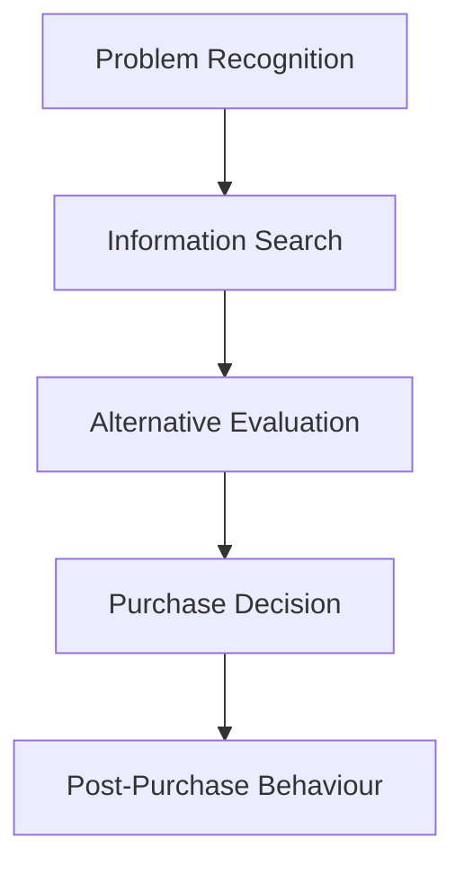

# MMPM-001: Consumer Behaviour
## Block 4: The Buying Process (Revision Notes)

---

### UNIT 12: PROBLEM RECOGNITION AND INFORMATION SEARCH BEHAVIOUR

#### 1. Concept of Problem Recognition
*   **Definition:** The perceived gap or discrepancy between an individual's existing (actual) state and their desired state for a given product or service.
*   **Problem Recognition Styles:**
    1.  *Assumed Problem Style:* Recognition triggered when an existing product fails to perform satisfactorily (e.g., a watch stops keeping time).
    2.  *Desire-Driven Style:* Recognition triggered by a desire for novelty or status, even if the current product works fine (e.g., buying a new model of phone/watch for style/features).

#### 2. Variation by Involvement Level
*   **High Involvement Purchase:**
    *   *Characteristics:* Expensive, high perceived risk, complex decision (e.g., purchasing a passenger car or a house).
    *   *Problem Recognition:* Develops slowly over time, involving deep cognitive evaluation. Consumers can recall the exact triggers and thoughts behind recognizing the need.
    *   *Marketer Action:* Influence the desired state by highlighting lifestyle benefits, advanced features, or highlighting deficiencies in the current state (e.g., high maintenance costs of old cars).
*   **Low Involvement Purchase:**
    *   *Characteristics:* Inexpensive, low perceived risk, routine/frequent decision (e.g., soap, soft drinks).
    *   *Problem Recognition:* Simple, rapid, and often occurs on impulse or due to routine stock-out.
    *   *Marketer Action:* Focus on top-of-mind awareness, point-of-sale (POS) displays, attractive packaging, and pricing discounts to trigger instant need recognition in-store.

#### 3. Factors Determining Level of External Information Search
*   **Product Factors:**
    *   *Increases Search:* High price, long interpurchase time (durable goods), frequent changes in styling/features, many brands in the category, high variation in features.
*   **Situational Factors:**
    *   *Experience:* First-time purchase, lack of past experience, or past unsatisfactory experience.
    *   *Social Visibility:* The product is consumed publicly or purchased as a gift.
    *   *Value-Related:* Discretionary purchase (luxury), conflicting information sources, disagreement among family members.
*   **Consumer Factors:**
    *   *Demographics:* Highly educated, high income, under 35 years of age.
    *   *Personality:* Low risk-perceiver, open-minded, high product involvement, and enjoyment of shopping.
*   **Information Overload:** Jacob Jacoby's concept warning that providing too much product/brand information can confuse consumers and lead to poorer decisions, rather than better ones. Marketers must optimize, not maximize, information load.

---

### UNIT 13: INFORMATION PROCESSING

#### 1. Concept of Information Processing
*   **Definition:** The series of steps through which a consumer is exposed to marketing stimuli, attends to them, comprehends them, accepts/yields to them, and retains them in memory.
*   **Difference from Learning:** Information processing is the immediate cognitive path of receiving and analyzing stimuli, whereas *learning* is a long-term change in behavior/associations resulting from that processing and experience.

#### 2. Five Stages of Information Processing Model
1.  **Exposure:** The degree to which a consumer notices a stimulus within the range of sensory receptors.
    *   *Selective Exposure:* Active avoidance of messages (zipping, zapping, muting, skipping ads) or noticing only what is personally relevant (perceptual vigilance).
    *   *Adaptation:* Consumers get habituated to a stimulus over time and stop noticing it. Driven by *intensity, duration, discrimination, frequency, and relevance*.
2.  **Attention:** The allocation of cognitive capacity to a stimulus. Marketers capture attention using:
    *   *Contrast:* Setting a stimulus apart from its surroundings (e.g., black-and-white ads, unique sizes).
    *   *Closure:* Relying on the consumer's tendency to mentally complete incomplete stimuli (e.g., incomplete jingles, mystery headlines), which increases engagement.
    *   *Similarity:* Grouping look-alike items (e.g., unifying product lines with similar lime/fresh themes).
    *   *Figure-Ground Relationship:* Making the main product (figure) dominate while the surrounding context recedes into the background.
3.  **Comprehension:** Assigning meaning to the stimulus by placing it into familiar cognitive categories (e.g., associating Neem with soap brand Margo).
4.  **Acceptance / Yielding:** Agreening or disagreeing with the message. Consumers may resist persuasion by generating counter-arguments, attacking the source (discrediting the spokesperson), or seeking support evidence.
5.  **Retention:** Storing the processed information in long-term memory for future retrieval during decision-making.

---

### UNIT 14: ALTERNATIVE EVALUATION

#### 1. Successive Brand Sets in Evaluation
*   *Total Set:* All existing brands in the market.
*   *Awareness Set:* Brands the consumer is aware of.
*   *Consideration Set:* Brands meeting initial criteria that are actively evaluated.
*   *Inept Set:* Brands dropped immediately due to unsuitability or past bad experience.
*   *Inert Set:* Brands towards which the consumer is indifferent (no positive or negative feelings).
*   *Choice Set:* The final strong contenders under intensive consideration.
*   *Chosen Brand:* The ultimate selection.

#### 2. Alternative Evaluation / Choice Rules (Heuristics)
*   **Non-Compensatory Rules:** Weakness in one attribute *cannot* be compensated by strength in another.
    1.  *Conjunctive Heuristic:* Consumer sets minimum cut-off points for each attribute. A brand is rejected if it fails to meet the cut-off on *any single* attribute (weighs negative info heavily).
    2.  *Disjunctive Heuristic:* Consumer sets minimum cut-offs only for key salient attributes. A brand is accepted if it exceeds the cut-off on at least one dominant attribute.
    3.  *Lexicographic Heuristic:* Attributes are ranked in order of importance. The brand scoring highest on the single most important attribute is selected. If there is a tie, the second most important attribute is evaluated.
*   **Compensatory Rules:**
    1.  *Linear Compensatory Heuristic:* Strength on one attribute offsets/compensates for weakness on another (e.g., high price compensated by excellent fuel economy). The brand with the highest weighted score is selected.
*   **Affect Referral Heuristic:** The simplest rule. The consumer relies on past holistic feelings and overall experience stored in memory rather than evaluating individual attributes (highly common in routine response behavior).

---

### UNIT 15: PURCHASE PROCESS AND POST-PURCHASE BEHAVIOUR

#### 1. The 5-Stage Consumer Decision-Making Process

*   *Marketer Intervention:* Marketers must align promotional messages with each stage: using attention-getting ads for need recognition, search tools/websites for information search, comparison matrices for evaluation, smooth checkout/in-store retail help for purchase, and prompt customer support to secure positive post-purchase outcomes.

#### 2. Role of Positioning in Launching a New Product
*   **Concept:** Distinctly placing the brand/product in the target consumers' minds relative to competitors.
*   **Relevance:**
    *   *Attention:* Helps a new product break through information clutter.
    *   *Comprehension:* Allows consumers to quickly categorize what the product does and why they need it.
    *   *Attitude & Choice:* Directly feeds into the choice heuristics by highlighting the most important attribute (Lexicographic focus) or showing how it outperforms competitors.

#### 3. Case Study Application: Glow Fair Male Skin Care Products
*   **Key Purchasing Factors:**
    *   *Self-Concept:* Driven by shifts in male identity (metrosexuality); grooming is aligned with professional success and social confidence.
    *   *Motivation:* Fulfilling social/esteem needs (desiring healthy skin, professional appearance).
    *   *Reference Groups:* Peer approval and celebrity/athlete endorsements normalize the usage of male cosmetics.
    *   *Evaluative Criteria (Attributes):* Non-greasiness, rapid absorption, skin-tone matching, sun protection, and masculine fragrance.
    *   *Situational Influences:* Purchase might occur online (non-store buying) to avoid retail embarrassment, or be triggered by antecedent states (preparing for job interviews/dates).

#### 4. Theories of Post-Purchase Evaluation (Expectation-Performance Disparity)
1.  **Assimilation Theory:** Consumers minimize any small gap between expectations and performance by adjusting their perception of the product's performance to match their expectations.
2.  **Contrast Theory:** Consumers magnify any disparity. If performance falls slightly short, they evaluate it as extremely poor. (Under-promise and over-deliver).
3.  **Generalized Negativity Theory:** Any disparity between expectation and performance leads to a general negative emotional state.
4.  **Assimilation-Contrast Theory:** Minor disparities are assimilated (ignored/minimized), while major disparities are contrasted (magnified).

#### 5. Reducing Cognitive Dissonance
*   **Post-Purchase Dissonance:** The feeling of anxiety or regret after making a purchase decision, wondering if the alternative brand would have been better.
*   **Consumer Strategies:** Seeking positive reviews of the chosen brand, avoiding ads of rejected brands, or downplaying the importance of attributes where the chosen brand is weak.
*   **Marketer Strategies:** Sending reassuring thank-you emails, offering clear instructions for product use, providing solid warranties, and advertising post-purchase satisfaction testimonials.
