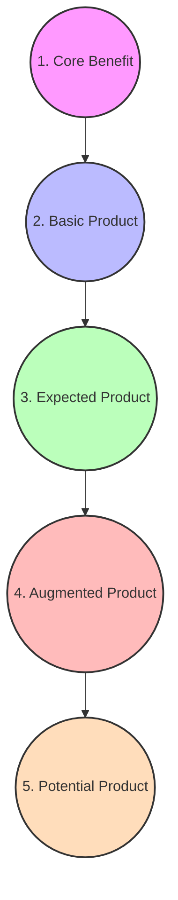
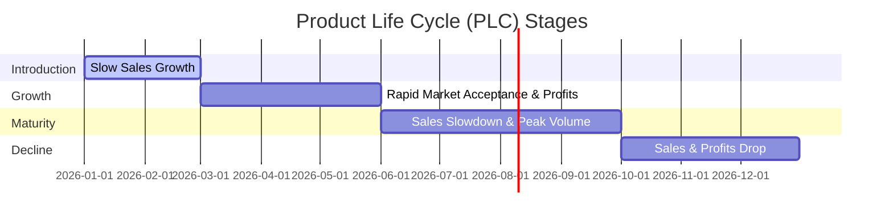
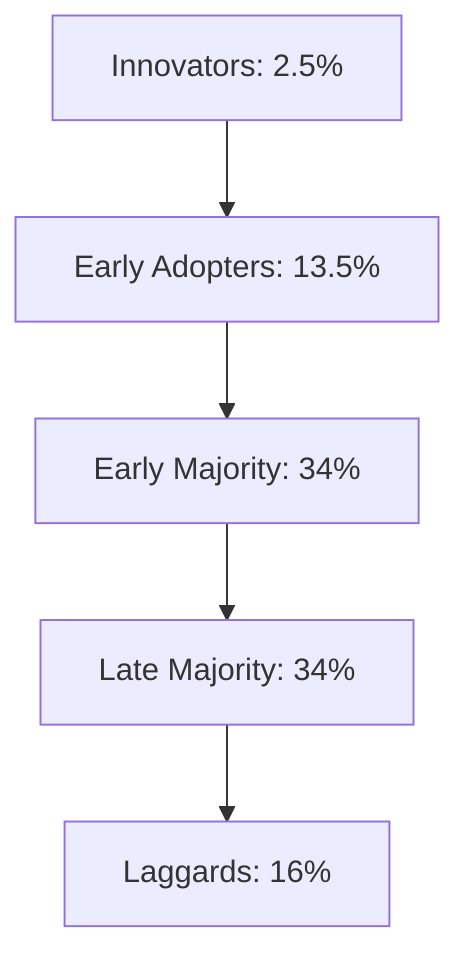
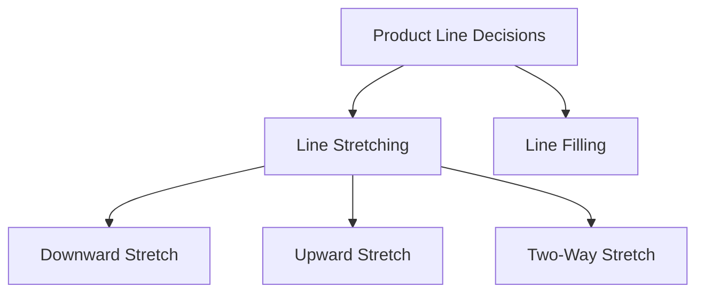

# Block 1 Notes: Product Management & Product Decisions
## Exam Revision Notes in Hinglish (High-Yield Sheet)

## Unit 1: Basic Concepts of Product and Product Planning

### What is a Product? (Product Kya Hai?)
A **Product** aisi koi bhi cheez hai jo market me kisi want ya need ko satisfy karne ke liye offer ki ja sakti hai. Isme physical goods, services, experiences, events, persons, places, properties, organizations, information, aur ideas sabhi shaamil hote hain.

---

### Levels of Product (Kotler's 5 Levels vs. Grönroos's 3 Levels)

#### Kotler's 5-Level Model
Marketers apne product offering ko plan karne ke liye paanch concentric (ek ke andar ek) levels ke baare me sochte hain:
1. **Core Benefit**: Wo fundamental service ya benefit jo customer actually khareed raha hai.
   * *Example*: Ek hotel guest basically "rest/sleep" khareedta hai.
2. **Basic Product**: Core benefit ke charo taraf jo actual physical product build kiya jata hai.
   * *Example*: Ek hotel room me bed, bathroom, towel, desk, aur closet ka hona.
3. **Expected Product**: Attributes aur conditions ka wo set jo buyers normal circumstances me purchase karte waqt expect karte hain.
   * *Example*: Clean bedsheets, fresh towels, working lamps, aur thodi quietness/shanti.
4. **Augmented Product**: Customer expectations se aage badhkar brand positioning, additional services, aur extra benefits offer karna jo product ko competitors se alag banate hain.
   * *Example*: Free high-speed Wi-Fi, complimentary breakfast, ya premium room service dena.
5. **Potential Product**: Wo saare possible augmentations aur transformations jo product ya offering future me undergo kar sakta hai.
   * *Example*: In-room virtual reality entertainment ya customizable smart-room settings.



#### Grönroos's 3-Level Service Product Model
Ye model khaaskar services par apply hota hai:
* **Core Service**: Customer ke purchase karne ki main wajah (e.g., flight transportation).
* **Facilitating Services**: Mandatory services jo core service ko consume karne ke liye zaroori hoti hain (e.g., check-in desk, baggage handling).
* **Supporting Services**: Value-adding extras jo service ko differentiate karne me help karte hain (e.g., in-flight meals, premium lounge access).

---

### Product Management Function: Meaning & Scope
Product Management ek organizational lifecycle function hai jo company ke andar product ke planning, forecasting, aur production/marketing ko product lifecycle ke sabhi stages par manage karta hai.
* **Scope**: Isme market research, competitive analysis, product development roadmap, pricing, launching, positioning, packaging, aur product pruning (hataana) sabhi shaamil hain.
* **Organizational Setup (The McElroy Brand Memo)**: Iski shuruat Procter & Gamble me 1931 me Neil McElroy ke memo se hui thi, jisme unhone "Brand Men" ke concept ki wakaalat ki thi jo brand ki marketing aur sales ki poori responsibility lete hain. Ye aamtaur par ek **matrix structure** me organized hota hai jahan product managers functional departments (sales, R&D, production) ke sath bina direct authority ke coordinate karte hain.

---

### Differences: Product vs. Brand (Product aur Brand me Antar)
| Dimension | Product | Brand |
| :--- | :--- | :--- |
| **Definition** | Ek tangible item ya service jo kisi need ko satisfy karne ke liye banaya/offer kiya jata hai. | Ek unique identity (name, logo, design) jo product ko differentiate karti hai. |
| **Creation** | Ye factory ya operational unit me banta hai. | Ye customer ke dimaag (mind) me marketing aur experience se banta hai. |
| **Imitability** | Competitors ise easily copy ya duplicate kar sakte hain. | Unique hota hai; trademark laws aur goodwill se protected hota hai. |
| **Lifespan** | Obsolete ya outdated ho sakta hai (finite life hoti hai). | Agar achhe se manage kiya jaye toh hamesha zinda reh sakta hai. |
| **Value** | Physical utility aur attributes se value milti hai. | Emotional connection, trust, aur reputation (equity) se value milti hai. |

---

### Product Classification (Product ka Vargikaran)

#### 1. Consumer Goods (Consumer ke shopping habits ke basis par)
* **Convenience Goods**: Jo bina kisi effort ke, frequently aur turant khareede jaate hain.
  * *Staples* (e.g., milk, bread), *Impulse goods* (e.g., checkout counter ke paas chocolates), *Emergency goods* (e.g., baarish me chhati/umbrella).
* **Shopping Goods**: Aise goods jise customer suitability, quality, price, aur style ke basis par compare karke khareedta hai.
  * *Homogeneous shopping goods* (similar quality par different prices, e.g., refrigerators), *Heterogeneous shopping goods* (features me farq hota hai, e.g., kapde/clothing).
* **Specialty Goods**: Aise goods jinki unique characteristics ya brand identification hoti hai aur customer inke liye special purchasing effort lagane ko tayyar rehta hai.
  * *Example*: Rolex watches, luxury sports cars.
* **Unsought Goods**: Jinke baare me consumer ko aamtaur par pata nahi hota ya wo normally unhe khareedne ke baare me nahi sochta.
  * *Example*: Life insurance, smoke detectors, encyclopedias.

#### 2. Industrial Goods (Production process me use ke basis par)
* **Materials and Parts**: Wo goods jo manufacturer ke finished product me poori tarah enter ho jaate hain.
  * *Raw Materials*: Farm products (wheat, cotton) aur natural products (oil, iron ore).
  * *Manufactured Materials and Parts*: Component materials (steel, cement) aur component parts (microchips, tires).
* **Capital Items**: Long-lasting goods jo finished product ko develop ya manage karne me help karte hain.
  * *Installations* (factories, heavy machinery) aur *Equipment* (hand tools, computers).
* **Supplies and Business Services**: Short-term goods aur services jo finished product ke operation aur management ko facilitate karte hain.
  * *Supplies*: Operating supplies (paper, coal) aur maintenance/repair items (paint, nails).
  * *Services*: Maintenance/repair services aur business advisory services.

---

### Services Differentiation
Services ki intangibility, inseparability, variability, aur perishability ko overcome karne ke liye firms in methods se differentiate karti hain:
* **Ordering Ease**: Customer ke liye order place karna kitna easy hai (e.g., online portals).
* **Delivery**: Delivery ke dauran speed, accuracy, aur customer care.
* **Installation**: Product ka professional setup (e.g., AC installation).
* **Customer Training**: Customer ke employees ko equipment effectively use karne ke liye train karna.
* **Customer Consulting**: Buyers ko data, information systems, aur advice offer karna.
* **Maintenance and Repair**: Products ko working order me rakhne ke liye maintenance service program.

---

### Labelling: Concept and Functions
**Labelling** product ke package par written, electronic, ya graphic communication ka display hota hai.
* **Functions**:
  1. Product ya brand ko identify karta hai (e.g., *Tide* brand name).
  2. Product ko grade karta hai (e.g., canned peaches graded A, B, and C).
  3. Product ko describe karta hai (kisne banaya, kahan, kab, contents, usage directions, safety warnings).
  4. Attractive graphics aur copy ke zariye product ko promote karta hai.
* **Example**: Food packaging par Nutritional Facts label jo calories, ingredients, aur allergy warnings dikhata hai, jo regulatory compliance aur promotional transparency dono ka kaam karta hai.

---
---

## Unit 2: Product Life Cycle (PLC)

### Product Life Cycle Stages
Har product ya brand samay ke sath industry sales aur profits ke different stages se guzarta hai.



| PLC Stage | Characteristics | Strategic Objective | Marketing Mix Strategies |
| :--- | :--- | :--- | :--- |
| **Introduction** | Low sales, high cost per customer, negative/low profits, very few competitors. | Product awareness aur trial generate karna. | **Product**: Basic product.<br>**Price**: Skimming ya Penetration.<br>**Distribution**: Selective.<br>**Promo**: Innovators me awareness badhane ke liye heavy advertising. |
| **Growth** | Rapidly rising sales, average cost per customer, rising profits, growing competitors. | Market share ko maximize karna. | **Product**: Extensions, service, warranty.<br>**Price**: Market penetrate karne ke liye low price.<br>**Distribution**: Intensive.<br>**Promo**: Brand awareness se shift hokar brand preference banana. |
| **Maturity** | Peak sales, low cost per customer, high/declining profits, stable/declining competitors. | Market share ko defend karte hue profit maximize karna. | **Product**: Brand, features, style ko modify karna.<br>**Price**: Competitors ke price ko match ya beat karna.<br>**Distribution**: Zyaada intensive.<br>**Promo**: Brand differentiation aur loyalty programs par focus. |
| **Decline** | Declining sales, low cost per customer, declining profits, declining competitors. | Spends kam karna aur brand ko harvest (milk) karna. | **Product**: Weak items ko phase out karna.<br>**Price**: Price cut karna.<br>**Distribution**: Go selective (unprofitable outlets band karna).<br>**Promo**: Minimal level tak reduce karna. |

---

### Rogers' Diffusion of Innovation Theory
Ye theory batati hai ki kaise koi naya idea, technology, ya product kisi social system me spread (diffuse) hota hai.



1. **Innovators (2.5%)**: Risk lene ke liye tayyar, venturesome, tech-savvy jo products ko turant khareedte hain. *Example*: Naye tech products ke liye raat bhar queue me lagne wale log.
2. **Early Adopters (13.5%)**: Opinion leaders jo soch-samajhkar par jaldi adopt karte hain; respect-driven hote hain. *Example*: YouTube tech reviewers aur influencers.
3. **Early Majority (34%)**: Deliberate aur pragmatist log jo average logo se pehle adopt karte hain par utility ka proof chahte hain. *Example*: Utility dekhne ke baad smart watches adopt karne wale urban professionals.
4. **Late Majority (34%)**: Skeptical log jo tabhi adopt karte hain jab majority ise try aur test kar chuki hoti hai. *Example*: Social pressure ke baad smartphones adopt karne wale bade-buzurg.
5. **Laggards (16%)**: Traditionalist log jo change ko pasand nahi karte aur tabhi adopt karte hain jab purani cheez chalna band ho jaye (obsolescence). *Example*: Tab tak feature phone chalane wale log jab tak 2G/3G network band na ho jaye.

---

### Case Study: Cell Phone Industry PLC & Marketer Strategies
* **Current Stage**: Global aur Urban smartphone markets abhi **Maturity Stage** me hain (market saturation ho chuki hai, demand replacement-driven hai, high price competition hai, aur features homogeneous hain).
* **Marketer Sustainability Strategies**:
  * **Product Differentiation**: Focus ab AI integrations (e.g., Apple Intelligence, Google Gemini), foldable screens, advanced camera capabilities, aur ecosystem lock-in (e.g., smartwatches, cloud storage) par hai.
  * **Price Optimization**: High volume secure karne ke liye ultra-premium category ke sath mid-tier aur budget-friendly options offer karna.
  * **Value-Added Services**: Hardware margin ke bajaye ab software service revenues (App stores, Apple Music, cloud services, aur wallets) par focus shift ho raha hai.

---
---

## Unit 3: Product Line Decisions

### Definitions (Paribhashayein)
* **Product Line**: Closely related products ka ek group (similar functions, same customer groups, same outlets ya similar price range wale products).
  * *Example (HUL)*: Bath soaps ki line (Dove, Liril, Pears, Rexona, Lux, Lifebuoy).
* **Product Mix (Product Assortment)**: Kisi particular seller dwara offer kiye jaane wale saare product lines aur items ka set.
  * **Width**: Company kitne different product lines carry karti hai (e.g., Soaps, Detergents, Oral Care, Beverages).
  * **Length**: Lines me total kitne items hain (e.g., 6 soap brands, 4 detergent brands).
  * **Depth**: Line ke har product ke kitne variants offered hain (e.g., Lux soap 5 fragrances aur 3 sizes me available hai).
  * **Consistency**: Alag-alag lines end-use, production, ya distribution me aapas me kitni closely related hain.

---

### Product Line Extensions (Stretching vs. Filling)



* **Line Stretching**: Kisi product line ko uski current range se aage lengthen (stretch) karna.
  * **Downward Stretch**: Competitors ko block karne ya mass market capture karne ke liye lower-priced item introduce karna (e.g., HUL dwara *Nirma* ko counter karne ke liye *Wheel* detergent launch karna).
  * **Upward Stretch**: High margin ya prestige ke liye premium market me enter karna (e.g., Toyota dwara *Lexus* brand launch karna).
  * **Two-Way Stretch**: Mid-market firm ka premium aur budget dono directions me stretch hona (e.g., Haier ka mid-range refrigerators se start karke budget 170L aur premium 688L models launch karna).
* **Line Filling**: Current range ke gaps ko plug karne, capacity utilize karne, ya competitors ko counter karne ke liye aur items add karna (e.g., *Good Knight* dwara coils, mats, liquids, aur cards me mosquito repellents launch karna). *Risk*: **Cannibalization** (naya item purane item ki sales ko kha jata hai).
* **Line Pruning**: Product line profits ko optimize karne ke liye unprofitable/deadwood items ko identify karke hataana (prune karna).

---

### Basis for Line Extensions (Pros and Cons)
* **Advantages**:
  * Low-cost aur low-risk tarike se diverse customer needs ko satisfy karna.
  * Retail shelves par "billboard effect" create karna, jisse brand visibility maximize hoti hai.
  * Pricing breadth milti hai: alag-alag price points offer karne ki capability.
  * Excess manufacturing capacity utilize hoti hai.
* **Disadvantages / Risks**:
  * **Weaker Line Logic**: Line bohot cluttered ho jaati hai aur consumers confuse ho jaate hain.
  * **Cannibalization**: Naye items core brand ke hi market share ko kam karte hain.
  * **Lower Brand Loyalty**: Variety-seeking behaviour ke karan customers brand switch karne lagte hain.
  * **Trade Friction**: Retailers shelf space restrict kar dete hain aur slotting ya failure fees charge karte hain.

---

### Maruti Suzuki Passenger Car Line Extensions
Maruti Suzuki Indian automobile market ke har segment ko cater karne ke liye systematic stretching aur filling ka use karti hai:
* **Downward/Entry level**: Alto, S-Presso.
* **Mid-tier hatchbacks/sedans**: WagonR, Swift, Dzire.
* **Upward Stretch (Nexa Outlets)**: Ciaz, Grand Vitara, Invicto, Baleno.
* **Key Factors Considered**: Customer segmentation (income groups), car length ke basis par tax brackets, fuel efficiency expectations, aur Hyundai/Tata ke against defensive strategy.

---

### Case Study: Indian Detergent Lines Analysis & Rationalization
* **HUL**: *Surf Excel* (premium), *Rin* (mid-market), *Wheel* (mass-market).
* **P&G**: *Ariel* (premium), *Tide* (mid-market).
* **Nirma**: *Nirma* (mass-market), *Super Nirma* (mid-market).
* **Rationalization & Drop Suggestion**:
  * *HUL/P&G* ko purane, low-margin detergent bars (jinki production aur logistics cost high hai) ko phase out/drop kar dena chahiye aur unhe liquid detergents ya pods se replace karna chahiye, kyunki rural aur semi-urban India me washing machine penetration tezi se badh raha hai.
  * *Nirma* ko apne overlapping mid-tier soap formulations ko drop kar dena chahiye jo *Super Nirma* ke sath conflict karte hain, taaki wo core mass-market detergent powder ko defend karne me resources lagayein.

---
---

## Unit 4: Product Portfolio

### Balancing a Product Portfolio
Ek balanced portfolio me cash-generating businesses (growth fund karne ke liye) aur future-growth businesses (aging products ko replace karne ke liye) dono hone chahiye. Marketers ko inme balance banana hota hai:
* **Cash Flow**: Cash users (stars/question marks) ko cash generators (cows) ke sath match karna.
* **Lifecycle Balance**: Development ke har stage par products ka hona.
* **Risk & Return**: High-risk innovations ya stagnant commodities par over-index na karna.

---

### BCG Growth-Share Matrix
Ye 2x2 matrix SBUs ko **Relative Market Share** (logarithmic scale, competitive position) aur **Market Growth Rate** (linear scale, market attractiveness) ke basis par classify karta hai.

```
           Relative Market Share (Log Scale)
                High          Low
           +-------------+-------------+
      High |    STARS    |  QUESTION   |
           |             |    MARKS    |
Market    +-------------+-------------+
Growth    |    CASH     |    DOGS     |
      Low  |    COWS     |             |
           +-------------+-------------+
```

* **Stars**: High market share, high growth. Leadership maintain karne ke liye heavy investment demand karte hain.
* **Cash Cows**: High market share, low growth. Excess cash generate karte hain; inhe milk karke Stars aur select Question Marks ko fund karna chahiye.
* **Question Marks**: Low market share, high growth. Share build karne ke liye heavy cash chahiye, ya fir inko divest kar dena chahiye.
* **Dogs**: Low market share, low growth. Negative/low cash generate karte hain; inhe harvest, divest ya liquidate kar dena chahiye.

---

### GE McKinsey Multi-Attribute Grid
Ye 3x3 matrix **Industry Attractiveness** (size, growth, profitability, competition ka composite index) aur **Business Strength** (market share, brand image, R&D capability, management quality ka composite index) ke basis par kaam karta hai.

* **Differences from BCG Matrix (BCG Matrix se farq)**:
  * BCG single dimensions (Growth & Market Share) use karta hai; GE composite multi-factor indices use karta hai.
  * GE ek 3x3 matrix hai (9 cells: High/Med/Low vs. Strong/Avg/Weak); BCG ek 2x2 matrix hai (4 cells).
  * GE zyaada detailed strategic directions deta hai (Invest/Build, Selective Harvest, Divest) bajaye rigid cash-based quadrants ke.

---

### PIMS Model (Profit Impact of Market Strategies)
Ye ek empirical model hai jo 2,000 se zyaada businesses ke database analysis par based hai (Strategic Planning Institute dwara coordinated).
* **Key Finding**: Product profitability market share se highly correlated hai. Market share me 10% ki growth ROI me 5% ki increase se linked hoti hai.
* **Mechanisms**: Experience curve cost reductions, purchasing power, aur economies of scale.

---

### Display Matrices: Utility and Limitations
* **Utility**:
  * SBU diversity aur cash-flow balances ka ek clear visual representation deta hai.
  * Systematic resource allocation aur strategic direction planning ko facilitate karta hai.
  * Underperforming products ko divestment ke liye identify karne me help karta.
* **Limitations**:
  * "Served market" kaise defined hai, ispar matrix highly sensitive hota hai.
  * SBUs ke beech ki synergies aur experience transfer ko ignore karta hai (e.g., ek "Dog" brand kisi "Star" brand ko critical technology/materials provide kar raha ho sakta hai).
  * Organizational aur human factors ko ignore karta hai (e.g., cash-cow milking par managers ka resist karna ya workers ka dog divestment ko oppose karna).
  * Subjective ho sakta hai (khaaskar GE Grid weights).
