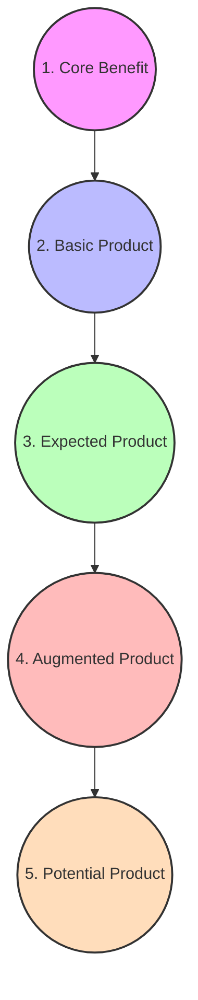
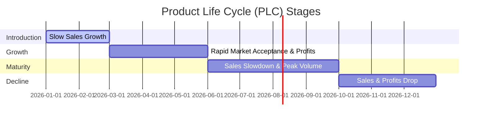
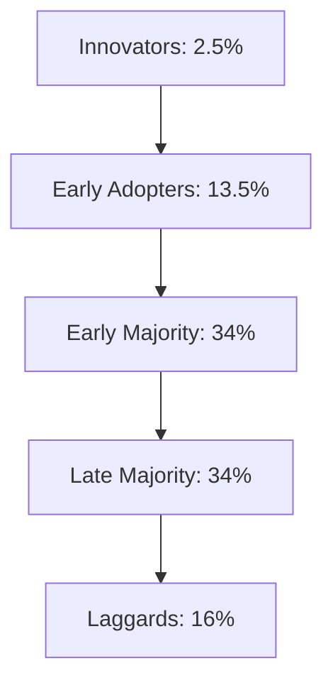
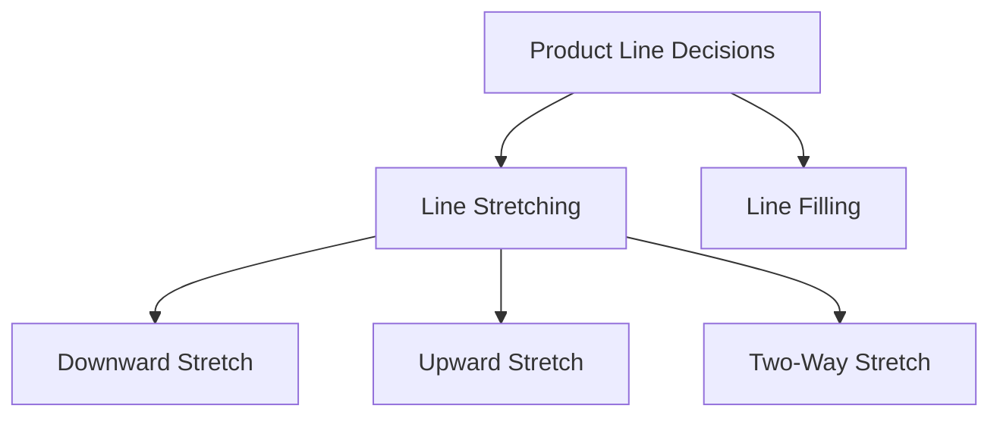

# Block 1 Notes: Product Management & Product Decisions

## Unit 1: Basic Concepts of Product and Product Planning

### What is a Product?
A **Product** is anything that can be offered to a market to satisfy a want or need, including physical goods, services, experiences, events, persons, places, properties, organizations, information, and ideas.

---

### Levels of Product (Kotler's 5 Levels vs. Grönroos's 3 Levels)

#### Kotler's 5-Level Model
Marketers plan their product offering by thinking through five concentric levels:
1. **Core Benefit**: The fundamental service or benefit the customer is buying. 
   * *Example*: A hotel guest buys "rest/sleep".
2. **Basic Product**: The actual physical product built around the core benefit.
   * *Example*: A hotel room includes a bed, bathroom, towel, desk, and closet.
3. **Expected Product**: A set of attributes and conditions buyers normally expect when they purchase this product.
   * *Example*: Clean bedsheets, fresh towels, working lamps, and relative quietness.
4. **Augmented Product**: Exceeding customer expectations by offering brand positioning, additional services, and benefits that distinguish the offer from competitors.
   * *Example*: Free high-speed Wi-Fi, complimentary breakfast, or premium room service.
5. **Potential Product**: All the possible augmentations and transformations the product or offering might undergo in the future.
   * *Example*: In-room virtual reality entertainment or customizable smart-room settings.



#### Grönroos's 3-Level Service Product Model
Particularly applicable to services:
* **Core Service**: The main reason for the customer's purchase (e.g., flight transportation).
* **Facilitating Services**: Mandatory services required to consume the core service (e.g., check-in desk, baggage handling).
* **Supporting Services**: Value-adding extras to differentiate the service (e.g., in-flight meals, premium lounge access).

---

### Product Management Function: Meaning & Scope
Product Management is an organizational lifecycle function within a company dealing with the planning, forecasting, and production/marketing of a product at all stages of the product lifecycle. 
* **Scope**: Encompasses market research, competitive analysis, product development roadmap, pricing, launching, positioning, packaging, and pruning.
* **Organizational Setup (The McElroy Brand Memo)**: Originated at Procter & Gamble (1931 Neil McElroy memo) advocating for "Brand Men" who take full ownership of a brand's marketing and sales success. Typically organized in a **matrix structure** where product managers coordinate with functional departments (sales, R&D, production) without having direct authority over them.

---

### Differences: Product vs. Brand
| Dimension | Product | Brand |
| :--- | :--- | :--- |
| **Definition** | A tangible item or service manufactured/offered to satisfy a need. | A unique identity (name, logo, design) that distinguishes a product. |
| **Creation** | Made in a factory/operational unit. | Created in the mind of the consumer through marketing and experience. |
| **Imitability** | Can be easily copied or duplicated by competitors. | Unique; protected by trademark laws and proprietary goodwill. |
| **Lifespan** | Can become obsolete or outdated (finite life). | Can remain timeless and live forever if managed well. |
| **Value** | Derived from physical utility/attributes. | Derived from emotional connection, trust, and reputation (equity). |

---

### Product Classification

#### 1. Consumer Goods (Based on shopping habits)
* **Convenience Goods**: Purchased frequently, immediately, and with minimal effort. 
  * *Staples* (e.g., milk, bread), *Impulse goods* (e.g., chocolates near checkout), *Emergency goods* (e.g., umbrellas in rain).
* **Shopping Goods**: Goods that the customer characteristically compares on bases such as suitability, quality, price, and style.
  * *Homogeneous shopping goods* (similar quality but different prices, e.g., refrigerators), *Heterogeneous shopping goods* (different product features, e.g., clothing).
* **Specialty Goods**: Goods with unique characteristics or brand identification for which a significant group of buyers is willing to make a special purchasing effort. 
  * *Example*: Rolex watches, luxury sports cars.
* **Unsought Goods**: Consumer does not know about or does not normally think of buying.
  * *Example*: Life insurance, smoke detectors, encyclopedias.

#### 2. Industrial Goods (Based on how they enter the production process)
* **Materials and Parts**: Goods that enter the manufacturer's product completely.
  * *Raw Materials*: Farm products (wheat, cotton) and natural products (oil, iron ore).
  * *Manufactured Materials and Parts*: Component materials (steel, cement) and component parts (microchips, tires).
* **Capital Items**: Long-lasting goods that facilitate developing or managing the finished product.
  * *Installations* (factories, heavy machinery) and *Equipment* (hand tools, computers).
* **Supplies and Business Services**: Short-term goods and services that facilitate developing or managing the finished product.
  * *Supplies*: Operating supplies (paper, coal) and maintenance/repair items (paint, nails).
  * *Services*: Maintenance/repair services and business advisory services.

---

### Services Differentiation
To overcome the intangibility, inseparability, variability, and perishability of services, firms differentiate through:
* **Ordering Ease**: How easy it is for a customer to place an order (e.g., online portals).
* **Delivery**: Speed, accuracy, and customer care during delivery.
* **Installation**: Professional setup of the product (e.g., AC installation).
* **Customer Training**: Training customer employees to use equipment effectively.
* **Customer Consulting**: Data, information systems, and advice services offered to buyers.
* **Maintenance and Repair**: Help program for keeping products in good working order.

---

### Labelling: Concept and Functions
**Labelling** is the display of written, electronic, or graphic communication on the product's packaging.
* **Functions**:
  1. Identifies the product or brand (e.g., the name *Tide*).
  2. Grades the product (e.g., canned peaches graded A, B, and C).
  3. Describes the product (who made it, where, when, contents, usage directions, safety warnings).
  4. Promotes the product through attractive graphics and promotional copy.
* **Example**: Nutritional Facts label on food packaging, displaying caloric content, ingredients, and allergen warnings, serving both regulatory compliance and promotional transparency.

---
---

## Unit 2: Product Life Cycle (PLC)

### Product Life Cycle Stages
Every product/brand progresses through a sequence of stages representing industry sales and profits over time.



| PLC Stage | Characteristics | Strategic Objective | Marketing Mix Strategies |
| :--- | :--- | :--- | :--- |
| **Introduction** | Low sales, high cost per customer, negative/low profits, few competitors. | Create product awareness and trial. | **Product**: Basic product.<br>**Price**: Skimming or Penetration.<br>**Distribution**: Selective.<br>**Promo**: Heavy advertising to build awareness among innovators. |
| **Growth** | Rapidly rising sales, average cost per customer, rising profits, growing competitors. | Maximize market share. | **Product**: Extensions, service, warranty.<br>**Price**: Price to penetrate market.<br>**Distribution**: Intensive.<br>**Promo**: Shift from awareness to brand preference. |
| **Maturity** | Peak sales, low cost per customer, high/declining profits, stable/declining competitors. | Maximize profit while defending market share. | **Product**: Modify brand, features, style.<br>**Price**: Match or beat competitors.<br>**Distribution**: More intensive.<br>**Promo**: Emphasize brand differentiation and loyalty programs. |
| **Decline** | Declining sales, low cost per customer, declining profits, declining competitors. | Reduce expenditure and milk/harvest the brand. | **Product**: Phase out weak items.<br>**Price**: Cut price.<br>**Distribution**: Go selective (phase out unprofitable outlets).<br>**Promo**: Reduce to minimal level. |

---

### Rogers' Diffusion of Innovation Theory
Explains how new ideas, technologies, or products spread through a social system.



1. **Innovators (2.5%)**: Venturesome, willing to take risks, tech-savvy, buy products immediately. *Example*: People queuing overnight for experimental tech releases.
2. **Early Adopters (13.5%)**: Opinion leaders, respect-driven, adopt early but carefully. *Example*: YouTube tech reviewers and influencers.
3. **Early Majority (34%)**: Deliberate, adopt before the average person, need proof of utility. *Example*: Urban professionals adopting smart watches once utility is proven.
4. **Late Majority (34%)**: Skeptical, adopt only after the majority has tried and tested. *Example*: Older generations adopting smartphones due to social pressure.
5. **Laggards (16%)**: Traditional, suspicious of change, adopt only when forced by obsolescence. *Example*: People using feature phones until 2G/3G networks shut down.

---

### Case Study: Cell Phone Industry PLC & Marketer Strategies
* **Current Stage**: Global/Urban smartphone markets are in the **Maturity Stage** (market saturation, replacement-driven demand, high price competition, homogeneous product features).
* **Marketer Sustainability Strategies**:
  * **Product Differentiation**: Focus on AI integrations (e.g., Apple Intelligence, Google Gemini), foldable screens, advanced camera capabilities, and ecosystem lock-in (e.g., smartwatches, cloud storage).
  * **Price Optimization**: Offering mid-tier and budget-friendly variants alongside ultra-premium categories to secure volume.
  * **Value-Added Services**: Shifting focus from hardware margins to software service revenues (App stores, Apple Music, cloud services, and financial wallets).

---
---

## Unit 3: Product Line Decisions

### Definitions
* **Product Line**: A group of closely related products (similar functions, same customer groups, same outlets, or similar price range).
  * *Example (HUL)*: The bath soaps line (Dove, Liril, Pears, Rexona, Lux, Lifebuoy).
* **Product Mix (Product Assortment)**: The set of all product lines and items that a particular seller offers for sale.
  * **Width**: How many different product lines the company carries (e.g., Soaps, Detergents, Oral Care, Beverages).
  * **Length**: Total number of items in the lines (e.g., 6 soap brands, 4 detergent brands).
  * **Depth**: How many variants are offered of each product in the line (e.g., Lux available in 5 fragrances, 3 sizes).
  * **Consistency**: How closely related the various lines are in end-use, production, or distribution.

---

### Product Line Extensions (Stretching vs. Filling)



* **Line Stretching**: Lengthening a product line beyond its current range.
  * **Downward Stretch**: Introducing a lower-priced item to block competitors or capture mass markets (e.g., HUL launching *Wheel* detergent to counter *Nirma*).
  * **Upward Stretch**: Entering the high-end market for higher margins or prestige (e.g., Toyota launching *Lexus*).
  * **Two-Way Stretch**: A mid-market firm expanding both up and down (e.g., Haier starting with mid-range refrigerators, then launching budget 170L models and premium 688L models).
* **Line Filling**: Adding more items within the present range to plug gaps, utilize capacity, or counter competitors (e.g., *Good Knight* launching mosquito repellents in coils, mats, liquids, and cards). *Risk*: **Cannibalization** (new item eating sales of existing items).
* **Line Pruning**: Periodically identifying and removing unprofitable/deadwood items to optimize line profits.

---

### Basis for Line Extensions (Pros and Cons)
* **Advantages**:
  * Low-cost, low-risk way to meet diverse customer needs.
  * Achieves "billboard effect" on retail shelves, maximizing brand visibility.
  * Pricing breadth: ability to offer varied price points.
  * Utilizes excess manufacturing capacity.
* **Disadvantages / Risks**:
  * **Weaker Line Logic**: Line becomes cluttered and confuses consumers.
  * **Cannibalization**: New items steal market share from the core brand.
  * **Lower Brand Loyalty**: Variety-seeking behavior can encourage brand switching.
  * **Trade Friction**: Retailers restrict shelf space and charge slotting/failure fees.

---

### Maruti Suzuki Passenger Car Line Extensions
Maruti Suzuki uses systematic stretching and filling to cater to every segment of the Indian automobile market:
* **Downward/Entry level**: Alto, S-Presso.
* **Mid-tier hatchbacks/sedans**: WagonR, Swift, Dzire.
* **Upward Stretch (Nexa Outlets)**: Ciaz, Grand Vitara, Invicto, Baleno. 
* **Key Factors Considered**: Customer segmentation (income groups), tax brackets based on car length, fuel efficiency expectations, and defensive strategy against Hyundai/Tata.

---

### Case Study: Indian Detergent Lines Analysis & Rationalization
* **HUL**: *Surf Excel* (premium), *Rin* (mid-market), *Wheel* (mass-market).
* **P&G**: *Ariel* (premium), *Tide* (mid-market).
* **Nirma**: *Nirma* (mass-market), *Super Nirma* (mid-market).
* **Rationalization & Drop Suggestion**: 
  * *HUL/P&G* should phase out/drop obsolete low-margin detergent bars (which have high production and logistics costs) and replace them with liquid detergents or pod extensions, as washing machine penetration grows rapidly in rural and semi-urban India. 
  * *Nirma* should drop lagging/overlapping mid-tier soap formulations that conflict with *Super Nirma* to concentrate resources on defending their core mass-market detergent powder.

---
---

## Unit 4: Product Portfolio

### Balancing a Product Portfolio
A balanced portfolio has cash-generating businesses (to fund growth) and future-growth businesses (to replace aging products). Marketers must balance:
* **Cash Flow**: Matching cash users (stars/question marks) with cash generators (cows).
* **Lifecycle Balance**: Having products at all stages of development.
* **Risk & Return**: Not over-indexing on high-risk innovations or stagnant commodities.

---

### BCG Growth-Share Matrix
A 2x2 matrix that classifies SBUs based on **Relative Market Share** (logarithmic scale, competitive position) and **Market Growth Rate** (linear scale, market attractiveness).

```
          Relative Market Share (Log Scale)
               High          Low
          +-------------+-------------+
     High |    STARS    |  QUESTION   |
          |             |    MARKS    |
Market    +-------------+-------------+
Growth    |    CASH     |    DOGS     |
     Low  |    COWS     |             |
          +-------------+-------------+
```

* **Stars**: High market share, high growth. Require heavy investment to maintain leadership.
* **Cash Cows**: High market share, low growth. Generate excess cash; should be milked to fund Stars and select Question Marks.
* **Question Marks**: Low market share, high growth. Require heavy cash to build share, or should be divested.
* **Dogs**: Low market share, low growth. Generate negative/low cash; should be harvested, divested, or liquidated.

---

### GE McKinsey Multi-Attribute Grid
A 3x3 matrix based on **Industry Attractiveness** (composite index of size, growth, profitability, competition) and **Business Strength** (composite index of market share, brand image, R&D capability, management quality).

* **Differences from BCG Matrix**:
  * BCG uses single dimensions (Growth & Market Share); GE uses composite multi-factor indices.
  * GE is a 3x3 matrix (9 cells: High/Med/Low vs. Strong/Avg/Weak); BCG is a 2x2 matrix (4 cells).
  * GE offers more nuanced strategic directions (Invest/Build, Selective Harvest, Divest) rather than rigid cash-based quadrants.

---

### PIMS Model (Profit Impact of Market Strategies)
An empirical model based on database analysis of over 2,000 businesses (coordinated by the Strategic Planning Institute).
* **Key Finding**: Product profitability is highly correlated with market share. A 10% increase in market share is linked with a 5% increase in ROI.
* **Mechanisms**: Experience curve cost reductions, purchasing power, and economies of scale.

---

### Display Matrices: Utility and Limitations
* **Utility**:
  * Provides a visual representation of SBU diversity and cash-flow balances.
  * Facilitates systematic resource allocation and strategic direction planning.
  * Identifies underperforming products/businesses for divestment.
* **Limitations**:
  * High sensitivity to how "served market" is defined.
  * Ignores synergies and experience transfer between SBUs (e.g., a "Dog" might be providing critical technology/materials to a "Star").
  * Ignores organizational/human factors (e.g., managers resisting cash-cow milking or workers opposing dog divestment).
  * Can be subjective (especially GE Grid weights).
