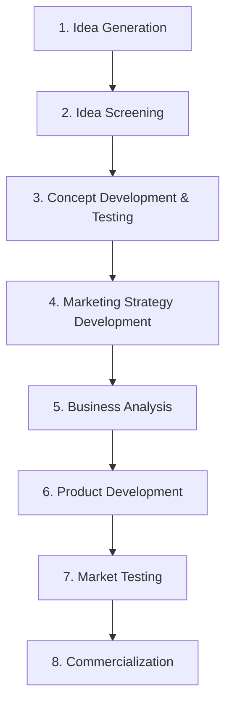
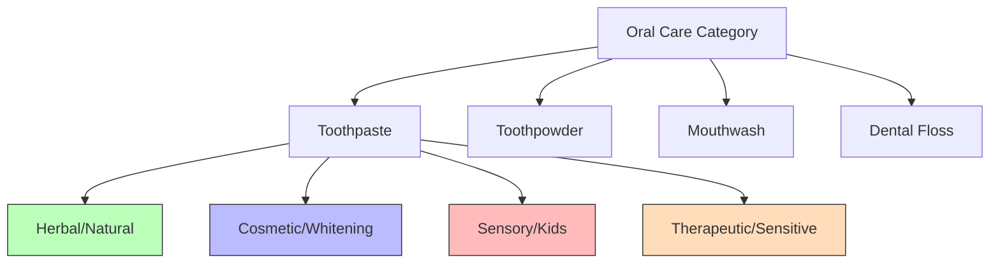

# Block 2 Notes: New Product Development & Launch
## Exam Revision Notes in Hinglish (High-Yield Sheet)

## Unit 5: Organizing for New Product Development

### Defining a "New Product" (New Product Kya Hota Hai?)
Naya product company ke liye, market ke liye, ya pure humankind (insaniyat) ke liye naya ho sakta hai.
* **New-to-the-World (New for the Mankind)**: Aise inventions jo bilkul naya market khada kar dete hain (e.g., pehla telephone, pehla smartphone).
* **New Product Lines (New for the Company)**: Products jo company ke liye toh naye hain par market me pehle se exist karte hain (e.g., ek pharmaceutical company ka apna vitamins brand launch karna).
* **Additions to Existing Product Lines**: Line extensions (e.g., naye flavors, packaging sizes).
* **Improvements/Revisions of Existing Products**: Existing products ke performance upgrades ya naye versions (e.g., naya mobile software update ya laptop me SSD lagana).
* **Repositionings**: Purane products ko naye markets ya segments me retarget karna (e.g., healthy lifestyle ke roop me rebranding karna).

---

### Assignment of NPD Responsibility (NPD ki Responsibility Dena)
NPD ke liye organizing me ye decide karna zaroori hai ki responsibility kiske paas rahegi:
1. **Corporate Level**: Jab company ke current lines se bahar ke naye products/markets develop karne hon, ya jab alag-alag divisions technologies/markets share karte hon. Ye log directly CEO ko report karte hain.
   * *Pros*: Daily operational tension se door rehkar specialized staff focus kar pata hai.
   * *Cons*: Turant ki market needs ke prati thoda unresponsive ho sakte hain.
2. **Divisional Level**: Jab company ke divisions bohot differentiated product lines handle karte hain. Staff divisional heads ko report karta hai.
   * *Pros*: Divisional market needs ke sath direct aur close connection rehta hai.
   * *Cons*: Operational staff aur NPD staff ke beech thoda conflict ho sakta hai (operational log inko elitist dreamers samajhte hain).
3. **Operating Level**: Functional departments (jaise Marketing) ke andar ya Product/Brand Managers ko responsibility dena.
   * **Marketing Department**: Market trends aur customer feedback ko achhe se track karta hai par short-term sales-volume outlook ho sakta hai.
   * **Product/Brand Manager**: Multi-brand companies me har brand ke liye alag manager hota hai.
     * *Pros*: Brand ke tasks ka full-time coordination hota hai.
     * *Cons*: Bohot saare brands hone se kabhi-kabhi inexperienced managers hire ho jate hain jo risks lene se bachte hain.
   * **Matrix Structure**: Product Managers (jo alag-alag markets ko dekhte hain) aur Marketing Managers (jo specific segments/regions me specialize karte hain) ko intersect karta hai.

---

### Structural Units for NPD
Firms permanent aur temporary dono tarah ke structural setups use karti hain:
* **New Product Department (Permanent)**: Full-time staff (technical aur marketing) jo corporate, divisional, ya operating level par kaam karta hai.
* **New Product Committee (Permanent)**: Alag-alag departments ke specialists ki multidisciplinary team jo part-time basis par advisory aur policy-setting ka kaam karti hai.
* **Ad hoc Committee (Temporary)**: Kisi specific task (e.g., brainstorming ya test market coordination) ke liye banyi jaane wali part-time team, jo task khatam hone par band ho jaati hai.
* **Task Force (Temporary)**: Divisional/operational level par integration aur specific project coordinate karne ke liye banai gayi multidisciplinary team.
* **Venture Team (Temporary)**: Corporate level par banayi gayi small, full-time interdisciplinary team jo aise projects ko handle karti hai jo company ke current line of business ke bahar hote hain.

---
---

## Unit 6: Idea Generation and Screening

### Sources of New Product Ideas (Ideas ke Sources)
* **Internal Sources**: Sales force (jo customers ke sabse paas hote hain), R&D staff, top management, purchase department (material insights ke liye), customer service, aur employee suggestion programs.
* **External Sources**: Customers (unmet needs), competitors (reverse engineering), global markets, consultants, distributors, researchers, aur public trends.

---

### Methods of Generating Ideas (Ideas Generate Karne ke Methods)
* **Brainstorming**: Group technique (6-10 log, preferrably subah ke time) jisme strict rules hote hain:
  1. *Deference of judgment*: Session ke dauran koi criticism nahi hoga.
  2. *Freewheeling*: Ajeeb aur wild ideas ko bhi encourage kiya jata hai.
  3. *Quantity*: Focus zyaada se zyaada number of ideas par hota hai.
  4. *Combination and improvement*: Doosron ke ideas par build-up karna.
  * **Buzz Group (Phillips 66)**: Poore group ko 6-6 logon ke chhote groups me divide kar diya jata hai jo 6 minutes tak fast brainstorming karte hain, taaki shant rehne wale log bhi contribute kar sakein aur dominant speakers isolate ho sakein.
* **Attribute Analysis / Listing**: Product ke har attribute (e.g., material, shank, handle of a screwdriver) ko break down karke modify karne ke baare me sochna (adapt, magnify, reduce, combine, substitute).
* **Heuristic Ideation Technique (HIT)**: Morphological analysis jahan product dimensions (e.g., ingredients, packaging) se ek grid banaya jata hai. Har intersecting cell ek naya idea represent karta hai. Non-feasible cells ko eliminate kar diya jata hai.
* **Benefit-Structure Analysis**: Customer interviews ke zariye "occasions", "actual operations", "products used", aur "benefits sought" ko identify karna taaki market gaps (**Market-Gap Analysis**) mil sakein jahan benefits demand me toh hain par existing brands unhe deliver nahi kar rahe (**Benefit-Deficiency Matrix**).
* **Focus Group Interviews**: Moderator ke under 8-12 target consumers ka group jo non-directive environment me needs aur reactions discuss karta hai.

---

### Screening of New Product Ideas (Ideas ki Screening)
Screening ka main purpose ye hota hai ki weak ideas ko shuruat me hi eliminate kiya jaye taaki aage aane wali development cost bach sake.
* **Prelim Screening (Checklists)**: Core criteria (fit with company activity, production capability, sales force compatibility, minimum market size, ROI) ke basis par fast "Yes/No" filtering.
* **Product Profile Ratings (Ranked vs. Summated)**:
  * **Ranked (Ordinal Measure)**: Har characteristic ko Very Good (A) se Very Poor (E) tak score dekar ek visual graphic profile banana.
  * **Summated (Weighted Measure)**: Har factor ko ek importance weight ($W_i$, total 1.00) aur score ($S_i$, 1 se 5) dena. Overall rating is formula se nikaali jaati hai:
    $$R = \sum (W_i \times S_i)$$
    Aamtaur par score $\ge 4.0$ accept hota hai aur $3.5$ se $4.0$ ke beech review kiya jata hai.
* **Screening Errors**:
  * **DROP Error**: Ek acche aur successful hone layak idea ko galti se reject kar dena (jab standards bohot strict hon).
  * **GO Error**: Ek bekaar ya kamzor idea ko aage allow kar dena, jisse product launch hone par absolute, partial, ya relative failure dekhne ko milti hai.

---
---

## Unit 7: Concept Development, Testing and Physical Development

### The NPD Process (NPD ka Step-by-Step Process)
Idea se lekar market launch tak ka safar 8 stages se guzarta hai:



---

### ATAR Forecasting Model
Ye model sales volume aur profit potential ko forecast karne me kaam aata hai:
$$\text{Sales Volume} = \text{Market Size} \times \text{Awareness (A)} \times \text{Trial (T)} \times \text{Availability (A)} \times \text{Repeat (R)}$$
* **Awareness**: Target buyers ka wo percentage jo product ke baare me jaanta hai.
* **Trial**: Aware buyers ka wo percentage jo product ko pehli baar try karta hai.
* **Availability**: Trial buyers ka wo percentage jinhe retail channels me product mil jata hai.
* **Repeat**: Trial buyers ka wo percentage jo product ko dobara khareedte hain (rebuy).

---

### Case Study: Concept Testing in Oral Care
Ek entrepreneur ek naya **Herbal & Tasty** toothpaste conceive karta hai.

#### Concept Development: 3 Feasible Concepts
1. *Concept 1*: Urban bachhon ke liye ek tasty aur fun toothpaste taaki brushing habits sudhar sakein aur bad taste ki complaint door ho sake.
2. *Concept 2*: Health-conscious consumers ke liye ek daily herbal toothpaste jo regular toothpastes ke clinical taste ko pasand nahi karte.
3. *Concept 3*: Rural consumers ke liye sachets me sasta herbal toothpaste, jo abhi commercial toothpaste ki kam availability ke karan neem/babool ki stick use karte hain.



* **Product-Positioning Map**: Product form ko competitors ke khilaf *Price per gram* aur *Availability* dimensions par evaluate karta hai.
* **Brand-Positioning Map**: Existing brands (Colgate, Patanjali, Sensodyne) ke prati consumer perceptions ko *Taste Quality* aur *Price* ke base par map karta hai.

---

### Quality Function Deployment (QFD)
QFD ek structured product development methodology hai jo customer needs ("Whats") ko technical specifications ("Hows") me translate karti hai.
* **House of Quality**:
  * Step 1: Customer needs identify karna (e.g., easy to use, lightweight, fast startup).
  * Step 2: In needs ki importance ko rate karna.
  * Step 3: Engineering/technical requirements define karna (e.g., SSD size, RAM, Processor, Weight).
  * Step 4: Relationship matrix map karna (9 = strong, 3 = moderate, 1 = weak).
  * Step 5: Engineering variables ke beech correlation check karna (e.g., SSD vs. Weight).
  * Step 6: Weighted sums calculate karke highest priority check karna (e.g., student laptop case me SSD = 0.2072 tha, jo batata hai ki speed ke liye solid-state storage primary value driver hai).

---

### Market Testing Methods
* **For Consumer/FMCG Goods**:
  * **Standard Test Markets**: Chhote representative shehron me product ko select retail channels aur normal marketing promotions ke sath poori tarah launch karna.
  * **Simulated Test Markets (STM)**: Laboratory setting jahan consumers ko ads dikhaye jaate hain aur unhe khareedne ke liye temporary funds diye jaate hain taaki trial rate check ho sake.
  * **Controlled Test Markets**: Competitors ki nazar se bachne ke liye retailers ko fee dekar specific shelves par product rakhna aur check karna.
  * **Sale-Wave Research**: Consumers ko repeatedly discount ya free of cost product offer karke unka repurchase interest track karna.
* **For Industrial/B2B Goods**:
  * **Alpha Testing**: Company ke apne employees aur engineers dwara kiya jaane wala internal test.
  * **Beta Testing**: Real target customers ke environment me testing karna aur pre-launch feedback lena.

---
---

## Unit 8: New Product Launch

### Reasons for Launch Failures (Launch Fail hone ke Reasons)
Naye products market size ke galat andaze, bekaar product design/features, galat positioning, kharab timing (jaise recession ke dauran launch), high development cost, ya competitors ke achanak aggressive retaliation ke karan fail ho jaate hain.

---

### Pricing Strategies for New Products (Pricing ki Strategies)
Marketers elasticity aur competition ke basis par pricing strategy select karte hain:

| Strategy | Definition | Ideal Conditions | Examples |
| :--- | :--- | :--- | :--- |
| **Skimming Pricing** | Product ki price shuru me high rakhna aur competitors ke aane par dheere-dheere kam karna. | Unique product jisme entry barriers hon; inelastic demand; shuruat me launch cost recover karni ho. | Dove soap, Van Heusen shirts, iPhone launches, Woodland shoes. |
| **Penetration Pricing** | Shuruat me low price par launch karna taaki maximum market share aur volume capture ho sake. | Highly elastic demand; scale economies available hon; competitors se turant khatra ho. | Nirma detergent, Peter England shirts, Maruti 800. |

---

### Case Study: Pricing for New Launch Categories
1. **Coconut Water in Tetra Pack**:
   * *Strategy*: **Skimming Pricing** (high promotional spends ke sath).
   * *Rationale*: Ye ek premium, healthy lifestyle product hai jo urban health-conscious logo ko target karta hai. Isme temperature-controlled logistics aur tetra pack technology lagti hai, aur customer education ki zaroorat hoti hai. High initial prices se setup costs jaldi recover hoti hain.
2. **Electric Bike (EV)**:
   * *Strategy*: **Penetration Pricing** (shuruat me volume capture karne ke liye) ya fir ultra-premium ho toh skimming.
   * *Rationale*: EV bikes traditional ICE (petrol) scooters se direct compete karti hain. Mass segment me high price elasticity hoti hai aur battery manufacturing me scale economies paane ke liye aggressive pricing zaroori hai, jise government subsidies se support milta hai.

---

### Promotion Mix Budgeting
Promotion budget me shaamil hain:
* **Advertising**: Target reach, frequency, aur media cost ke basis par budget banana.
  * *Ad Math Example*: Agar expected sales = 400,000 units/month (4 units per customer = 100,000 customers). Agar 10% convinced buyers try karte hain, toh hume 1,000,000 convinced buyers chahiye. Agar 10% ad viewers convince hote hain, toh 10,000,000 viewers chahiye. Agar reach 1,000,000 hai toh 10 baar ad run karni padegi.
* **Sales Promotion (Monthly Calendar)**: Har mahine promotions plan karna (e.g., April: Free samples; May: Buy-1-Get-1-Free; June: Scratch cards). Inki cost manufacturing cost par calculate hoti hai, retail price par nahi.
* **Publicity**: Kam cost wala PR tool (jaise press events aur media coverage se credibility banana).

---

### Distribution Timeline (Launch Timeline Math)
Product manager ko launch date (**Day X**) se backward schedule calculate karna padta hai:

```
+-------------------------------------------------------------+
| FACTORY READY |   DEPOT ARRIVAL   |   STOCKIST   | RETAILER |
|   X - 37 Days |    X - 22 Days    |  X - 7 Days  |  Day X   |
+-------------------------------------------------------------+
```

* **Retail Availability (Day X)**: Official launch day jab product market me milna chahiye.
* **Stockists (Day X - 7)**: Stockists se retailers tak product pahunchne me 7 days lagte hain.
* **Depot (Day X - 22)**: Depot se stockists tak dispatch karne me 15 days lagte hain.
* **Factory (Day X - 37)**: Factory se regional depots tak transit me 15 days lagte hain. Yani production launch se 37 days pehle complete hona chahiye.
