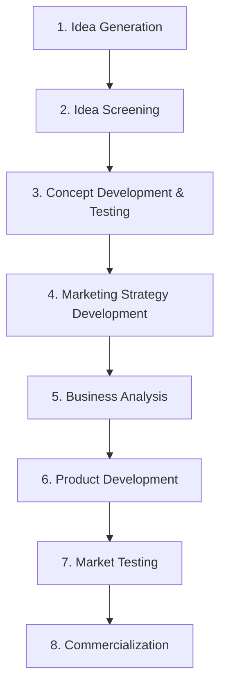
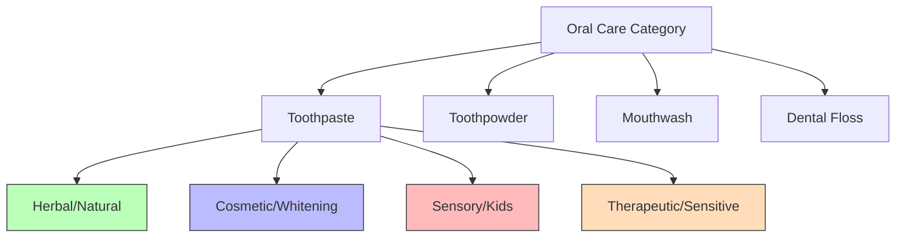

# Block 2 Notes: New Product Development & Launch

## Unit 5: Organizing for New Product Development

### Defining a "New Product"
A product can be new to the company, new to the market, or new to the human race.
* **New-to-the-World (New for the Mankind)**: Inventions that create an entirely new market (e.g., first telephone, first smartphone).
* **New Product Lines (New for the Company)**: Products that are new to the company but already exist in the market (e.g., a pharmaceutical company launching its own brand of vitamins).
* **Additions to Existing Product Lines**: Line extensions (e.g., new flavors, package sizes).
* **Improvements/Revisions of Existing Products**: Performance upgrades or new versions (e.g., new smartphone software or a laptop with an SSD upgrade).
* **Repositionings**: Retargeting existing products to new markets or segments (e.g., healthy lifestyle rebranding).

---

### Assignment of NPD Responsibility
Organizing for NPD requires determining where responsibility lies:
1. **Corporate Level**: Feasible when developing new products/markets outside the firm's existing lines, or when divisions share technologies/markets. reporting directly to the CEO.
   * *Pros*: Insulation from operational crises, specialized staff.
   * *Cons*: Can be unresponsive to immediate market needs.
2. **Divisional Level**: Used when divisions have highly differentiated product lines. Staff report to divisional heads.
   * *Pros*: Close connection to divisional market needs.
   * *Cons*: Can cause friction between operational personnel and NPD staff (viewed as elitist dreamers).
3. **Operating Level**: Assigned within functional departments (e.g., Marketing) or to Product/Brand Managers.
   * **Marketing Department**: Tracks market trends and customer feedback but may have a short-term, sales-volume outlook.
   * **Product/Brand Manager**: Multi-brand firms assign individual managers.
     * *Pros*: Full-time coordination of the brand.
     * *Cons*: Multiplicity of brands may lead to hiring inexperienced managers who avoid risks.
   * **Matrix Structure**: Intersects Product Managers (looking across markets) with Marketing Managers (specializing in specific segments/regions).

---

### Structural Units for NPD
Firms utilize various permanent and temporary structural configurations:
* **New Product Department (Permanent)**: Full-time staff (technical and marketing). Exists at corporate, divisional, or operating levels.
* **New Product Committee (Permanent)**: Multidisciplinary team from various departments; serves an advisory/policy-setting role on a part-time basis.
* **Ad hoc Committee (Temporary)**: Part-time team of specialists set up for a specific task (e.g., brainstorming or test market coordination) and dismantled upon completion.
* **Task Force (Temporary)**: Multidisciplinary group formed at divisional/operational level to perform integration and coordinate a specific project.
* **Venture Team (Temporary)**: Small, full-time interdisciplinary group established at the corporate level to champion a project that sits outside current lines of business.

---
---

## Unit 6: Idea Generation and Screening

### Sources of New Product Ideas
* **Internal Sources**: Sales force (close to customers), R&D staff, top management, purchase department (material insights), customer service, and employee suggestion programs.
* **External Sources**: Customers (unmet needs), competitors (reverse engineering), global markets, consultants, distributors, researchers, and public trends.

---

### Methods of Generating Ideas
* **Brainstorming**: Group technique (6-10 people, preferably in the morning) with strict ground rules:
  1. *Deference of judgment*: No criticism allowed during the session.
  2. *Freewheeling*: Encourage wild, far-out ideas.
  3. *Quantity*: Focus on generating a high volume of ideas.
  4. *Combination and improvement*: Build upon ideas of others.
  * **Buzz Group (Phillips 66)**: Subdivides the group into clusters of 6 people for 6 minutes of rapid brainstorming to isolate dominant speakers and encourage quiet contributors.
* **Attribute Analysis / Listing**: Breaking down a product into constituent attributes (e.g., material, shank, handle of a screwdriver) and systematically questioning modifications (adapt, magnify, reduce, combine, substitute).
* **Heuristic Ideation Technique (HIT)**: Morphological analysis where product dimensions (e.g., ingredients, packaging) form a grid. Intersection cells represent new ideas. Non-feasible or non-novel cells are systematically eliminated.
* **Benefit-Structure Analysis**: Customer interviews identifying "occasions", "actual operations", "products used", and "benefits sought" to map gaps in the market (**Market-Gap Analysis**) where benefits are desired but not delivered by existing brands (**Benefit-Deficiency Matrix**).
* **Focus Group Interviews**: 8-12 target consumers led by a moderator to discuss needs and reactions in a non-directive environment.

---

### Screening of New Product Ideas
The purpose of screening is to eliminate weak ideas early before costs escalate.
* **Prelim Screening (Checklists)**: Quick "Yes/No" filtering based on core criteria (fit with company activity, production capability, sales force compatibility, minimum market size, ROI).
* **Product Profile Ratings (Ranked vs. Summated)**:
  * **Ranked (Ordinal Measure)**: Score each characteristic from Very Good (A) to Very Poor (E) to create a visual graphic profile.
  * **Summated (Weighted Measure)**: Assign weights ($W_i$) reflecting importance (totaling 1.00) and scores ($S_i$) from 1 to 5. The overall rating is calculated as:
    $$R = \sum (W_i \times S_i)$$
    Usually, a score $\ge 4.0$ indicates acceptance, while $3.5$ to $4.0$ requires review.
* **Screening Errors**:
  * **DROP Error**: Rejecting an otherwise good idea (standards are too conservative).
  * **GO Error**: Permitting a poor idea to move to development and commercialization, leading to absolute, partial, or relative failure.

---
---

## Unit 7: Concept Development, Testing and Physical Development

### The NPD Process
The complete path from idea to market launch consists of 8 stages:



---

### ATAR Forecasting Model
The ATAR model is used to forecast sales volume and profit potential:
$$\text{Sales Volume} = \text{Market Size} \times \text{Awareness (A)} \times \text{Trial (T)} \times \text{Availability (A)} \times \text{Repeat (R)}$$
* **Awareness**: Percentage of target buyers who know about the product.
* **Trial**: Percentage of aware buyers who try the product.
* **Availability**: Percentage of trial buyers who find the product in retail channels.
* **Repeat**: Percentage of trial buyers who buy the product again (rebuy).

---

### Case Study: Concept Testing in Oral Care
An entrepreneur conceives a new **Herbal & Tasty** toothpaste.

#### Concept Development: 3 Feasible Concepts
1. *Concept 1*: A fun, tasty toothpaste for urban children to cultivate brushing habits and eliminate bad taste complaints.
2. *Concept 2*: A daily herbal toothpaste targeting health-conscious consumers who dislike the clinical taste of regular toothpastes.
3. *Concept 3*: An inexpensive, herbal toothpaste in sachets targeting rural consumers who currently use chew sticks (neem/babool) due to low availability of commercial toothpastes.



* **Product-Positioning Map**: Evaluates the product form against competitors on dimensions like *Price per gram* and *Availability*.
* **Brand-Positioning Map**: Maps consumer perceptions of existing brands (e.g., Colgate, Patanjali, Sensodyne) based on dimensions like *Taste Quality* and *Price*.

---

### Quality Function Deployment (QFD)
QFD is a structured product development methodology that translates customer needs ("Whats") into technical specifications ("Hows").
* **House of Quality**:
  * Step 1: Identify customer needs (e.g., easy to use, lightweight, fast startup).
  * Step 2: Rate the importance of these needs.
  * Step 3: Define engineering/technical requirements (e.g., SSD size, RAM, Processor, Weight).
  * Step 4: Map the relationship matrix (9 = strong, 3 = moderate, 1 = weak).
  * Step 5: Establish pairwise correlations between engineering variables (e.g., SSD vs. Weight).
  * Step 6: Calculate weighted sums to identify the highest relative importance weight-age (e.g., SSD = 0.2072 in a student laptop study, highlighting that solid-state storage is the primary value driver).

---

### Market Testing Methods
* **For Consumer/FMCG Goods**:
  * **Standard Test Markets**: Full launch in limited representative cities (selective retail channels and standard promotional buzz).
  * **Simulated Test Markets (STM)**: Laboratory setting where consumers are exposed to commercials and given purchasing funds to measure trial rates.
  * **Controlled Test Markets**: Minimizes competitor visibility by hiring stores to display products at specific shelf locations for a fee.
  * **Sale-Wave Research**: Repeatedly offering the product to consumers free of charge or at discounted prices to gauge repurchase intention.
* **For Industrial/B2B Goods**:
  * **Alpha Testing**: Internal testing by company employees/engineers.
  * **Beta Testing**: Testing by actual target customers in real-use environments for feedback before commercialization.

---
---

## Unit 8: New Product Launch

### Reasons for Launch Failures
New products fail due to: market size overestimation, poor product design/features, incorrect positioning, poor timing (launching during recessions), high development/launch costs, or aggressive competitor retaliation.

---

### Pricing Strategies for New Products
Marketers must select a pricing strategy based on market elasticity and competitor dynamics:

| Strategy | Definition | Ideal Conditions | Examples |
| :--- | :--- | :--- | :--- |
| **Skimming Pricing** | Pricing the product high initially and lowering it as competitors enter the market. | Unique product with high barriers to entry; inelastic demand; high initial launch costs to recover. | Dove soap, Van Heusen shirts, iPhone launches, Woodland shoes. |
| **Penetration Pricing** | Launching at a low price to capture maximum market share and volume. | Highly elastic demand; economies of scale available; strong threat of immediate competition. | Nirma detergent, Peter England shirts, Maruti 800. |

---

### Case Study: Pricing for New Launch Categories
1. **Coconut Water in Tetra Pack**:
   * *Strategy*: **Skimming Pricing** (with high promotional spending).
   * *Rationale*: A premium, healthy lifestyle product targeting urban, health-conscious consumers. Requires temperature-controlled logistics, tetra pack technology, and high education spending. High initial prices help offset production setup costs.
2. **Electric Bike (EV)**:
   * *Strategy*: **Penetration Pricing** (initially) or **Two-Tier/Skimming** if premium.
   * *Rationale*: EV bikes compete directly with highly entrenched internal combustion engine (ICE) scooters. High price elasticity in the mass commuter segment and the need to achieve battery manufacturing scale economies demand competitive pricing, backed by government subsidies.

---

### Promotion Mix Budgeting
The promotion budget includes:
* **Advertising**: Budgeting based on target reach, frequency, and media costs.
  * *Advertising Math Example*: If expected sales = 400,000 units/month (4 units per customer = 100,000 customers). If 10% of convinced buyers try, we need 1,000,000 convinced buyers. If 10% of ad viewers are convinced, we need 10,000,000 viewers. If average ad reach is 1,000,000, we need 10 ad runs.
* **Sales Promotion (Monthly Calendar)**: Scheduling promotions monthly (e.g., April: Free samples; May: Buy-One-Get-One-Free; June: Newspaper inserts). Costs are calculated based on manufacturing costs (not retail price).
* **Publicity**: Lower-cost credibility builder (using PR agencies to organize press events and earn editorial coverage).

---

### Distribution Timeline (Launch Timeline Math)
A product manager must coordinate launch schedules backward from the target launch date (**Day X**):

```
+-------------------------------------------------------------+
| FACTORY READY |   DEPOT ARRIVAL   |   STOCKIST   | RETAILER |
|   X - 37 Days |    X - 22 Days    |  X - 7 Days  |  Day X   |
+-------------------------------------------------------------+
```

* **Retail Availability (Day X)**: Official launch day.
* **Stockists (Day X - 7)**: Requires 7 days for distribution from stockists to retailers.
* **Depot (Day X - 22)**: Requires 15 days for logistics from regional depots to stockists.
* **Factory (Day X - 37)**: Requires 15 days for transportation from factory to depots. Production must be completed 37 days before launch.
