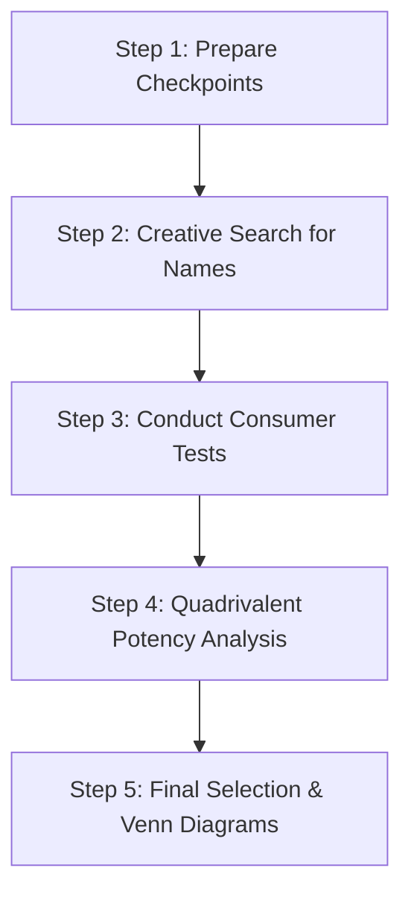
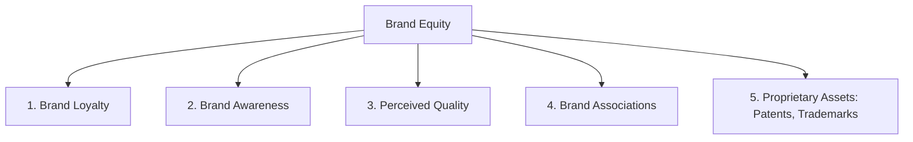

# Block 3 Notes: Brand Management & Brand Equity
## Exam Revision Notes in Hinglish (High-Yield Sheet)

## Unit 9: Brand Concepts and Evolution

### Branding: Definition and Functions (Branding kya hai aur iske Functions)
Ek **Brand** ek name, term, sign, symbol, design, ya inka combination hota hai jo kisi seller ke goods aur services ko identify karne aur competitors se differentiate karne ke liye use kiya jata hai.
* **Key Functions of a Brand (Consumers ke liye)**:
  * *Identification of source*: Purchase decisions ko easy banata hai aur search cost kam karta hai.
  * *Quality guarantee / Promise*: Consistency ki guarantee deta hai aur purchase risk ko kam karta hai.
  * *Status/Self-expression*: Personal values ko reflect karta hai (e.g., luxury ya ruggedness).
* **Strategic Relevance**: Strong brands consumer loyalty badhate hain, premium pricing allow karte hain, shelf space secure karte hain, aur higher shareholder value generate karte hain (jaise Madden, Fehle, aur Fournier ki study ne Interbrand lists par show kiya).

---

### Brand Name Selection Process (Brand Name Select Karne ki Process)
Ye systematic process creative search aur analytical verification dono ko combine karti hai:



* **Step 1: Checkpoints Formulation**: Jackson Martindell ke method ka use karke alag-alag areas me checkpoints list karna:
  * *Associational value*: Desired product benefits ke sath connection.
  * *Memorizational value*: Recall karne me, rhyme me, aur spelling me kitna easy hai.
  * *Descriptional value*: Key product attributes ko describe karna.
  * *Motivational value*: Customer ko purchase karne ke liye kitna motivate kar sakta hai.
* **Step 2: Search**: Alternative brand names generate karna.
* **Step 3: Rating/Testing**: Consumer panels ko names dekar association, recall, description, aur motivation tests run karna.
* **Step 4: Quadrivalent Analysis**: **Marketing Potency (MP)** calculate karna:
  $$MP = An \times Mm \times Dp \times Mt$$
  *(Jahan $An$ = Associational, $Mm$ = Memorization, $Dp$ = Descriptional, $Mt$ = Motivational value).*
  Is score ko **3D Graphic Matrix** (jahan axes $An, Mm, Dp$ hain aur $Mt$ parentheses me hai) par plot karke names ko 8 quadrants me divide kiya jata hai. Quadrant 1 (origin se sabse door) me sabse desirable names hote hain.
* **Step 5: Final Selection**: Name ki values ke zariye generate hone wale market share segments ka overlap aur union dikhane wale **Venn Diagrams** banakar final choice select karna.

#### Examples of Brand Name Decisions
* **Smart Watch (Indian Company)**: *TrakX* ya *Pulse* jaisa short name active, tech-savvy youth ko target karega. Checkpoints: health tracking, connectivity, sleek style. *An*: fitness se linked. *Mm*: short aur punchy name jo yaad rahe. *Dp*: monitor karne ki capabilities ko dikhata hai. *Mt*: healthy lifestyle ke liye motivate karta hai.
* **Honeymoon Resort Package (Newly Married Urban Couples)**: Suggestion: *Amour Retreat* ya *Eternal Bliss*.
  * *Rationale*: Romance, privacy, aur luxury ke sath high *Associational value* ($An$). Yaad rakhne me aasan ($Mm$), scenic beauty aur intimacy ko describe karne wala ($Dp$), aur emotional appeal se booking ke liye motivate karne wala ($Mt$).

---

### Family Branding vs. Individual Branding
* **Family Branding (Umbrella Branding)**: Ek single parent brand name ko company ke saare products par apply karna (e.g., *Tata* salt, cars, aur steel; *Dove* soap, shampoo, aur deodorant).
  * *Pros*: Marketing cost kam aati hai, line extensions launch karna aasan hota hai, aur existing brand equity ka leverage milta hai.
  * *Cons*: Kisi ek product ke fail hone par pure family brand ki reputation kharab ho sakti hai.
* **Individual Branding**: Har product ke liye ek alag aur unique name assign karna (e.g., P&G's *Ariel*, *Tide*, *Pampers*).
  * *Pros*: Alag segments ke liye unique positioning; kisi ek product ke fail hone par parent company safe rehti hai.
  * *Cons*: Har naye launch ke liye high brand-building aur development costs aati hain.

---

### Branding of Commodities (Commodities ki Branding)
Commodity ek basic good hota hai (e.g., salt, sugar, cement, rice) jo aamtaur par sirf price ke base par bikta hai. Modern marketing me ab **branding of commodities** ka trend chal raha hai (e.g., *Tata Salt*, *Aashirvaad Atta*, *UltraTech Cement*).
* **Advantages (Fayde)**:
  * Order tracking aur processing ko aasan banata hai.
  * Trademarks ke zariye legal protection milti hai.
  * Quality-conscious customers ko attract karta hai, jisse unka focus price se hatkar product benefits par jata hai.
  * Value perception badhakar gross margins improve karta hai.
* **Special Considerations**: Iske liye distinct packaging, quality standardization, target segment mapping, aur low-involvement transactional buying ko high-involvement brand pull me badalne ki zaroorat hoti hai.

---
---

## Unit 10: Brand Equity

### What is Brand Equity? (Brand Equity Kya Hai?)
Brand Equity assets aur liabilities ka wo set hai jo brand ke name aur symbol se linked hota hai aur kisi product/service ki value ko add ya subtract karta hai.

---

### Brand Equity Models

#### 1. David Aaker's Brand Equity Model
Aaker brand equity ko paanch primary asset categories ke basis par define karte hain:



* **Brand Loyalty**: Core asset hai. Marketing cost kam karta hai, entry barriers banata hai, aur predictable revenue secure karta hai.
* **Brand Awareness**: Recognition se lekar recall, top-of-mind, aur brand dominance tak range karta hai.
* **Perceived Quality**: ROI par direct impact dalta hai; khareedne ki wajah deta hai aur premium pricing ko support karta hai.
* **Brand Associations**: Brand ko attributes, symbols, lifestyles, aur celebrities se link karta hai (e.g., Boost with Sachin Tendulkar).
* **Proprietary Assets**: Patents aur trademarks jo legal protection dete hain.

#### 2. Keller's Customer-Based Brand Equity (CBBE) Model
CBBE consumer ke brand knowledge ka wo differential effect hai jo brand ki marketing ke prati uske response ko generate karta hai. Keller ise ek **Brand Resonance Pyramid** me structure karte hain:

```
                   RESONANCE (Relationships)
              +---------------------------------+
              |   FEELINGS   |    JUDGMENTS     | (Response)
              +--------------+------------------+
              |   IMAGERY    |   PERFORMANCE    | (Meaning)
              +--------------+------------------+
                   SALIENCE (Identity)
```

* **Level 1: Salience (Identity)**: Category identification; awareness ki depth aur breadth kya hai.
* **Level 2: Performance & Imagery (Meaning)**:
  * *Performance*: Functional needs ki fulfillment (reliability, serviceability, durability, price).
  * *Imagery*: Psychological/social needs ki fulfillment (user profiles, usage situations, personality).
* **Level 3: Judgments & Feelings (Response)**:
  * *Judgments*: Rational opinions (credibility, quality, consideration, superiority).
  * *Feelings*: Emotional reactions (warmth, fun, excitement, security, social approval, self-respect).
* **Level 4: Resonance (Relationships)**: Psychological bond aur active engagement (behavioral loyalty, attitudinal attachment, sense of community, active engagement).

---

### Case Study: Patanjali's FMCG Brand Equity Creation
Patanjali ne Indian FMCG sector me ek bada space banaya:
* **Brand Identity**: Apne aap ko ek "Swadeshi" (indigenous), pure, Ayurvedic alternative ke roop me position kiya. Apni identity ko Yoga guru Baba Ramdev ke association ke charo taraf build kiya.
* **Brand Equity Elements**: Herbal/organic ingredients ki *high perceived quality*, nationalism ke sath *strong associations*, aur competitive pricing ka use kiya, jisse price-sensitive commodity buyers highly loyal, health-oriented brand advocates me badal gaye.

---

### Brand Equity Measurement (Brand Equity ko Measure Karna)
* **Young & Rubicam's Brand Asset Valuator (BAV)**: Brands ko step-by-step sequence me measure karta hai:
  $$\text{Differentiation} \rightarrow \text{Relevance} \rightarrow \text{Esteem} \rightarrow \text{Knowledge}$$
* **Aaker's "Brand Equity Ten"**:
  1. *Loyalty*: Price Premium, Satisfaction/Loyalty.
  2. *Perceived Quality/Leadership*: Perceived Quality, Leadership/Popularity.
  3. *Associations/Differentiation*: Perceived Value, Brand Personality, Organizational Association.
  4. *Awareness*: Brand Awareness.
  5. *Market Behavior*: Market Share, Distribution Coverage/Market Price.

---
---

## Unit 11: Brand Building Blocks: Identity, Image, and Positioning

### Options of Appeals to Reinforce Brand Image (Brand Image ko mazboot karne ke Appeals)
Marketers positive brand image build karne ke liye different dimensions par appeal karte hain:
* **Appeal to Reason**: Performance, technical specifications, aur functional benefits par focus (rational choice).
* **Appeal to Senses**: Consumers ko visually, aurally, ya aesthetically satisfy karna (e.g., Royal Enfield engine ka sound, Samsung *The Frame* TV ka visual appeal).
* **Appeal to Emotion**: Social approval, self-respect, aur brand owner hone ke psychological rewards ko target karna (e.g., *Raymond* "The Complete Man" campaign).
* **Reference Appeal**: Family, peers, aur social groups ke perception par stress dena, jo prestige ko reinforce karta hai.

---

### Criteria for Brand Positioning
Positioning ke liye ye establish karna zaroori hai:
* **Frame of Reference**: Wo category jisme brand compete karta hai (e.g., two-wheelers, banking).
* **Points of Parity (POP)**: Wo benefits jo category me compete karne ke liye mandatory hain (e.g., cars me safety).
* **Points of Difference (POD)**: Wo unique attributes jo brand ko sabse alag banate hain (e.g., Royal Enfield me rugged heritage).
* **Brand Mantra**: Ek short aur simple 3-5 words ka phrase jo brand ke dil ko capture karta hai (e.g., BMW's "The Ultimate Driving Machine").

---
---

## Unit 12: Brand Architecture and Brand Extension

### Brand Architecture Strategy
Ye brand portfolio ke structure ko organize karti hai. Breadth aur depth ko in strategies se manage kiya jata hai:
* **House of Brands**: Independent aur distinct brands jo specific segments ko cater karte hain (e.g., Unilever's Lux, Lifebuoy, Dove).
* **Branded House**: Ek single master brand jo company ki saare offerings par apply hota hai (e.g., Apple, Virgin).
* **Endorsed Brands**: Alag brands jinko corporate master brand support deta hai (e.g., *Xbox by Microsoft*).
* **Co-branding / Ingredient Branding**: Do established names ka joint venture (e.g., *Amazon Pay ICICI Credit Card*; *Intel Inside* processors).

---

### Brand Hierarchy levels (Brand Hierarchy ke Levels)
Brand elements ke explicit order ko dikhane wala hierarchy levels:

```
[1. Corporate Brand]       (e.g., ITC)
       |
[2. Family/Umbrella Brand] (e.g., Classmate, Bingo)
       |
[3. Individual Brand]      (e.g., Tedhe Medhe, Mad Angles)
       |
[4. Modifier level]        (e.g., Masala Tadka, Tomato Masti)
       |
[5. Product Descriptor]    (e.g., Finger Snack, Potato Chips)
```

---

### Brand Extensions (Line vs. Category)
* **Line Extensions**: Same category me naye variants introduce karna (e.g., Colgate Active Salt, Colgate Sensitive).
  * *Horizontal*: Same price point par flavors/types add karna (e.g., Horlicks Lite).
  * *Vertical*: Price-quality tiers ko change karna: **Upscale** (e.g., Tata Harrier) vs. **Downscale** (e.g., Tata Tiago).
* **Category Extensions**: Brand name ko kisi different category me use karna (e.g., Dettol antiseptic liquid se Dettol soaps, sanitizers, aur slab gels banana).
  * *Advantages*: Launch cost kam karta hai, advertising efficiency badhata hai, aur core brand image ko reinforce karta hai.
  * *Disadvantages*: Customers ko confuse kar sakta hai, **cannibalization** ka risk hota hai, aur brand meaning dilute ho sakta hai (e.g., *Colgate Kitchen Entrees* fit na hone ke karan fail ho gaya).

---

### Launching a Brand Extension: The 6-Step Process
1. **Identify Parent Brand**: Evaluate karna ki kis brand ke paas stretch karne ke liye equity hai.
2. **Identify Key Associations**: Un associations ko select karna jo leverage de sakein (e.g., Tata = trust, reliability).
3. **Highlight Alternative Businesses**: Associations ke base par related product categories brainstorm karna.
4. **Identify Specific Products**: Un categories me potential items ki list banana.
5. **Select Candidate Product**: Sabse achhe advantage aur fit wale product ko select karna.
6. **Launch Extension**: Parent brand ke endorsement ke sath product ki unique positioning balance karna.

#### Case Study: Brand Extension Strategy of Tata e-car
* **Tata Motors** ne *Tata* ko parent brand ke roop me identify kiya, jo national trust, safety, aur manufacturing expertise ke sath associated hai.
* **Extension Opportunity**: Is brand name ko electric vehicle category me stretch kiya (*Nexon EV*, *Tigor EV*).
* **Launch Execution**: Master brand *Tata* ka use karke customers ko service, battery warranty, aur safety standards ka assurance diya, aur naye *EV* sub-brand ke zariye modernization ka signal diya, jisse Indian EV market ko successfully dominate kiya.
