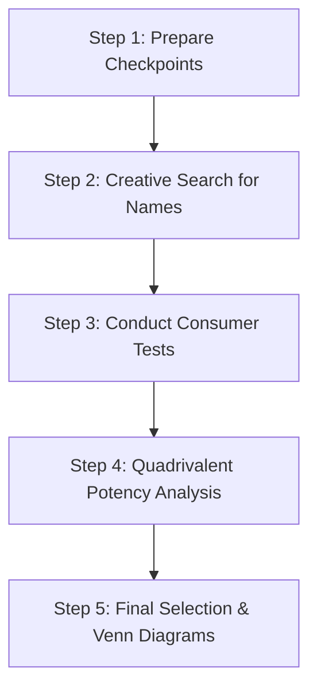
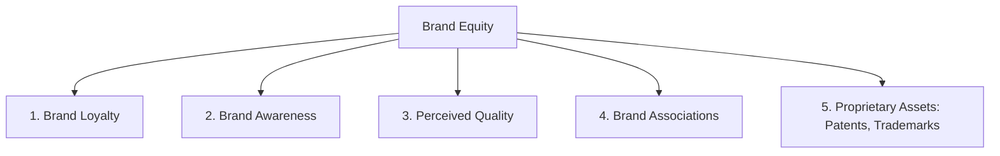

# Block 3 Notes: Brand Management & Brand Equity

## Unit 9: Brand Concepts and Evolution

### Branding: Definition and Functions
A **Brand** is a name, term, sign, symbol, design, or a combination of these, intended to identify the goods or services of a seller and differentiate them from competitors.
* **Key Functions of a Brand (to Consumers)**:
  * *Identification of source*: Simplifies purchase decisions and lowers search costs.
  * *Quality guarantee / Promise*: Assures consistency and reduces purchase risk.
  * *Status/Self-expression*: Reflects personal values (e.g., luxury or ruggedness).
* **Strategic Relevance**: Strong brands build consumer loyalty, allow premium pricing, secure shelf space, and yield higher shareholder value (as shown by Madden, Fehle, and Fournier study on Interbrand lists).

---

### Brand Name Selection Process
A systematic process combining creative search with analytical verification:



* **Step 1: Checkpoints Formulation**: Using Jackson Martindell's method to list checkpoints across:
  * *Associational value*: Connection with desired product benefits.
  * *Memorizational value*: Ease of recall, rhyme, and spelling.
  * *Descriptional value*: Key product attributes described.
  * *Motivational value*: Ability of the name to induce purchase.
* **Step 2: Search**: Generating alternative names.
* **Step 3: Rating/Testing**: Giving names to consumer panels for association, recall, description, and motivation tests.
* **Step 4: Quadrivalent Analysis**: Calculating the **Marketing Potency (MP)**:
  $$MP = An \times Mm \times Dp \times Mt$$
  *(Where $An$ = Associational, $Mm$ = Memorization, $Dp$ = Descriptional, $Mt$ = Motivational value).*
  Plotted on a **3D Graphic Matrix** (where axes are $An, Mm, Dp$ and $Mt$ is in parentheses) to divide names into 8 quadrants. Quadrant 1 (farthest from origin) contains the most desirable names.
* **Step 5: Final Selection**: Creating **Venn Diagrams** showing the union and overlap of market share segments generated by the name's values to make a final choice.

#### Examples of Brand Name Decisions
* **Smart Watch (Indian Company)**: A name like *TrakX* or *Pulse* targets active, tech-savvy youth. Checkpoints: health tracking, connectivity, sleek style. *An*: linked to fitness. *Mm*: short, punchy, memorable. *Dp*: suggests monitoring. *Mt*: motivates healthy lifestyle.
* **Honeymoon Resort Package (Newly Married Urban Couples)**: Suggestion: *Amour Retreat* or *Eternal Bliss*.
  * *Rationale*: High *Associational value* with romance, privacy, and luxury. Easy to memorize (*Mm*), describes scenic beauty and intimacy (*Dp*), and motivates booking through emotional appeal (*Mt*).

---

### Family Branding vs. Individual Branding
* **Family Branding (Umbrella Branding)**: Applying a parent brand name to all products (e.g., *Tata* salt, cars, and steel; *Dove* soap, shampoo, and deodorant).
  * *Pros*: Lower marketing cost, easier introduction of line extensions, leverages existing brand equity.
  * *Cons*: A single product failure can damage the entire family brand reputation.
* **Individual Branding**: Assigning unique names to each product (e.g., P&G's *Ariel*, *Tide*, *Pampers*).
  * *Pros*: Unique positioning for separate segments; insulates parent company from individual product failures.
  * *Cons*: High brand-building and developmental costs for each new launch.

---

### Branding of Commodities
A commodity is a basic good (e.g., salt, sugar, cement, rice) sold primarily on price. Modern marketing trends show widespread **branding of commodities** (e.g., *Tata Salt*, *Aashirvaad Atta*, *UltraTech Cement*).
* **Advantages**:
  * Facilitates order tracking and processing.
  * Provides legal protection via trademarks.
  * Attracts a loyal, quality-conscious segment, shifting purchases from price-driven to benefit-driven.
  * Increases gross margins by enhancing value perceptions.
* **Special Considerations**: Requires distinct packaging, quality standardization, target segment mapping, and a shift from low-involvement transactional buying to high-involvement brand pull.

---
---

## Unit 10: Brand Equity

### What is Brand Equity?
Brand Equity is the set of assets and liabilities linked to a brand’s name and symbol that adds to or subtracts from the value provided by a product or service.

---

### Brand Equity Models

#### 1. David Aaker's Brand Equity Model
Aaker defines brand equity based on five primary asset categories:



* **Brand Loyalty**: Core asset. Reduces marketing costs, creates entry barriers, and secures predictable revenue.
* **Brand Awareness**: Ranges from recognition to recall, top-of-mind, and brand dominance.
* **Perceived Quality**: Direct impact on ROI; provides a reason to buy and supports premium pricing.
* **Brand Associations**: Links the brand to attributes, symbols, lifestyles, and celebrities (e.g., Boost with Sachin Tendulkar).
* **Proprietary Assets**: Patents and trademarks providing legal protection.

#### 2. Keller's Customer-Based Brand Equity (CBBE) Model
CBBE is the differential effect that consumer brand knowledge has on their response to the marketing of the brand. Keller structures this as a **Brand Resonance Pyramid**:

```
                  RESONANCE (Relationships)
             +---------------------------------+
             |   FEELINGS   |    JUDGMENTS     | (Response)
             +--------------+------------------+
             |   IMAGERY    |   PERFORMANCE    | (Meaning)
             +--------------+------------------+
                  SALIENCE (Identity)
```

* **Level 1: Salience (Identity)**: Category identification; depth and breadth of awareness.
* **Level 2: Performance & Imagery (Meaning)**:
  * *Performance*: Functional needs fulfillment (reliability, serviceability, durability, price).
  * *Imagery*: Psychological/social needs fulfillment (user profiles, usage situations, personality).
* **Level 3: Judgments & Feelings (Response)**:
  * *Judgments*: Rational opinions (credibility, quality, consideration, superiority).
  * *Feelings*: Emotional reactions (warmth, fun, excitement, security, social approval, self-respect).
* **Level 4: Resonance (Relationships)**: Psychological bond and active engagement (behavioral loyalty, attitudinal attachment, sense of community, active engagement).

---

### Case Study: Patanjali's FMCG Brand Equity Creation
Patanjali carved a massive space in the Indian FMCG sector by:
* **Brand Identity**: Positioned as a "Swadeshi" (indigenous), pure, Ayurvedic alternative to multinational brands. Built identity around the association with Yoga guru Baba Ramdev.
* **Brand Equity Elements**: Leveraged *high perceived quality* of herbal/organic ingredients, *strong associations* with nationalism, and competitive pricing, converting price-sensitive commodity buyers into highly loyal, health-oriented brand advocates.

---

### Brand Equity Measurement
* **Young & Rubicam's Brand Asset Valuator (BAV)**: Measures brands sequentially:
  $$\text{Differentiation} \rightarrow \text{Relevance} \rightarrow \text{Esteem} \rightarrow \text{Knowledge}$$
* **Aaker's "Brand Equity Ten"**:
  1. *Loyalty*: Price Premium, Satisfaction/Loyalty.
  2. *Perceived Quality/Leadership*: Perceived Quality, Leadership/Popularity.
  3. *Associations/Differentiation*: Perceived Value, Brand Personality, Organizational Association.
  4. *Awareness*: Brand Awareness.
  5. *Market Behavior*: Market Share, Distribution Coverage/Market Price.

---
---

## Unit 11: Brand Building Blocks: Identity, Image, and Positioning

### Options of Appeals to Reinforce Brand Image
Marketers appeal to different customer dimensions to build a positive brand image:
* **Appeal to Reason**: Focuses on performance, technical specifications, and functional benefits (rational choice).
* **Appeal to Senses**: Gratifys consumers visually, aurally, or aesthetically (e.g., sound of a Royal Enfield engine, visual appeal of Samsung's *The Frame* TV).
* **Appeal to Emotion**: Targets social approval, self-respect, and psychological rewards of owning a brand (e.g., *Raymond* "The Complete Man" campaign).
* **Reference Appeal**: Emphasizes how family, peers, and social groups view the brand, reinforcing prestige.

---

### Criteria for Brand Positioning
Positioning requires establishing:
* **Frame of Reference**: The category in which the brand competes (e.g., two-wheelers, banking).
* **Points of Parity (POP)**: Benefits that are mandatory to compete in the category (e.g., safety in cars).
* **Points of Difference (POD)**: Unique attributes that set the brand apart (e.g., rugged heritage in Royal Enfield).
* **Brand Mantra**: A short, simple 3-5 word phrase capturing the brand's heart (e.g., BMW's "The Ultimate Driving Machine").

---
---

## Unit 12: Brand Architecture and Brand Extension

### Brand Architecture Strategy
Organizes the structure of the brand portfolio. Breadth and depth are managed through:
* **House of Brands**: Independent, distinct brands catering to specific segments (e.g., Unilever's Lux, Lifebuoy, Dove).
* **Branded House**: Single master brand applied across all offerings (e.g., Apple, Virgin).
* **Endorsed Brands**: Separate brands supported by a corporate master brand (e.g., *Xbox by Microsoft*).
* **Co-branding / Ingredient Branding**: Joint branding of two established names (e.g., *Amazon Pay ICICI Credit Card*; *Intel Inside* processors).

---

### Brand Hierarchy levels
A graphic hierarchy showing explicit ordering of brand elements:

```
[1. Corporate Brand]       (e.g., ITC)
       |
[2. Family/Umbrella Brand] (e.g., Classmate, Bingo)
       |
[3. Individual Brand]      (e.g., Tedhe Medhe, Mad Angles)
       |
[4. Modifier level]        (e.g., Masala Tadka, Tomato Masti)
       |
[5. Product Descriptor]    (e.g., Finger Snack, Potato Chips)
```

---

### Brand Extensions (Line vs. Category)
* **Line Extensions**: Introducing variants in the same category (e.g., Colgate Active Salt, Colgate Sensitive).
  * *Horizontal*: Adding flavors/types at the same price point (e.g., Horlicks Lite).
  * *Vertical*: Changing price-quality tiers: **Upscale** (e.g., Tata Harrier) vs. **Downscale** (e.g., Tata Tiago).
* **Category Extensions**: Using the brand name in a different category (e.g., Dettol antiseptic liquid extending to Dettol soaps, sanitizers, and slab gels).
  * *Advantages*: Lowers launch costs, builds advertising efficiency, reinforces core brand image.
  * *Disadvantages*: Confuses customers, risks **cannibalization**, and can dilute brand meaning (e.g., *Colgate Kitchen Entrees* failed due to poor fit).

---

### Launching a Brand Extension: The 6-Step Process
1. **Identify Parent Brand**: Evaluate which brand has the equity to stretch.
2. **Identify Key Associations**: Pick associations that provide leverage (e.g., Tata = trust, reliability).
3. **Highlight Alternative Businesses**: Brainstorm related product categories based on associations.
4. **Identify Specific Products**: List potential items in those categories.
5. **Select Candidate Product**: Pick the product with the best point of advantage and fit.
6. **Launch Extension**: Balance parent endorsement while maintaining suitable product distance.

#### Case Study: Brand Extension Strategy of Tata e-car
* **Tata Motors** identified *Tata* as the parent brand, associated with national trust, safety, and manufacturing expertise.
* **Extension Opportunity**: Leveraged the brand into the electric vehicle category (*Nexon EV*, *Tigor EV*).
* **Launch Execution**: Used the master brand *Tata* to assure customers of serviceability, battery warranty, and safety standards, combined with the *EV* sub-brand to signal technological modernization, successfully dominating the Indian EV passenger car market.
