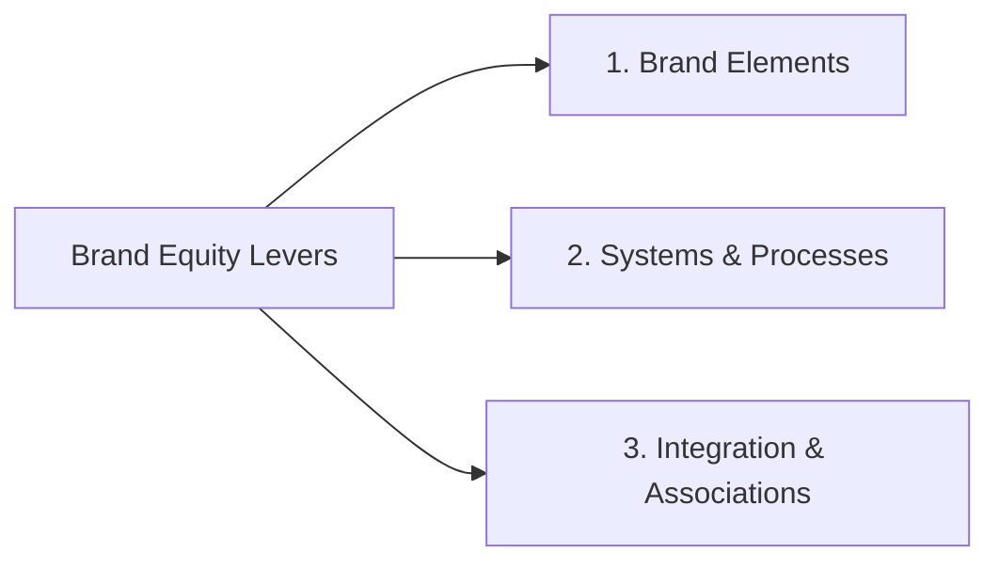
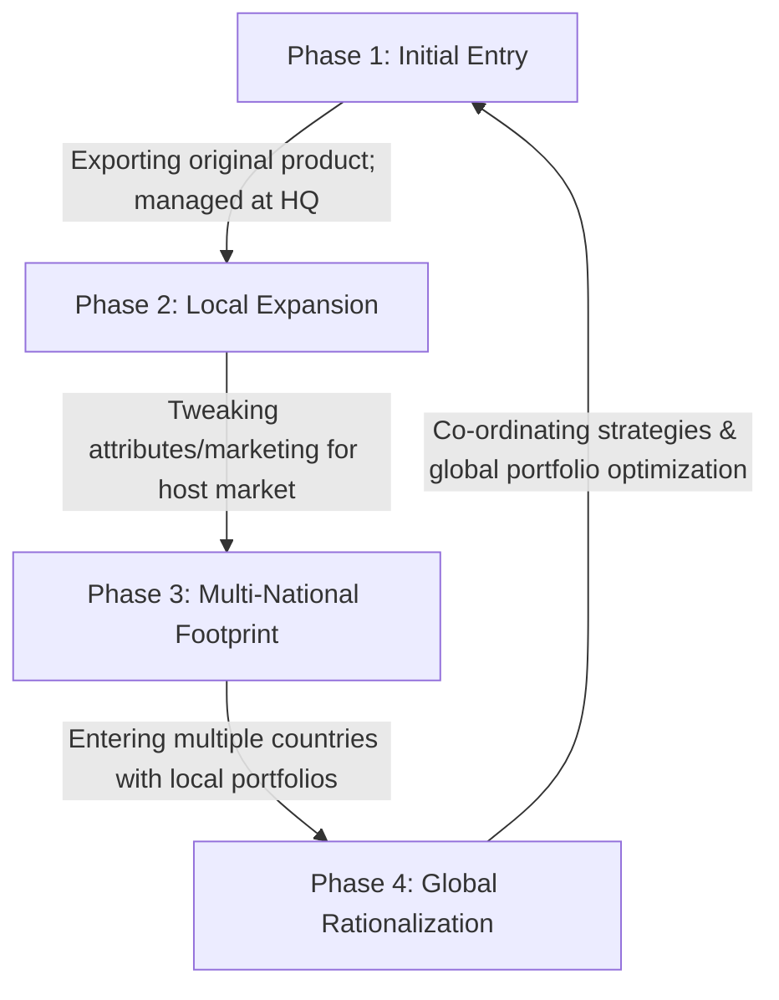
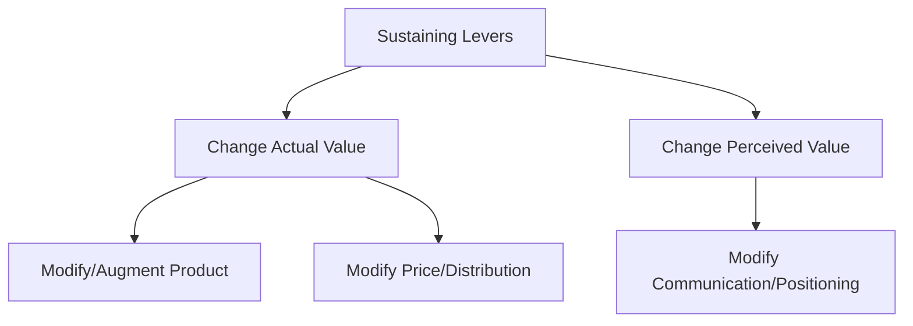
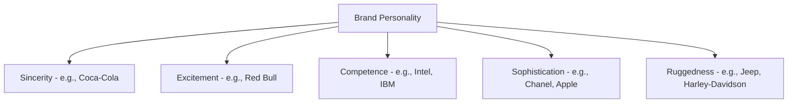

# Block 4 Notes: Managing Brand Equity
## Exam Revision Notes in Hinglish (High-Yield Sheet)

## Unit 13: Enhancing Brand Equity

### Brand Foundation: Authenticity and Believability (Brand ki Bunyaad)
Ek strong brand ke paas **love** (pyaar) aur **respect** (izzat) dono honi chahiye. Brand building do main pillars par tiki hoti hai:
1. **Authenticity**: Brand ke core purpose aur promise ke sath sacha rehna. Brand ko apne values ko har action me embody (apnana) karna chahiye, sirf bolne (lip service) se kaam nahi chalta.
   * *Example (Body Shop)*: Ye brand "Enrich not Exploit" philosophy ke sath khada hai, jo natural ingredients aur fair trade practices ko unki supply chain, retail experience, aur hiring me reflect karta hai.
   * *Example (Patanjali)*: Isne natural, Ayurvedic origins ke core par apni brand equity banayi thi. Par, 2020 me CSE ki honey adulteration (milawat) study jaise controversies ne iski brand authenticity ko nuksan pahunchaya.
   * *Example (Dove)*: Ye brand functional cleansing benefits se aage badhkar global **"Campaign for Real Beauty" (2004)** par shift hua, jo body confidence aur real, bina-airbrush ki gayi women ko celebrate karta hai (jaise India me #StopTheBeautyTest campaign), jisne iski authenticity ko aur mazboot kiya.
2. **Believability**: Brand jo claims karta hai uske liye ek strong **Reason to Believe (RTB)** dena. RTB ye ho sakta hai:
   * *Rational*: Saffola cooking oil heart health ke liye low PUFA content highlight karta hai.
   * *Emotional / Heritage*: BMW ki German engineering ya Apple ki tech innovation capabilities.

---

### Levers for Enhancing Brand Equity (Brand Equity badhane ke Levers)
Marketers brand equity build aur sustain karne ke liye teen primary touchpoints ka use karte hain:



#### 1. Selecting and Managing Brand Elements
Brand elements (logos, symbols, characters, names, URLs) brand ko identify aur differentiate karne me help karte hain.
* **Keller’s Six Criteria for Brand Elements (Brand Elements chunne ke 6 criteria)**:
  * **Memorable**: Recognition aur recall karne me easy hona (e.g., *Amul Girl* mascot).
  * **Meaningful**: Product category ya benefits ko connote (darshana) karna.
  * **Likeable**: Warm, fun, aur visually appealing hona.
  * **Transferable**: Different product lines aur geographies me applicable hona.
  * **Adaptable**: Samay ke sath change hone aur update hone me easy hona.
  * **Protectable**: Legally protectable hona taaki koi copy na kar sake.
* *Example (Intel Inside / Pentium)*: Intel ne processor names ko numbers (e.g., 486, jo protectable nahi the aur consumer-friendly bhi nahi the) se badalkar **Pentium** kiya (jisne 5th gen technology dikhayi, scientific sound kiya, aur legally unique/protectable tha), aur sath me "Intel Inside" logo aur sound signature ka use kiya taaki ingredient brand awareness ban sake.
* *Example (Amul Girl)*: Eustace Fernandes dwara 1966 me "Utterly Butterly" tagline ke sath banayi gayi. Ye mascot contemporary topical issues par humorous comments karke brand ko hamesha updated aur likeable rakhta hai.

#### 2. Systems and Processes to Deliver Brand Promise
Brand promise ko deliver karna non-negotiable hai. Agar customer experience expectations se match nahi karta, toh equity kharab ho jaati hai.
* **Tajness (Taj Hotels)**: Tajness ka spirit operations ke six pillars (Nobility, Sincere Care, Homage to Local Culture, Sensorial Journeys, Pioneering Spirit, Authenticity) par chalta hai, jo premium service promise ko standard rituals aur consistent guest experiences me badalta hai.
* **Airbnb's Curated Experience**: Airbnb ne sirf rooms connect karne se aage badhkar customer journey ko map kiya. Unhone professional photography programme (2009-2010) launch kiya taaki listings real me achhi dikhein aur "Airbnb Neighborhoods" ke zariye local guides coordinate kiye, jisse online booking se lekar real stay tak ka experience seamless ho gaya.

#### 3. Building Desired Brand Associations
* **Surf Excel ("Daag Acche Hain")**: Stain-cleaning ad se shift hokar unhone bachhon ko achhe kaam karte waqt ganda hote dikhaya (e.g., #NekiEkIbadat, #AbLagRahiDiwali). Isse brand laundry powder ke bajaye parents ka partner ban gaya jo child development me help karta hai.
* **Brooke Bond Taj Mahal Tea**: Classical music (Ustad Zakir Hussain's "Wah Taj!") ke zariye premium connoisseur association banaya aur physical *Taj Mahal Tea House* (Mumbai) banakar tea-tasting aur music experience ko blend kiya.
* **Maggi ("Me and Meri Maggi")**: Customers se unki Maggi stories share karwayi aur unhe packets aur ads me use kiya. Is emotional connect ke karan 2015 ke MSG controversy ke baad brand ko customers ne jaldi forgive kiya aur re-launch bohot successful raha.
* **Harley Owners Group (H.O.G.)**: Global level par 1,400 se zyaada chapters banaye jo rider community ko bind karte hain, jisse deep loyalty aur brand advocacy create hoti hai.

#### 4. Keller's Brand Resonance Model
Equity build karne ke sequential steps ko dikhata hai:

```
                  RESONANCE (Active Engagement)
             +--------------------------------------+
             |   FEELINGS   |       JUDGMENTS       | (Response)
             +--------------+-----------------------+
             |   IMAGERY    |      PERFORMANCE      | (Meaning)
             +--------------+-----------------------+
                    SALIENCE (Recall/Recall)          (Identity)
```

---
---

## Unit 14: Managing Brands over Time and Geographies

### International Brand Expansion (International Expansion ke Reasons)
Firms domestic market saturation, international market growth potential, global mobility of customers, risk management, aur production scale economies ke liye international markets me expand karti hain.

#### The 4 Phases of Internationalization

* *Example (Phase 2)*: Nokia ne Indian rural market ke liye saste aur battery durability wale mobile handsets launch kiye taaki brand penetration badh sake.

---

### Global Branding: Standardization vs. Customization
Global brands ko standardize aur customize strategies me se choose karna hota hai:

| Dimension | Standardized Approach | Customized Approach |
| :--- | :--- | :--- |
| **Core Idea** | Poore world me same product, positioning, aur marketing mix. | Local culture, laws, aur habits ke basis par mix me badlaav karna. |
| **Advantages** | - Cost savings (production aur campaigns me scale economies).<br>- Uniform global brand image.<br>- Headquarters se easy coordination. | - Local customers ke liye high relevance.<br>- Local regulations ke compliance me easy.<br>- Local competition ko counter karna aasan. |
| **Drawbacks / Issues** | - Cultural insensitivity ka risk (e.g., Japan me Camay soap ad failure).<br>- Localized competition ko ignore karna. | - Product aur marketing adaptation ki high cost.<br>- Global brand image/meaning dilute hone ka risk. |
| **Prime Example** | **Apple**: Puri duniya me same hardware specifications aur stores ka look and feel. | **Netflix**: India me Rs 199 mobile-only subscription plans aur local shows (e.g., *Sacred Games*) banana. |

#### Quelch and Hoff's Global Marketing Planning Matrix
Managers ko business functions (R&D, manufacturing) aur marketing elements (price, product design, distribution) ko country-by-country standardize ya customize karne me help karta hai.

#### Factors Driving Customization (Customization badhane wale Factors)
1. **Product & Packaging**:
   * *Nature of Product*: Consumer goods me industrial goods se zyaada customization lagta hai.
   * *Regulations*: E.g., India me food products par green veg dot lagana, voltage requirements, ya local language.
   * *Purchase Patterns*: Sachets (shampoo/sauces) introduce karna lower-income segments ke liye vs. US me bulk-buying.
2. **Pricing & Distribution**:
   * *Market Sensitivity & Local Costs*: Revlon ne 90s me India enter karte waqt premium pricing rakhi (US me mass brand hone ke bawajood) taaki quality perception aur prestige bani rahe.
   * *Payment options*: Amazon aur Uber ka India me Cash on Delivery/Cash options accept karna.
   * *Distribution bottlenecks*: Castrol ne PSU petrol pumps par block hone ke baad local garages aur spare part shops ke zariye apna proprietary network banaya.
3. **Communication & Positioning**:
   * *Cultural Nuances*: Kit Kat ne Japan me "Have a Break" ko "Kitto Katsu" (surely win in Kyushu dialect) se connect kiya, jisse students use exam good-luck charm ke roop me gift karne lage aur sales 150% badh gayi.
   * *Risk Mitigation*: Amazon ka India me online purchase ka fear door karne ke liye "Apni Dukan" campaign chalana.

---

### Kapferer's 7 Patterns of Globalization
Kapferer ne concept, name, aur product/service ke combo ke base par globalization ke 7 patterns bataye hain:
1. **Type 1: No Adaptation**: Pure standardized global branding (e.g., Rolex).
2. **Type 2: Different Positioning**: Same product, but positioning different (e.g., Ford Fiesta family car in Portugal but entry-level in Germany; Knorr soups positioned as evening snack in India instead of meals starter).
3. **Type 3: Important Product Adaptations**: Product modify karna brand name same rakh kar (e.g., Colgate Vedshakti in India).
4. **Type 4: Split Brands**: Split ownership me different positioning aur products (e.g., Gervais ice cream).
5. **Type 5: Different Brand Names**: Same concept, different names due to culture/laws (e.g., Burger King is *Hungry Jack’s* in Australia; P&G's sanitary pads branded as *Whisper* in India due to period stigma).
6. **Type 6: World Brands with Dual Pricing**: Volkswagen aur entry-level Audi cars ki identical pricing.
7. **Type 7: Operating with Local Brands**: Local brand acquire karke market share badhana (e.g., Coca-Cola acquiring *Thums Up* in India; Colgate acquiring *Darlie* in China).

---

### Levers for Sustaining Brand Value Over Time (Brand Value sustain karne ke Levers)
Aage chal kar obsolescence se bachne ke liye brands ko rejuvenate hona padta hai.



#### 1. Augmenting the Product/Service (Actual Value me change karna)
* **For Existing Customers**:
  * *Amazon Prime*: Streaming aur fast shipping bundle karke customer stickiness badhana.
  * *Asian Paints*: Paint bechne se shift hokar complete home painting service designer banna.
  * *Cadbury*: Ordinary chocolate se shift hokar festival gifting ke liye "Kuch Meetha Ho Jaye" boxes introduce karna.
* **For New Customers**:
  * *Maruti Suzuki (Nexa)*: Upgrading buyers ke liye premium Nexa showrooms launch karna.
  * *Philips*: T-Bulb introduce karna jo normal socket me fit ho sake, bina kisi installation hurdles ke.

#### 2. Pricing and Distribution Levers
* *Baxter Renal Care*: fluid bags ki price par focus karne ke bajaye unhone total cost of treatment pricing ki (nursing, home delivery, training bundle karke).
* *Maruti Suzuki*: Low income segment ke liye monthly installment schemes (INR 2,599/month) laana.
* *Unilever's Project i-Shakti*: Rural distribution gaps fill karne ke liye rural women ko micro-distributors banana.

#### 3. Communication & Positioning (Perceived Value me change karna)
* *Fair & Lovely (Glow & Lovely)*: Shaadi aur groom context se shift hokar career confidence par, aur ab colorism criticisms ke baad inclusive "glowing skin" par positioning shift karna.
* *Saffola*: Curative heart care niche (jo mature ho chuka tha) se preventive heart health positioning par shift hona aur ads me warmth aur humor use karna.

---
---

## Unit 15: Measuring Brand Equity

### Tracking Brand Equity vs. Brand Valuation
* **Brand Equity Tracking**: Consumer-based brand health (awareness, loyalty, associations) ko qualitatively aur quantitatively measure karna.
* **Brand Valuation**: Balance sheet par brand name ki direct financial value estimate karna.

---

### Measuring Customer-Based Brand Equity Components

#### 1. Brand Awareness Measures (Awareness ko measure karna)
Awareness dimaag me brand ki presence ki strength ko batata hai.

```
                      +------------------+
                      |   TOP OF MIND    | (First brand recalled)
                      +------------------+
                      |  UNAIDED RECALL  | (Spontaneous recall in category)
                      +------------------+
                      |   AIDED RECALL   | (Recognized upon prompting)
                      +------------------+
```
* *Example (Allen Solly Shirts)*: 600 respondents ke survey me:
  * 200 log Allen Solly ka naam sabse pehle lete hain $\rightarrow$ **Top of Mind** = $33\%$
  * 390 log bina prompt ke name batate hain $\rightarrow$ **Unaided Recall** = $65\%$
  * 120 log prompt karne par recognize karte hain $\rightarrow$ **Aided Recall** = $20\%$
  * Total Brand Awareness (Aided + Unaided) = $65\% + 20\% = 85\%$

#### 2. Perceived Quality Measures
Competitors ke comparison me product quality ke customer perception ko study karna:
* Customer Satisfaction Index (CSI) ka use karna.
* Performance ratings, intention-to-use, aur actual usage metrics.

#### 3. Brand Association Measures
Qualitative research ke zariye find out karna:
* **Free Association**: Brand ka naam sunte hi dimaag me sabse pehle kya aata hai.
* **Picture Interpretation**: Consumers matching animal/person pictures pick karte hain speed, safety reflect karne ke liye.
* **Description of typical user**: Harley-Davidson user ko ek rugged, free rebel ke roop me describe karna.
* **Brand Personality Framework (Jennifer Aaker)**: Brand personality ke 5 dimensions identify karna:



#### 4. Brand Loyalty Measures
* **Repeat Purchase Rate**: Total category purchases me se kitni baar ye brand khareeda gaya (e.g., 4 me se 3 baar soap khareeda).
* **RFM Analysis (Retail)**: Recency, Frequency, aur Monetary value of purchase ko track karna.
* **Trial Rate & Brand Preference**: Naye extensions try karne ki willingness aur relative price premium support check karna.

#### 5. Young & Rubicam's Brand Asset Valuator (BAV)
Y&R Power Grid par strength aur stature plot karna:

```
     Brand Strength
    (Differentiation
     & Relevance)
          ^
          |   [Niche / Unrealized Potential]  |   [Power Leaders]
          |   (High Strength, Low Stature)    |   (High Strength, High Stature)
          | ----------------------------------+---------------------------------
          |   [New / Unfocused]               |   [Eroding / Declining]
          |   (Low Strength, Low Stature)     |   (Low Strength, High Stature)
          +--------------------------------------------------------------------> Brand Stature
                                                                        (Esteem & Knowledge)
```

---

### Keller's Brand Report Card
Strongest brands in **10 key characteristics** par rate hoti hain (1 se 10 scale):
1. **Desire Fulfillment**: Consumers ki core desired benefits deliver karna.
2. **Relevance**: Product updates ke zariye relevant rehna.
3. **Value Pricing**: Pricing customer value perception ke accordance hona.
4. **Proper Positioning**: Points of Parity (POP) aur Points of Difference (POD) clear hona.
5. **Consistency**: Consistent, non-conflicting brand messaging.
6. **Logical Hierarchy**: Portfolio aur hierarchy structural design sahi hona.
7. **Marketing Repertoire**: Coordinated 360-degree marketing.
8. **Consumer Understanding**: Managers consumer dimaag me brand meaning ko jante hon.
9. **Sustained Support**: Long-term financial aur marketing backing.
10. **Equity Monitoring**: Systematic tracking aur brand audits.

---

### Brand Valuation Methods (Brand Valuation ke Methods)
Brand valuation physical assets se brand name ki financial value ko alag karta hai. 2020 me S&P 500 market value me intangible assets ka share **90%** tak pahunch gaya hai.

#### 1. Cost-Based Methods
* **Historical Cost**: Past marketing aur brand development costs ko add karna. Easy hai par efficiency aur current market values ko ignore karta hai.
* **Replacement Cost**: Aaj ki date me same brand build karne me aane wali cost estimate karna. Subjective hai par competition ko represent karta hai.
* **Market-Based Approach**: Branded product ke profits ko generic unbranded product ke profits se compare karna. benchmark find karna mushkil hota hai aur future earnings ko skip karta hai.

#### 2. Income-Based Methods
Brand se generate hone wali future expected earnings ko present value (NPV) me discount karna.

#### 3. Interbrand Valuation Method
Financial analysis aur marketing contribution ko combine karta hai:
* **Valuation Formula**:
  $$\text{Brand Value} = \frac{\text{Intangible Earnings} \times \text{Role of Branding Index (RBI)}}{\text{Discount Factor}}$$
* **Step 1: Economic Earnings**: Cost of capital ko net earnings se subtract karke segments ka Economic Value Added (EVA) calculate karna.
* **Step 2: Role of Brand Index (RBI)**: Purchase decision me brand brand name ka index percentage (chemical me 10% se cosmetic/soft drinks me 80-90% tak).
* **Step 3: Brand Strength Score**: 7 factors (Market potential, stability, leadership, trend, support, footprint, protectability) par evaluate karke risk and **Discount Factor** decide karna (higher score $\rightarrow$ lower risk $\rightarrow$ lower discount factor).
* **Other Strength Indicators**:
  * *Brand Weight*: Market dominance.
  * *Brand Width*: Customer categories range.
  * *Brand Stretch*: Product categories served.
  * *Brand Depth*: Customer loyalty levels.

#### Case Study: Reliance Acquisition of Hamleys (2019)
* **Context**: Reliance Industries ne 2019 me British toy maker Hamleys ko **$88.6 million** cash deal me acquire kiya. Us samay, Hamleys FY 2018 me $3.13M profit me tha par FY 2017 me use $14.8M ka bada loss hua tha.
* **Strategic Valuation Rationale**: Reliance ne losses ke bawajood heavy price isliye diya kyunki Hamleys ke paas high **intangible brand equity** aur global brand awareness thi. Toy category me deep customer loyalty aur strong associations the. Reliance ne is brand value ko use karke apne retail network ke zariye toy sales aur physical outlets scale kiye. Ye batata hai ki brand valuation forward-looking aur potential-leveraging hota hai, na ki sirf historical profit tracking.
