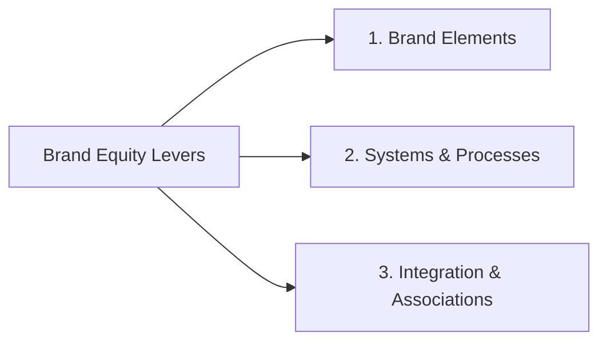
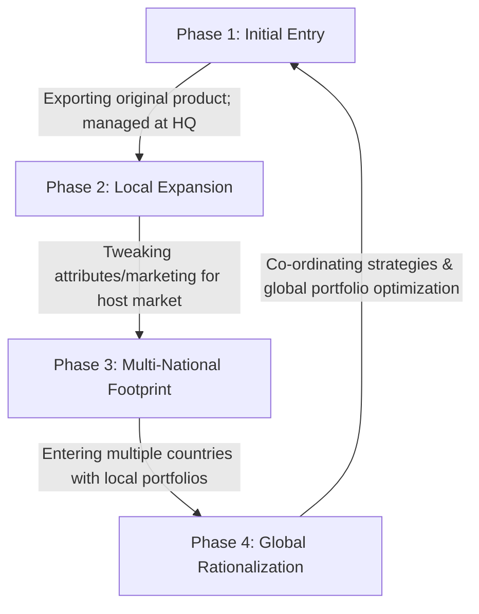
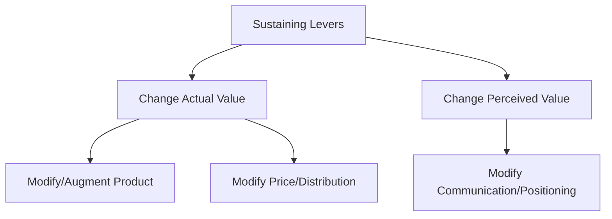
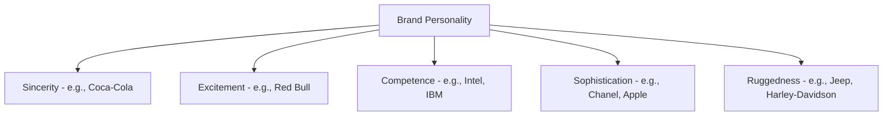

# Block 4 Notes: Managing Brand Equity

## Unit 13: Enhancing Brand Equity

### Brand Foundation: Authenticity and Believability
A strong brand must command both **love** and **respect**. Brand building rests on two core pillars:
1. **Authenticity**: Remaining true to the brand’s core purpose and promise. A brand must embody its values in every action, not just offer lip service.
   * *Example (Body Shop)*: Stands for "Enrich not Exploit," reflecting natural ingredients and fair trade across supply chains, retail, and hiring.
   * *Example (Patanjali)*: Built equity on natural, Ayurvedic origins. However, controversies like the 2020 honey adulteration study by CSE show how deviations can damage authenticity.
   * *Example (Dove)*: Shifted from cleansing/moisturizing benefits to the global **"Campaign for Real Beauty" (2004)**, promoting body confidence and real, un-airbrushed women (e.g., #StopTheBeautyTest in India), cementing its authenticity.
2. **Believability**: Providing a strong **Reason to Believe (RTB)** for the brand’s claims. RTB can be:
   * *Rational*: Saffola cooking oil highlighting low PUFA for heart health.
   * *Emotional / Heritage*: BMW’s German engineering or Apple’s tech innovation.

---

### Levers for Enhancing Brand Equity
Marketers leverage three primary touchpoints to build and sustain brand equity:



#### 1. Selecting and Managing Brand Elements
Brand elements (logos, symbols, characters, names, URLs) identify and differentiate the brand.
* **Keller’s Six Criteria for Brand Elements**:
  * **Memorable**: Easy to recognize and recall (e.g., *Amul Girl* mascot).
  * **Meaningful**: Connotes product category or benefits.
  * **Likeable**: Warm, fun, and visually appealing.
  * **Transferable**: Works across product lines and geographic boundaries.
  * **Adaptable**: Easy to update over time to keep pace with consumer trends.
  * **Protectable**: Legally defensible from imitation.
* *Example (Intel Inside / Pentium)*: Intel moved from numerical processor names (e.g., 486, which were not protectable or consumer-friendly) to **Pentium** (meaningful suffix "ium", scientific sounding, and legally protectable), using the distinctive "Intel Inside" logo and auditory signature to build ingredient brand awareness.
* *Example (Amul Girl)*: Created in 1966 with the tagline "Utterly Butterly." The mascot has endured by humorously commenting on contemporary topical issues, keeping the brand highly adaptable and liked.

#### 2. Systems and Processes to Deliver Brand Promise
Consistency is crucial. If the customer experience fails to match expectations, brand equity erodes.
* **Tajness (Taj Hotels)**: The spirit of Tajness is built on six operational pillars (Nobility, Sincere Care, Homage to Local Culture, Sensorial Journeys, Pioneering Spirit, Authenticity), translating a premium promise into signature rituals and uniform guest experiences.
* **Airbnb's Curated Experience**: Transitioned from a cheap lodging connector to a social discovery platform. Focused on the customer journey by investing in professional photography for listings (2009-2010) and launching "Airbnb Neighborhoods" to coordinate local guides and editor recommendations, ensuring a seamless digital-to-physical experience.

#### 3. Building Desired Brand Associations
* **Surf Excel ("Daag Acche Hain" / Dirt is Good)**: Replaced functional "stain removal" ads with a 360-degree emotional platform showing children getting dirty while doing good deeds (e.g., #NekiEkIbadat, #AbLagRahiDiwali). This shifted the brand from an adversary of stains to a partner in children's development.
* **Brooke Bond Taj Mahal Tea**: Deepened its premium "connoisseur" association by aligning with Indian classical music (Ustad Zakir Hussain's "Wah Taj!") and creating the physical *Taj Mahal Tea House* in Mumbai to cultivate a holistic sensory brand experience.
* **Maggi ("Me and Meri Maggi")**: Leveraged signature customer storytelling campaigns (printing select user stories on packs and airing them as TV spots). During its lead/MSG controversy in 2015, this deep emotional bank of customer love facilitated brand forgiveness and a highly successful post-ban re-launch.
* **Harley Owners Group (H.O.G.)**: Over 1,400 global dealer-sponsored chapters creating a passionate brand community, driving deep loyalty and brand advocacy.

#### 4. Keller's Brand Resonance Model
Summarizes the sequential steps to build equity:

```
                  RESONANCE (Active Engagement)
             +--------------------------------------+
             |   FEELINGS   |       JUDGMENTS       | (Response)
             +--------------+-----------------------+
             |   IMAGERY    |      PERFORMANCE      | (Meaning)
             +--------------+-----------------------+
                    SALIENCE (Recall/Recall)          (Identity)
```

---
---

## Unit 14: Managing Brands over Time and Geographies

### International Brand Expansion
Firms expand internationally due to domestic market saturation, untapped global potential, global mobility of customers, risk diversification, and economies of scale.

#### The 4 Phases of Internationalization

* *Example (Phase 2)*: Nokia launching low-cost, rugged mobile handsets specifically designed for the Indian rural market to drive penetration.

---

### Global Branding: Standardization vs. Customization
Firms face a trade-off between standardizing their marketing mix globally or customizing it locally.

| Dimension | Standardized Approach | Customized Approach |
| :--- | :--- | :--- |
| **Core Idea** | Same product, positioning, and marketing globally. | Tweak marketing mix to fit local culture, laws, and habits. |
| **Advantages** | - Huge cost savings (economies of scale in R&D, production).<br>- Uniform global brand image.<br>- Easier coordination & control. | - High customer relevance.<br>- Adherence to local regulations.<br>- Adapts to local competition & infrastructure. |
| **Drawbacks / Issues** | - Risks cultural insensitivity (e.g., P&G Camay soap ad failure in Japan).<br>- Ignores localized competition. | - High costs of adaptation.<br>- Potential dilution of the global brand identity. |
| **Prime Example** | **Apple**: Identical hardware design and uniform global retail look. | **Netflix**: Rs 199 mobile-only subscription plans in India (due to low Wi-Fi penetration) and heavy investment in local content (e.g., *Sacred Games*). |

#### Quelch and Hoff's Global Marketing Planning Matrix
Helps managers map the degree of standardization or customization across business functions (R&D, Manufacturing, Finance) and marketing mix elements (Product design, Price, Promotion, Distribution) per country.

#### Factors Driving Customization
1. **Product & Packaging**:
   * *Nature of Product*: Consumer durables/FMCG need more customization than industrial products.
   * *Regulations*: E.g., India's green veg dot dotting food labels, specific voltage configurations, and local language packaging.
   * *Purchase Patterns*: Sachets (shampoo/sauces) in India to match low income levels vs. bulk buying in the US.
2. **Pricing & Distribution**:
   * *Market Sensitivity & Local Costs*: Revlon using premium pricing in India in the 90s (despite mass status in US) to align with prestige associations.
   * *Payment/System changes*: Amazon and Uber accepting cash on delivery/cash payments in India.
   * *Distribution bottlenecks*: Castrol bypassing public sector oil-controlled petrol stations by establishing a proprietary network through local garage and spare part shops.
3. **Communication & Positioning**:
   * *Cultural Nuances*: Kit Kat in Japan adapting "Have a Break" to "Kitto Katsu" (meaning "surely win" in Kyushu dialect), positioning the chocolate as an exam good-luck charm for students, resulting in a 150% sales increase.
   * *Risk Mitigation*: Amazon India launching the "Apni Dukan" campaign to build trust and ease online buying hesitation for first-time shoppers.

---

### Kapferer's 7 Patterns of Globalization
Kapferer outlines options along a continuum of globalization to customization based on three brand facets (Concept, Name, Product/Service):
1. **Type 1: No Adaptation**: Pure global standardized brands (e.g., luxury goods like Rolex).
2. **Type 2: Different Positioning**: Same product/name, but positioned differently (e.g., Ford Fiesta is a family car in Portugal but an entry-level car in Germany; Knorr soups positioned as an evening snack in India rather than a starter course).
3. **Type 3: Important Product Adaptations**: Tweak product while keeping brand name/concept (e.g., Colgate Vedshakti for the Indian herbal segment).
4. **Type 4: Split Brands**: Different positioning/offering under split corporate ownership (e.g., Gervais ice cream).
5. **Type 5: Different Brand Names**: Same product/concept, different names due to cultural/legal reasons (e.g., Burger King is *Hungry Jack’s* in Australia; P&G's sanitary pads branded as *Whisper* in India due to cultural stigmas).
6. **Type 6: World Brands with Dual Pricing**: Audi entry-level vs. high-end Volkswagen cars.
7. **Type 7: Operating with Local Brands**: Acquiring local brands to gain market share (e.g., Coca-Cola acquiring *Thums Up* in India; Colgate acquiring *Darlie* in China).

---

### Levers for Sustaining Brand Value Over Time
Over time, brands must rejuvenate themselves to prevent obsolescence.



#### 1. Augmenting the Product/Service (Actual Value Changes)
* **For Existing Customers**:
  * *Amazon Prime*: Bundle fast delivery with streaming services to build customer dependency.
  * *Asian Paints*: Transitioning from a paint supplier to a complete home painting service provider.
  * *Cadbury*: Expanding from a simple chocolate bar to "Kuch Meetha Ho Jaye" festival gift boxes, converting chocolates into a replacement for traditional Indian sweets.
* **For New Customers**:
  * *Maruti Suzuki (Nexa)*: Launching premium Nexa showrooms to capture upscale buyers upgrading from entry-level cars.
  * *Philips*: Introducing the T-Bulb to fit existing bulb sockets easily, appealing to customers who found traditional tubelight installation cumbersome.

#### 2. Pricing and Distribution Levers
* *Baxter Renal Care*: Faced with cost-conscious hospital administrators, Baxter shifted from selling fluid bags to managing the **total cost of treatment** by bundle-pricing fluid bags, nurse training, and home-delivery services.
* *Maruti Suzuki*: Attracted lower-income buyers via easy installment plans (INR 2,599/month).
* *Unilever's Project i-Shakti*: Recruiting rural women as micro-distributors to break distribution fragmentation in deep villages.

#### 3. Communication & Positioning (Perceived Value Changes)
* *Fair & Lovely (Glow & Lovely)*: Evolved positioning from seeking a groom/marriage to professional career advancement, and finally transitioning to inclusive "glowing skin" to address colorism concerns.
* *Saffola*: Shifted from curative/therapeutic heart disease positioning (niche/saturated) to preventive heart care for active families, utilizing warmer, humorous ad setups to increase usage frequency.

---
---

## Unit 15: Measuring Brand Equity

### Tracking Brand Equity vs. Brand Valuation
* **Brand Equity Tracking**: Qualitative and quantitative measurement of consumer-based brand health (awareness, associations, loyalty).
* **Brand Valuation**: Estimating the direct financial value of the brand as an asset on the balance sheet.

---

### Measuring Customer-Based Brand Equity Components

#### 1. Brand Awareness Measures
Awareness is the strength of a brand’s presence in memory.

```
                      +------------------+
                      |   TOP OF MIND    | (First brand recalled)
                      +------------------+
                      |  UNAIDED RECALL  | (Spontaneous recall in category)
                      +------------------+
                      |   AIDED RECALL   | (Recognized upon prompting)
                      +------------------+
```
* *Example (Allen Solly Shirts)*: In a survey of 600 respondents:
  * 200 name Allen Solly first $\rightarrow$ **Top of Mind** = $33\%$
  * 390 name it spontaneously $\rightarrow$ **Unaided Recall** = $65\%$
  * 120 recognize it only when prompted $\rightarrow$ **Aided Recall** = $20\%$
  * Total Brand Awareness (Aided + Unaided) = $65\% + 20\% = 85\%$

#### 2. Perceived Quality Measures
Measures consumer perception of overall quality relative to substitutes. Tracked via:
* Customer Satisfaction Index (CSI).
* Performance ratings, intention-to-use, and category usage metrics.

#### 3. Brand Association Measures
Elicited through qualitative research:
* **Free Association**: What immediately comes to mind.
* **Picture Interpretation**: Customers pick matching animal/person pictures to represent speed, safety, etc.
* **Description of typical user**: E.g., Harley-Davidson user described as a rugged, freedom-loving rebel.
* **Brand Personality Framework (Jennifer Aaker)**: Identifies 5 brand personality dimensions:



#### 4. Brand Loyalty Measures
* **Repeat Purchase Rate**: Number of times the brand is bought out of total category purchases (e.g., 3 out of 4 soap purchases).
* **RFM Analysis (Retail)**: Recency, Frequency, and Monetary value of purchases.
* **Trial Rate & Brand Preference**: Measuring willingness to try extensions and checking if the brand is the "most preferred" even if other options are cheaper.

#### 5. Young & Rubicam's Brand Asset Valuator (BAV)
BAV plots brand strength and stature on the **BAV Power Grid**:

```
     Brand Strength
    (Differentiation
     & Relevance)
          ^
          |   [Niche / Unrealized Potential]  |   [Power Leaders]
          |   (High Strength, Low Stature)    |   (High Strength, High Stature)
          | ----------------------------------+---------------------------------
          |   [New / Unfocused]               |   [Eroding / Declining]
          |   (Low Strength, Low Stature)     |   (Low Strength, High Stature)
          +--------------------------------------------------------------------> Brand Stature
                                                                        (Esteem & Knowledge)
```

---

### Keller's Brand Report Card
Strongest brands excel across **10 key characteristics** (rated 1 to 10):
1. **Desire Fulfillment**: Excels at delivering benefits consumers truly desire.
2. **Relevance**: Stays relevant through updates.
3. **Value Pricing**: Pricing matches customer value perceptions.
4. **Proper Positioning**: Points of Parity (POP) and Points of Difference (POD) are clear.
5. **Consistency**: Consistent non-conflicting message.
6. **Logical Hierarchy**: Brand architecture makes sense.
7. **Marketing Repertoire**: Fully coordinated 360-degree marketing activities.
8. **Consumer Understanding**: Managers know what the brand means to consumers.
9. **Sustained Support**: Long-term support and funding.
10. **Equity Monitoring**: Systematic tracking and periodic brand audits.

---

### Brand Valuation Methods
Brand valuation separates the value of the brand name from physical assets. In 2020, intangible assets accounted for roughly **90% of the S&P 500 market value**.

#### 1. Cost-Based Methods
* **Historical Cost**: Accumulates all past marketing and development expenditures. Easy to calculate, but ignores current relevance and past spending inefficiencies.
* **Replacement Cost**: Estimates cost to build a brand of similar stature today. Reflects current competitive toughness but is highly subjective.
* **Market-Based Approach**: Compares profits of the branded product against an unbranded generic equivalent. Limited by the difficulty of finding an identical generic benchmark and its focus on current (rather than future) profits.

#### 2. Income-Based Methods
Discounting future expected earnings directly attributable to the brand to present value.

#### 3. Interbrand Valuation Method
Uses a combined financial and marketing contribution approach.
* **Valuation Formula**:
  $$\text{Brand Value} = \frac{\text{Intangible Earnings} \times \text{Role of Branding Index (RBI)}}{\text{Discount Factor}}$$
* **Step 1: Economic Earnings**: Calculate Economic Value Added (EVA) from the brand's segments by subtracting cost of capital from net earnings.
* **Step 2: Role of Brand Index (RBI)**: The percentage of purchase decision driven by the brand name alone (ranges from 10% in chemicals to 80-90% in cosmetics/soft drinks).
* **Step 3: Brand Strength Score**: Evaluated on 7 attributes (Market Potential, Stability, Leadership Position, Growth Trend, Support, Geographic Footprint, Legal Protectability). This determines the **Discount Factor** (higher brand strength $\rightarrow$ lower risk $\rightarrow$ lower discount factor).
* **Other Strength Indicators**:
  * *Brand Weight*: Dominance in market.
  * *Brand Width*: Number of customer categories.
  * *Brand Stretch*: Product categories served.
  * *Brand Depth*: Customer relationship/loyalty.

#### Case Study: Reliance Acquisition of Hamleys (2019)
* **Context**: Reliance Industries acquired British toy maker Hamleys in 2019 for **$88.6 million** in cash. At the time, Hamleys had reported a net profit of $3.13 million in 2018 but massive losses of $14.8 million in 2017.
* **Strategic Valuation Rationale**: Reliance paid a heavy premium because Hamleys possessed massive **intangible brand equity**. Despite poor short-term physical retail performance, the brand maintained high global awareness, deep emotional associations, and a strong history of consumer trust. Reliance leveraged this brand equity to scale Hamleys across its expanding retail footprint in India and globally, showing that brand valuation is forward-looking and asset-leveraging rather than just a reflection of historic balance sheets.
