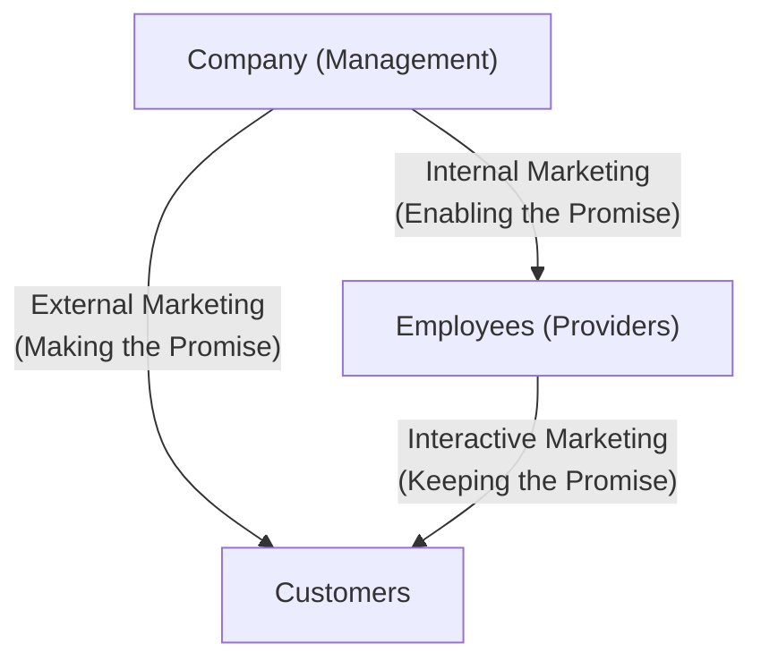

# MMPM-005: Block 1 — Marketing of Services: An Overview
## Exam Revision Notes in Hinglish (High-Yield Sheet)

---

## Unit 1: Marketing of Services: An Introduction

### 1. Defining "Services" (Services ko Define Karna)
* **Concept of Service**: Separately identifiable, aur basically intangible activities jo customer ki requirements/wants ko satisfy karti hain. Ye performances hoti hain, koi physical objects nahi.
* **Core Distinction**: Services me, production aur consumption dono simultaneous (ek sath) hote hain, aur buyer permanent ownership lene ki jagah facility ya experience ko use/access karne ka right khareedta hai.
* **Goods vs. Services Summary**:
  | Dimension | Goods (Samaan) | Services (Seva) |
  | :--- | :--- | :--- |
  | **Tangibility** | Tangible (Jise touch aur dekh sakein) | Intangible (Sirf experience ya feel kar sakein) |
  | **Ownership** | Purchase karne par buyer ko transfer hoti hai | Title/ownership ka koi transfer nahi hota |
  | **Evaluation** | Easy (Standard specifications hote hain) | Complex (Provider aur day-to-day change hota hai) |
  | **Perishability** | Inventory me store kiya ja sakta hai | Store nahi kar sakte (Perishable hoti hain) |
  | **Inseparability** | Pehle produce hoti hai, fir sell aur consume | Production aur consumption ek sath hota hai |

### 2. Growth Drivers of the Service Sector (India ke special reference ke sath)
India me "service economy" (jahan services GDP me >50% contribute karti hain) ke growth ke main factors ye hain:
* **Increasing Affluence (Badhti Ameeri)**: Logon ki disposable income badh rahi hai, jisse wo domestic chores (jaise gardening, laundry, interior design, catering) outsource kar rahe hain.
* **More Leisure Time (Fursat ka Time)**: Isse tourism, travel resorts, fitness clubs, aur self-improvement courses ki demand badhti hai.
* **Demographic Changes (Abaadi me badlaav)**: 
  - *Greater Life Expectancy (Lambe jeevan ki ummeed)*: Isse healthcare, nursing homes, aur retirement services ki demand badhti hai.
  - *Women in the Workforce (Kamkaaji Mahilaayein)*: Isse crèches, daycare, babysitting, aur household help ki demand badhti hai.
* **Product Complexity (Products ka complex hona)**: Sophisticated electronics (cars, home automation) ke liye specialized maintenance/servicing contracts (AMCs) zaroori ho jate hain.
* **Complexity of Life (Zindagi ki complexities)**: Modern legal, tax, financial, aur personal systems ko handle karne ke liye specialists (financial advisors, tax consultants, legal aids, therapists) ki zaroori demand hoti hai.
* **Globalization**: International transactions badh rahe hain, jisse logistics, global communication, international travel, aur consulting ki demand badh rahi hai.
* **Manufacturing-Service Synergy (Porter's Links)**:
  - *De-integration*: Manufacturers non-core tasks (logistics, security, IT) ko outsource karte hain.
  - *Services Tied to Goods*: Durables (cars, computers) ki sale se maintenance aur training ki demand badhti hai.
  - *Goods Tied to Services*: Service operations (aviation, hospitality) chalane ke liye bohot saare manufactured equipment ki zaroorat hoti hai.

---

## Unit 2: Conceptual Framework for Services Marketing

### 1. Service Characteristics & Marketing Implications (Characteristics aur unke Marketing par Asar)
Services ki paanch main characteristics hain jo unique marketing challenges create karti hain:
* **Intangibility**: 
  - *Challenges*: Ise display, sample, patent ya easily promote nahi kiya ja sakta.
  - *Strategies*: Brand names use karein, customer benefits par focus karein, credentials showcase karein, aur service ko "tangibilize" karein (jaise modern offices, brochures dikhana).
* **Inseparability**: 
  - *Challenges*: Customer ko "service factory" me present rehna padta hai; operations ka scale limit ho jata hai; direct sales ki zaroorat hoti hai.
  - *Strategies*: Zyaada service personnel ko train karein, scale badhane ke liye technology/automation use karein, aur front-end processes ko standardize karein.
* **Heterogeneity (Variability)**: 
  - *Challenges*: Quality day-to-day, employee-to-employee, aur customer-to-customer vary karti hai (alag hoti hai).
  - *Strategies*: Delivery procedures ko standardize karein, performance ko monitor karein, aur tasks ko automate karein (jaise ATMs, digital self-service).
* **Perishability**: 
  - *Challenges*: Unused capacity hamesha ke liye loss ho jati hai (jaise empty hotel rooms).
  - *Strategies*: Demand aur supply ko align karne ke liye differential pricing (peak vs. off-peak rates) use karein, part-time staff rakhein, aur reservations system chalayein.
* **Non-Ownership**: 
  - *Challenges*: Customers sirf access/usage khareedte hain.
  - *Strategies*: Ease of entry ko highlight karein, convenience par stress dein, aur flexible payment options offer karein.

### 2. The Expanded Marketing Mix for Services (7 Ps)
Services experiences hoti hain, isliye traditional 4 Ps ko expand karke 3 naye Ps add kiye gaye hain:
1. **Product**: Benefits ka ek bundle jisme core, facilitating, aur supporting services hoti hain.
2. **Price**: Dynamically vary karta hai; isme time, psychological costs, aur sensory efforts bhi shaamil hote hain.
3. **Place**: Direct channels common hote hain; site ki convenience aur digital delivery bohot vital (zaroori) hoti hai.
4. **Promotion**: Intangible ko tangibilize karne aur expectations ko manage karne par focus karta hai.
5. **People** *(Naya)*: Frontline staff (jo customer ko dikhte hain) jo brand ko represent karte hain, aur sath hi customer aur baaki customers jo environment me hote hain.
6. **Physical Evidence** *(Naya)*: Servicescape (ambiance, layout, signage) jo quality ke perception ko influence karta hai.
7. **Process** *(Naya)*: Activities ka flow, procedures, aur service delivery systems.

* **Example: Education Services Marketing Mix**:
  - *Product*: Curriculum, degrees, library facilities, placement records.
  - *Price*: Tuition fees, hostel fees, scholarship options.
  - *Place*: Campus location, online learning management systems (LMS), digital access.
  - *Promotion*: Alumni testimonials, rankings, accreditation displays, webinars.
  - *People*: Faculty qualifications, administrative staff ki courtesy, student diversity.
  - *Physical Evidence*: Modern classrooms, laboratories, green campus, website layout.
  - *Process*: Admission process, lecture schedules, examination system, placement drives.

### 3. Service Contact Levels & People's Roles
Services ko physical customer interaction ke level ke basis par classify kiya jata hai:
* **High-Contact Services**: Customers delivery ke dauran active participants hote hain (jaise universities, hospitals, hotels). 
  - *People's Roles*: Frontline staff boundary-spanning roles me hote hain; unke paas high technical skills aur interactive empathy honi chahiye.
* **Medium-Contact Services**: Customer involvement kam hota hai; customers sirf transaction start ya end karne aate hain (jaise dry cleaners, repair shops).
  - *People's Roles*: Staff prompt execution, reliability, aur structured check-in/out protocols par focus karte hain.
* **Low-Contact Services**: Transactions door se hi hote hain (jaise online banking, DTH, telecom services).
  - *People's Roles*: Focus back-end technical stability, online support systems, chatbots, aur self-service interfaces par shift ho jata hai.

### 4. The Services Marketing Triangle
Ye framework services marketing ki success ke liye three-way relationships ko dikhata hai:
* **The Actors**: Company (Management), Customers, aur Employees (Providers).
* **The Three Marketing Types**:
  1. **External Marketing (Making the Promise)**: Company target expectations set karne ke liye traditional marketing mix, advertising, aur sales campaigns chalati hai.
  2. **Interactive Marketing (Keeping the Promise)**: Employees aur customers ke beech real-time encounters. Service quality yahan judge hoti hai.
  3. **Internal Marketing (Enabling the Promise)**: Management employees ko training, tools, motivation, aur rewards deta hai. *Jab tak employees enable nahi honge, tab tak promises pure nahi kiye ja sakte.*

---

## Unit 3: Consumer Behaviour in Services

### 1. Risk Perception in Service Purchases (Risk ka Ehsaas)
Physical goods ke मुकाबले services purchase karne me consumers ko zyaada risk lagta hai, kyunki:
* **High Experience & Credence Qualities**: Search qualities low hoti hain; customers purchase se pehle quality evaluate nahi kar sakte (jaise surgeon choose karna) aur consume karne ke baad bhi mushkil hota hai (jaise legal consultation).
* **Non-Standardization**: Heterogeneity ke karan outcome quality unpredictable hoti hai.
* **Non-Reversibility**: Bohot si services ko return ya undo nahi kiya ja sakta (jaise bad haircut ya knee surgery).
* **Long-Term Impact**: High-cost services ke consequences lambe time tak rehte hain (jaise MBA program ya financial investments).

* *Customer Risk-Mitigation Strategies*: Word-of-mouth (dosto/family) par rely karna, physical facilities pehle dekhna, online reviews/ratings check karna, aur established brands ko select karna.
* *Marketer Risk-Reduction Strategies*: Free trials offer karna (jaise streaming services), certifications dikhana, customer reviews share karna, aur service guarantees dena.

### 2. Three-Stage Consumer Decision-Making Process
* **Stage 1: Pre-Consumption Phase (Purchase se pehle)**:
  - *Need Recognition*: Physical conditions, unconscious motivations, ya external stimuli (ads) se start hota hai.
  - *Information Search*: Personal networks aur digital reviews par zyaada trust; search vs. experience attributes ka evaluation.
  - *Evaluation of Alternatives*: **Zone of Tolerance** ko define karna—jo ki *adequate service* (minimum acceptable) aur *desired service* (ideal expectation) ke beech ka range hai.
  - *Decision Types*: Routinized response (low-involvement, jaise taxi), Limited problem-solving (semi-frequent, jaise house painting), ya Extensive problem-solving (high-cost/high-risk, jaise home loan lena).
* **Stage 2: Service Encounter Phase (Service delivery ke dauran)**:
  - Service ka actual experience aur delivery.
  - Vitals: **Moments of Truth**—critical contact points jahan customer service personnel ki empathy, responsiveness, aur speed ko evaluate karta hai.
* **Stage 3: Post-Consumption Phase (Purchase ke baad)**:
  - Experienced service ko expectations se compare karna.
  - Outcomes: Delighted (performance > desired), Satisfied (performance in zone of tolerance), ya Dissatisfied (performance < adequate).

* **Decision-Making Example: Buying a Home Loan vs. Mediclaim**:
  - *Pre-Consumption*: Need recognize hoti hai (home ya health security). Interest rates, premium rates, network hospitals, aur bank reputation search karte hain. Trust aur ease of processing par alternatives evaluate karte hain.
  - *Service Encounter*: Loan officers ya insurance agents se interact karte hain (Moments of Truth: responsiveness, hidden clauses ki clarity, paperwork speed).
  - *Post-Consumption*: Claim settlement ya monthly EMI deduct hone ka experience. Agar claims smoothly bina kisi jhanjhat ke settle ho jayein, toh customer brand advocate ban jata hai.

### 3. Moments of Truth
* **Definition**: Aisa koi bhi instance jahan customer service provider ke kisi bhi aspect ke contact me aata hai aur firm ka ek perception banata hai.
* **Significance**: Ye ek make-or-break moment hota hai. Ek single negative contact point (jaise receptionist ka rude behavior) ek technically perfect service (jaise highly skilled doctor) ko kharab kar sakta hai.

### 4. Telecommunications Market Segmentation & Complaint Handling
* **Segmenting Possibilities**:
  - *Demographic & Behavioral Profiles*: Based on *Bill Values* (High-value enterprise/postpaid vs. Low-value prepaid) aur *Usage Profiles* (High-data/streaming users vs. Basic voice/SMS users vs. Roaming/International travelers).
  - *Strategic Value*: Telecom firms ko customized tariff plans design karne, targeted loyalty bonuses dene, aur services bundle karne (jaise high-data users ko free OTT subscription) me help karta hai.
* **Guidelines for Resolving Customer Complaints (Complaints resolve karne ki guidelines)**:
  - *Connectivity Issues*: CSR ko turant issue acknowledge karna chahiye, clear resolution timeline deni chahiye, aur technical diagnostics tools use karne chahiye.
  - *Harassment / Spam Calls*: Fast action zaroori hai. Guidelines me DND registries set up karna, call blocking facilitate karna, aur privacy controls ko priority dena shaamil hai.
  - *Billing Queries*: Transparency, simple itemized bills, aur billing error hone par fast refunds/adjustments zaroori hain. Empathetic active listening customer defection ko rokta hai.
