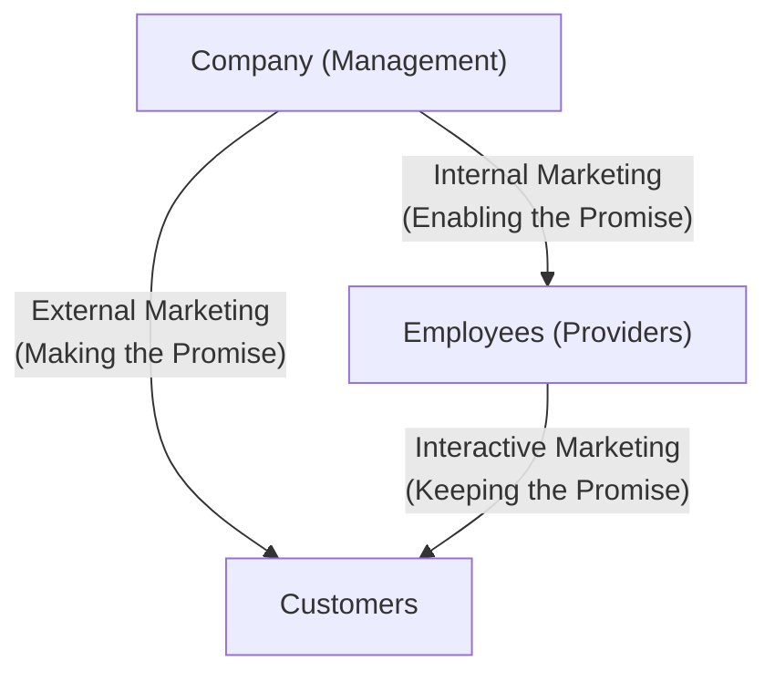

# MMPM-005: Block 1 — Marketing of Services: An Overview
## Exam Revision Notes (High-Yield Sheet)

---

## Unit 1: Marketing of Services: An Introduction

### 1. Defining "Services"
* **Concept of Service**: Separately identifiable, essentially intangible activities that provide want-satisfaction. They are performances rather than physical objects.
* **Core Distinction**: In services, production and consumption are simultaneous, and the buyer purchases the *right to use* or *access* a facility/experience rather than obtaining permanent ownership.
* **Goods vs. Services Summary**:
  | Dimension | Goods | Services |
  | :--- | :--- | :--- |
  | **Tangibility** | Tangible (physical specifications) | Intangible (acts, experiences) |
  | **Ownership** | Transferred to buyer on purchase | No transfer of title/ownership |
  | **Evaluation** | Easy (standardized specifications) | Complex (varies by provider/day) |
  | **Perishability** | Can be stored in inventory | Cannot be stored (perishable) |
  | **Inseparability** | Produced first, then sold/consumed | Simultaneous production & consumption |

### 2. Growth Drivers of the Service Sector (with special reference to India)
The transition to a post-industrial "service economy" (where services contribute >50% of GDP) is driven by:
* **Increasing Affluence**: Higher disposable income drives outsourcing of domestic chores (gardening, laundry, interior design, catering).
* **More Leisure Time**: Promotes tourism, travel resorts, fitness clubs, and self-improvement courses.
* **Demographic Changes**: 
  - *Greater Life Expectancy*: Increases demand for healthcare, nursing homes, and retirement services.
  - *Women in the Workforce*: Increases demand for crèches, daycare, babysitting, and household help.
* **Product Complexity**: Sophisticated electronics (cars, home automation) necessitate specialized maintenance/servicing contracts (AMCs).
* **Complexity of Life**: Navigating modern legal, tax, financial, and relational systems creates demand for specialists (financial advisors, tax consultants, legal aids, therapists).
* **Globalization**: Expands international transactions, calling for logistics, global communication, international travel, and consulting.
* **Manufacturing-Service Synergy (Porter's Links)**:
  - *De-integration*: Manufacturers outsource non-core tasks (logistics, security, IT).
  - *Services Tied to Goods*: Sale of durables (cars, computers) triggers demand for maintenance and training.
  - *Goods Tied to Services*: Service operations (aviation, hospitality) consume substantial manufactured equipment.

---

## Unit 2: Conceptual Framework for Services Marketing

### 1. Service Characteristics & Marketing Implications
Services possess five primary characteristics that create unique marketing challenges:
* **Intangibility**: 
  - *Challenges*: Cannot be displayed, sampled, patented, or easily promoted.
  - *Strategies*: Use brand names, focus on customer benefits, showcase credentials, and "tangibilize" the service (e.g., modern offices, brochures).
* **Inseparability**: 
  - *Challenges*: Customer must be present at the "service factory"; limits scale of operations; requires direct sales.
  - *Strategies*: Train more service personnel, use technology/automation to scale, and standardize front-end processes.
* **Heterogeneity (Variability)**: 
  - *Challenges*: Quality varies day-to-day, employee-to-employee, and customer-to-customer.
  - *Strategies*: Standardize delivery procedures, monitor performance, and automate tasks (e.g., ATMs, digital self-service).
* **Perishability**: 
  - *Challenges*: Unused capacity is lost forever (e.g., empty hotel rooms).
  - *Strategies*: Align demand and supply using differential pricing (peak vs. off-peak rates), part-time staff, and reservations.
* **Non-Ownership**: 
  - *Challenges*: Customers only buy access/usage.
  - *Strategies*: Highlight ease of entry, stress convenience, and offer flexible payment options.

### 2. The Expanded Marketing Mix for Services (7 Ps)
Because services are experiences, the traditional 4 Ps are expanded to include 3 additional Ps:
1. **Product**: A bundle of benefits with core, facilitating, and supporting services.
2. **Price**: Varies dynamically; incorporates time, psychological costs, and sensory efforts.
3. **Place**: Direct channels are common; convenience of site and digital delivery is vital.
4. **Promotion**: Focuses on tangibilizing the intangible and managing expectations.
5. **People** *(New)*: Frontline staff (visible to customer) who represent the brand, as well as the customer and other customers in the environment.
6. **Physical Evidence** *(New)*: The servicescape (ambiance, layout, signage) that influences quality perceptions.
7. **Process** *(New)*: The flow of activities, procedures, and service delivery systems.

* **Example: Education Services Marketing Mix**:
  - *Product*: Curriculum, degrees, library facilities, placement records.
  - *Price*: Tuition fees, hostel fees, scholarship options.
  - *Place*: Campus location, online learning management systems (LMS), digital access.
  - *Promotion*: Alumni testimonials, rankings, accreditation displays, webinars.
  - *People*: Faculty qualifications, administrative staff courtesy, student diversity.
  - *Physical Evidence*: Modern classrooms, laboratories, green campus, website layout.
  - *Process*: Admission process, lecture schedules, examination system, placement drives.

### 3. Service Contact Levels & People's Roles
Services are classified by the level of physical customer interaction required:
* **High-Contact Services**: Customers are active participants throughout the delivery (e.g., universities, hospitals, hotels). 
  - *People's Roles*: Frontline staff have highly visible, boundary-spanning roles; they must possess high technical skills and interactive empathy.
* **Medium-Contact Services**: Lower customer involvement; customers visit only for transaction initiation/termination (e.g., dry cleaners, repair shops).
  - *People's Roles*: Staff focus on prompt execution, reliability, and structured check-in/out protocols.
* **Low-Contact Services**: Transactions occur at arm's length (e.g., online banking, DTH, telecom services).
  - *People's Roles*: Focus shifts to back-end technical stability, online support systems, chatbots, and self-service interfaces.

### 4. The Services Marketing Triangle
This framework illustrates the three-way relationships required for services marketing success:
* **The Actors**: Company (Management), Customers, and Employees (Providers).
* **The Three Marketing Types**:
  1. **External Marketing (Making the Promise)**: Traditional marketing mix, advertising, and sales campaigns managed by the company to set customer expectations.
  2. **Interactive Marketing (Keeping the Promise)**: Real-time encounters between employees and customers. Service quality is judged here.
  3. **Internal Marketing (Enabling the Promise)**: Recruitment, training, tools, motivation, and rewards provided by management to employees. *Promises cannot be kept unless employees are enabled.*

---

## Unit 3: Consumer Behaviour in Services

### 1. Risk Perception in Service Purchases
Services are perceived as higher-risk purchases than physical goods because:
* **High Experience & Credence Qualities**: Search qualities are low; customers cannot evaluate the quality before buying (e.g., choosing a surgeon) or even after consumption (e.g., legal consultation).
* **Non-Standardization**: Heterogeneity makes outcome quality unpredictable.
* **Non-Reversibility**: Many services cannot be returned or undone (e.g., a bad haircut or knee surgery).
* **Long-Term Impact**: High-cost services have extended consequences (e.g., an MBA program or financial investments).

* *Customer Risk-Mitigation Strategies*: Relying on word-of-mouth (personal sources), visiting physical facilities beforehand, looking up online reviews/ratings, and choosing established brands.
* *Marketer Risk-Reduction Strategies*: Offering free trials (e.g., streaming services), showing certifications, sharing customer reviews, and providing service guarantees.

### 2. Three-Stage Consumer Decision-Making Process
* **Stage 1: Pre-Consumption Phase**:
  - *Need Recognition*: Activated by physical conditions, unconscious motivations, or external stimuli (ads).
  - *Information Search*: Relying heavily on personal networks and digital reviews; evaluation of search vs. experience attributes.
  - *Evaluation of Alternatives*: Defining the **Zone of Tolerance**—the range between the *adequate service* (minimum acceptable) and *desired service* (ideal hope).
  - *Decision Types*: Routinized response (low-involvement, e.g., taxi), Limited problem-solving (semi-frequent, e.g., house painting), or Extensive problem-solving (high-cost/high-risk, e.g., buying a home loan).
* **Stage 2: Service Encounter Phase**:
  - The actual experience/delivery of the service.
  - Vitals: **Moments of Truth**—critical points of contact where the customer evaluates the service personnel's empathy, responsiveness, and speed.
* **Stage 3: Post-Consumption Phase**:
  - Comparison of experienced service with expectations.
  - Outplacement: Delighted (performance > desired), Satisfied (performance in zone of tolerance), or Dissatisfied (performance < adequate).

* **Decision-Making Example: Buying a Home Loan vs. Mediclaim**:
  - *Pre-Consumption*: Recognizes need (buying house or medical security). Searches for interest rates, premium rates, network hospitals, and bank reputation. Evaluates options based on trust, ease of processing, and reviews.
  - *Service Encounter*: Interacts with loan officers or insurance agents (Moments of Truth: responsiveness, clarity of hidden clauses, paperwork speed).
  - *Post-Consumption*: Experiences claim settlement or monthly EMI deducts. If claims are settled smoothly without hassle, the customer becomes a brand advocate.

### 3. Moments of Truth
* **Definition**: Any instance where the customer comes in contact with any aspect of the service provider, forming a perception of the firm.
* **Significance**: It is a make-or-break moment. A single negative contact point (e.g., rude behavior by a receptionist) can ruin a technically perfect service (e.g., highly skilled doctor).

### 4. Telecommunications Market Segmentation & Complaint Handling
* **Segmenting Possibilities**:
  - *Demographic & Behavioral Profiles*: Based on *Bill Values* (High-value enterprise/postpaid vs. Low-value prepaid) and *Usage Profiles* (High-data/streaming users vs. Basic voice/SMS users vs. Roaming/International travelers).
  - *Strategic Value*: Allows telecom firms to design customized tariff plans, offer targeted loyalty bonuses, and bundle services (e.g., free OTT subscriptions for high-data users).
* **Guidelines for Resolving Customer Complaints**:
  - *Connectivity Issues*: CSR must acknowledge the issue promptly, provide clear resolution timelines, and use technical diagnostic tools.
  - *Harassment / Spam Calls*: Fast action is required. Guidelines include setting up DND registries, facilitating call blocking, and prioritizing privacy controls.
  - *Billing Queries*: Requires transparency, simple itemized bills, and fast adjustments/refunds if errors are found. Empathetic active listening prevents customer defection.
