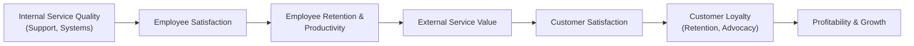

# MMPM-005: Block 3 — Extended Marketing Mix for Services
## Exam Revision Notes in Hinglish (High-Yield Sheet)

---

## Unit 8: Managing People

### 1. Frontline Employees as Boundary Spanners (Boundary Spanners ke roop me Frontline Employees)
* **Concept of Boundary Spanners**: Aise service employees jo organization ki boundary par operate karte hain, aur internal operations ko external customers aur market environment se link karte hain.
* **Key Challenges**:
  * **Emotional Labor**: Employee ke internal feelings (e.g., thaka hua, stressed) aur jo positive emotions (smiles, warmth) unhe customers ke samne display karne hote hain, unke beech ka gap/mismatch. E.g., Air hostesses, front desk executives.
  * **Role Conflicts**: Frontline staff ko ek sath kai competing expectations ko manage karna padta hai, jisse 3 tarah ke conflicts hote hain:
    1. **Person-Role Conflict**: Employee ke personal values/beliefs aur job ki demands ke beech clash (e.g., specific uniforms pehnna, rude customers ke samne smile karna).
    2. **Organization-Client Conflict**: Company ki policies (e.g., efficiency, upsell targets) aur customer ki expectations (e.g., fast service, personalized attention, shopping ke dauran pareshan na karna) ke beech conflict.
    3. **Inter-Client Conflict**: Ek hi time par alag-alag demands wale multiple customers ko serve karne se hone wala conflict (e.g., ek class me teacher ka har student ki alag learning capacity ko satisfy karna, ya waiter ka ek shor karne wale group aur shanti chahne wale couple ko sath me handle karna).

### 2. Internal Marketing
* **Definition (Gronroos)**: Aise managerial philosophy jisme employees ko organization ka *first internal market* mana jata hai. Iska goal employees ko active, coordinated marketing-like internal approaches ke through customer-oriented aur service-minded banana hai.
* **Strategic vs. Tactical Objectives (Gronroos)**:
  | Level | Objectives (Uddeshya) | Action Items |
  | :--- | :--- | :--- |
  | **Strategic Level** | Ek supportive internal environment create karna. | Customer-consciousness aur sales-mindedness badhane ke liye management styles, personnel policy aur planning/control ko align karna. |
  | **Tactical Level** | Company ki services, campaigns aur values ko employees ko sell karna. | Employees ko pehla market manna; naye campaigns/services ko launch karne se pehle employees ko samjhana; internal information channels ko behtar banana. |
* **Internal Marketing Action Checklist (Berry & Parasuraman)**:
  1. *Compete for talent aggressively*: Best talent recruit karne ke liye aggressively compete karein.
  2. *Offer a compelling vision*: Employees ko ek aisi vision dein jisse unhe kaam karne ka ek purpose mile.
  3. *Prepare people to perform*: Ongoing technical aur interactive skills training dein (sirf "how" nahi, "why" bhi sikhayein).
  4. *Stress team play*: Teamwork ko foster karne wala environment aur structure banayein.
  5. *Leverage the freedom factor*: Employees ko customer problems solve karne ke liye empower (azaadi) karein.
  6. *Measure and reward achievement*: Performance ko properly measure aur reward karein.
  7. *Listen to employees*: Employees ke attitudes aur concerns ko regular research se sunte rahein.

### 3. The Service Profit Chain
* **Framework Concept (Heskett et al.)**: Ye model internal quality, employee satisfaction, customer value, customer satisfaction, customer loyalty, aur company ki profitability/growth ke beech ek direct relationship establish karta hai.
* **Flow of the Chain**:
  $$\text{Internal Service Quality} \rightarrow \text{Employee Satisfaction} \rightarrow \text{Employee Retention \& Productivity} \rightarrow \text{External Service Value} \rightarrow \text{Customer Satisfaction} \rightarrow \text{Customer Loyalty} \rightarrow \text{Revenue Growth \& Profitability}$$
* **Key Lesson**: Happy aur empowered employees hi happy aur loyal customers banate hain.

### 4. Cycle of Failure vs. Cycle of Success (Schlesinger & Heskett)
* **Cycle of Failure**: 
  * *Characteristics*: Kam pay, narrow jobs, minimal training, high employee turnover, customer dissatisfaction, aur low profitability.
  * *Mechanism*: Managers cheap, simple jobs design karte hain -> low-wage par low-skilled staff recruit karte hain -> high employee turnover hota hai -> service quality kharab hoti hai -> customer defect hote hain -> low profits hote hain -> wage pressure aur badhta hai.
* **Cycle of Success**:
  * *Characteristics*: Fair pay, broad jobs, achhi training, employee empowerment, high retention, satisfied/loyal customers, aur high profitability.
  * *Mechanism*: Employee selection aur training me invest karte hain -> higher employee satisfaction hoti hai -> high employee retention hota hai -> service quality consistently high rehti hai -> customer satisfaction aur loyalty milti hai -> revenue badhta hai -> staff me dobara reinvestment hoti hai.
* **Human Resource Strategies for Delivering Service Quality**:
  1. *Hire the Right People*: Best candidates ke liye compete karein, service competencies aur service inclination ko check karein.
  2. *Develop People*: Technical aur interactive skills training dein, teamwork badhayein, aur staff ko empower karein.
  3. *Provide Support Systems*: Sahi tools/technology dein, internal service quality measure karein, service-oriented internal processes design karein.
  4. *Retain the Best People*: Employees ko internal customers ki tarah treat karein, unhe vision ka part banayein, rewards ko performance se align karein.
  5. *Use Automation*: Human dependency kam karne aur consistency lane ke liye ATMs, chatbots ya self-service tools integrate karein.

---

## Unit 9: Managing Physical Evidence

### 1. Role of Physical Evidence (Servicescape)
* **Definition**: Wo physical environment jahan service deliver hoti hai aur jahan firm aur customers ke beech interaction hota hai.
* **Servicescape Classification (Julie Baker's Model)**:
  * **Ambient Factors**: Background conditions jo humare 5 senses ko affect karti hain (e.g., temperature, air quality, music, scent).
  * **Design Factors**: Visual/functional stimuli jo seedhe awareness me aate hain (e.g., architecture, layout, signage, colors, comfort, functionality).
  * **Social Factors**: Environment me present human elements (e.g., frontline staff aur baaki customers ka behavior aur look).
* **Six Roles of Physical Evidence (Parasuraman et al.)**:
  1. *Shaping First Impressions*: Consumption se pehle positive cues create karna.
  2. *Managing Trust*: Professional quality aur reliability dikhakar consumer anxiety kam karna.
  3. *Facilitating Service Quality*: Operations aur comfort ko support karna taaki service easily deliver ho sake.
  4. *Changing the Image*: Outlets ko upgrade karke (e.g., non-AC to AC, new layout) brand ki market perception change karna.
  5. *Providing Sensory Stimuli*: Customer ke senses ko stimulate karna (e.g., premium scent/music) taaki wo zyaada der rukhein.
  6. *Socializing Employees*: Aisa environment banana jahan employees aur customers ke beech healthy social ties aur teamwork bane.

### 2. Tangibilizing the Service and the Message
* **Tangibilizing the Service**: Communication me physical assets ko highlight karna (e.g., courier company ka apne trucks aur airplanes dikhana, ya credit card ko ek premium branding physical card me offer karna).
* **Tangibilizing the Message**: Concrete evidence (before/after statistics), service guarantees (warranties), ya positive word-of-mouth ke through abstract service claims ko credible banana.

### 3. Case Application: Designing Physical Evidence for a Coffee Shop
* **Ambiance / Ambient Factors**:
  * *Scent*: Freshly ground coffee beans ki warm aroma jisse bhook lagti hai.
  * *Sound*: Soft, acoustic ya lo-fi instrumental music jo working aur quiet discussions ke liye suitable ho.
  * *Lighting*: Warm, low-intensity yellow lighting jo ek cozy aur relaxing environment banaye.
* **Design / Functional Factors**:
  * *Furniture*: Comfortable upholstered armchairs, wooden work tables, aur laptop users ke liye charging outlets ke sath high-stools.
  * *Layout*: Counter ke paas crowd na ho aisi spacious space; takeaway, social chats, aur quiet study ke liye alag zones.
  * *Signage*: Clear hand-written chalkboard menus, washrooms ke liye directions, aur visible Wi-Fi password.
* **Social / Human Factors**:
  * *Baristas' Appearance*: Friendly nametags ke sath uniform aprons.
  * *Behavior*: Empathetic customer greeting, fast order processing, aur personal recommendations.
  * *Crowd Management*: Sahi crowd (students, remote workers) ko attract karne ke liye suitable pricing aur interior design cues.

---

## Unit 10: Managing Service Process

### 1. Structure of Service Processes: Complexity vs. Divergence
Shostack ke according, service processes structural roop se do dimensions me defined hote hain:
* **Complexity (Jatilta)**: Service execute karne ke liye zaroori steps aur sub-steps ka number.
* **Divergence (Vibhinnata)**: In steps ko execute karne me kitni freedom, latitude ya customization allowed hai.
* **Four Strategic Paths for Process Engineering**:
  1. *Reduced Divergence (Standardization)*: Cost kam karta hai, speed aur reliability badhata hai, lekin customization khatam ho jati hai.
  2. *Increased Divergence (Customization)*: Premium niche positioning aur high margins deta hai, lekin manage aur control karna mushkil hota hai.
  3. *Reduced Complexity (Specialization)*: Service offering ko narrow karta hai taaki control aur distribution easy ho (e.g., eye-only surgery clinic).
  4. *Increased Complexity (Market Penetration)*: Per-customer revenue badhane ke liye zyaada services/steps add karna, lekin bina management ke quality kharab ho sakti hai.

### 2. Classification of Service Processes (Lovelock ke 4 Categories)
Services ko unke action ke nature (tangible/intangible) aur object (people/possessions) ke base par classify kiya jata hai:
| Nature of Act / Object | Directed at People's Bodies | Directed at Physical Possessions |
| :--- | :--- | :--- |
| **Tangible Actions** | **People Processing** Customer ka physically hona zaroori hai. *Examples*: Passenger transport, healthcare, lodging, fitness centers. | **Possession Processing** Object hona chahiye; customer absent ho sakta hai. *Examples*: Car repair, dry cleaning, freight transport. |
| **Intangible Actions** | **Mental Stimulus Processing** Customer ka mentally present hona zaroori hai. *Examples*: Education, entertainment, consulting, religion. | **Information Processing** Intangible assets ko ICT se process karna. *Examples*: Banking, insurance, legal services, accounting. |

### 3. Service Blueprinting
* **Definition**: Ek visual mapping tool jo simultaneously service delivery process, points of customer contact, roles of customers and employees, aur visible physical evidence ko show karta hai.
* **Key Components**:
  * *Customer Actions*: Customer ke safar (journey) ke steps.
  * *Onstage Contact Person Actions*: Face-to-face interactions jo customer ko dikhti hain.
  * *Backstage Contact Person Actions*: Behind-the-scenes interactions jo customer ko nahi dikhti (e.g., kitchen me khana pakna).
  * *Support Processes*: Contact staff ko support karne wale internal systems/departments (e.g., billing database).
  * *Line of Visibility*: Onstage (visible) aur backstage (invisible) activities ko separate karne wali line.
  * *Physical Evidence*: Har step par customer ko milne wale cues/evidence.
* **Benefits of Blueprinting**:
  * Bottlenecks aur failure points ko identify karta hai.
  * Roles aur training needs ko clear karta hai.
  * Interdependencies dikhakar alag-alag departments me coordination behtar banata hai.
  * Quality vs. efficiency ko balance karne ke liye cost centers design karne me help karta.

### 4. Customer Roles in Service Co-Creation (Service Co-Creation me Customer ke Roles)
Customers service process me active participants hote hain aur ye roles play karte hain (Manfred & Dominik):
1. **The Specifier**: Custom requirements ko clear batana (e.g., doctor ko apni medical history details dena).
2. **The Transferer**: Shuruati tasks khud karna (e.g., car ko khud workshop lekar jana).
3. **The Abandoner**: Kuch time ke liye azaadi chhod dena (e.g., repair ke dauran car chhodkar public transport use karna).
4. **The Co-Producer**: Value creation me active help karna (e.g., physiotherapy exercises properly follow karna, ya tax documents time par jama karna).
5. **The Co-User**: Dusre consumers ke sath service space share karna (e.g., flight cabin, cinema, ya gym share karna).

### 5. Why Customers Switch Service Providers (Susan Keaveney's Model)
Marketers ko customer defection rokne ke liye controllable factors par focus karna chahiye:
* **Pricing**: Zyaada prices, sudden price increase, ya misleading pricing policies.
* **Inconvenience**: Kharab location, appointments ya execution ke liye lamba waiting time.
* **Core Service Failures**: Technical mistakes, billing errors, ya promised service deliver na hona.
* **Service Encounter Failures**: Rude, uncaring, unknowledgeable ya unresponsive staff behavior.
* **Response to Service Failures**: Complaint ko ignore karna, negative response, ya bohot slow recovery.
* **Competition**: Competitors ka superior quality ya better value offer karna.
* **Ethical Problems**: Cheating, safety violations, ya forced selling tricks.
* **Involuntary Switching**: Customer ka transfer ho jana ya provider ka business band ho jana.

### 6. Service Recovery and Complaint Management Systems
* **Service Recovery**: Service failure hone par customer goodwill ko restore karne ke liye provider dwara kiya gaya corrective action (e.g., reserved economy car na hone par customer ko luxury sedan car upgrade free me dena).
* **Six Service Recovery Strategies (Hart et al.)**:
  1. *Measure the costs*: Lost customers ke cost ko calculate karein taaki recovery budgets ko justify kiya ja sake.
  2. *Break customer silence*: Feedbacks/complaints ko encourage karein (complaining process ko easy banayein).
  3. *Anticipate failure-prone zones*: Problem-prone areas ko pehle se identify karke solutions ready rakhein.
  4. *Act fast*: Turant apology, explanation ya execution ensure karein.
  5. *Train and empower frontline employees*: Frontline staff ko authority dein taaki wo on-the-spot issues resolve kar sakein bina management permission ke.
  6. *Close the loop*: Customer ko batayein ki unki complaint ke baad kya corrective action liya gaya hai.
* **Features of a Good Complaint Management System (ISO/TC 176 Standards)**:
  * **Visibility**: Customer ko pata ho ki complain kahan karni hai.
  * **Accessibility**: Complain lodge karne ke simple aur multiple channels (toll-free number, email, app).
  * **Responsiveness**: Jaldi resolution aur update milna.
  * **Customer-Focused Approach**: Customer ko sunna, empathy dikhana, aur complaint ko gift ki tarah treat karna.
  * **Accountability**: Complaint handle karne ke liye dedicated personnel assign karna.
  * **Continuous Improvement**: Root causes analyze karne ke liye complaint logs maintain karna aur process ko improve karna.
