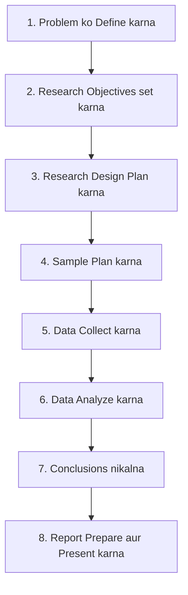
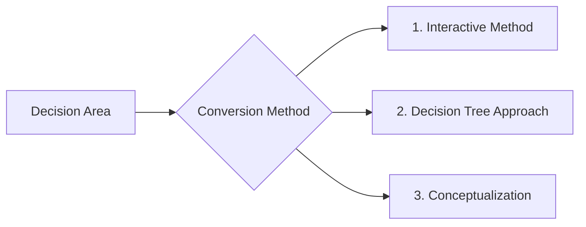

# Block 1 Notes (Hinglish): Concepts and Applications

Yeh revision guide MMPM-006 ke **Units 1, 2, aur 3** ke core concepts, frameworks, aur methodologies ko cover karti hai. Isko exam day par jaldi se scan aur revise karne ke liye design kiya gaya hai.

---

## Unit 1: Marketing Research — An Introduction

### 1. Marketing Research (MR) kya hai?
Marketing Research ek **objective, systematic, aur formal process** hai jismein data ko collect, analyze, aur communicate kiya jata hai taaki managers sahi marketing decisions le sakein.

* **Systematic:** Har stage ko ek logical aur structured sequence mein plan kiya jata hai.
* **Objective:** Findings bilkul unbiased (bina kisi bhedbhav ke) honi chahiye, bina kisi personal ya political influence ke.
* **Linkage:** Yeh ek information channel ki tarah kaam karta hai jo customer/consumer aur public ko marketer se jodta hai.

---

### 2. Need ko samajhna: MIS vs. Marketing Research
Firms information gather karne ke liye **Marketing Information Systems (MIS)** aur **Marketing Research (MR)** dono ka use karti hain. Dono mein kuch basic differences hain:

| Feature | Marketing Information System (MIS) | Marketing Research (MR) |
| :--- | :--- | :--- |
| **Frequency** | **Continuous** (lagaatar) chalne wala process hai. | **Ad-hoc / Project-based** hota hai, jiska ek specific start aur end time hota hai. |
| **Data Source** | Purane ya **existing** internal sales aur operational data par focus karta hai. | Specific gaps ko fill karne ke liye **naya** (primary) data generate karta hai. |
| **Purpose** | Rozana ke **routine** decisions lene mein help karta hai. | Risk kam karne ke liye **specific, non-routine** problems ko target karta hai. |
| **Structure** | Rigid hota hai, pehle se set reporting formats par chalta hai. | Flexible hota hai, unique questions ko solve karne ke liye custom design kiya jata. |

> [!TIP]
> **Need Justification:** MR tabhi justified hota hai jab managers ke samne **uncertainty aur risk** ho jise existing MIS data se solve nahi kiya ja sakta, aur jab galat decision lene ki cost research karne ki cost se zyada ho.

---

### 3. Marketing Research Process ke 8 Stages
Research process ek planned aur iterative sequence hai:

1. **Problem ko Define karna:** Root issue ya opportunity ko clear karna (symptoms aur causes ke beech farq samajhna).
2. **Research Objectives set karna:** Decision problem ko specific questions ya hypotheses mein translate karna.
3. **Research Design Plan karna:** Blueprint ya strategy banana (exploratory, descriptive, ya experimental).
4. **Sample Plan karna:** Yeh decide karna ki kiska survey karna hai (target population), sample size kya hoga, aur sampling method (probability vs. non-probability) kya hoga.
5. **Data Collect karna:** Respondents se observation ya communication ke zariye data gather karna.
6. **Data Analyze karna:** Data ko edit aur code karna, aur statistical methods use karke use samajhna.
7. **Conclusions nikalna:** Results ko interpret karna taaki managerial insights mil sakein.
8. **Report Prepare aur Present karna:** Findings ko ek clear aur bina technical jargon wali report mein managers ke liye present karna.

---

### 4. Marketing Research ka Scope aur Decision Areas
MR ka use alag-alag business areas mein decision risk ko kam karne ke liye hota hai:
* **Sales Analysis:** Market potential measure karna, demand projections, market share estimate karna, aur buying habits analyze karna.
* **Sales Methods & Policies:** Sales territories design karna, quotas set karna, distribution channels ko evaluate karna, aur promotional deals test karna.
* **Product Management:** Market segmentation, brand positioning, simulated test marketing (STM), packaging, aur pricing studies.
* **Advertising Research:** Media audience measurement, copy testing (ads ko evaluate karna), aur campaigns ki effectiveness track karna.
* **Corporate Research:** Image studies, social values research, aur customer complaints track karna.
* **Syndicated Research:** Standardized audits (retail audits, TRP ratings) jo research agencies karti hain aur subscription par bechti hain.

---

### 5. MR ke Limitations aur Errors ke Sources
* **MR decisions nahi leta:** Yeh sirf ek supportive tool hai. Final action manager ke intuition aur experience par depend karta hai.
* **MR success ki guarantee nahi deta:** Yeh sirf current market conditions batata hai, jo kabhi bhi change ho sakti hain.
* **Surrogate Information Error:** Yeh tab hota hai jab decision problem ko solve karne ke liye zaroori information aur researcher dwara collect ki gayi information match nahi karti.
* **Response aur Questionnaire Errors:** Jab respondents questions ko galat samajhte hain, jhoot bolte hain, ya questionnaire ka design hi kharab hota hai.

---

### 6. India mein Marketing Research: Trends, Outsourcing, aur Challenges

#### Market Characteristics & Growth
* Indian MR industry bohot tezi se grow kar rahi hai (**2030 tak $10 billion** reach karne ka estimate hai).
* **Outsourcing:** Lagbhag **76%** revenue international outsourced accounts se aata hai. India iska global hub hai kyunki:
  * **Cost Advantage:** Data processing aur operations Western countries se **50% tak saste** hain.
  * **Talent Pool:** Yahan English-speaking talent bohot hai jinki technical, analytical aur data handling skills strong hain.
* **Service Composition:** Marketing analytics se **52%** revenue aata hai, uske baad traditional market research (32%) aur syndicated publishing (16%) ka number hai.

#### In-House vs. Outsourced Research
* **In-House MR:** Badi firms ke liye best hai jinki research needs regular hoti hain. Inke paas dedicated team hoti hai. Choti firms routine staff se hi kaam chalati hain jo quality kharab kar sakta hai.
* **Outsourced MR:** External specialists (agencies, KPOs, consultants) ki help li jati hai. Yeh **Customized** (ek client ke liye; costly) ya **Syndicated** (shared database; cost-efficient) ho sakti hai.

#### India mein Researchers ke main Challenges
1. **Linguistic Complexity (Bhasha ki vividhata):** 22 official bhashaein aur saikdo dialects hone ki wajah se national level par questionnaire ko 5-6 bhashaon mein translate karna padta hai.
2. **Rural Accessibility (Gaon tak pahunch):** 70% population rural hai. Dialects alag hone se face-to-face interview costly ho jata hai aur low literacy ki wajah se mail surveys possible nahi hote.
3. **Incomplete Sampling Frames:** Manufacturers ya tradesmen ki updated lists na hone se random probability sampling karna mushkil hota hai.
4. **Compensation & Attrition:** Employee turnover high (around 30%) rehta hai kyunki Indian clients budget toh kam dete hain par quality high mangte hain.
5. **Managerial Attitudes:** Bohot se managers research ke bajaye apne "gut feeling" ko priority dete hain ya sochte hain ki research report aane mein bohot time lagta hai.

---

## Unit 2: Applications of Marketing Research and Ethical Issues

### 1. Marketing Research mein Ethical Issues
Researchers ki duty hai ki woh respondents ko protect karein aur clients ke sath transparent rahein:

* **Voluntary Participation:** Respondents ke paas freedom honi chahiye ki woh jab chahein study chhod sakein.
* **Informed Consent:** Participants ko pehle hi study ke purpose aur risks ke baare mein batana chahiye.
* **Anonymity aur Confidentiality:** Respondents ka personal data leak nahi hona chahiye.
* **Minimizing Harm:** Participants ko koi physical, social ya psychological distress nahi hona chahiye.
* **Scientific Integrity:** Data ko manipulate ya jhootha present nahi karna chahiye.

> [!IMPORTANT]
> **CASRO Guidelines Summary:**
> * **DO:** Privacy ka respect karein, recording se pehle batayein, aur report mein research agency ka naam aur dates clear likhein.
> * **DON'T:** Qualitative studies se quantitative stats ka dawa na karein, research experts ke technical methods mein interfere na karein, aur jab secondary data available ho toh faltu ka costly primary research na karein.

---

### 2. Concept Application: Primary vs. Secondary Data in Promotion
Jaise ek electric scooter launch karna ho:
* **Secondary Data Pehle:** Competitor websites, industry reports (SIAM, EV trends) aur government subsidies (FAME II) analyze karke market trend samjhein.
* **Primary Data Baad Mein:** Ad concepts, safety concerns aur battery charging issues par customers se custom feedback lene ke liye focus groups aur pricing surveys karein.

---

### 3. Indian MR mein Digital Technology
* Smartphones (84%+ homes) aur cheap 4G data (Jio effect) ki wajah se data collection online ho gaya hai.
* Online surveys, CATI (Computer-Assisted Telephonic Interviews), aur social media listening se face-to-face interviews ke mukable cost aur time dono bohot kam ho gaye hain.

---

## Unit 3: Identifying and Defining Research Problems

Ek **decision area** (manager ki real challenge) ko **research objectives** (specific information goals) mein convert karna padta hai.

> [!NOTE]
> * **Decision Problem (Manager):** Action par focus karta hai ("Kya humein product launch karna chahiye?").
> * **Research Objective (Researcher):** Information par focus karta hai ("Consumer interest aur willingness to pay ko pata karna").

### Conversion ke Teen Methods
Firms in teen methods ka use karti hain:

#### A. Interactive Method (The "Dummy Test" Process)
* Tab use hota hai jab manager problem ko theek se samjha nahi pata.
* Researcher iterative questions poochta hai: *"Aapko aisi kaunsi baat pata chale jo aapka decision badal de?"*, *"Kya decision-maker ko sach mein yeh janna zaroori hai?"*, *"Yeh info milne ke baad aap kya decision lenge?"*
* **Dummy Test:** Final report ki tables ka ek mock-up design manager ko dikhaya jata hai. Agar manager bole, *"Main is table se decision nahi le sakta,"* toh data collect karne se pehle objectives ko phir se revise kiya jata hai.

#### B. Decision Tree Approach
* Complex aur multi-stage decision problems ke liye use hota hai.
* Yeh bade problem ko chote aur hierarchical branches mein todta hai.
* **Process:** Main decision se start karein (e.g., "Kaunse segment mein enter karein?") $\rightarrow$ sub-segments (under construction vs. existing houses) $\rightarrow$ buyer influences (builders vs. owners) $\rightarrow$ strategies map karein.

#### C. Conceptualization Method
Yeh complex problem ko key variables ke relationships ke zariye todta hai. Iske do tarike hain:
1. **Existing Concept Apply karna:** Kisi pehle se validated framework ka use karna.
   * *Example:* **AIDA Model** (Attention, Interest, Desire, Action) apply karke environmental awareness check karna:
     * *Attention:* Kya log jaante hain ki environment kis cheez se damage ho raha hai?
     * *Interest:* Woh kin eco-friendly practices mein interested hain?
     * *Desire:* Environment ko bachane ke liye unka motivation kya hai?
     * *Action:* Real mein woh kya steps le rahe hain?
2. **Naya Concept Develop karna:** Unique situation ke liye khud ka model banana.
   * *Example:* **DLA Framework** (Delivery, Learning, Acceptance) banana online vs. offline education ko compare karne ke liye, jismein *Institute*, *Faculty*, *Students*, aur *Recruiters* ke angles ko map kiya jata hai.
