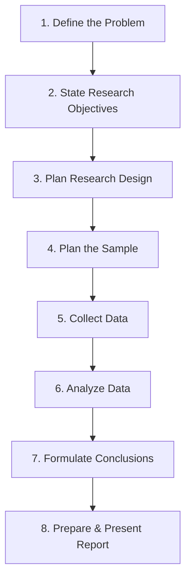
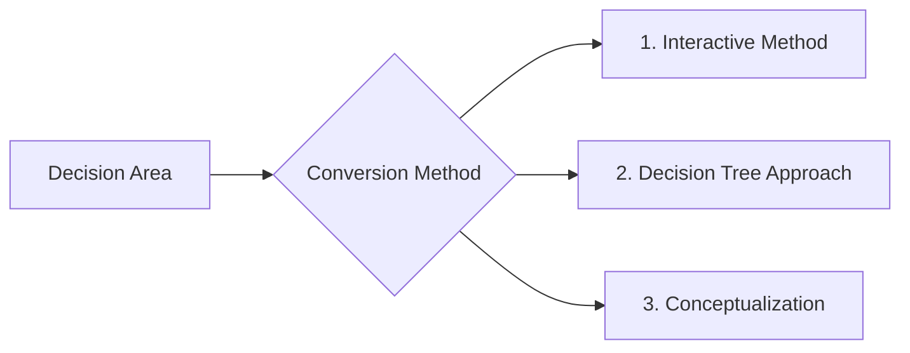

# Block 1 Notes: Concepts and Applications

This revision guide covers the core concepts, frameworks, and methodologies from **Units 1, 2, and 3** of MMPM-006. It is designed for quick scanning and high retention on exam day.

---

## Unit 1: Marketing Research — An Introduction

### 1. What is Marketing Research (MR)?
Marketing Research is the **objective, systematic, and formal process** of collecting, analyzing, and communicating information to assist managers in marketing decision-making. 

* **Systematic:** Every stage must be planned in a logical, structured sequence.
* **Objective:** The findings must be unbiased and free from personal or political influence.
* **Linkage:** It acts as the information channel linking the customer/consumer and the public to the marketer.

---

### 2. Bounding the Need: MIS vs. Marketing Research
Firms gather information using both **Marketing Information Systems (MIS)** and **Marketing Research (MR)**. They differ fundamentally in scope, time, and source:

| Feature | Marketing Information System (MIS) | Marketing Research (MR) |
| :--- | :--- | :--- |
| **Frequency** | **Continuous** and ongoing process. | **Ad-hoc / Project-based** with defined start/end. |
| **Data Source** | Focuses on **existing** internal sales/operational data. | Generates **new** (primary) data for specific gaps. |
| **Purpose** | Assists in **routine** day-to-day decision-making. | Targets **specific, non-routine** problems to reduce risk. |
| **Structure** | Rigid, built around established reporting formats. | Flexible, custom-designed to address unique questions. |

> [!TIP]
> **Need Justification:** MR is justified when managers face **uncertainty and risk** that cannot be resolved by existing MIS data, and the cost of making an incorrect decision exceeds the cost of conducting the research.

---

### 3. The 8 Stages of the Marketing Research Process
The research process represents a planned, iterative sequence of steps:

1. **Defining the Problem:** Clarifying the root issue or opportunity (distinguishing symptoms from causes).
2. **Statement of Research Objectives:** Translating the decision problem into specific questions or hypotheses.
3. **Planning the Research Design:** Designing the blueprint or strategy (exploratory, descriptive, or experimental).
4. **Planning the Sample:** Deciding who to survey (target population), sample size, and sampling method (probability vs. non-probability).
5. **Collecting the Data:** Gathering data from respondents via observation or communication methods.
6. **Analyzing the Data:** Editing, coding, and using statistical methods to make sense of the data.
7. **Formulating Conclusion:** Interpreting the results to draw managerial inferences.
8. **Preparing & Presenting the Report:** Documenting the findings in a clear, jargon-free report for decision-makers.

---

### 4. Scope and Decision Areas of Marketing Research
MR is applied across multiple business domains to reduce decision risk:
* **Sales Analysis:** Measuring market potential, demand projections, estimating market shares, and analyzing buying habits.
* **Sales Methods & Policies:** Designing sales territories, setting quotas, evaluating distribution channels, and testing promotional deals.
* **Product Management:** Segmenting markets, brand positioning, simulated test marketing (STM), packaging, and pricing studies.
* **Advertising Research:** Media audience measurement, copy testing (evaluating ad designs), and tracking campaign effectiveness.
* **Corporate Research:** Periodic corporate image studies, social values research, and customer grievance monitoring.
* **Syndicated Research:** Standardized audits (retail audits, TV rating points/TRPs) funded by research agencies and sold on subscription.

---

### 5. Limitations and Sources of Error in MR
* **MR does not make decisions:** It acts as a supportive tool. Final action depends on managerial intuition and experience.
* **MR does not guarantee success:** It reflects current market conditions, which are subject to rapid environmental change.
* **Surrogate Information Error:** Occurs when there is a mismatch between the information required to solve the decision problem and the information gathered by the researcher.
* **Response and Questionnaire Errors:** Occur when respondents misinterpret questions, provide dishonest answers, or when the instrument design is flawed.

---

### 6. Marketing Research in India: Trends, Outsourcing, and Challenges

#### Market Characteristics & Growth
* The Indian MR industry is growing rapidly (estimated to reach **$10 billion by 2030**). 
* **Outsourcing:** Roughly **3/4 (76%)** of revenue comes from international outsourced accounts. India is a global hub due to:
  * **Cost Advantage:** Data processing and operations are up to **50% cheaper** than in Western nations.
  * **Talent Pool:** High density of English speakers with strong technical, analytical, and data-handling expertise.
* **Service Composition:** Marketing analytics accounts for over **52%** of revenue, followed by traditional market research (32%) and syndicated publishing (16%).

#### In-House vs. Outsourced Research
* **In-House MR:** Suitable for large firms with regular research needs. Uses dedicated research personnel. Small firms often assign routine sales/marketing staff, which can compromise research quality.
* **Outsourced MR:** Leverages external specialists (agencies, KPOs, consultants). Can be **Customized** (tailored to one client; expensive) or **Syndicated** (shared database sold to multiple subscribers; cost-efficient).

#### Key Challenges Faced by Researchers in India
1. **Linguistic Complexity:** With 22 official languages and hundreds of dialects, questionnaires must be translated into 5-6 languages for national studies. Literal translations often fail to capture regional idioms.
2. **Rural Accessibility:** 70% of the population is rural. High hyper-localization of dialects makes personal interviews expensive, while low literacy makes mail surveys unviable.
3. **Incomplete Sampling Frames:** Lack of updated lists of manufacturers, tradesmen, or census data restricts the use of random probability sampling.
4. **Compensation & Attrition:** Research firms experience high employee turnover (around 30%) because Indian clients demand high-quality work but offer low budgets.
5. **Managerial Attitudes:** Many executives prioritize "gut feeling" over formal research or believe that MR reports take too long to be of practical use.

---

## Unit 2: Applications of Marketing Research and Ethical Issues

### 1. Ethical Considerations in Marketing Research
Researchers have ethical duties to protect respondents, maintain scientific integrity, and be transparent with clients:

* **Voluntary Participation:** Respondents must have the freedom to opt in or out of the study at any point.
* **Informed Consent:** Participants must be briefed on the purpose, risks, and benefits of the study before agreeing.
* **Anonymity and Confidentiality:** Identifiable data must not be collected or disclosed.
* **Minimizing Harm:** Protecting participants from physical, social, or psychological distress.
* **Scientific Integrity:** Avoiding the falsification or selective presentation of data.

> [!IMPORTANT]
> **CASRO Guidelines Summary:**
> * **DO:** Respect privacy, inform participants if they are being recorded, and clearly cite the researching firm and dates in report summaries.
> * **DON'T:** Use qualitative studies to claim quantitative statistics (or vice versa), dictate the technical methods to research professionals, or conduct expensive primary research when secondary sources can serve the same purpose.

---

### 2. Concept Application: Primary vs. Secondary Data in Promotion
When launching or promoting a new product (e.g., an electric scooter launch):
* **Secondary Data First:** Analyze competitor websites, industry reports (e.g., SIAM, EV sales trends), and government subsidies (FAME II) to understand macro market trends and locate competitor dealerships.
* **Primary Data Second:** Gather custom data on customer motivations through focus groups (to test ad concepts, EV safety perceptions, or battery charging concerns) and conduct sample surveys on pricing/financing options.

---

### 3. Digital Technology in Indian MR
* Widespread smartphone adoption (over 84% of households) and low-cost high-speed 4G data plans (e.g., Jio effect) have shifted data collection online.
* Online surveys, CATI (Computer-Assisted Telephonic Interviews), and social media listening have drastically reduced field costs and turnaround times compared to traditional face-to-face interviews.

---

## Unit 3: Identifying and Defining Research Problems

A **decision area** (the manager's practical challenge) must be converted into **research objectives** (the specific information goals). 

> [!NOTE]
> * **Decision Problem (Manager):** Focuses on action ("Should we launch the product?").
> * **Research Objective (Researcher):** Focuses on information ("To determine consumer interest and willingness to pay").

### Three Methods of Conversion
Firms use three structured methods to bridge the gap between decision problems and research objectives:

#### A. The Interactive Method (The "Dummy Test" Process)
* Used when the manager cannot articulate the exact issue.
* The researcher asks series of iterative questions: *"What information will change your decision?"*, *"Does the decision-maker really need to know this?"* and *"What decisions can be made once we have this information?"*
* **The Dummy Test:** A mock-up of what the final report's data tables will look like is presented to the manager. If the manager says, *"I can't make a decision based on this mock table,"* the objectives are revised before data collection begins.

#### B. The Decision Tree Approach
* Used for complex, multi-stage decision problems.
* It systematically decomposes a broad problem into smaller, hierarchical branches (Connected Nodes).
* **Process:** Start with the core decision (e.g., "Which target segment to enter?") $\rightarrow$ break into sub-segments (e.g., houses under construction vs. existing houses) $\rightarrow$ branch into buyer influences (builders vs. owners) $\rightarrow$ map strategies (possession utility vs. price sensitivity).

#### C. Conceptualization Method
This method breaks down a complex problem by mapping relationships between key variables. It takes two forms:
1. **Applying an Existing Concept:** Using a validated framework to guide information needs.
   * *Example:* Applying the **AIDA Model** (Attention, Interest, Desire, Action) to study environmental awareness by measuring:
     * *Awareness:* Do they know what causes environmental damage?
     * *Interest:* What eco-friendly practices are they interested in?
     * *Desire:* What are their motives to protect the environment?
     * *Action:* What actions do they actually take?
2. **Developing a New Concept:** Building a custom model for a unique situation.
   * *Example:* Developing the **DLA Framework** (Delivery, Learning, Acceptance) to compare online vs. offline education by mapping the perspectives of the *Institute* (image, resources), *Faculty* (pedagogy, adaptability), *Students* (motivation, connectivity), and *Recruiters* (perceptions).
