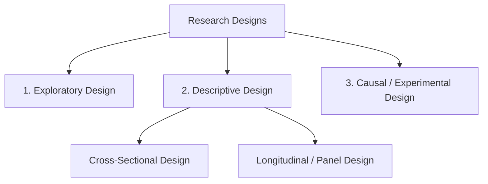
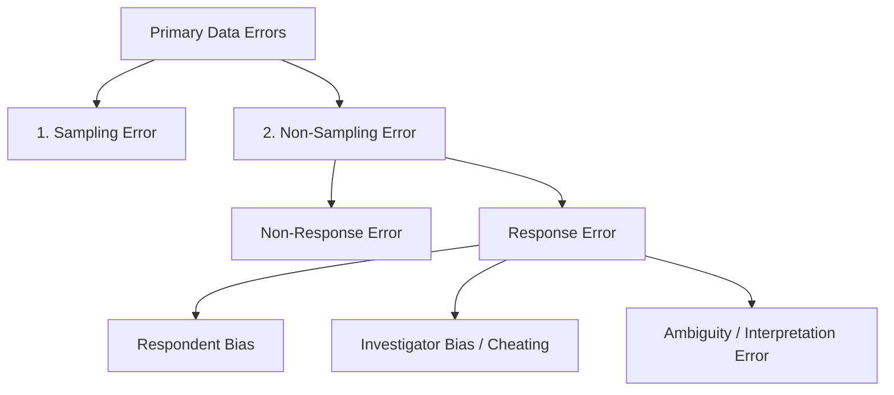

# Block 2 Notes (Hinglish): Data Collection and Processing

Yeh revision guide MMPM-006 ke **Units 4, 5, aur 6** ke core concepts, frameworks, aur methodologies ko cover karti hai. Isko exam day par jaldi se scan aur revise karne ke liye design kiya gaya hai.

---

## Unit 4: Research Design Formulation

### 1. Research Design kya hai?
Research design ek marketing research project ko chalane ka **blueprint ya framework** hota hai. Yeh clear karta hai ki research problem ko solve karne ke liye zaroori information kaise, kab, kitne budget mein, aur kis sampling plan ya analysis model ke zariye collect ki jayegi.

---

### 2. Research Designs ka Core Classification
Research objectives ke nature ke basis par research designs ko teen main categories mein divide kiya jata hai:

#### A. Exploratory Research Design
* **Purpose:** Background insights lena, problem ko clarify karna, hypotheses banana, ya aage ki research ke liye priorities set karna.
* **Characteristics:** Bohot flexible, unstructured, informal aur qualitative hota hai, aur chote, non-representative samples ka use karta hai.
* **Examples:** Focus groups, pilot studies, expert interviews, aur secondary literature reviews.

#### B. Descriptive Research Design
* **Purpose:** Market variables, consumer groups, ya kisi phenomenon ki characteristics ko describe karna (jaise consumer behaviour ke "who, what, when, where, why, and how" ko detail mein batana).
* **Characteristics:** Bohot structured, pre-planned, aur formal hota hai. Iske liye **a-priori hypotheses** (pehle se bani hypotheses) aur bade representative samples zaroori hote hain taaki quantitative conclusions nikale ja sakein.
* **Subtypes:**
  * **Cross-Sectional Design:** Target population ke ek sample se sirf **ek baar** information gather karna (ek "one-time snapshot" ya sample survey). *Multiple cross-sectional designs* mein alag-alag times par alag-alag samples ka survey kiya jata hai.
  * **Longitudinal / Panel Design:** Same **fixed sample (panel)** se alag-alag time intervals par questionnaire fill karwaya jata hai. Yeh trends, brand switching, aur time ke sath consumer perceptions mein aane wale changes ko track karne ke liye best hai.

#### C. Causal / Experimental Design
* **Purpose:** Cause-and-effect (karan aur asar) relationships ko establish karna (conclusive research).
* **Characteristics:** Researcher ek ya ek se zyada independent variables (treatments) ko manipulate (change) karta hai aur baaki extraneous variables ko control karke dependent variable par asar measure karta hai.

---

### 3. Experimental Validity: Internal vs. External
Causal experiments karte waqt do tarah ki validity maintain karna zaroori hai:
* **Internal Validity:** Yeh guarantee ki dependent variable mein jo changes aaye hain, woh **sirf aur sirf** experimental treatment ki wajah se hain, na ki kisi extraneous (bahari) variable ki wajah se.
* **External Validity:** Experimental findings ko real world (doosri populations, geographic settings, aur timeframes) par **generalize** (apply) karne ki ability.

> [!WARNING]
> **Internal Validity ko khatra pahunchane wale Extraneous Threats:**
> 1. **History:** Experiment ke dauran hone wali koi bahari, non-recurring event (jaise aapke ad test ke dauran competitor ka price cut launch karna).
> 2. **Maturation:** Subjects mein time ke sath aane wale biological ya psychological changes (jaise test salespeople ka experience badhna ya unka thak jana).
> 3. **Testing (Sensitization):** Pre-test measurement ki wajah se respondents alert ya bias ho jate hain, jisse unka response badal jata hai.
> 4. **Instrumentation:** Measuring instrument mein changes (jaise questionnaire ki wording badalna, naye observers ko train karna, ya prices badalna).
> 5. **Selection Bias:** Random selection na hone ki wajah se treatment aur control groups mein non-comparable test units ka assign ho jana.
> 6. **Test Unit Mortality:** Experiment khatam hone se pehle participants ka beech mein hi chhod dena.

---

### 4. Quasi-Experimental vs. True Experimental Designs
Dono mein main difference **randomization (R)** ka hota hai. Quasi-experiments mein random assignment aur treatment scheduling par control nahi hota, isliye inki internal validity thodi doubtful hoti hai.

#### Quasi-Experimental Designs (Bina Randomization ke)
* **After-Only without Control (One-Shot Case Study):** 
  $$X \rightarrow O$$
  *Ek hi group ko treatment $X$ diya jata hai, aur phir measurement $O$ liya jata hai. Sabse weak design; koi baseline comparison nahi hota.*
* **Before-After without Control (One Group Pre-post):** 
  $$O_1 \rightarrow X \rightarrow O_2$$
  *Yeh change ($O_2 - O_1$) measure karta hai. Ismein history, maturation, aur testing effects ka asar ho sakta hai.*
* **Static-Group Comparison:** 
  $$\text{Group 1 (Experimental): } X_1 \rightarrow O_1$$
  $$\text{Group 2 (Control Group): } X_2 \rightarrow O_2$$
  *Bina random assignment ke. Dono groups ke beech ka difference pehle se maujood selection bias ki wajah se bhi ho sakta hai.*
* **Time-Series / Longitudinal Design:** 
  $$O_1 \ O_2 \ O_3 \ O_4 \rightarrow X \rightarrow O_5 \ O_6 \ O_7 \ O_8$$
  *Lagaatar periodic measurements se maturation/testing ka asar khatam ho jata hai, par history ka khatra rehta hai.*

#### True Experimental Designs (Randomization 'R' ke sath)
* **After-Only with One Control Group:**
  $$\text{Group 1 (Experimental): } R \rightarrow X \rightarrow O_1$$
  $$\text{Group 2 (Control): } R \rightarrow O_2$$
  *Yeh pre-testing bias ko door karta hai. Yeh maan kar chalta hai ki randomization se dono groups treatment se pehle barabar the.*
* **Before-After with One Control Group:**
  $$\text{Group 1 (Experimental): } R \rightarrow O_1 \rightarrow X \rightarrow O_2$$
  $$\text{Group 2 (Control): } R \rightarrow O_3 \rightarrow O_4$$
  *Standard experimental design. Iska main limitation Group 1 par hone wala testing sensitization effect hai.*
* **Solomon Four-Group Design:**
  *Yeh upar ke dono designs ko combine karta hai (4 groups aur 6 measurements use karke) taaki testing sensitization aur history effects ko isolate aur khatam kiya ja sake.*

---

### 5. Applied Case Framework: Research Designs Recommend karna
* **Car ka naya variant launch karna (Manufacturer):** Iske liye **Descriptive Cross-Sectional Survey** (potential buyers ka profile banane, features ki list set karne, aur price test karne ke liye) aur **Simulated Test Marketing (STM)** best hai.
* **Kisi region mein retail outlets kholna (Smartphone Maker):** Pehle **Exploratory Research** (secondary GIS data aur competitor stores ka audit karne ke liye) aur uske baad kisi representative city mein store config test karne ke liye **Causal Test Market Experiment** recommend kiya jata hai.

---

## Unit 5: Data Collection — Qualitative and Quantitative

### 1. Primary vs. Secondary Data
* **Secondary Data:** Woh data jo pehle hi kisi aur ne kisi aur purpose ke liye collect kiya ho. Hamesha pehle secondary sources check karein.
  * *Sources:* Internal CRM database, financial reports, external census data, research journals, aur syndicated reports.
  * *Pros/Cons:* Cost low hoti hai, jaldi mil jata hai / Relevancy, accuracy, ya freshness (outdated data) ka issue ho sakta hai.
* **Primary Data:** Naya data jo specifically current research problem ko solve karne ke liye collect kiya jata hai.
  * *Sources:* Surveys, focus groups, interviews, aur direct observations.
  * *Pros/Cons:* Custom-made aur highly relevant / Expensive aur time-consuming.

---

### 2. Primary Data Methods: Communication vs. Observation
* **Communication Methods:** Respondents se sawaal poochkar data gather karna (surveys, interviews).
  * *Pros/Cons:* Unobservable variables (attitudes, intentions, motives) ko capture kar sakta hai / Response bias aur questionnaire error ka chance high hota hai.
* **Observation Methods:** Bina sawaal pooche respondents ke actual behaviour ko record karna.
  * *Pros/Cons:* Highly objective hota hai, respondent ke memory bias ko khatam karta hai / Behaviour ke peeche ke motives ya attitudes ko capture nahi kar sakta.

---

### 3. Primary Data Collection mein Errors ke Sources
Primary data collection errors ko in do categories mein divide kiya jata hai:

1. **Sampling Error:** Galat selection ki wajah se sample aur target population ke characteristics mein mismatch hona.
2. **Non-Response Error:** Selected respondents ka na milna ya participate karne se mana kar dena (non-response bias create karta hai).
3. **Response Error:** Real value aur reported value mein mismatch hona. Yeh in wajahon se hota hai:
   * *Respondent:* Sach na batana (prestige bias) ya theek se yaad na hona.
   * *Investigator:* Dishonesty, cheating (fake responses banana), ya sawaal theek se na pooch paana.
   * *Ambiguity:* Translation gaps ya words ko galat samajh lena.

---

### 4. Qualitative Research: Focus Groups
Qualitative research non-numerical, deep insights capture karti hai.
* **Focus Groups:** Ek trained moderator ki presence mein 8-12 participants ke beech free-flowing, unstructured discussion hota hai.
* **Usage:** Ideas generate karne, ad themes test karne, aur exploratory problem define karne ke liye best hai.
* **Caution:** Sample size bohot chota hone ki wajah se focus group findings ko **kabhi bhi** conclusive statistical generalizations ke liye use na karein.

---

### 5. Applied Sampling aur Questionnaire Design
* **Sampling Decision:** Conclusive descriptive studies ke liye **Probability Sampling** (Simple Random, Stratified) select karein jahan generalizability zaroori ho. Exploratory studies ke liye **Non-Probability Sampling** (Convenience, Quota, Judgement) select karein.
* **Questionnaire Rules:** Questions ko clear, short, neutral (no leading questions) rakhein, logical order follow karein (funnel approach: broad to specific), aur final rollout se pehle pre-test zaroori hai.

---

## Unit 6: Data Processing

Data processing raw aur unstructured data ko statistical analysis ke liye structured format mein badalta hai.

### 1. Data Processing ke Teen Pillars
* **Data Editing:** Fill kiye gaye questionnaires ko check karna taaki missing data, illegibility (gandi writing), aur contradictions (inconsistencies) ko pakda ja sake. Kharab questionnaires ko filter out kiya jata hai.
* **Coding:** Raw responses ko numerical codes ya categories dena (jaise Male ko '1', Female ko '2' code karna) taaki data entry easy ho sake.
* **Tabulation:** Coded data ko rows aur columns ki matrices (matrices of rows and columns) mein summarize karna (jaise frequency tables, cross-tabulations) taaki trends aur patterns dikh sakein.

---

### 2. Data ka Classification
Classification ka matlab data ko unki shared characteristics ke basis par homogeneous groups mein arrange karna hai. Yeh **mutually exclusive** (koi overlap nahi) aur **collectively exhaustive** (saara data cover ho) hona chahiye.

#### A. Attributes ke according Classification (Qualitative)
Descriptive characteristics par apply hota hai jise numbers mein measure nahi kiya ja sakta:
1. **Simple Classification:** Kisi ek attribute ki presence ya absence ke basis par categorize karna (e.g., User vs. Non-user).
2. **Manifold Classification:** Ek sath multiple nested attributes ke basis par categorize karna (e.g., User status $\rightarrow$ Gender $\rightarrow$ Age Group $\rightarrow$ Profession).

#### B. Numerical Characteristics ke according Classification (Quantitative)
Numerical data (e.g., sales, income, age) par apply hota hai jise **class intervals** mein in do methods se group kiya jata hai:
* **Inclusive Method:** Class ki lower aur upper dono limits includes hoti hain (e.g., 10-15, 16-21, 22-27). Discrete data ke liye use hota hai.
* **Exclusive Method:** Lower limit toh includes hoti hai par upper limit exclude hoti hai (e.g., 10-15, 15-20, 20-25). Agar value exactly 15 hai, toh woh second interval (15-20) mein jayegi. Continuous data ke liye use hota hai.
