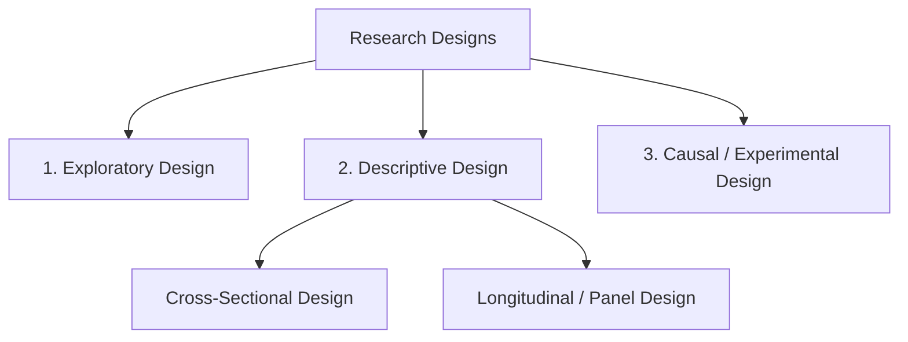
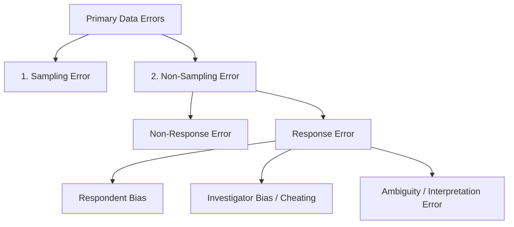

# Block 2 Notes: Data Collection and Processing

This revision guide covers the core concepts, frameworks, and methodologies from **Units 4, 5, and 6** of MMPM-006. It is designed for quick scanning and high retention on exam day.

---

## Unit 4: Research Design Formulation

### 1. What is a Research Design?
A research design is the **blueprint or framework** for conducting a marketing research project. It outlines the specific procedures, timelines, budget, sampling plans, and analysis models needed to obtain the information required to solve the research problem.

---

### 2. Core Classification of Research Designs
Research designs are divided into three primary categories based on the nature of the research objective:

#### A. Exploratory Research Design
* **Purpose:** To gain background insights, clarify problems, formulate hypotheses, or establish priorities for further research.
* **Characteristics:** Highly flexible, unstructured, informal, qualitative, and uses small, non-representative samples.
* **Examples:** Focus groups, pilot studies, expert interviews, and secondary literature reviews.

#### B. Descriptive Research Design
* **Purpose:** To describe the characteristics of market variables, consumer groups, or phenomena (e.g., detailing "who, what, when, where, why, and how" of consumer behaviour).
* **Characteristics:** Highly structured, pre-planned, and formal. Mandates **a-priori hypotheses** and large representative samples to draw quantitative conclusions.
* **Subtypes:**
  * **Cross-Sectional Design:** Gathering information from a sample of the population only **once** (a "one-time snapshot" or sample survey). In *multiple cross-sectional designs*, different samples are surveyed at different times.
  * **Longitudinal / Panel Design:** Administering the questionnaire to the **same fixed sample (panel)** at multiple points in time. Excellent for tracking trends, brand switching, and changes in consumer perceptions over time.

#### C. Causal / Experimental Design
* **Purpose:** To establish cause-and-effect relationships (conclusive research).
* **Characteristics:** The researcher manipulates one or more independent variables (treatments) while controlling for extraneous variables to measure their effect on the dependent variable.

---

### 3. Experimental Validity: Internal vs. External
When conducting causal experiments, two types of validity must be maintained:
* **Internal Validity:** The assurance that the observed changes in the dependent variable are **solely due** to the experimental treatment and not confounded by extraneous variables.
* **External Validity:** The ability to **generalize** the experimental findings to the real world (other populations, geographic settings, and timeframes).

> [!WARNING]
> **Extraneous Threats to Internal Validity:**
> 1. **History:** External, non-recurring events occurring concurrently with the experiment (e.g., a competitor launching a massive price cut during your ad test).
> 2. **Maturation:** Biological or psychological changes in the subjects over time (e.g., test salespeople gaining experience or growing fatigued).
> 3. **Testing (Sensitization):** The pre-test measurement alerts or biases respondents, altering their subsequent responses.
> 4. **Instrumentation:** Changes in the measuring instrument (e.g., changing questionnaire wording, training new observers, or price changes).
> 5. **Selection Bias:** Assignment of non-comparable test units to treatment vs. control groups due to non-random selection.
> 6. **Test Unit Mortality:** The drop-out of participants before the experiment is completed.

---

### 4. Quasi-Experimental vs. True Experimental Designs
The key difference lies in **randomization (R)**. Quasi-experiments lack random assignment and control over treatment scheduling, making their internal validity questionable.

#### Quasi-Experimental Designs (No Randomization)
* **After-Only without Control (One-Shot Case Study):** 
  $$X \rightarrow O$$
  *A single group is exposed to treatment $X$, and measurement $O$ is taken. Weakest design; no baseline comparison.*
* **Before-After without Control (One Group Pre-post):** 
  $$O_1 \rightarrow X \rightarrow O_2$$
  *Measures change ($O_2 - O_1$). Confounded by history, maturation, and testing effects.*
* **Static-Group Comparison:** 
  $$\text{Group 1 (Experimental): } X_1 \rightarrow O_1$$
  $$\text{Group 2 (Control Group): } X_2 \rightarrow O_2$$
  *No random assignment. Differences may be due to pre-existing selection bias.*
* **Time-Series / Longitudinal Design:** 
  $$O_1 \ O_2 \ O_3 \ O_4 \rightarrow X \rightarrow O_5 \ O_6 \ O_7 \ O_8$$
  *Periodic measurements help rule out maturation/testing, but history remains a threat.*

#### True Experimental Designs (With Randomization 'R')
* **After-Only with One Control Group:**
  $$\text{Group 1 (Experimental): } R \rightarrow X \rightarrow O_1$$
  $$\text{Group 2 (Control): } R \rightarrow O_2$$
  *Rules out pre-testing bias. Assumes randomization makes groups equal prior to treatment.*
* **Before-After with One Control Group:**
  $$\text{Group 1 (Experimental): } R \rightarrow O_1 \rightarrow X \rightarrow O_2$$
  $$\text{Group 2 (Control): } R \rightarrow O_3 \rightarrow O_4$$
  *Standard experimental design. The main limitation is the testing sensitization effect on Group 1.*
* **Solomon Four-Group Design:**
  *Combines the above two designs (utilizing 4 groups and 6 measurements) to isolate, measure, and eliminate testing sensitization and history effects.*

---

### 5. Applied Case Framework: Recommending Research Designs
* **Launch of a New Car Variant (Manufacturer):** Recommends **Descriptive Cross-Sectional Survey** (to profile potential buyers, prioritize feature needs, and test price thresholds) combined with **Simulated Test Marketing (STM)**.
* **Opening Retail Outlets in a Region (Smartphone Maker):** Recommends **Exploratory Research** (using secondary GIS/footfall data and competitor store audits) followed by a **Causal Test Market Experiment** in a representative city to evaluate store configurations.

---

## Unit 5: Data Collection — Qualitative and Quantitative

### 1. Primary vs. Secondary Data
* **Secondary Data:** Data already collected by someone else for another purpose. Always check secondary sources first.
  * *Sources:* Internal CRM database, financial reports, external census data, research journals, and syndicated reports.
  * *Pros/Cons:* Low cost, quick retrieval / May lack accuracy, relevancy, or fitness (outdated, incompatible units).
* **Primary Data:** Fresh data collected specifically to address the current research problem.
  * *Sources:* Surveys, focus groups, interviews, and direct observations.
  * *Pros/Cons:* Tailored, highly relevant / Expensive, time-consuming.

---

### 2. Primary Data Methods: Communication vs. Observation
* **Communication Methods:** Gathering data by questioning respondents (surveys, interviews).
  * *Pros/Cons:* Captures unobservable variables (attitudes, intentions, motives) / High response bias and questionnaire error.
* **Observation Methods:** Recording actual behaviour as it occurs without direct questioning.
  * *Pros/Cons:* Highly objective, eliminates respondent memory bias / Cannot capture underlying motives or attitudes.

---

### 3. Sources of Error in Primary Data Collection
Primary data collection errors are broadly divided into:

1. **Sampling Error:** Mismatch between sample characteristics and the target population due to flawed selection.
2. **Non-Response Error:** Selected respondents are unreachable or refuse to participate (creates non-response bias).
3. **Response Error:** Mismatch between the actual value and the reported value. Caused by:
   * *Respondent:* Unwillingness (prestige bias) or inability to recall.
   * *Investigator:* Dishonesty, cheating (fabricating responses), or poor phrasing.
   * *Ambiguity:* Misinterpretation of words or behavior due to translation gaps.

---

### 4. Qualitative Research: Focus Groups
Qualitative research captures non-numerical, deep insights. 
* **Focus Groups:** A free-flowing, unstructured discussion among 8-12 participants led by a trained moderator.
* **Usage:** Excellent for generating ideas, testing ad themes, and exploratory problem definition.
* **Caution:** Because sample sizes are tiny, focus group findings must **never** be used to make conclusive statistical generalizations.

---

### 5. Applied Sampling and Questionnaire Design
* **Sampling Decision:** Choose **Probability Sampling** (Simple Random, Stratified) for conclusive descriptive studies where generalizability is vital. Choose **Non-Probability Sampling** (Convenience, Quota, Judgement) for exploratory studies.
* **Questionnaire Rules:** Keep questions clear, brief, neutral (no leading questions), logically ordered (funnel approach: broad to specific), and always pre-test before final rollout.

---

## Unit 6: Data Processing

Data processing transforms raw, unstructured data into a structured format suitable for statistical analysis.

### 1. Three Pillars of Data Processing
* **Data Editing:** Inspecting completed questionnaires to detect omissions, illegibility, and inconsistencies. Flawed questionnaires are either discarded or corrected.
* **Coding:** Assigning numerical codes or categories to raw responses (e.g., coding Male as '1', Female as '2') to facilitate data entry.
* **Tabulation:** Summarizing the coded data into matrices of rows and columns (e.g., frequency tables, cross-tabulations) to reveal trends and patterns.

---

### 2. Classification of Data
Classification is the process of arranging data into homogeneous groups based on shared characteristics. It must be **mutually exclusive** (no overlap) and **collectively exhaustive** (covers all data points).

#### A. Classification According to Attributes (Qualitative)
Applies to descriptive characteristics that cannot be measured numerically:
1. **Simple Classification:** Categorizing based on the presence or absence of a single attribute (e.g., User vs. Non-user).
2. **Manifold Classification:** Categorizing based on multiple nested attributes simultaneously (e.g., Segmenting by User status $\rightarrow$ Gender $\rightarrow$ Age Group $\rightarrow$ Profession).

#### B. Classification According to Numerical Characteristics (Quantitative)
Applies to numerical data (e.g., sales, income, age) grouped into **class intervals** using two methods:
* **Inclusive Method:** Both the lower and upper limits are included in the class (e.g., 10-15, 16-21, 22-27). Used for discrete data.
* **Exclusive Method:** The lower limit is included but the upper limit is excluded (e.g., 10-15, 15-20, 20-25). If a value is exactly 15, it goes into the second interval (15-20). Used for continuous data.
