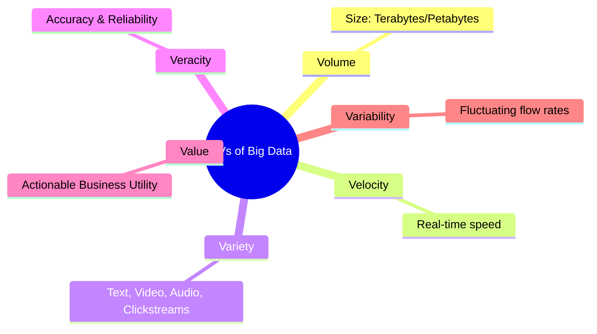
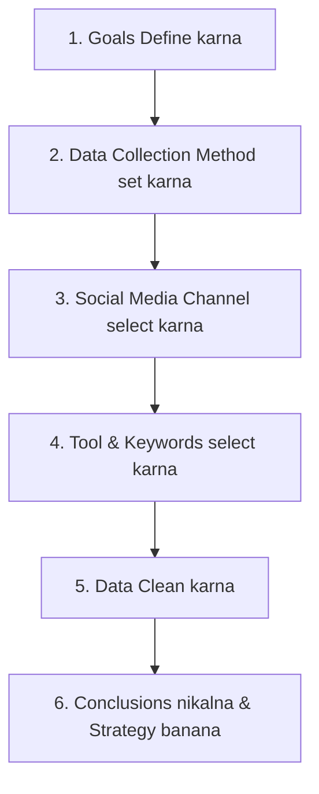

# Block 4 Notes (Hinglish): Emerging Issues

Yeh revision guide MMPM-006 ke **Units 13, 14, aur 15** ke core concepts, digital frameworks, aur modern technologies ko cover karti hai. Isko exam day par jaldi se scan aur revise karne ke liye design kiya gaya hai.

---

## Unit 13: Big Data and Marketing Research

### 1. Big Data kya hai?
Big Data ka matlab aise data sets se hai jinki variety bohot wide hoti hai, jo bohot fast speed se aate hain, aur jinka volume (size) itna bada hota hai ki unhe traditional databases se manage nahi kiya ja sakta.

#### Big Data ke Char Types:
1. **Structured Data:** Formatted data jise easily collect, save, retrieve, aur process kiya ja sake (e.g., SQL tables, transactional records).
2. **Semi-structured Data:** Structured aur unstructured elements ka mix (e.g., XML/JSON files, metadata ke sath emails).
3. **Quasi-structured Data:** Erratic (tedhe-medhe) formats wala data jo semi-structured aur unstructured ke beech aata hai (e.g., web clickstreams, server logs).
4. **Unstructured Data:** Aisa data jiska koi predefined structure ya hierarchy nahi hoti (e.g., text, video, audio files).

---

### 2. Big Data ke 6Vs
Big Data ko six critical dimensions se define kiya jata hai:

* **Volume:** Datasets ka sheersize (petabytes aur exabytes mein).
* **Variety:** Data formats ki diversity (structured transactional data vs. unstructured social media videos).
* **Velocity:** Real-time mein naye data ke generate aur process hone ki speed.
* **Veracity:** Collected data ki accuracy, quality, aur trustworthiness.
* **Value:** Raw data ko actionable business insights mein convert karne ki ability.
* **Variability:** Waqt ke sath data ke badalne ya fluctuate hone ki rate.

---

### 3. Big Data Insights Process
Big Data se value nikalne ke liye organizations ek multi-stage data processing pipeline execute karti hain:
1. **Data Acquisition:** Digital touchpoints (smartphones, IoT, transactional databases) se data capture karna.
2. **Extraction aur Cleaning:** Unstructured datasets ko reformat karna aur missing, galat ya corrupt data ko repair karna.
3. **Integration aur Aggregation:** Alag-alag datasets ko combine aur match karna (e.g., credit card transactions ko store logs ke sath merge karna).
4. **Modeling aur Analysis:** Text (tweets), audio (calls), video (unboxing clips) ya networks (community detection) ko analyze karne ke liye machine learning models use karna.
5. **Interpretation:** Statistical models ko visual dashboards, forecasting tables, ya decision trees mein convert karna.

---

### 4. Big Data ke Marketing Applications
* **Customer Relationship Building:** Customer journey touchpoints (e.g., flight booking habits) analyze karke customized tourism/hotel deals offer karna.
* **Product Development & Positioning:** Predictive demand models (like Netflix recommendations ya P&G test market analytics) ke zariye product concepts ko pre-test karna.
* **Dynamic Pricing & Promotions:** Competitor rates aur consumer demand ke according real-time mein prices adjust karna (e.g., Amazon din mein lakho baar prices badalta hai).
* **Price Optimization:** Purchase histories analyze karke inventory clearance levels manage karna.
* **360-Degree Know Your Customer (KYC):** Online aur offline touchpoints se consumer interactions ka ek complete profile banana.

---

### 5. Big Data Implementation ke main Challenges
* **System Design & Cost:** Custom tech stack banane ke liye bade IT infrastructure aur skilled database professionals ki zaroorat hoti hai.
* **Storage Space:** Massive files (khaskar unstructured audio/video) ko store karne ke liye bohot badi cloud capacity chahiye.
* **Skill Gaps:** Advanced tools use karne aur complex models ko interpret karne ke liye qualified data scientists ki kami.
* **Data Security & Privacy:** Databases ko hackers se bachana aur regional privacy rules ko follow karna.
* **Integration Hurdles:** ERPs, CRM systems, web logs, aur social media sites se aane wale data ko standardize karna.

---

## Unit 14: Internet-Based Marketing Research

### 1. Purpose aur Applications
Internet-based (online) marketing research traditional survey, panel, aur observational methods ko web par adapt karti hai.
* **Target Audience Profiling:** Digital consumer demographics (age, spending, habits) ko map karna.
* **Competitor Audits:** Competitor websites ko scrape karke catalogs, prices, aur promos track karna.
* **Usage & Web Analytics:** **Cookies** (small text files jo browser activity record karti hain) ke zariye visitor count, navigation paths, aur session duration check karna.

---

### 2. Online MR ke Advantages vs. Limitations
* **Advantages:**
  * **Low Cost:** Physical mail, phone, ya face-to-face interviews ke mukable bohot sasta.
  * **Speed:** Fast data collection aur real-time tabulation.
  * **Geographical Reach:** Ek sath alag-alag countries ke respondents tak pahunch.
  * **Customization:** Automated chatbots previous answers ke basis par questions ko adapt kar sakte hain.
* **Limitations:**
  * **Internet Penetration Bias:** Rural aur remote areas ke log (jahan internet slow hai) exclude ho jate hain.
  * **Lack of Sensory Testing:** Consumer product ko touch, smell, ya taste nahi kar sakta.
  * **No Non-verbal Feedback:** Facial expressions ya body language ko observe nahi kiya ja sakta.
  * **Authenticity Risk:** Anonymity ki wajah se fake profiles ya dummy responses milne ka khatra.

---

### 3. Online Marketing Research ke 4 Steps
1. **Define the Target Audience:** Target segment ke age, location, aur digital habits specify karna.
2. **Prepare the Research Instrument:** Digital platforms ke liye relevant aur clear surveys design karna (e.g., Zomato app ratings).
3. **Ensure Active Engagement:** Survey ko targeted email, social media, online panels, ya banners ke zariye promote karna taaki sample size badhe.
4. **Summarize aur Report:** Raw data ko executive summaries, spreadsheets, aur visual reports mein convert karna.

> [!TIP]
> **Online Techniques:**
> * **Online Surveys:** Opinions capture karne ke liye Likert scales ya binary questions use karna.
> * **Online Focus Groups:** **Asynchronous/Chat-based** (users log-in karke kai dino tak comment/media upload karte hain) ya **Synchronous/Real-time** (live video/chat session led by a moderator).

---

## Unit 15: Marketing Research and Social Media

### 1. Social Media MR ka Role aur Benefits
Social media ek bade focus group ki tarah kaam karta hai.
* **Sentiment Analysis:** Text-categorization technology jo online comments/tweets ko analyze karke consumer feelings ko **Positive, Negative, ya Neutral** mein classify karti hai.
* **Word Clouds:** Visual tools jo brand keyword ke sath sabse zyada use hone wale terms ko bada karke dikhate hain.

---

### 2. Social Media MR Process ke 6 Steps

1. **Define Target Goals:** Kaunse specific brand, product, ya competitor metric ko track karna hai?
2. **Define Data Collection Method:** Quantitative (likes, shares, comments) vs. Qualitative (sentiment tracking, theme association).
3. **Select the Channel:** Target audience ke demographics ke according social network select karna.
4. **Choose the Tool and Keywords:** Brand keywords aur search phrases ke sath social listening tools setup karna.
5. **Clean the Data:** Spam, bots, off-topic comments, aur unrelated terms ko filter out karna.
6. **Draw Conclusions:** Findings ko dashboards par visualize karna aur insights ko marketing strategies mein badalna.

---

### 3. Applied Framework: Social Media MR Design
Jab social media research design karna ho (e.g., koi restaurant chain naya **Cloud Kitchen** concept plan kar rahi ho):
* **Goal:** High-potential geographical regions aur popular food items ko identify karna.
* **Method:** Localized keywords ke sath listening tools setup karna (e.g., "food delivery," "biryani Indore," "cloud kitchen reviews").
* **Execution:** Competitors ke customer reviews analyze karna (complaints like slow delivery, cold food) aur underserved locations ko search karne ke liye sentiment analysis run karna. Phir un geographic hotspots par targeted social media ads run karna.
